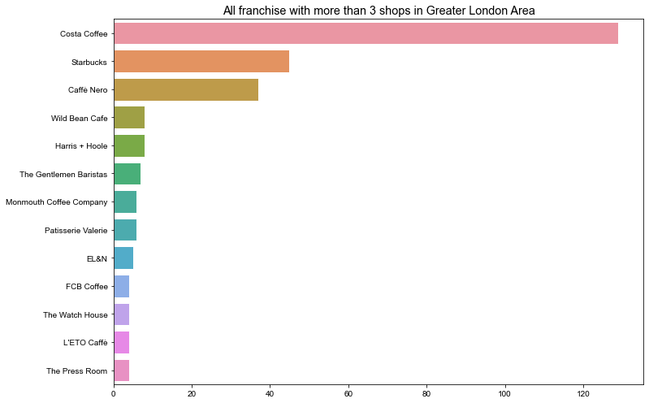
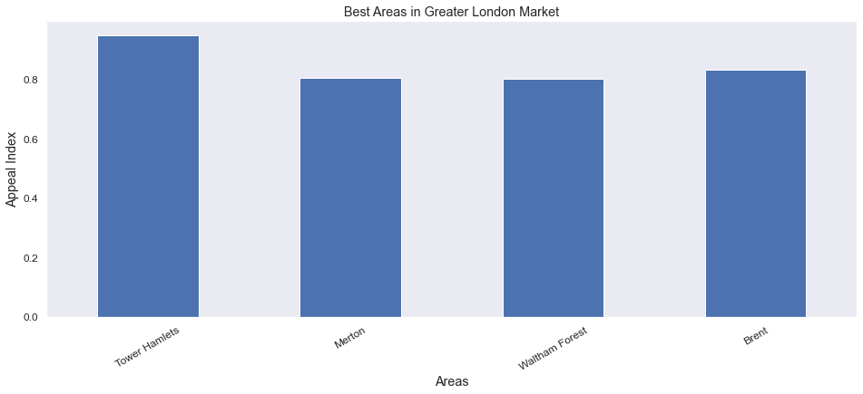

___

# Capstone Project
### Applied Data Science Capstone by IBM/Coursera
___
# London venues analysis: a case study for opening of new shops


## Table of contents
* [1. Business Problem](#BusinessProblem)
* [2. Assignment](#Assignment)
* [3. Data and Methodology](#Data&Methodology)
* [4. Analysis](#Analysis)
* [5. Results: the appeal index and cluster membership per each borough](#Results)
* [6. Conclusion and Final Comments](#Conclusion)

___

## 1. Business Problem <a name="BusinessProblem"></a>

___

An medium-seized coffee shop franchise - our client - is looking for three suited places in London to open new shops over there.
The four new shops - three "standards" plus one flagship - should be

**a.** well spread over Greater London Area.\
**b.** in zones with a low concentration of competitor shops (competitor = franchise with a number of shops between 3 and 6 in whole Greater London Area).\
**c.** in zones with a proved business resilience (i.e. high business survival rate).\
**d.** in zones with good pop density.\
**e.** the flagship should be placed in a INNER LONDON borough.\
**f.** the other three shops can be placed each of them in one of the three clusters assessed in OUTER Areas.


___

## 2. Assignment <a name="Assignment"></a>

___

The client commissioned to our company a detailed analysis to find out four suited zones to open his shops by fulfilling the requirements listed in the Background.


___

## 3. Data and Methodology <a name="Data&Methodology"></a>

___

* Data Source for Greater London Stats: https://data.london.gov.uk/dataset/london-borough-profiles   ([License](http://www.nationalarchives.gov.uk/doc/open-government-licence/version/2/))
* Foursquare for Greater London Venue Stats.

**Steps**:\
**I.**  The Greater London boroughs will be analyzed and clusterized by taking into account their geographical coordinates: particular focus will be placed on Business Survival Rate, Population Density and Competitors Shop Density.\
**II.** An appeal index by taking into account point **b.**, **c.** and **d.** will be created, the index will be created by weighing:

| FACTORS                   | WEIGHTS |
| :--------------------------:| :--------:|
| CoffeeShop Density per Ha | 45%     |
| Business Survival Index   | 25%     |
| Population Density        | 30%     |


While Business Survival Rate and Population Density can be easily retrieved in the first link, Competitors Shop Density per borough will be assessed by using Foursquare to search for coffee shop in a 3.5 km radius from boroughs center.

Roughly, in the first step the London boroughs will be divided in three clusters while in the second step we will assess the three major indexes per each borough to support the decision where shops should be placed in: the decision will be addressed to the evaluation of an **APPEAL INDEX** calculated as weighted average of three major indexes.

The **APPEAL INDEX** is meant as *"the higher, the better"*: <u>**the best performing borough per each cluster will be the winner**</u>.


___

## 4. Analysis <a name="Analysis"></a>

___

### 4.a **Import all needed Python Modules**


```python
!pip install lxml
!pip install geopy
!pip install folium
!pip install geopy

import numpy as np
import scipy as sp

import pandas as pd
from lxml import etree

import folium as fo
from geopy.geocoders import Nominatim
import requests as rq

from sklearn.cluster import KMeans

import matplotlib as mpl
import seaborn as sns

pd.set_option("precision", 5)
```

    Requirement already satisfied: lxml in g:\python\python39\lib\site-packages (4.6.2)
    Requirement already satisfied: geopy in g:\python\python39\lib\site-packages (2.1.0)
    Requirement already satisfied: geographiclib<2,>=1.49 in g:\python\python39\lib\site-packages (from geopy) (1.50)
    Requirement already satisfied: folium in g:\python\python39\lib\site-packages (0.12.1)
    Requirement already satisfied: requests in g:\python\python39\lib\site-packages (from folium) (2.25.1)
    Requirement already satisfied: jinja2>=2.9 in g:\python\python39\lib\site-packages (from folium) (2.11.2)
    Requirement already satisfied: branca>=0.3.0 in g:\python\python39\lib\site-packages (from folium) (0.4.2)
    Requirement already satisfied: numpy in g:\python\python39\lib\site-packages (from folium) (1.19.5)
    Requirement already satisfied: MarkupSafe>=0.23 in g:\python\python39\lib\site-packages (from jinja2>=2.9->folium) (1.1.1)
    Requirement already satisfied: chardet<5,>=3.0.2 in g:\python\python39\lib\site-packages (from requests->folium) (4.0.0)
    Requirement already satisfied: idna<3,>=2.5 in g:\python\python39\lib\site-packages (from requests->folium) (2.10)
    Requirement already satisfied: urllib3<1.27,>=1.21.1 in g:\python\python39\lib\site-packages (from requests->folium) (1.26.2)
    Requirement already satisfied: certifi>=2017.4.17 in g:\python\python39\lib\site-packages (from requests->folium) (2020.12.5)
    Requirement already satisfied: geopy in g:\python\python39\lib\site-packages (2.1.0)
    Requirement already satisfied: geographiclib<2,>=1.49 in g:\python\python39\lib\site-packages (from geopy) (1.50)
    

### 4.b **Import and Show London boroughs selected data**


```python
# Source file saved locally
LondonDatasetPath = 'C:/Users/Marco/Desktop/london-borough-profiles.csv'

# Import selected columns
RequiredCols = ['Code', 'Area_name','Inner/_Outer_London','Inland_Area_(Hectares)','Population_density_(per_hectare)_2017','Average_Age,_2017', \
                'Proportion_of_population_of_working-age,_2015', 'Two-year_business_survival_rates_(started_in_2013)']

# Read Dataset
LondonDataset = pd.read_csv(LondonDatasetPath, usecols=RequiredCols)

# Some Rows are general stats (e.g. whole England\United Kingdom stats), they have to be dropped out
LondonDataset.dropna(how='any',subset=['Inner/_Outer_London'],inplace=True)

# Print total number of boroughs in London
print('\n{} boroughs found in Greater London Area.\n'.format(LondonDataset.shape[0]))

# Show Dataset
LondonDataset
```

    
    33 boroughs found in Greater London Area.
    
    


<div>
<style scoped>
    .dataframe tbody tr th:only-of-type {
        vertical-align: middle;
    }

    .dataframe tbody tr th {
        vertical-align: top;
    }

    .dataframe thead th {
        text-align: right;
    }
</style>
<table border="1" class="dataframe">
  <thead>
    <tr style="text-align: right;">
      <th></th>
      <th>Code</th>
      <th>Area_name</th>
      <th>Inner/_Outer_London</th>
      <th>Inland_Area_(Hectares)</th>
      <th>Population_density_(per_hectare)_2017</th>
      <th>Average_Age,_2017</th>
      <th>Proportion_of_population_of_working-age,_2015</th>
      <th>Two-year_business_survival_rates_(started_in_2013)</th>
    </tr>
  </thead>
  <tbody>
    <tr>
      <th>0</th>
      <td>E09000001</td>
      <td>City of London</td>
      <td>Inner London</td>
      <td>290</td>
      <td>30.3</td>
      <td>43.2</td>
      <td>73.1</td>
      <td>64.3</td>
    </tr>
    <tr>
      <th>1</th>
      <td>E09000002</td>
      <td>Barking and Dagenham</td>
      <td>Outer London</td>
      <td>3,611</td>
      <td>57.9</td>
      <td>32.9</td>
      <td>63.1</td>
      <td>73.0</td>
    </tr>
    <tr>
      <th>2</th>
      <td>E09000003</td>
      <td>Barnet</td>
      <td>Outer London</td>
      <td>8,675</td>
      <td>44.9</td>
      <td>37.3</td>
      <td>64.9</td>
      <td>73.8</td>
    </tr>
    <tr>
      <th>3</th>
      <td>E09000004</td>
      <td>Bexley</td>
      <td>Outer London</td>
      <td>6,058</td>
      <td>40.3</td>
      <td>39.0</td>
      <td>62.9</td>
      <td>73.5</td>
    </tr>
    <tr>
      <th>4</th>
      <td>E09000005</td>
      <td>Brent</td>
      <td>Outer London</td>
      <td>4,323</td>
      <td>76.8</td>
      <td>35.6</td>
      <td>67.8</td>
      <td>74.4</td>
    </tr>
    <tr>
      <th>5</th>
      <td>E09000006</td>
      <td>Bromley</td>
      <td>Outer London</td>
      <td>15,013</td>
      <td>21.8</td>
      <td>40.2</td>
      <td>62.6</td>
      <td>78.6</td>
    </tr>
    <tr>
      <th>6</th>
      <td>E09000007</td>
      <td>Camden</td>
      <td>Inner London</td>
      <td>2,179</td>
      <td>111.3</td>
      <td>36.4</td>
      <td>71.0</td>
      <td>73.6</td>
    </tr>
    <tr>
      <th>7</th>
      <td>E09000008</td>
      <td>Croydon</td>
      <td>Outer London</td>
      <td>8,650</td>
      <td>44.7</td>
      <td>37.0</td>
      <td>64.9</td>
      <td>75.3</td>
    </tr>
    <tr>
      <th>8</th>
      <td>E09000009</td>
      <td>Ealing</td>
      <td>Outer London</td>
      <td>5,554</td>
      <td>63.3</td>
      <td>36.2</td>
      <td>66.8</td>
      <td>75.8</td>
    </tr>
    <tr>
      <th>9</th>
      <td>E09000010</td>
      <td>Enfield</td>
      <td>Outer London</td>
      <td>8,083</td>
      <td>41.2</td>
      <td>36.3</td>
      <td>64.4</td>
      <td>74.2</td>
    </tr>
    <tr>
      <th>10</th>
      <td>E09000011</td>
      <td>Greenwich</td>
      <td>Outer London</td>
      <td>4,733</td>
      <td>59.2</td>
      <td>35.0</td>
      <td>67.7</td>
      <td>72.7</td>
    </tr>
    <tr>
      <th>11</th>
      <td>E09000012</td>
      <td>Hackney</td>
      <td>Inner London</td>
      <td>1,905</td>
      <td>144</td>
      <td>33.1</td>
      <td>72.1</td>
      <td>76.8</td>
    </tr>
    <tr>
      <th>12</th>
      <td>E09000013</td>
      <td>Hammersmith and Fulham</td>
      <td>Inner London</td>
      <td>1,640</td>
      <td>113</td>
      <td>35.7</td>
      <td>72.3</td>
      <td>73.4</td>
    </tr>
    <tr>
      <th>13</th>
      <td>E09000014</td>
      <td>Haringey</td>
      <td>Inner London</td>
      <td>2,960</td>
      <td>93.9</td>
      <td>35.1</td>
      <td>70.7</td>
      <td>74.4</td>
    </tr>
    <tr>
      <th>14</th>
      <td>E09000015</td>
      <td>Harrow</td>
      <td>Outer London</td>
      <td>5,046</td>
      <td>50</td>
      <td>38.3</td>
      <td>64.5</td>
      <td>76.5</td>
    </tr>
    <tr>
      <th>15</th>
      <td>E09000016</td>
      <td>Havering</td>
      <td>Outer London</td>
      <td>11,235</td>
      <td>22.6</td>
      <td>40.3</td>
      <td>62.3</td>
      <td>75.3</td>
    </tr>
    <tr>
      <th>16</th>
      <td>E09000017</td>
      <td>Hillingdon</td>
      <td>Outer London</td>
      <td>11,570</td>
      <td>26</td>
      <td>36.4</td>
      <td>65.6</td>
      <td>75.0</td>
    </tr>
    <tr>
      <th>17</th>
      <td>E09000018</td>
      <td>Hounslow</td>
      <td>Outer London</td>
      <td>5,598</td>
      <td>49</td>
      <td>35.8</td>
      <td>67.6</td>
      <td>76.2</td>
    </tr>
    <tr>
      <th>18</th>
      <td>E09000019</td>
      <td>Islington</td>
      <td>Inner London</td>
      <td>1,486</td>
      <td>155.6</td>
      <td>34.8</td>
      <td>75.3</td>
      <td>72.5</td>
    </tr>
    <tr>
      <th>19</th>
      <td>E09000020</td>
      <td>Kensington and Chelsea</td>
      <td>Inner London</td>
      <td>1,212</td>
      <td>131.1</td>
      <td>39.3</td>
      <td>69.3</td>
      <td>74.5</td>
    </tr>
    <tr>
      <th>20</th>
      <td>E09000021</td>
      <td>Kingston upon Thames</td>
      <td>Outer London</td>
      <td>3,726</td>
      <td>47.1</td>
      <td>37.1</td>
      <td>67.2</td>
      <td>76.8</td>
    </tr>
    <tr>
      <th>21</th>
      <td>E09000022</td>
      <td>Lambeth</td>
      <td>Inner London</td>
      <td>2,681</td>
      <td>122.7</td>
      <td>34.5</td>
      <td>74.6</td>
      <td>63.8</td>
    </tr>
    <tr>
      <th>22</th>
      <td>E09000023</td>
      <td>Lewisham</td>
      <td>Inner London</td>
      <td>3,515</td>
      <td>86.3</td>
      <td>35.0</td>
      <td>70.1</td>
      <td>73.4</td>
    </tr>
    <tr>
      <th>23</th>
      <td>E09000024</td>
      <td>Merton</td>
      <td>Outer London</td>
      <td>3,762</td>
      <td>55.3</td>
      <td>36.7</td>
      <td>67.2</td>
      <td>78.4</td>
    </tr>
    <tr>
      <th>24</th>
      <td>E09000025</td>
      <td>Newham</td>
      <td>Inner London</td>
      <td>3,620</td>
      <td>94.7</td>
      <td>32.1</td>
      <td>70.2</td>
      <td>70.0</td>
    </tr>
    <tr>
      <th>25</th>
      <td>E09000026</td>
      <td>Redbridge</td>
      <td>Outer London</td>
      <td>5,642</td>
      <td>53.9</td>
      <td>35.8</td>
      <td>65.0</td>
      <td>74.7</td>
    </tr>
    <tr>
      <th>26</th>
      <td>E09000027</td>
      <td>Richmond upon Thames</td>
      <td>Outer London</td>
      <td>5,741</td>
      <td>34.4</td>
      <td>38.8</td>
      <td>64.5</td>
      <td>78.8</td>
    </tr>
    <tr>
      <th>27</th>
      <td>E09000028</td>
      <td>Southwark</td>
      <td>Inner London</td>
      <td>2,886</td>
      <td>108.9</td>
      <td>34.4</td>
      <td>73.5</td>
      <td>73.4</td>
    </tr>
    <tr>
      <th>28</th>
      <td>E09000029</td>
      <td>Sutton</td>
      <td>Outer London</td>
      <td>4,385</td>
      <td>46.2</td>
      <td>38.9</td>
      <td>64.3</td>
      <td>76.0</td>
    </tr>
    <tr>
      <th>29</th>
      <td>E09000030</td>
      <td>Tower Hamlets</td>
      <td>Inner London</td>
      <td>1,978</td>
      <td>153.7</td>
      <td>31.4</td>
      <td>73.9</td>
      <td>69.7</td>
    </tr>
    <tr>
      <th>30</th>
      <td>E09000031</td>
      <td>Waltham Forest</td>
      <td>Outer London</td>
      <td>3,881</td>
      <td>71.2</td>
      <td>35.1</td>
      <td>67.9</td>
      <td>71.0</td>
    </tr>
    <tr>
      <th>31</th>
      <td>E09000032</td>
      <td>Wandsworth</td>
      <td>Inner London</td>
      <td>3,426</td>
      <td>93.7</td>
      <td>35.0</td>
      <td>72.8</td>
      <td>75.8</td>
    </tr>
    <tr>
      <th>32</th>
      <td>E09000033</td>
      <td>Westminster</td>
      <td>Inner London</td>
      <td>2,149</td>
      <td>112.7</td>
      <td>37.7</td>
      <td>72.3</td>
      <td>68.8</td>
    </tr>
  </tbody>
</table>
</div>


### 4.c **Search for and Show Geographic Coordinates of each borough**


```python
GeoDataDict = {'Area_name': [],'Extended_name': [],'Lat': [],'Lon': []}
for idx, Area in LondonDataset.iterrows():
    print('Checking "{}"\n'.format(Area['Area_name']))
    geolocator = Nominatim(user_agent="LondonAreas")
    if not Area['Area_name'] in ['Westminster', 'City of London'] :
        location = geolocator.geocode('London borough of {}'.format(Area['Area_name']))
    elif Area['Area_name'] in ['Westminster', 'City of London']:
        location = geolocator.geocode('City of {}'.format(Area['Area_name']))        
    print('\t{}: {}\n\tLat={:+4.3f}, Lon={:+4.3f}\n'.format(idx,location.address,location.latitude,location.longitude))
    GeoDataDict['Area_name'].append(Area['Area_name'])
    GeoDataDict['Extended_name'].append(location.address)
    GeoDataDict['Lat'].append(location.latitude)
    GeoDataDict['Lon'].append(location.longitude)
    
GeoData = pd.DataFrame(data=GeoDataDict)
```

    Checking "City of London"
    
    	0: City of London, Greater London, England, United Kingdom
    	Lat=+51.516, Lon=-0.092
    
    Checking "Barking and Dagenham"
    
    	1: London Borough of Barking and Dagenham, London, Greater London, England, United Kingdom
    	Lat=+51.554, Lon=+0.151
    
    Checking "Barnet"
    
    	2: London Borough of Barnet, London, Greater London, England, United Kingdom
    	Lat=+51.613, Lon=-0.211
    
    Checking "Bexley"
    
    	3: London Borough of Bexley, London, Greater London, England, United Kingdom
    	Lat=+51.462, Lon=+0.146
    
    Checking "Brent"
    
    	4: London Borough of Brent, London, Greater London, England, United Kingdom
    	Lat=+51.564, Lon=-0.276
    
    Checking "Bromley"
    
    	5: London Borough of Bromley, London, Greater London, England, United Kingdom
    	Lat=+51.367, Lon=+0.062
    
    Checking "Camden"
    
    	6: London Borough of Camden, London, Greater London, England, United Kingdom
    	Lat=+51.543, Lon=-0.163
    
    Checking "Croydon"
    
    	7: London Borough of Croydon, London, Greater London, England, United Kingdom
    	Lat=+51.355, Lon=-0.064
    
    Checking "Ealing"
    
    	8: London Borough of Ealing, London, Greater London, England, United Kingdom
    	Lat=+51.525, Lon=-0.314
    
    Checking "Enfield"
    
    	9: London Borough of Enfield, London, Greater London, England, United Kingdom
    	Lat=+51.649, Lon=-0.081
    
    Checking "Greenwich"
    
    	10: Royal Borough of Greenwich, London, Greater London, England, United Kingdom
    	Lat=+51.469, Lon=+0.049
    
    Checking "Hackney"
    
    	11: London Borough of Hackney, London, Greater London, England, United Kingdom
    	Lat=+51.549, Lon=-0.048
    
    Checking "Hammersmith and Fulham"
    
    	12: London Borough of Hammersmith and Fulham, London, Greater London, England, United Kingdom
    	Lat=+51.498, Lon=-0.228
    
    Checking "Haringey"
    
    	13: London Borough of Haringey, London, Greater London, England, United Kingdom
    	Lat=+51.588, Lon=-0.105
    
    Checking "Harrow"
    
    	14: London Borough of Harrow, London, Greater London, England, United Kingdom
    	Lat=+51.597, Lon=-0.337
    
    Checking "Havering"
    
    	15: London Borough of Havering, London, Greater London, England, United Kingdom
    	Lat=+51.558, Lon=+0.250
    
    Checking "Hillingdon"
    
    	16: London Borough of Hillingdon, London, Greater London, England, United Kingdom
    	Lat=+51.543, Lon=-0.448
    
    Checking "Hounslow"
    
    	17: London Borough of Hounslow, London, Greater London, England, United Kingdom
    	Lat=+51.462, Lon=-0.380
    
    Checking "Islington"
    
    	18: London Borough of Islington, London, Greater London, England, United Kingdom
    	Lat=+51.547, Lon=-0.102
    
    Checking "Kensington and Chelsea"
    
    	19: Chelsea, Royal Borough of Kensington and Chelsea, London, Greater London, England, SW3 5UA, United Kingdom
    	Lat=+51.488, Lon=-0.169
    
    Checking "Kingston upon Thames"
    
    	20: Kingston, Wood Street, Norbiton, Royal Borough of Kingston upon Thames, London, Greater London, England, KT1 1UJ, United Kingdom
    	Lat=+51.413, Lon=-0.302
    
    Checking "Lambeth"
    
    	21: London Borough of Lambeth, London, Greater London, England, United Kingdom
    	Lat=+51.460, Lon=-0.121
    
    Checking "Lewisham"
    
    	22: London Borough of Lewisham, London, Greater London, England, United Kingdom
    	Lat=+51.453, Lon=-0.013
    
    Checking "Merton"
    
    	23: London Borough of Merton, London, Greater London, England, United Kingdom
    	Lat=+51.411, Lon=-0.188
    
    Checking "Newham"
    
    	24: London Borough of Newham, London, Greater London, England, United Kingdom
    	Lat=+51.530, Lon=+0.029
    
    Checking "Redbridge"
    
    	25: London Borough of Redbridge, London, Greater London, England, United Kingdom
    	Lat=+51.586, Lon=+0.070
    
    Checking "Richmond upon Thames"
    
    	26: London Borough of Richmond upon Thames, London, Greater London, England, United Kingdom
    	Lat=+51.441, Lon=-0.308
    
    Checking "Southwark"
    
    	27: London Borough of Southwark, London, Greater London, England, United Kingdom
    	Lat=+51.465, Lon=-0.069
    
    Checking "Sutton"
    
    	28: London Borough of Sutton, London, Greater London, England, United Kingdom
    	Lat=+51.357, Lon=-0.174
    
    Checking "Tower Hamlets"
    
    	29: London Borough of Tower Hamlets, London, Greater London, England, United Kingdom
    	Lat=+51.515, Lon=-0.035
    
    Checking "Waltham Forest"
    
    	30: London Borough of Waltham Forest, London, Greater London, England, United Kingdom
    	Lat=+51.598, Lon=-0.018
    
    Checking "Wandsworth"
    
    	31: London Borough of Wandsworth, London, Greater London, England, United Kingdom
    	Lat=+51.452, Lon=-0.200
    
    Checking "Westminster"
    
    	32: City of Westminster, London, Greater London, England, United Kingdom
    	Lat=+51.497, Lon=-0.137
    
    

### 4.d **Create an extended dataset (Borough info and Geo Coordinates) and show the boroughs in a map**


```python
ExtendedLondonDataset = LondonDataset.merge(GeoData)
columns = ExtendedLondonDataset.columns.to_list()
columns = columns[0:3]+columns[-3:]+columns[3:-3]
ExtendedLondonDataset = ExtendedLondonDataset[columns]
```


```python
location = geolocator.geocode('London')
print('\nCenter map on: {}\n'.format(location.address))
map_london = fo.Map(location=[location.latitude, location.longitude], zoom_start=11)

print('Red marker\t>>\tInner London\nBlue Marker\t>>\tOuter London.\n')
# add markers to map
for lat, lng, area_name,ext, inout in zip(ExtendedLondonDataset['Lat'], ExtendedLondonDataset['Lon'], ExtendedLondonDataset['Area_name'], ExtendedLondonDataset['Extended_name'], ExtendedLondonDataset['Inner/_Outer_London']):
    if inout=='Inner London':
        col='red'
    elif inout=='Outer London':
        col='blue'
    label = '{}'.format(area_name)
    label = fo.Popup(label, parse_html=True)
    fo.Marker(
        [lat, lng],
        popup=label,
        tooltip=ext,
        icon=fo.Icon(color=col, icon='info-sign')).add_to(map_london)  
    
map_london
```

    
    Center map on: London, Greater London, England, United Kingdom
    
    Red marker	>>	Inner London
    Blue Marker	>>	Outer London.
    
    


<div style="width:100%;"><div style="position:relative;width:100%;height:0;padding-bottom:60%;"><span style="color:#565656">Make this Notebook Trusted to load map: File -> Trust Notebook</span><iframe src="about:blank" style="position:absolute;width:100%;height:100%;left:0;top:0;border:none !important;" data-html=%3C%21DOCTYPE%20html%3E%0A%3Chead%3E%20%20%20%20%0A%20%20%20%20%3Cmeta%20http-equiv%3D%22content-type%22%20content%3D%22text/html%3B%20charset%3DUTF-8%22%20/%3E%0A%20%20%20%20%0A%20%20%20%20%20%20%20%20%3Cscript%3E%0A%20%20%20%20%20%20%20%20%20%20%20%20L_NO_TOUCH%20%3D%20false%3B%0A%20%20%20%20%20%20%20%20%20%20%20%20L_DISABLE_3D%20%3D%20false%3B%0A%20%20%20%20%20%20%20%20%3C/script%3E%0A%20%20%20%20%0A%20%20%20%20%3Cstyle%3Ehtml%2C%20body%20%7Bwidth%3A%20100%25%3Bheight%3A%20100%25%3Bmargin%3A%200%3Bpadding%3A%200%3B%7D%3C/style%3E%0A%20%20%20%20%3Cstyle%3E%23map%20%7Bposition%3Aabsolute%3Btop%3A0%3Bbottom%3A0%3Bright%3A0%3Bleft%3A0%3B%7D%3C/style%3E%0A%20%20%20%20%3Cscript%20src%3D%22https%3A//cdn.jsdelivr.net/npm/leaflet%401.6.0/dist/leaflet.js%22%3E%3C/script%3E%0A%20%20%20%20%3Cscript%20src%3D%22https%3A//code.jquery.com/jquery-1.12.4.min.js%22%3E%3C/script%3E%0A%20%20%20%20%3Cscript%20src%3D%22https%3A//maxcdn.bootstrapcdn.com/bootstrap/3.2.0/js/bootstrap.min.js%22%3E%3C/script%3E%0A%20%20%20%20%3Cscript%20src%3D%22https%3A//cdnjs.cloudflare.com/ajax/libs/Leaflet.awesome-markers/2.0.2/leaflet.awesome-markers.js%22%3E%3C/script%3E%0A%20%20%20%20%3Clink%20rel%3D%22stylesheet%22%20href%3D%22https%3A//cdn.jsdelivr.net/npm/leaflet%401.6.0/dist/leaflet.css%22/%3E%0A%20%20%20%20%3Clink%20rel%3D%22stylesheet%22%20href%3D%22https%3A//maxcdn.bootstrapcdn.com/bootstrap/3.2.0/css/bootstrap.min.css%22/%3E%0A%20%20%20%20%3Clink%20rel%3D%22stylesheet%22%20href%3D%22https%3A//maxcdn.bootstrapcdn.com/bootstrap/3.2.0/css/bootstrap-theme.min.css%22/%3E%0A%20%20%20%20%3Clink%20rel%3D%22stylesheet%22%20href%3D%22https%3A//maxcdn.bootstrapcdn.com/font-awesome/4.6.3/css/font-awesome.min.css%22/%3E%0A%20%20%20%20%3Clink%20rel%3D%22stylesheet%22%20href%3D%22https%3A//cdnjs.cloudflare.com/ajax/libs/Leaflet.awesome-markers/2.0.2/leaflet.awesome-markers.css%22/%3E%0A%20%20%20%20%3Clink%20rel%3D%22stylesheet%22%20href%3D%22https%3A//cdn.jsdelivr.net/gh/python-visualization/folium/folium/templates/leaflet.awesome.rotate.min.css%22/%3E%0A%20%20%20%20%0A%20%20%20%20%20%20%20%20%20%20%20%20%3Cmeta%20name%3D%22viewport%22%20content%3D%22width%3Ddevice-width%2C%0A%20%20%20%20%20%20%20%20%20%20%20%20%20%20%20%20initial-scale%3D1.0%2C%20maximum-scale%3D1.0%2C%20user-scalable%3Dno%22%20/%3E%0A%20%20%20%20%20%20%20%20%20%20%20%20%3Cstyle%3E%0A%20%20%20%20%20%20%20%20%20%20%20%20%20%20%20%20%23map_2c4845190008487cae0e94898dd1f07c%20%7B%0A%20%20%20%20%20%20%20%20%20%20%20%20%20%20%20%20%20%20%20%20position%3A%20relative%3B%0A%20%20%20%20%20%20%20%20%20%20%20%20%20%20%20%20%20%20%20%20width%3A%20100.0%25%3B%0A%20%20%20%20%20%20%20%20%20%20%20%20%20%20%20%20%20%20%20%20height%3A%20100.0%25%3B%0A%20%20%20%20%20%20%20%20%20%20%20%20%20%20%20%20%20%20%20%20left%3A%200.0%25%3B%0A%20%20%20%20%20%20%20%20%20%20%20%20%20%20%20%20%20%20%20%20top%3A%200.0%25%3B%0A%20%20%20%20%20%20%20%20%20%20%20%20%20%20%20%20%7D%0A%20%20%20%20%20%20%20%20%20%20%20%20%3C/style%3E%0A%20%20%20%20%20%20%20%20%0A%3C/head%3E%0A%3Cbody%3E%20%20%20%20%0A%20%20%20%20%0A%20%20%20%20%20%20%20%20%20%20%20%20%3Cdiv%20class%3D%22folium-map%22%20id%3D%22map_2c4845190008487cae0e94898dd1f07c%22%20%3E%3C/div%3E%0A%20%20%20%20%20%20%20%20%0A%3C/body%3E%0A%3Cscript%3E%20%20%20%20%0A%20%20%20%20%0A%20%20%20%20%20%20%20%20%20%20%20%20var%20map_2c4845190008487cae0e94898dd1f07c%20%3D%20L.map%28%0A%20%20%20%20%20%20%20%20%20%20%20%20%20%20%20%20%22map_2c4845190008487cae0e94898dd1f07c%22%2C%0A%20%20%20%20%20%20%20%20%20%20%20%20%20%20%20%20%7B%0A%20%20%20%20%20%20%20%20%20%20%20%20%20%20%20%20%20%20%20%20center%3A%20%5B51.5073219%2C%20-0.1276474%5D%2C%0A%20%20%20%20%20%20%20%20%20%20%20%20%20%20%20%20%20%20%20%20crs%3A%20L.CRS.EPSG3857%2C%0A%20%20%20%20%20%20%20%20%20%20%20%20%20%20%20%20%20%20%20%20zoom%3A%2011%2C%0A%20%20%20%20%20%20%20%20%20%20%20%20%20%20%20%20%20%20%20%20zoomControl%3A%20true%2C%0A%20%20%20%20%20%20%20%20%20%20%20%20%20%20%20%20%20%20%20%20preferCanvas%3A%20false%2C%0A%20%20%20%20%20%20%20%20%20%20%20%20%20%20%20%20%7D%0A%20%20%20%20%20%20%20%20%20%20%20%20%29%3B%0A%0A%20%20%20%20%20%20%20%20%20%20%20%20%0A%0A%20%20%20%20%20%20%20%20%0A%20%20%20%20%0A%20%20%20%20%20%20%20%20%20%20%20%20var%20tile_layer_99c2f544b8f64acda42db6be6b52230f%20%3D%20L.tileLayer%28%0A%20%20%20%20%20%20%20%20%20%20%20%20%20%20%20%20%22https%3A//%7Bs%7D.tile.openstreetmap.org/%7Bz%7D/%7Bx%7D/%7By%7D.png%22%2C%0A%20%20%20%20%20%20%20%20%20%20%20%20%20%20%20%20%7B%22attribution%22%3A%20%22Data%20by%20%5Cu0026copy%3B%20%5Cu003ca%20href%3D%5C%22http%3A//openstreetmap.org%5C%22%5Cu003eOpenStreetMap%5Cu003c/a%5Cu003e%2C%20under%20%5Cu003ca%20href%3D%5C%22http%3A//www.openstreetmap.org/copyright%5C%22%5Cu003eODbL%5Cu003c/a%5Cu003e.%22%2C%20%22detectRetina%22%3A%20false%2C%20%22maxNativeZoom%22%3A%2018%2C%20%22maxZoom%22%3A%2018%2C%20%22minZoom%22%3A%200%2C%20%22noWrap%22%3A%20false%2C%20%22opacity%22%3A%201%2C%20%22subdomains%22%3A%20%22abc%22%2C%20%22tms%22%3A%20false%7D%0A%20%20%20%20%20%20%20%20%20%20%20%20%29.addTo%28map_2c4845190008487cae0e94898dd1f07c%29%3B%0A%20%20%20%20%20%20%20%20%0A%20%20%20%20%0A%20%20%20%20%20%20%20%20%20%20%20%20var%20marker_63b65b56a31c4eb7b6f758948918d09a%20%3D%20L.marker%28%0A%20%20%20%20%20%20%20%20%20%20%20%20%20%20%20%20%5B51.5156177%2C%20-0.0919983%5D%2C%0A%20%20%20%20%20%20%20%20%20%20%20%20%20%20%20%20%7B%7D%0A%20%20%20%20%20%20%20%20%20%20%20%20%29.addTo%28map_2c4845190008487cae0e94898dd1f07c%29%3B%0A%20%20%20%20%20%20%20%20%0A%20%20%20%20%0A%20%20%20%20%20%20%20%20%20%20%20%20var%20icon_55a0012b4f77482db5ee7c87fa5f37fb%20%3D%20L.AwesomeMarkers.icon%28%0A%20%20%20%20%20%20%20%20%20%20%20%20%20%20%20%20%7B%22extraClasses%22%3A%20%22fa-rotate-0%22%2C%20%22icon%22%3A%20%22info-sign%22%2C%20%22iconColor%22%3A%20%22white%22%2C%20%22markerColor%22%3A%20%22red%22%2C%20%22prefix%22%3A%20%22glyphicon%22%7D%0A%20%20%20%20%20%20%20%20%20%20%20%20%29%3B%0A%20%20%20%20%20%20%20%20%20%20%20%20marker_63b65b56a31c4eb7b6f758948918d09a.setIcon%28icon_55a0012b4f77482db5ee7c87fa5f37fb%29%3B%0A%20%20%20%20%20%20%20%20%0A%20%20%20%20%0A%20%20%20%20%20%20%20%20var%20popup_7bc1bec90d2747d6bb6a60d8338209c1%20%3D%20L.popup%28%7B%22maxWidth%22%3A%20%22100%25%22%7D%29%3B%0A%0A%20%20%20%20%20%20%20%20%0A%20%20%20%20%20%20%20%20%20%20%20%20var%20html_0e945246f6ee4ccba3fa85b2cc17b851%20%3D%20%24%28%60%3Cdiv%20id%3D%22html_0e945246f6ee4ccba3fa85b2cc17b851%22%20style%3D%22width%3A%20100.0%25%3B%20height%3A%20100.0%25%3B%22%3ECity%20of%20London%3C/div%3E%60%29%5B0%5D%3B%0A%20%20%20%20%20%20%20%20%20%20%20%20popup_7bc1bec90d2747d6bb6a60d8338209c1.setContent%28html_0e945246f6ee4ccba3fa85b2cc17b851%29%3B%0A%20%20%20%20%20%20%20%20%0A%0A%20%20%20%20%20%20%20%20marker_63b65b56a31c4eb7b6f758948918d09a.bindPopup%28popup_7bc1bec90d2747d6bb6a60d8338209c1%29%0A%20%20%20%20%20%20%20%20%3B%0A%0A%20%20%20%20%20%20%20%20%0A%20%20%20%20%0A%20%20%20%20%0A%20%20%20%20%20%20%20%20%20%20%20%20marker_63b65b56a31c4eb7b6f758948918d09a.bindTooltip%28%0A%20%20%20%20%20%20%20%20%20%20%20%20%20%20%20%20%60%3Cdiv%3E%0A%20%20%20%20%20%20%20%20%20%20%20%20%20%20%20%20%20%20%20%20%20City%20of%20London%2C%20Greater%20London%2C%20England%2C%20United%20Kingdom%0A%20%20%20%20%20%20%20%20%20%20%20%20%20%20%20%20%20%3C/div%3E%60%2C%0A%20%20%20%20%20%20%20%20%20%20%20%20%20%20%20%20%7B%22sticky%22%3A%20true%7D%0A%20%20%20%20%20%20%20%20%20%20%20%20%29%3B%0A%20%20%20%20%20%20%20%20%0A%20%20%20%20%0A%20%20%20%20%20%20%20%20%20%20%20%20var%20marker_fbd8e2ce30e645fba6d26ade49295827%20%3D%20L.marker%28%0A%20%20%20%20%20%20%20%20%20%20%20%20%20%20%20%20%5B51.5541171%2C%200.15050434261994267%5D%2C%0A%20%20%20%20%20%20%20%20%20%20%20%20%20%20%20%20%7B%7D%0A%20%20%20%20%20%20%20%20%20%20%20%20%29.addTo%28map_2c4845190008487cae0e94898dd1f07c%29%3B%0A%20%20%20%20%20%20%20%20%0A%20%20%20%20%0A%20%20%20%20%20%20%20%20%20%20%20%20var%20icon_ef7f128df3bd4b0da4c08f4f04ad9d96%20%3D%20L.AwesomeMarkers.icon%28%0A%20%20%20%20%20%20%20%20%20%20%20%20%20%20%20%20%7B%22extraClasses%22%3A%20%22fa-rotate-0%22%2C%20%22icon%22%3A%20%22info-sign%22%2C%20%22iconColor%22%3A%20%22white%22%2C%20%22markerColor%22%3A%20%22blue%22%2C%20%22prefix%22%3A%20%22glyphicon%22%7D%0A%20%20%20%20%20%20%20%20%20%20%20%20%29%3B%0A%20%20%20%20%20%20%20%20%20%20%20%20marker_fbd8e2ce30e645fba6d26ade49295827.setIcon%28icon_ef7f128df3bd4b0da4c08f4f04ad9d96%29%3B%0A%20%20%20%20%20%20%20%20%0A%20%20%20%20%0A%20%20%20%20%20%20%20%20var%20popup_2a2e66b2fc814580a9e8df512045d5e9%20%3D%20L.popup%28%7B%22maxWidth%22%3A%20%22100%25%22%7D%29%3B%0A%0A%20%20%20%20%20%20%20%20%0A%20%20%20%20%20%20%20%20%20%20%20%20var%20html_38d406f407114e1bb90fb67cc5d7a9a5%20%3D%20%24%28%60%3Cdiv%20id%3D%22html_38d406f407114e1bb90fb67cc5d7a9a5%22%20style%3D%22width%3A%20100.0%25%3B%20height%3A%20100.0%25%3B%22%3EBarking%20and%20Dagenham%3C/div%3E%60%29%5B0%5D%3B%0A%20%20%20%20%20%20%20%20%20%20%20%20popup_2a2e66b2fc814580a9e8df512045d5e9.setContent%28html_38d406f407114e1bb90fb67cc5d7a9a5%29%3B%0A%20%20%20%20%20%20%20%20%0A%0A%20%20%20%20%20%20%20%20marker_fbd8e2ce30e645fba6d26ade49295827.bindPopup%28popup_2a2e66b2fc814580a9e8df512045d5e9%29%0A%20%20%20%20%20%20%20%20%3B%0A%0A%20%20%20%20%20%20%20%20%0A%20%20%20%20%0A%20%20%20%20%0A%20%20%20%20%20%20%20%20%20%20%20%20marker_fbd8e2ce30e645fba6d26ade49295827.bindTooltip%28%0A%20%20%20%20%20%20%20%20%20%20%20%20%20%20%20%20%60%3Cdiv%3E%0A%20%20%20%20%20%20%20%20%20%20%20%20%20%20%20%20%20%20%20%20%20London%20Borough%20of%20Barking%20and%20Dagenham%2C%20London%2C%20Greater%20London%2C%20England%2C%20United%20Kingdom%0A%20%20%20%20%20%20%20%20%20%20%20%20%20%20%20%20%20%3C/div%3E%60%2C%0A%20%20%20%20%20%20%20%20%20%20%20%20%20%20%20%20%7B%22sticky%22%3A%20true%7D%0A%20%20%20%20%20%20%20%20%20%20%20%20%29%3B%0A%20%20%20%20%20%20%20%20%0A%20%20%20%20%0A%20%20%20%20%20%20%20%20%20%20%20%20var%20marker_6e350a1b0b6341feafe11a6bbe7b24d9%20%3D%20L.marker%28%0A%20%20%20%20%20%20%20%20%20%20%20%20%20%20%20%20%5B51.612522999999996%2C%20-0.21144427132963145%5D%2C%0A%20%20%20%20%20%20%20%20%20%20%20%20%20%20%20%20%7B%7D%0A%20%20%20%20%20%20%20%20%20%20%20%20%29.addTo%28map_2c4845190008487cae0e94898dd1f07c%29%3B%0A%20%20%20%20%20%20%20%20%0A%20%20%20%20%0A%20%20%20%20%20%20%20%20%20%20%20%20var%20icon_1fe0c6ef8cc14b0d8213ca4a87ae78b4%20%3D%20L.AwesomeMarkers.icon%28%0A%20%20%20%20%20%20%20%20%20%20%20%20%20%20%20%20%7B%22extraClasses%22%3A%20%22fa-rotate-0%22%2C%20%22icon%22%3A%20%22info-sign%22%2C%20%22iconColor%22%3A%20%22white%22%2C%20%22markerColor%22%3A%20%22blue%22%2C%20%22prefix%22%3A%20%22glyphicon%22%7D%0A%20%20%20%20%20%20%20%20%20%20%20%20%29%3B%0A%20%20%20%20%20%20%20%20%20%20%20%20marker_6e350a1b0b6341feafe11a6bbe7b24d9.setIcon%28icon_1fe0c6ef8cc14b0d8213ca4a87ae78b4%29%3B%0A%20%20%20%20%20%20%20%20%0A%20%20%20%20%0A%20%20%20%20%20%20%20%20var%20popup_6621c330c6cb41d493c63168d02e70a8%20%3D%20L.popup%28%7B%22maxWidth%22%3A%20%22100%25%22%7D%29%3B%0A%0A%20%20%20%20%20%20%20%20%0A%20%20%20%20%20%20%20%20%20%20%20%20var%20html_bf2518de70124af2835e332d1a780e12%20%3D%20%24%28%60%3Cdiv%20id%3D%22html_bf2518de70124af2835e332d1a780e12%22%20style%3D%22width%3A%20100.0%25%3B%20height%3A%20100.0%25%3B%22%3EBarnet%3C/div%3E%60%29%5B0%5D%3B%0A%20%20%20%20%20%20%20%20%20%20%20%20popup_6621c330c6cb41d493c63168d02e70a8.setContent%28html_bf2518de70124af2835e332d1a780e12%29%3B%0A%20%20%20%20%20%20%20%20%0A%0A%20%20%20%20%20%20%20%20marker_6e350a1b0b6341feafe11a6bbe7b24d9.bindPopup%28popup_6621c330c6cb41d493c63168d02e70a8%29%0A%20%20%20%20%20%20%20%20%3B%0A%0A%20%20%20%20%20%20%20%20%0A%20%20%20%20%0A%20%20%20%20%0A%20%20%20%20%20%20%20%20%20%20%20%20marker_6e350a1b0b6341feafe11a6bbe7b24d9.bindTooltip%28%0A%20%20%20%20%20%20%20%20%20%20%20%20%20%20%20%20%60%3Cdiv%3E%0A%20%20%20%20%20%20%20%20%20%20%20%20%20%20%20%20%20%20%20%20%20London%20Borough%20of%20Barnet%2C%20London%2C%20Greater%20London%2C%20England%2C%20United%20Kingdom%0A%20%20%20%20%20%20%20%20%20%20%20%20%20%20%20%20%20%3C/div%3E%60%2C%0A%20%20%20%20%20%20%20%20%20%20%20%20%20%20%20%20%7B%22sticky%22%3A%20true%7D%0A%20%20%20%20%20%20%20%20%20%20%20%20%29%3B%0A%20%20%20%20%20%20%20%20%0A%20%20%20%20%0A%20%20%20%20%20%20%20%20%20%20%20%20var%20marker_deac6943acbc48699b4214ffb3eae594%20%3D%20L.marker%28%0A%20%20%20%20%20%20%20%20%20%20%20%20%20%20%20%20%5B51.46196875%2C%200.14569856715068022%5D%2C%0A%20%20%20%20%20%20%20%20%20%20%20%20%20%20%20%20%7B%7D%0A%20%20%20%20%20%20%20%20%20%20%20%20%29.addTo%28map_2c4845190008487cae0e94898dd1f07c%29%3B%0A%20%20%20%20%20%20%20%20%0A%20%20%20%20%0A%20%20%20%20%20%20%20%20%20%20%20%20var%20icon_0ee61b88266940f692ad4d97a1351b93%20%3D%20L.AwesomeMarkers.icon%28%0A%20%20%20%20%20%20%20%20%20%20%20%20%20%20%20%20%7B%22extraClasses%22%3A%20%22fa-rotate-0%22%2C%20%22icon%22%3A%20%22info-sign%22%2C%20%22iconColor%22%3A%20%22white%22%2C%20%22markerColor%22%3A%20%22blue%22%2C%20%22prefix%22%3A%20%22glyphicon%22%7D%0A%20%20%20%20%20%20%20%20%20%20%20%20%29%3B%0A%20%20%20%20%20%20%20%20%20%20%20%20marker_deac6943acbc48699b4214ffb3eae594.setIcon%28icon_0ee61b88266940f692ad4d97a1351b93%29%3B%0A%20%20%20%20%20%20%20%20%0A%20%20%20%20%0A%20%20%20%20%20%20%20%20var%20popup_77aee75b9fb3486eb8029629b9fa87f1%20%3D%20L.popup%28%7B%22maxWidth%22%3A%20%22100%25%22%7D%29%3B%0A%0A%20%20%20%20%20%20%20%20%0A%20%20%20%20%20%20%20%20%20%20%20%20var%20html_d5fa468c4c6c404da098c66d649a24b9%20%3D%20%24%28%60%3Cdiv%20id%3D%22html_d5fa468c4c6c404da098c66d649a24b9%22%20style%3D%22width%3A%20100.0%25%3B%20height%3A%20100.0%25%3B%22%3EBexley%3C/div%3E%60%29%5B0%5D%3B%0A%20%20%20%20%20%20%20%20%20%20%20%20popup_77aee75b9fb3486eb8029629b9fa87f1.setContent%28html_d5fa468c4c6c404da098c66d649a24b9%29%3B%0A%20%20%20%20%20%20%20%20%0A%0A%20%20%20%20%20%20%20%20marker_deac6943acbc48699b4214ffb3eae594.bindPopup%28popup_77aee75b9fb3486eb8029629b9fa87f1%29%0A%20%20%20%20%20%20%20%20%3B%0A%0A%20%20%20%20%20%20%20%20%0A%20%20%20%20%0A%20%20%20%20%0A%20%20%20%20%20%20%20%20%20%20%20%20marker_deac6943acbc48699b4214ffb3eae594.bindTooltip%28%0A%20%20%20%20%20%20%20%20%20%20%20%20%20%20%20%20%60%3Cdiv%3E%0A%20%20%20%20%20%20%20%20%20%20%20%20%20%20%20%20%20%20%20%20%20London%20Borough%20of%20Bexley%2C%20London%2C%20Greater%20London%2C%20England%2C%20United%20Kingdom%0A%20%20%20%20%20%20%20%20%20%20%20%20%20%20%20%20%20%3C/div%3E%60%2C%0A%20%20%20%20%20%20%20%20%20%20%20%20%20%20%20%20%7B%22sticky%22%3A%20true%7D%0A%20%20%20%20%20%20%20%20%20%20%20%20%29%3B%0A%20%20%20%20%20%20%20%20%0A%20%20%20%20%0A%20%20%20%20%20%20%20%20%20%20%20%20var%20marker_0713b2c5e2d7410780a295f830619f5a%20%3D%20L.marker%28%0A%20%20%20%20%20%20%20%20%20%20%20%20%20%20%20%20%5B51.563825800000004%2C%20-0.2757596561855699%5D%2C%0A%20%20%20%20%20%20%20%20%20%20%20%20%20%20%20%20%7B%7D%0A%20%20%20%20%20%20%20%20%20%20%20%20%29.addTo%28map_2c4845190008487cae0e94898dd1f07c%29%3B%0A%20%20%20%20%20%20%20%20%0A%20%20%20%20%0A%20%20%20%20%20%20%20%20%20%20%20%20var%20icon_38db158377f34ae193e7dbfa2f72353a%20%3D%20L.AwesomeMarkers.icon%28%0A%20%20%20%20%20%20%20%20%20%20%20%20%20%20%20%20%7B%22extraClasses%22%3A%20%22fa-rotate-0%22%2C%20%22icon%22%3A%20%22info-sign%22%2C%20%22iconColor%22%3A%20%22white%22%2C%20%22markerColor%22%3A%20%22blue%22%2C%20%22prefix%22%3A%20%22glyphicon%22%7D%0A%20%20%20%20%20%20%20%20%20%20%20%20%29%3B%0A%20%20%20%20%20%20%20%20%20%20%20%20marker_0713b2c5e2d7410780a295f830619f5a.setIcon%28icon_38db158377f34ae193e7dbfa2f72353a%29%3B%0A%20%20%20%20%20%20%20%20%0A%20%20%20%20%0A%20%20%20%20%20%20%20%20var%20popup_15fc77fdd1db4d16b57143e1d7f8e2a7%20%3D%20L.popup%28%7B%22maxWidth%22%3A%20%22100%25%22%7D%29%3B%0A%0A%20%20%20%20%20%20%20%20%0A%20%20%20%20%20%20%20%20%20%20%20%20var%20html_8b80e8f6215c4c8a94d6db92754580cb%20%3D%20%24%28%60%3Cdiv%20id%3D%22html_8b80e8f6215c4c8a94d6db92754580cb%22%20style%3D%22width%3A%20100.0%25%3B%20height%3A%20100.0%25%3B%22%3EBrent%3C/div%3E%60%29%5B0%5D%3B%0A%20%20%20%20%20%20%20%20%20%20%20%20popup_15fc77fdd1db4d16b57143e1d7f8e2a7.setContent%28html_8b80e8f6215c4c8a94d6db92754580cb%29%3B%0A%20%20%20%20%20%20%20%20%0A%0A%20%20%20%20%20%20%20%20marker_0713b2c5e2d7410780a295f830619f5a.bindPopup%28popup_15fc77fdd1db4d16b57143e1d7f8e2a7%29%0A%20%20%20%20%20%20%20%20%3B%0A%0A%20%20%20%20%20%20%20%20%0A%20%20%20%20%0A%20%20%20%20%0A%20%20%20%20%20%20%20%20%20%20%20%20marker_0713b2c5e2d7410780a295f830619f5a.bindTooltip%28%0A%20%20%20%20%20%20%20%20%20%20%20%20%20%20%20%20%60%3Cdiv%3E%0A%20%20%20%20%20%20%20%20%20%20%20%20%20%20%20%20%20%20%20%20%20London%20Borough%20of%20Brent%2C%20London%2C%20Greater%20London%2C%20England%2C%20United%20Kingdom%0A%20%20%20%20%20%20%20%20%20%20%20%20%20%20%20%20%20%3C/div%3E%60%2C%0A%20%20%20%20%20%20%20%20%20%20%20%20%20%20%20%20%7B%22sticky%22%3A%20true%7D%0A%20%20%20%20%20%20%20%20%20%20%20%20%29%3B%0A%20%20%20%20%20%20%20%20%0A%20%20%20%20%0A%20%20%20%20%20%20%20%20%20%20%20%20var%20marker_42b6eb07b7014d898a2379d54e75603b%20%3D%20L.marker%28%0A%20%20%20%20%20%20%20%20%20%20%20%20%20%20%20%20%5B51.36685695%2C%200.061709076090816765%5D%2C%0A%20%20%20%20%20%20%20%20%20%20%20%20%20%20%20%20%7B%7D%0A%20%20%20%20%20%20%20%20%20%20%20%20%29.addTo%28map_2c4845190008487cae0e94898dd1f07c%29%3B%0A%20%20%20%20%20%20%20%20%0A%20%20%20%20%0A%20%20%20%20%20%20%20%20%20%20%20%20var%20icon_7ffa6683a899463c92f0e31e89e8fca7%20%3D%20L.AwesomeMarkers.icon%28%0A%20%20%20%20%20%20%20%20%20%20%20%20%20%20%20%20%7B%22extraClasses%22%3A%20%22fa-rotate-0%22%2C%20%22icon%22%3A%20%22info-sign%22%2C%20%22iconColor%22%3A%20%22white%22%2C%20%22markerColor%22%3A%20%22blue%22%2C%20%22prefix%22%3A%20%22glyphicon%22%7D%0A%20%20%20%20%20%20%20%20%20%20%20%20%29%3B%0A%20%20%20%20%20%20%20%20%20%20%20%20marker_42b6eb07b7014d898a2379d54e75603b.setIcon%28icon_7ffa6683a899463c92f0e31e89e8fca7%29%3B%0A%20%20%20%20%20%20%20%20%0A%20%20%20%20%0A%20%20%20%20%20%20%20%20var%20popup_c6a8e5b03e064fd5b67d90a167713c62%20%3D%20L.popup%28%7B%22maxWidth%22%3A%20%22100%25%22%7D%29%3B%0A%0A%20%20%20%20%20%20%20%20%0A%20%20%20%20%20%20%20%20%20%20%20%20var%20html_e9ef278165f74a47aa95a7f7a9656bb6%20%3D%20%24%28%60%3Cdiv%20id%3D%22html_e9ef278165f74a47aa95a7f7a9656bb6%22%20style%3D%22width%3A%20100.0%25%3B%20height%3A%20100.0%25%3B%22%3EBromley%3C/div%3E%60%29%5B0%5D%3B%0A%20%20%20%20%20%20%20%20%20%20%20%20popup_c6a8e5b03e064fd5b67d90a167713c62.setContent%28html_e9ef278165f74a47aa95a7f7a9656bb6%29%3B%0A%20%20%20%20%20%20%20%20%0A%0A%20%20%20%20%20%20%20%20marker_42b6eb07b7014d898a2379d54e75603b.bindPopup%28popup_c6a8e5b03e064fd5b67d90a167713c62%29%0A%20%20%20%20%20%20%20%20%3B%0A%0A%20%20%20%20%20%20%20%20%0A%20%20%20%20%0A%20%20%20%20%0A%20%20%20%20%20%20%20%20%20%20%20%20marker_42b6eb07b7014d898a2379d54e75603b.bindTooltip%28%0A%20%20%20%20%20%20%20%20%20%20%20%20%20%20%20%20%60%3Cdiv%3E%0A%20%20%20%20%20%20%20%20%20%20%20%20%20%20%20%20%20%20%20%20%20London%20Borough%20of%20Bromley%2C%20London%2C%20Greater%20London%2C%20England%2C%20United%20Kingdom%0A%20%20%20%20%20%20%20%20%20%20%20%20%20%20%20%20%20%3C/div%3E%60%2C%0A%20%20%20%20%20%20%20%20%20%20%20%20%20%20%20%20%7B%22sticky%22%3A%20true%7D%0A%20%20%20%20%20%20%20%20%20%20%20%20%29%3B%0A%20%20%20%20%20%20%20%20%0A%20%20%20%20%0A%20%20%20%20%20%20%20%20%20%20%20%20var%20marker_34993b272db743a5aef273f919e96426%20%3D%20L.marker%28%0A%20%20%20%20%20%20%20%20%20%20%20%20%20%20%20%20%5B51.5428548%2C%20-0.1625090986157582%5D%2C%0A%20%20%20%20%20%20%20%20%20%20%20%20%20%20%20%20%7B%7D%0A%20%20%20%20%20%20%20%20%20%20%20%20%29.addTo%28map_2c4845190008487cae0e94898dd1f07c%29%3B%0A%20%20%20%20%20%20%20%20%0A%20%20%20%20%0A%20%20%20%20%20%20%20%20%20%20%20%20var%20icon_8e29840e30554c659445590dbe6f3b35%20%3D%20L.AwesomeMarkers.icon%28%0A%20%20%20%20%20%20%20%20%20%20%20%20%20%20%20%20%7B%22extraClasses%22%3A%20%22fa-rotate-0%22%2C%20%22icon%22%3A%20%22info-sign%22%2C%20%22iconColor%22%3A%20%22white%22%2C%20%22markerColor%22%3A%20%22red%22%2C%20%22prefix%22%3A%20%22glyphicon%22%7D%0A%20%20%20%20%20%20%20%20%20%20%20%20%29%3B%0A%20%20%20%20%20%20%20%20%20%20%20%20marker_34993b272db743a5aef273f919e96426.setIcon%28icon_8e29840e30554c659445590dbe6f3b35%29%3B%0A%20%20%20%20%20%20%20%20%0A%20%20%20%20%0A%20%20%20%20%20%20%20%20var%20popup_a318ae82381c49c7802a9bfd91523818%20%3D%20L.popup%28%7B%22maxWidth%22%3A%20%22100%25%22%7D%29%3B%0A%0A%20%20%20%20%20%20%20%20%0A%20%20%20%20%20%20%20%20%20%20%20%20var%20html_01d5e315fa9d400cb1b396b0b8b9fcd4%20%3D%20%24%28%60%3Cdiv%20id%3D%22html_01d5e315fa9d400cb1b396b0b8b9fcd4%22%20style%3D%22width%3A%20100.0%25%3B%20height%3A%20100.0%25%3B%22%3ECamden%3C/div%3E%60%29%5B0%5D%3B%0A%20%20%20%20%20%20%20%20%20%20%20%20popup_a318ae82381c49c7802a9bfd91523818.setContent%28html_01d5e315fa9d400cb1b396b0b8b9fcd4%29%3B%0A%20%20%20%20%20%20%20%20%0A%0A%20%20%20%20%20%20%20%20marker_34993b272db743a5aef273f919e96426.bindPopup%28popup_a318ae82381c49c7802a9bfd91523818%29%0A%20%20%20%20%20%20%20%20%3B%0A%0A%20%20%20%20%20%20%20%20%0A%20%20%20%20%0A%20%20%20%20%0A%20%20%20%20%20%20%20%20%20%20%20%20marker_34993b272db743a5aef273f919e96426.bindTooltip%28%0A%20%20%20%20%20%20%20%20%20%20%20%20%20%20%20%20%60%3Cdiv%3E%0A%20%20%20%20%20%20%20%20%20%20%20%20%20%20%20%20%20%20%20%20%20London%20Borough%20of%20Camden%2C%20London%2C%20Greater%20London%2C%20England%2C%20United%20Kingdom%0A%20%20%20%20%20%20%20%20%20%20%20%20%20%20%20%20%20%3C/div%3E%60%2C%0A%20%20%20%20%20%20%20%20%20%20%20%20%20%20%20%20%7B%22sticky%22%3A%20true%7D%0A%20%20%20%20%20%20%20%20%20%20%20%20%29%3B%0A%20%20%20%20%20%20%20%20%0A%20%20%20%20%0A%20%20%20%20%20%20%20%20%20%20%20%20var%20marker_446cce7ba62c4ebd86246db9cda143be%20%3D%20L.marker%28%0A%20%20%20%20%20%20%20%20%20%20%20%20%20%20%20%20%5B51.3550556%2C%20-0.0643103753173489%5D%2C%0A%20%20%20%20%20%20%20%20%20%20%20%20%20%20%20%20%7B%7D%0A%20%20%20%20%20%20%20%20%20%20%20%20%29.addTo%28map_2c4845190008487cae0e94898dd1f07c%29%3B%0A%20%20%20%20%20%20%20%20%0A%20%20%20%20%0A%20%20%20%20%20%20%20%20%20%20%20%20var%20icon_f4663247997c4472874183cd86490cc8%20%3D%20L.AwesomeMarkers.icon%28%0A%20%20%20%20%20%20%20%20%20%20%20%20%20%20%20%20%7B%22extraClasses%22%3A%20%22fa-rotate-0%22%2C%20%22icon%22%3A%20%22info-sign%22%2C%20%22iconColor%22%3A%20%22white%22%2C%20%22markerColor%22%3A%20%22blue%22%2C%20%22prefix%22%3A%20%22glyphicon%22%7D%0A%20%20%20%20%20%20%20%20%20%20%20%20%29%3B%0A%20%20%20%20%20%20%20%20%20%20%20%20marker_446cce7ba62c4ebd86246db9cda143be.setIcon%28icon_f4663247997c4472874183cd86490cc8%29%3B%0A%20%20%20%20%20%20%20%20%0A%20%20%20%20%0A%20%20%20%20%20%20%20%20var%20popup_603428800ee449b8874244e31a209f9b%20%3D%20L.popup%28%7B%22maxWidth%22%3A%20%22100%25%22%7D%29%3B%0A%0A%20%20%20%20%20%20%20%20%0A%20%20%20%20%20%20%20%20%20%20%20%20var%20html_74a973f9e75e4c78a75019ac14d9ff4b%20%3D%20%24%28%60%3Cdiv%20id%3D%22html_74a973f9e75e4c78a75019ac14d9ff4b%22%20style%3D%22width%3A%20100.0%25%3B%20height%3A%20100.0%25%3B%22%3ECroydon%3C/div%3E%60%29%5B0%5D%3B%0A%20%20%20%20%20%20%20%20%20%20%20%20popup_603428800ee449b8874244e31a209f9b.setContent%28html_74a973f9e75e4c78a75019ac14d9ff4b%29%3B%0A%20%20%20%20%20%20%20%20%0A%0A%20%20%20%20%20%20%20%20marker_446cce7ba62c4ebd86246db9cda143be.bindPopup%28popup_603428800ee449b8874244e31a209f9b%29%0A%20%20%20%20%20%20%20%20%3B%0A%0A%20%20%20%20%20%20%20%20%0A%20%20%20%20%0A%20%20%20%20%0A%20%20%20%20%20%20%20%20%20%20%20%20marker_446cce7ba62c4ebd86246db9cda143be.bindTooltip%28%0A%20%20%20%20%20%20%20%20%20%20%20%20%20%20%20%20%60%3Cdiv%3E%0A%20%20%20%20%20%20%20%20%20%20%20%20%20%20%20%20%20%20%20%20%20London%20Borough%20of%20Croydon%2C%20London%2C%20Greater%20London%2C%20England%2C%20United%20Kingdom%0A%20%20%20%20%20%20%20%20%20%20%20%20%20%20%20%20%20%3C/div%3E%60%2C%0A%20%20%20%20%20%20%20%20%20%20%20%20%20%20%20%20%7B%22sticky%22%3A%20true%7D%0A%20%20%20%20%20%20%20%20%20%20%20%20%29%3B%0A%20%20%20%20%20%20%20%20%0A%20%20%20%20%0A%20%20%20%20%20%20%20%20%20%20%20%20var%20marker_4ebfc8d8b585476bb296a08a1e46e74f%20%3D%20L.marker%28%0A%20%20%20%20%20%20%20%20%20%20%20%20%20%20%20%20%5B51.5250711%2C%20-0.31431191838840966%5D%2C%0A%20%20%20%20%20%20%20%20%20%20%20%20%20%20%20%20%7B%7D%0A%20%20%20%20%20%20%20%20%20%20%20%20%29.addTo%28map_2c4845190008487cae0e94898dd1f07c%29%3B%0A%20%20%20%20%20%20%20%20%0A%20%20%20%20%0A%20%20%20%20%20%20%20%20%20%20%20%20var%20icon_1985459f17d145c9affe220e890d7057%20%3D%20L.AwesomeMarkers.icon%28%0A%20%20%20%20%20%20%20%20%20%20%20%20%20%20%20%20%7B%22extraClasses%22%3A%20%22fa-rotate-0%22%2C%20%22icon%22%3A%20%22info-sign%22%2C%20%22iconColor%22%3A%20%22white%22%2C%20%22markerColor%22%3A%20%22blue%22%2C%20%22prefix%22%3A%20%22glyphicon%22%7D%0A%20%20%20%20%20%20%20%20%20%20%20%20%29%3B%0A%20%20%20%20%20%20%20%20%20%20%20%20marker_4ebfc8d8b585476bb296a08a1e46e74f.setIcon%28icon_1985459f17d145c9affe220e890d7057%29%3B%0A%20%20%20%20%20%20%20%20%0A%20%20%20%20%0A%20%20%20%20%20%20%20%20var%20popup_43bb13902fac49799130363fc82365e8%20%3D%20L.popup%28%7B%22maxWidth%22%3A%20%22100%25%22%7D%29%3B%0A%0A%20%20%20%20%20%20%20%20%0A%20%20%20%20%20%20%20%20%20%20%20%20var%20html_2590453e249649e3977909393dccdcdc%20%3D%20%24%28%60%3Cdiv%20id%3D%22html_2590453e249649e3977909393dccdcdc%22%20style%3D%22width%3A%20100.0%25%3B%20height%3A%20100.0%25%3B%22%3EEaling%3C/div%3E%60%29%5B0%5D%3B%0A%20%20%20%20%20%20%20%20%20%20%20%20popup_43bb13902fac49799130363fc82365e8.setContent%28html_2590453e249649e3977909393dccdcdc%29%3B%0A%20%20%20%20%20%20%20%20%0A%0A%20%20%20%20%20%20%20%20marker_4ebfc8d8b585476bb296a08a1e46e74f.bindPopup%28popup_43bb13902fac49799130363fc82365e8%29%0A%20%20%20%20%20%20%20%20%3B%0A%0A%20%20%20%20%20%20%20%20%0A%20%20%20%20%0A%20%20%20%20%0A%20%20%20%20%20%20%20%20%20%20%20%20marker_4ebfc8d8b585476bb296a08a1e46e74f.bindTooltip%28%0A%20%20%20%20%20%20%20%20%20%20%20%20%20%20%20%20%60%3Cdiv%3E%0A%20%20%20%20%20%20%20%20%20%20%20%20%20%20%20%20%20%20%20%20%20London%20Borough%20of%20Ealing%2C%20London%2C%20Greater%20London%2C%20England%2C%20United%20Kingdom%0A%20%20%20%20%20%20%20%20%20%20%20%20%20%20%20%20%20%3C/div%3E%60%2C%0A%20%20%20%20%20%20%20%20%20%20%20%20%20%20%20%20%7B%22sticky%22%3A%20true%7D%0A%20%20%20%20%20%20%20%20%20%20%20%20%29%3B%0A%20%20%20%20%20%20%20%20%0A%20%20%20%20%0A%20%20%20%20%20%20%20%20%20%20%20%20var%20marker_e59243871fe0439dbfe2330b4b2f562d%20%3D%20L.marker%28%0A%20%20%20%20%20%20%20%20%20%20%20%20%20%20%20%20%5B51.64874005%2C%20-0.08097999953626095%5D%2C%0A%20%20%20%20%20%20%20%20%20%20%20%20%20%20%20%20%7B%7D%0A%20%20%20%20%20%20%20%20%20%20%20%20%29.addTo%28map_2c4845190008487cae0e94898dd1f07c%29%3B%0A%20%20%20%20%20%20%20%20%0A%20%20%20%20%0A%20%20%20%20%20%20%20%20%20%20%20%20var%20icon_b55b787b02a346b882ced27ec8a3da57%20%3D%20L.AwesomeMarkers.icon%28%0A%20%20%20%20%20%20%20%20%20%20%20%20%20%20%20%20%7B%22extraClasses%22%3A%20%22fa-rotate-0%22%2C%20%22icon%22%3A%20%22info-sign%22%2C%20%22iconColor%22%3A%20%22white%22%2C%20%22markerColor%22%3A%20%22blue%22%2C%20%22prefix%22%3A%20%22glyphicon%22%7D%0A%20%20%20%20%20%20%20%20%20%20%20%20%29%3B%0A%20%20%20%20%20%20%20%20%20%20%20%20marker_e59243871fe0439dbfe2330b4b2f562d.setIcon%28icon_b55b787b02a346b882ced27ec8a3da57%29%3B%0A%20%20%20%20%20%20%20%20%0A%20%20%20%20%0A%20%20%20%20%20%20%20%20var%20popup_10ffc74408c041efa2979fbb15f10f56%20%3D%20L.popup%28%7B%22maxWidth%22%3A%20%22100%25%22%7D%29%3B%0A%0A%20%20%20%20%20%20%20%20%0A%20%20%20%20%20%20%20%20%20%20%20%20var%20html_8b922cc6ae0a45179cd5ea40d3f44abe%20%3D%20%24%28%60%3Cdiv%20id%3D%22html_8b922cc6ae0a45179cd5ea40d3f44abe%22%20style%3D%22width%3A%20100.0%25%3B%20height%3A%20100.0%25%3B%22%3EEnfield%3C/div%3E%60%29%5B0%5D%3B%0A%20%20%20%20%20%20%20%20%20%20%20%20popup_10ffc74408c041efa2979fbb15f10f56.setContent%28html_8b922cc6ae0a45179cd5ea40d3f44abe%29%3B%0A%20%20%20%20%20%20%20%20%0A%0A%20%20%20%20%20%20%20%20marker_e59243871fe0439dbfe2330b4b2f562d.bindPopup%28popup_10ffc74408c041efa2979fbb15f10f56%29%0A%20%20%20%20%20%20%20%20%3B%0A%0A%20%20%20%20%20%20%20%20%0A%20%20%20%20%0A%20%20%20%20%0A%20%20%20%20%20%20%20%20%20%20%20%20marker_e59243871fe0439dbfe2330b4b2f562d.bindTooltip%28%0A%20%20%20%20%20%20%20%20%20%20%20%20%20%20%20%20%60%3Cdiv%3E%0A%20%20%20%20%20%20%20%20%20%20%20%20%20%20%20%20%20%20%20%20%20London%20Borough%20of%20Enfield%2C%20London%2C%20Greater%20London%2C%20England%2C%20United%20Kingdom%0A%20%20%20%20%20%20%20%20%20%20%20%20%20%20%20%20%20%3C/div%3E%60%2C%0A%20%20%20%20%20%20%20%20%20%20%20%20%20%20%20%20%7B%22sticky%22%3A%20true%7D%0A%20%20%20%20%20%20%20%20%20%20%20%20%29%3B%0A%20%20%20%20%20%20%20%20%0A%20%20%20%20%0A%20%20%20%20%20%20%20%20%20%20%20%20var%20marker_980beaa0958c40c68e30603af0cf80c2%20%3D%20L.marker%28%0A%20%20%20%20%20%20%20%20%20%20%20%20%20%20%20%20%5B51.4686295%2C%200.0488382866312719%5D%2C%0A%20%20%20%20%20%20%20%20%20%20%20%20%20%20%20%20%7B%7D%0A%20%20%20%20%20%20%20%20%20%20%20%20%29.addTo%28map_2c4845190008487cae0e94898dd1f07c%29%3B%0A%20%20%20%20%20%20%20%20%0A%20%20%20%20%0A%20%20%20%20%20%20%20%20%20%20%20%20var%20icon_ae0d3f74a3c140e8ba72450446f72d7a%20%3D%20L.AwesomeMarkers.icon%28%0A%20%20%20%20%20%20%20%20%20%20%20%20%20%20%20%20%7B%22extraClasses%22%3A%20%22fa-rotate-0%22%2C%20%22icon%22%3A%20%22info-sign%22%2C%20%22iconColor%22%3A%20%22white%22%2C%20%22markerColor%22%3A%20%22blue%22%2C%20%22prefix%22%3A%20%22glyphicon%22%7D%0A%20%20%20%20%20%20%20%20%20%20%20%20%29%3B%0A%20%20%20%20%20%20%20%20%20%20%20%20marker_980beaa0958c40c68e30603af0cf80c2.setIcon%28icon_ae0d3f74a3c140e8ba72450446f72d7a%29%3B%0A%20%20%20%20%20%20%20%20%0A%20%20%20%20%0A%20%20%20%20%20%20%20%20var%20popup_41fba6d8b4e64810b3c2b0b9b7eb0ad4%20%3D%20L.popup%28%7B%22maxWidth%22%3A%20%22100%25%22%7D%29%3B%0A%0A%20%20%20%20%20%20%20%20%0A%20%20%20%20%20%20%20%20%20%20%20%20var%20html_b3a7cb8c62184713aa7bac2bda8fa62d%20%3D%20%24%28%60%3Cdiv%20id%3D%22html_b3a7cb8c62184713aa7bac2bda8fa62d%22%20style%3D%22width%3A%20100.0%25%3B%20height%3A%20100.0%25%3B%22%3EGreenwich%3C/div%3E%60%29%5B0%5D%3B%0A%20%20%20%20%20%20%20%20%20%20%20%20popup_41fba6d8b4e64810b3c2b0b9b7eb0ad4.setContent%28html_b3a7cb8c62184713aa7bac2bda8fa62d%29%3B%0A%20%20%20%20%20%20%20%20%0A%0A%20%20%20%20%20%20%20%20marker_980beaa0958c40c68e30603af0cf80c2.bindPopup%28popup_41fba6d8b4e64810b3c2b0b9b7eb0ad4%29%0A%20%20%20%20%20%20%20%20%3B%0A%0A%20%20%20%20%20%20%20%20%0A%20%20%20%20%0A%20%20%20%20%0A%20%20%20%20%20%20%20%20%20%20%20%20marker_980beaa0958c40c68e30603af0cf80c2.bindTooltip%28%0A%20%20%20%20%20%20%20%20%20%20%20%20%20%20%20%20%60%3Cdiv%3E%0A%20%20%20%20%20%20%20%20%20%20%20%20%20%20%20%20%20%20%20%20%20Royal%20Borough%20of%20Greenwich%2C%20London%2C%20Greater%20London%2C%20England%2C%20United%20Kingdom%0A%20%20%20%20%20%20%20%20%20%20%20%20%20%20%20%20%20%3C/div%3E%60%2C%0A%20%20%20%20%20%20%20%20%20%20%20%20%20%20%20%20%7B%22sticky%22%3A%20true%7D%0A%20%20%20%20%20%20%20%20%20%20%20%20%29%3B%0A%20%20%20%20%20%20%20%20%0A%20%20%20%20%0A%20%20%20%20%20%20%20%20%20%20%20%20var%20marker_ff44ca05e973462297649c0ec0b53337%20%3D%20L.marker%28%0A%20%20%20%20%20%20%20%20%20%20%20%20%20%20%20%20%5B51.54888185%2C%20-0.047669054262764424%5D%2C%0A%20%20%20%20%20%20%20%20%20%20%20%20%20%20%20%20%7B%7D%0A%20%20%20%20%20%20%20%20%20%20%20%20%29.addTo%28map_2c4845190008487cae0e94898dd1f07c%29%3B%0A%20%20%20%20%20%20%20%20%0A%20%20%20%20%0A%20%20%20%20%20%20%20%20%20%20%20%20var%20icon_d8ddaf74b25e492f82e3590e1af4da2f%20%3D%20L.AwesomeMarkers.icon%28%0A%20%20%20%20%20%20%20%20%20%20%20%20%20%20%20%20%7B%22extraClasses%22%3A%20%22fa-rotate-0%22%2C%20%22icon%22%3A%20%22info-sign%22%2C%20%22iconColor%22%3A%20%22white%22%2C%20%22markerColor%22%3A%20%22red%22%2C%20%22prefix%22%3A%20%22glyphicon%22%7D%0A%20%20%20%20%20%20%20%20%20%20%20%20%29%3B%0A%20%20%20%20%20%20%20%20%20%20%20%20marker_ff44ca05e973462297649c0ec0b53337.setIcon%28icon_d8ddaf74b25e492f82e3590e1af4da2f%29%3B%0A%20%20%20%20%20%20%20%20%0A%20%20%20%20%0A%20%20%20%20%20%20%20%20var%20popup_646aec16f7fe47e4995cd71ebe518b6f%20%3D%20L.popup%28%7B%22maxWidth%22%3A%20%22100%25%22%7D%29%3B%0A%0A%20%20%20%20%20%20%20%20%0A%20%20%20%20%20%20%20%20%20%20%20%20var%20html_d3b3ff3377694bfc9150ee893a75b6eb%20%3D%20%24%28%60%3Cdiv%20id%3D%22html_d3b3ff3377694bfc9150ee893a75b6eb%22%20style%3D%22width%3A%20100.0%25%3B%20height%3A%20100.0%25%3B%22%3EHackney%3C/div%3E%60%29%5B0%5D%3B%0A%20%20%20%20%20%20%20%20%20%20%20%20popup_646aec16f7fe47e4995cd71ebe518b6f.setContent%28html_d3b3ff3377694bfc9150ee893a75b6eb%29%3B%0A%20%20%20%20%20%20%20%20%0A%0A%20%20%20%20%20%20%20%20marker_ff44ca05e973462297649c0ec0b53337.bindPopup%28popup_646aec16f7fe47e4995cd71ebe518b6f%29%0A%20%20%20%20%20%20%20%20%3B%0A%0A%20%20%20%20%20%20%20%20%0A%20%20%20%20%0A%20%20%20%20%0A%20%20%20%20%20%20%20%20%20%20%20%20marker_ff44ca05e973462297649c0ec0b53337.bindTooltip%28%0A%20%20%20%20%20%20%20%20%20%20%20%20%20%20%20%20%60%3Cdiv%3E%0A%20%20%20%20%20%20%20%20%20%20%20%20%20%20%20%20%20%20%20%20%20London%20Borough%20of%20Hackney%2C%20London%2C%20Greater%20London%2C%20England%2C%20United%20Kingdom%0A%20%20%20%20%20%20%20%20%20%20%20%20%20%20%20%20%20%3C/div%3E%60%2C%0A%20%20%20%20%20%20%20%20%20%20%20%20%20%20%20%20%7B%22sticky%22%3A%20true%7D%0A%20%20%20%20%20%20%20%20%20%20%20%20%29%3B%0A%20%20%20%20%20%20%20%20%0A%20%20%20%20%0A%20%20%20%20%20%20%20%20%20%20%20%20var%20marker_a767783ad9e84c108a5237c056f6af71%20%3D%20L.marker%28%0A%20%20%20%20%20%20%20%20%20%20%20%20%20%20%20%20%5B51.49832875%2C%20-0.2278920166897498%5D%2C%0A%20%20%20%20%20%20%20%20%20%20%20%20%20%20%20%20%7B%7D%0A%20%20%20%20%20%20%20%20%20%20%20%20%29.addTo%28map_2c4845190008487cae0e94898dd1f07c%29%3B%0A%20%20%20%20%20%20%20%20%0A%20%20%20%20%0A%20%20%20%20%20%20%20%20%20%20%20%20var%20icon_100b968cea4a44b5bebed8a3da889af1%20%3D%20L.AwesomeMarkers.icon%28%0A%20%20%20%20%20%20%20%20%20%20%20%20%20%20%20%20%7B%22extraClasses%22%3A%20%22fa-rotate-0%22%2C%20%22icon%22%3A%20%22info-sign%22%2C%20%22iconColor%22%3A%20%22white%22%2C%20%22markerColor%22%3A%20%22red%22%2C%20%22prefix%22%3A%20%22glyphicon%22%7D%0A%20%20%20%20%20%20%20%20%20%20%20%20%29%3B%0A%20%20%20%20%20%20%20%20%20%20%20%20marker_a767783ad9e84c108a5237c056f6af71.setIcon%28icon_100b968cea4a44b5bebed8a3da889af1%29%3B%0A%20%20%20%20%20%20%20%20%0A%20%20%20%20%0A%20%20%20%20%20%20%20%20var%20popup_95ec0298f5174d6dafb520c5605a23d0%20%3D%20L.popup%28%7B%22maxWidth%22%3A%20%22100%25%22%7D%29%3B%0A%0A%20%20%20%20%20%20%20%20%0A%20%20%20%20%20%20%20%20%20%20%20%20var%20html_1da97faacb874af88d1017c10dd14c4f%20%3D%20%24%28%60%3Cdiv%20id%3D%22html_1da97faacb874af88d1017c10dd14c4f%22%20style%3D%22width%3A%20100.0%25%3B%20height%3A%20100.0%25%3B%22%3EHammersmith%20and%20Fulham%3C/div%3E%60%29%5B0%5D%3B%0A%20%20%20%20%20%20%20%20%20%20%20%20popup_95ec0298f5174d6dafb520c5605a23d0.setContent%28html_1da97faacb874af88d1017c10dd14c4f%29%3B%0A%20%20%20%20%20%20%20%20%0A%0A%20%20%20%20%20%20%20%20marker_a767783ad9e84c108a5237c056f6af71.bindPopup%28popup_95ec0298f5174d6dafb520c5605a23d0%29%0A%20%20%20%20%20%20%20%20%3B%0A%0A%20%20%20%20%20%20%20%20%0A%20%20%20%20%0A%20%20%20%20%0A%20%20%20%20%20%20%20%20%20%20%20%20marker_a767783ad9e84c108a5237c056f6af71.bindTooltip%28%0A%20%20%20%20%20%20%20%20%20%20%20%20%20%20%20%20%60%3Cdiv%3E%0A%20%20%20%20%20%20%20%20%20%20%20%20%20%20%20%20%20%20%20%20%20London%20Borough%20of%20Hammersmith%20and%20Fulham%2C%20London%2C%20Greater%20London%2C%20England%2C%20United%20Kingdom%0A%20%20%20%20%20%20%20%20%20%20%20%20%20%20%20%20%20%3C/div%3E%60%2C%0A%20%20%20%20%20%20%20%20%20%20%20%20%20%20%20%20%7B%22sticky%22%3A%20true%7D%0A%20%20%20%20%20%20%20%20%20%20%20%20%29%3B%0A%20%20%20%20%20%20%20%20%0A%20%20%20%20%0A%20%20%20%20%20%20%20%20%20%20%20%20var%20marker_d3a174343eff4b5b9277d6299228cab1%20%3D%20L.marker%28%0A%20%20%20%20%20%20%20%20%20%20%20%20%20%20%20%20%5B51.587929849999995%2C%20-0.10541010599099046%5D%2C%0A%20%20%20%20%20%20%20%20%20%20%20%20%20%20%20%20%7B%7D%0A%20%20%20%20%20%20%20%20%20%20%20%20%29.addTo%28map_2c4845190008487cae0e94898dd1f07c%29%3B%0A%20%20%20%20%20%20%20%20%0A%20%20%20%20%0A%20%20%20%20%20%20%20%20%20%20%20%20var%20icon_89fe615baa304d76ac3fb5528a657e44%20%3D%20L.AwesomeMarkers.icon%28%0A%20%20%20%20%20%20%20%20%20%20%20%20%20%20%20%20%7B%22extraClasses%22%3A%20%22fa-rotate-0%22%2C%20%22icon%22%3A%20%22info-sign%22%2C%20%22iconColor%22%3A%20%22white%22%2C%20%22markerColor%22%3A%20%22red%22%2C%20%22prefix%22%3A%20%22glyphicon%22%7D%0A%20%20%20%20%20%20%20%20%20%20%20%20%29%3B%0A%20%20%20%20%20%20%20%20%20%20%20%20marker_d3a174343eff4b5b9277d6299228cab1.setIcon%28icon_89fe615baa304d76ac3fb5528a657e44%29%3B%0A%20%20%20%20%20%20%20%20%0A%20%20%20%20%0A%20%20%20%20%20%20%20%20var%20popup_b73393c8ef8c48159271a19b12942d47%20%3D%20L.popup%28%7B%22maxWidth%22%3A%20%22100%25%22%7D%29%3B%0A%0A%20%20%20%20%20%20%20%20%0A%20%20%20%20%20%20%20%20%20%20%20%20var%20html_c241edc221b64d76a5d6c637876bc9d0%20%3D%20%24%28%60%3Cdiv%20id%3D%22html_c241edc221b64d76a5d6c637876bc9d0%22%20style%3D%22width%3A%20100.0%25%3B%20height%3A%20100.0%25%3B%22%3EHaringey%3C/div%3E%60%29%5B0%5D%3B%0A%20%20%20%20%20%20%20%20%20%20%20%20popup_b73393c8ef8c48159271a19b12942d47.setContent%28html_c241edc221b64d76a5d6c637876bc9d0%29%3B%0A%20%20%20%20%20%20%20%20%0A%0A%20%20%20%20%20%20%20%20marker_d3a174343eff4b5b9277d6299228cab1.bindPopup%28popup_b73393c8ef8c48159271a19b12942d47%29%0A%20%20%20%20%20%20%20%20%3B%0A%0A%20%20%20%20%20%20%20%20%0A%20%20%20%20%0A%20%20%20%20%0A%20%20%20%20%20%20%20%20%20%20%20%20marker_d3a174343eff4b5b9277d6299228cab1.bindTooltip%28%0A%20%20%20%20%20%20%20%20%20%20%20%20%20%20%20%20%60%3Cdiv%3E%0A%20%20%20%20%20%20%20%20%20%20%20%20%20%20%20%20%20%20%20%20%20London%20Borough%20of%20Haringey%2C%20London%2C%20Greater%20London%2C%20England%2C%20United%20Kingdom%0A%20%20%20%20%20%20%20%20%20%20%20%20%20%20%20%20%20%3C/div%3E%60%2C%0A%20%20%20%20%20%20%20%20%20%20%20%20%20%20%20%20%7B%22sticky%22%3A%20true%7D%0A%20%20%20%20%20%20%20%20%20%20%20%20%29%3B%0A%20%20%20%20%20%20%20%20%0A%20%20%20%20%0A%20%20%20%20%20%20%20%20%20%20%20%20var%20marker_d8bd0da538c747eaaabbef3f14cd1478%20%3D%20L.marker%28%0A%20%20%20%20%20%20%20%20%20%20%20%20%20%20%20%20%5B51.596827149999996%2C%20-0.33731605402671094%5D%2C%0A%20%20%20%20%20%20%20%20%20%20%20%20%20%20%20%20%7B%7D%0A%20%20%20%20%20%20%20%20%20%20%20%20%29.addTo%28map_2c4845190008487cae0e94898dd1f07c%29%3B%0A%20%20%20%20%20%20%20%20%0A%20%20%20%20%0A%20%20%20%20%20%20%20%20%20%20%20%20var%20icon_d25b524e950e463b812516da831f7c9b%20%3D%20L.AwesomeMarkers.icon%28%0A%20%20%20%20%20%20%20%20%20%20%20%20%20%20%20%20%7B%22extraClasses%22%3A%20%22fa-rotate-0%22%2C%20%22icon%22%3A%20%22info-sign%22%2C%20%22iconColor%22%3A%20%22white%22%2C%20%22markerColor%22%3A%20%22blue%22%2C%20%22prefix%22%3A%20%22glyphicon%22%7D%0A%20%20%20%20%20%20%20%20%20%20%20%20%29%3B%0A%20%20%20%20%20%20%20%20%20%20%20%20marker_d8bd0da538c747eaaabbef3f14cd1478.setIcon%28icon_d25b524e950e463b812516da831f7c9b%29%3B%0A%20%20%20%20%20%20%20%20%0A%20%20%20%20%0A%20%20%20%20%20%20%20%20var%20popup_1254ca41edf34f5b9c66bb21d3b46078%20%3D%20L.popup%28%7B%22maxWidth%22%3A%20%22100%25%22%7D%29%3B%0A%0A%20%20%20%20%20%20%20%20%0A%20%20%20%20%20%20%20%20%20%20%20%20var%20html_e93fef77500f4665ad30e96189cde26d%20%3D%20%24%28%60%3Cdiv%20id%3D%22html_e93fef77500f4665ad30e96189cde26d%22%20style%3D%22width%3A%20100.0%25%3B%20height%3A%20100.0%25%3B%22%3EHarrow%3C/div%3E%60%29%5B0%5D%3B%0A%20%20%20%20%20%20%20%20%20%20%20%20popup_1254ca41edf34f5b9c66bb21d3b46078.setContent%28html_e93fef77500f4665ad30e96189cde26d%29%3B%0A%20%20%20%20%20%20%20%20%0A%0A%20%20%20%20%20%20%20%20marker_d8bd0da538c747eaaabbef3f14cd1478.bindPopup%28popup_1254ca41edf34f5b9c66bb21d3b46078%29%0A%20%20%20%20%20%20%20%20%3B%0A%0A%20%20%20%20%20%20%20%20%0A%20%20%20%20%0A%20%20%20%20%0A%20%20%20%20%20%20%20%20%20%20%20%20marker_d8bd0da538c747eaaabbef3f14cd1478.bindTooltip%28%0A%20%20%20%20%20%20%20%20%20%20%20%20%20%20%20%20%60%3Cdiv%3E%0A%20%20%20%20%20%20%20%20%20%20%20%20%20%20%20%20%20%20%20%20%20London%20Borough%20of%20Harrow%2C%20London%2C%20Greater%20London%2C%20England%2C%20United%20Kingdom%0A%20%20%20%20%20%20%20%20%20%20%20%20%20%20%20%20%20%3C/div%3E%60%2C%0A%20%20%20%20%20%20%20%20%20%20%20%20%20%20%20%20%7B%22sticky%22%3A%20true%7D%0A%20%20%20%20%20%20%20%20%20%20%20%20%29%3B%0A%20%20%20%20%20%20%20%20%0A%20%20%20%20%0A%20%20%20%20%20%20%20%20%20%20%20%20var%20marker_93a6757eadb64fd99c0e6fd41e7437f3%20%3D%20L.marker%28%0A%20%20%20%20%20%20%20%20%20%20%20%20%20%20%20%20%5B51.55792615%2C%200.24981280474568598%5D%2C%0A%20%20%20%20%20%20%20%20%20%20%20%20%20%20%20%20%7B%7D%0A%20%20%20%20%20%20%20%20%20%20%20%20%29.addTo%28map_2c4845190008487cae0e94898dd1f07c%29%3B%0A%20%20%20%20%20%20%20%20%0A%20%20%20%20%0A%20%20%20%20%20%20%20%20%20%20%20%20var%20icon_a105940506a0476eafd14bb0d3be5861%20%3D%20L.AwesomeMarkers.icon%28%0A%20%20%20%20%20%20%20%20%20%20%20%20%20%20%20%20%7B%22extraClasses%22%3A%20%22fa-rotate-0%22%2C%20%22icon%22%3A%20%22info-sign%22%2C%20%22iconColor%22%3A%20%22white%22%2C%20%22markerColor%22%3A%20%22blue%22%2C%20%22prefix%22%3A%20%22glyphicon%22%7D%0A%20%20%20%20%20%20%20%20%20%20%20%20%29%3B%0A%20%20%20%20%20%20%20%20%20%20%20%20marker_93a6757eadb64fd99c0e6fd41e7437f3.setIcon%28icon_a105940506a0476eafd14bb0d3be5861%29%3B%0A%20%20%20%20%20%20%20%20%0A%20%20%20%20%0A%20%20%20%20%20%20%20%20var%20popup_b35db0b82775473e8c2a418839f34012%20%3D%20L.popup%28%7B%22maxWidth%22%3A%20%22100%25%22%7D%29%3B%0A%0A%20%20%20%20%20%20%20%20%0A%20%20%20%20%20%20%20%20%20%20%20%20var%20html_c7bbd0b0c729446b86caf13ecd3e66c9%20%3D%20%24%28%60%3Cdiv%20id%3D%22html_c7bbd0b0c729446b86caf13ecd3e66c9%22%20style%3D%22width%3A%20100.0%25%3B%20height%3A%20100.0%25%3B%22%3EHavering%3C/div%3E%60%29%5B0%5D%3B%0A%20%20%20%20%20%20%20%20%20%20%20%20popup_b35db0b82775473e8c2a418839f34012.setContent%28html_c7bbd0b0c729446b86caf13ecd3e66c9%29%3B%0A%20%20%20%20%20%20%20%20%0A%0A%20%20%20%20%20%20%20%20marker_93a6757eadb64fd99c0e6fd41e7437f3.bindPopup%28popup_b35db0b82775473e8c2a418839f34012%29%0A%20%20%20%20%20%20%20%20%3B%0A%0A%20%20%20%20%20%20%20%20%0A%20%20%20%20%0A%20%20%20%20%0A%20%20%20%20%20%20%20%20%20%20%20%20marker_93a6757eadb64fd99c0e6fd41e7437f3.bindTooltip%28%0A%20%20%20%20%20%20%20%20%20%20%20%20%20%20%20%20%60%3Cdiv%3E%0A%20%20%20%20%20%20%20%20%20%20%20%20%20%20%20%20%20%20%20%20%20London%20Borough%20of%20Havering%2C%20London%2C%20Greater%20London%2C%20England%2C%20United%20Kingdom%0A%20%20%20%20%20%20%20%20%20%20%20%20%20%20%20%20%20%3C/div%3E%60%2C%0A%20%20%20%20%20%20%20%20%20%20%20%20%20%20%20%20%7B%22sticky%22%3A%20true%7D%0A%20%20%20%20%20%20%20%20%20%20%20%20%29%3B%0A%20%20%20%20%20%20%20%20%0A%20%20%20%20%0A%20%20%20%20%20%20%20%20%20%20%20%20var%20marker_baebfcaed5ce43849550abd032df7176%20%3D%20L.marker%28%0A%20%20%20%20%20%20%20%20%20%20%20%20%20%20%20%20%5B51.542519299999995%2C%20-0.44833493117949663%5D%2C%0A%20%20%20%20%20%20%20%20%20%20%20%20%20%20%20%20%7B%7D%0A%20%20%20%20%20%20%20%20%20%20%20%20%29.addTo%28map_2c4845190008487cae0e94898dd1f07c%29%3B%0A%20%20%20%20%20%20%20%20%0A%20%20%20%20%0A%20%20%20%20%20%20%20%20%20%20%20%20var%20icon_2c70ca421a244a69a826019fb2cde174%20%3D%20L.AwesomeMarkers.icon%28%0A%20%20%20%20%20%20%20%20%20%20%20%20%20%20%20%20%7B%22extraClasses%22%3A%20%22fa-rotate-0%22%2C%20%22icon%22%3A%20%22info-sign%22%2C%20%22iconColor%22%3A%20%22white%22%2C%20%22markerColor%22%3A%20%22blue%22%2C%20%22prefix%22%3A%20%22glyphicon%22%7D%0A%20%20%20%20%20%20%20%20%20%20%20%20%29%3B%0A%20%20%20%20%20%20%20%20%20%20%20%20marker_baebfcaed5ce43849550abd032df7176.setIcon%28icon_2c70ca421a244a69a826019fb2cde174%29%3B%0A%20%20%20%20%20%20%20%20%0A%20%20%20%20%0A%20%20%20%20%20%20%20%20var%20popup_7bbd9c0692fb403c8713041feacbae85%20%3D%20L.popup%28%7B%22maxWidth%22%3A%20%22100%25%22%7D%29%3B%0A%0A%20%20%20%20%20%20%20%20%0A%20%20%20%20%20%20%20%20%20%20%20%20var%20html_2193b9a753764b97b79978a5d61dba96%20%3D%20%24%28%60%3Cdiv%20id%3D%22html_2193b9a753764b97b79978a5d61dba96%22%20style%3D%22width%3A%20100.0%25%3B%20height%3A%20100.0%25%3B%22%3EHillingdon%3C/div%3E%60%29%5B0%5D%3B%0A%20%20%20%20%20%20%20%20%20%20%20%20popup_7bbd9c0692fb403c8713041feacbae85.setContent%28html_2193b9a753764b97b79978a5d61dba96%29%3B%0A%20%20%20%20%20%20%20%20%0A%0A%20%20%20%20%20%20%20%20marker_baebfcaed5ce43849550abd032df7176.bindPopup%28popup_7bbd9c0692fb403c8713041feacbae85%29%0A%20%20%20%20%20%20%20%20%3B%0A%0A%20%20%20%20%20%20%20%20%0A%20%20%20%20%0A%20%20%20%20%0A%20%20%20%20%20%20%20%20%20%20%20%20marker_baebfcaed5ce43849550abd032df7176.bindTooltip%28%0A%20%20%20%20%20%20%20%20%20%20%20%20%20%20%20%20%60%3Cdiv%3E%0A%20%20%20%20%20%20%20%20%20%20%20%20%20%20%20%20%20%20%20%20%20London%20Borough%20of%20Hillingdon%2C%20London%2C%20Greater%20London%2C%20England%2C%20United%20Kingdom%0A%20%20%20%20%20%20%20%20%20%20%20%20%20%20%20%20%20%3C/div%3E%60%2C%0A%20%20%20%20%20%20%20%20%20%20%20%20%20%20%20%20%7B%22sticky%22%3A%20true%7D%0A%20%20%20%20%20%20%20%20%20%20%20%20%29%3B%0A%20%20%20%20%20%20%20%20%0A%20%20%20%20%0A%20%20%20%20%20%20%20%20%20%20%20%20var%20marker_9260453376ea435995264d1923b6eadc%20%3D%20L.marker%28%0A%20%20%20%20%20%20%20%20%20%20%20%20%20%20%20%20%5B51.46173345%2C%20-0.38013097749520874%5D%2C%0A%20%20%20%20%20%20%20%20%20%20%20%20%20%20%20%20%7B%7D%0A%20%20%20%20%20%20%20%20%20%20%20%20%29.addTo%28map_2c4845190008487cae0e94898dd1f07c%29%3B%0A%20%20%20%20%20%20%20%20%0A%20%20%20%20%0A%20%20%20%20%20%20%20%20%20%20%20%20var%20icon_cd03a5a202b6428fb759c10876c0353d%20%3D%20L.AwesomeMarkers.icon%28%0A%20%20%20%20%20%20%20%20%20%20%20%20%20%20%20%20%7B%22extraClasses%22%3A%20%22fa-rotate-0%22%2C%20%22icon%22%3A%20%22info-sign%22%2C%20%22iconColor%22%3A%20%22white%22%2C%20%22markerColor%22%3A%20%22blue%22%2C%20%22prefix%22%3A%20%22glyphicon%22%7D%0A%20%20%20%20%20%20%20%20%20%20%20%20%29%3B%0A%20%20%20%20%20%20%20%20%20%20%20%20marker_9260453376ea435995264d1923b6eadc.setIcon%28icon_cd03a5a202b6428fb759c10876c0353d%29%3B%0A%20%20%20%20%20%20%20%20%0A%20%20%20%20%0A%20%20%20%20%20%20%20%20var%20popup_cad3a6b360a646b7b012302be51f1327%20%3D%20L.popup%28%7B%22maxWidth%22%3A%20%22100%25%22%7D%29%3B%0A%0A%20%20%20%20%20%20%20%20%0A%20%20%20%20%20%20%20%20%20%20%20%20var%20html_79f4249d3aa34cd9a7140be64058a919%20%3D%20%24%28%60%3Cdiv%20id%3D%22html_79f4249d3aa34cd9a7140be64058a919%22%20style%3D%22width%3A%20100.0%25%3B%20height%3A%20100.0%25%3B%22%3EHounslow%3C/div%3E%60%29%5B0%5D%3B%0A%20%20%20%20%20%20%20%20%20%20%20%20popup_cad3a6b360a646b7b012302be51f1327.setContent%28html_79f4249d3aa34cd9a7140be64058a919%29%3B%0A%20%20%20%20%20%20%20%20%0A%0A%20%20%20%20%20%20%20%20marker_9260453376ea435995264d1923b6eadc.bindPopup%28popup_cad3a6b360a646b7b012302be51f1327%29%0A%20%20%20%20%20%20%20%20%3B%0A%0A%20%20%20%20%20%20%20%20%0A%20%20%20%20%0A%20%20%20%20%0A%20%20%20%20%20%20%20%20%20%20%20%20marker_9260453376ea435995264d1923b6eadc.bindTooltip%28%0A%20%20%20%20%20%20%20%20%20%20%20%20%20%20%20%20%60%3Cdiv%3E%0A%20%20%20%20%20%20%20%20%20%20%20%20%20%20%20%20%20%20%20%20%20London%20Borough%20of%20Hounslow%2C%20London%2C%20Greater%20London%2C%20England%2C%20United%20Kingdom%0A%20%20%20%20%20%20%20%20%20%20%20%20%20%20%20%20%20%3C/div%3E%60%2C%0A%20%20%20%20%20%20%20%20%20%20%20%20%20%20%20%20%7B%22sticky%22%3A%20true%7D%0A%20%20%20%20%20%20%20%20%20%20%20%20%29%3B%0A%20%20%20%20%20%20%20%20%0A%20%20%20%20%0A%20%20%20%20%20%20%20%20%20%20%20%20var%20marker_ebe3efb49f5f430a8eabee0f291ae5b8%20%3D%20L.marker%28%0A%20%20%20%20%20%20%20%20%20%20%20%20%20%20%20%20%5B51.54703495%2C%20-0.10165844952259628%5D%2C%0A%20%20%20%20%20%20%20%20%20%20%20%20%20%20%20%20%7B%7D%0A%20%20%20%20%20%20%20%20%20%20%20%20%29.addTo%28map_2c4845190008487cae0e94898dd1f07c%29%3B%0A%20%20%20%20%20%20%20%20%0A%20%20%20%20%0A%20%20%20%20%20%20%20%20%20%20%20%20var%20icon_d6ae775417ea4c149634938c0e01da8c%20%3D%20L.AwesomeMarkers.icon%28%0A%20%20%20%20%20%20%20%20%20%20%20%20%20%20%20%20%7B%22extraClasses%22%3A%20%22fa-rotate-0%22%2C%20%22icon%22%3A%20%22info-sign%22%2C%20%22iconColor%22%3A%20%22white%22%2C%20%22markerColor%22%3A%20%22red%22%2C%20%22prefix%22%3A%20%22glyphicon%22%7D%0A%20%20%20%20%20%20%20%20%20%20%20%20%29%3B%0A%20%20%20%20%20%20%20%20%20%20%20%20marker_ebe3efb49f5f430a8eabee0f291ae5b8.setIcon%28icon_d6ae775417ea4c149634938c0e01da8c%29%3B%0A%20%20%20%20%20%20%20%20%0A%20%20%20%20%0A%20%20%20%20%20%20%20%20var%20popup_0c94027e1a0b48eb8255ef2c42ec5ec8%20%3D%20L.popup%28%7B%22maxWidth%22%3A%20%22100%25%22%7D%29%3B%0A%0A%20%20%20%20%20%20%20%20%0A%20%20%20%20%20%20%20%20%20%20%20%20var%20html_3aecf951b1014b2d9e5a9be5036c669e%20%3D%20%24%28%60%3Cdiv%20id%3D%22html_3aecf951b1014b2d9e5a9be5036c669e%22%20style%3D%22width%3A%20100.0%25%3B%20height%3A%20100.0%25%3B%22%3EIslington%3C/div%3E%60%29%5B0%5D%3B%0A%20%20%20%20%20%20%20%20%20%20%20%20popup_0c94027e1a0b48eb8255ef2c42ec5ec8.setContent%28html_3aecf951b1014b2d9e5a9be5036c669e%29%3B%0A%20%20%20%20%20%20%20%20%0A%0A%20%20%20%20%20%20%20%20marker_ebe3efb49f5f430a8eabee0f291ae5b8.bindPopup%28popup_0c94027e1a0b48eb8255ef2c42ec5ec8%29%0A%20%20%20%20%20%20%20%20%3B%0A%0A%20%20%20%20%20%20%20%20%0A%20%20%20%20%0A%20%20%20%20%0A%20%20%20%20%20%20%20%20%20%20%20%20marker_ebe3efb49f5f430a8eabee0f291ae5b8.bindTooltip%28%0A%20%20%20%20%20%20%20%20%20%20%20%20%20%20%20%20%60%3Cdiv%3E%0A%20%20%20%20%20%20%20%20%20%20%20%20%20%20%20%20%20%20%20%20%20London%20Borough%20of%20Islington%2C%20London%2C%20Greater%20London%2C%20England%2C%20United%20Kingdom%0A%20%20%20%20%20%20%20%20%20%20%20%20%20%20%20%20%20%3C/div%3E%60%2C%0A%20%20%20%20%20%20%20%20%20%20%20%20%20%20%20%20%7B%22sticky%22%3A%20true%7D%0A%20%20%20%20%20%20%20%20%20%20%20%20%29%3B%0A%20%20%20%20%20%20%20%20%0A%20%20%20%20%0A%20%20%20%20%20%20%20%20%20%20%20%20var%20marker_5a5ef72c487247e480be93522559d241%20%3D%20L.marker%28%0A%20%20%20%20%20%20%20%20%20%20%20%20%20%20%20%20%5B51.4875167%2C%20-0.1687007%5D%2C%0A%20%20%20%20%20%20%20%20%20%20%20%20%20%20%20%20%7B%7D%0A%20%20%20%20%20%20%20%20%20%20%20%20%29.addTo%28map_2c4845190008487cae0e94898dd1f07c%29%3B%0A%20%20%20%20%20%20%20%20%0A%20%20%20%20%0A%20%20%20%20%20%20%20%20%20%20%20%20var%20icon_678145c8ea5945cbaad9ace146445dc5%20%3D%20L.AwesomeMarkers.icon%28%0A%20%20%20%20%20%20%20%20%20%20%20%20%20%20%20%20%7B%22extraClasses%22%3A%20%22fa-rotate-0%22%2C%20%22icon%22%3A%20%22info-sign%22%2C%20%22iconColor%22%3A%20%22white%22%2C%20%22markerColor%22%3A%20%22red%22%2C%20%22prefix%22%3A%20%22glyphicon%22%7D%0A%20%20%20%20%20%20%20%20%20%20%20%20%29%3B%0A%20%20%20%20%20%20%20%20%20%20%20%20marker_5a5ef72c487247e480be93522559d241.setIcon%28icon_678145c8ea5945cbaad9ace146445dc5%29%3B%0A%20%20%20%20%20%20%20%20%0A%20%20%20%20%0A%20%20%20%20%20%20%20%20var%20popup_3c6eb5ad31094278acb04acf2a493276%20%3D%20L.popup%28%7B%22maxWidth%22%3A%20%22100%25%22%7D%29%3B%0A%0A%20%20%20%20%20%20%20%20%0A%20%20%20%20%20%20%20%20%20%20%20%20var%20html_34ed6e55f0804926a6c717983f0db838%20%3D%20%24%28%60%3Cdiv%20id%3D%22html_34ed6e55f0804926a6c717983f0db838%22%20style%3D%22width%3A%20100.0%25%3B%20height%3A%20100.0%25%3B%22%3EKensington%20and%20Chelsea%3C/div%3E%60%29%5B0%5D%3B%0A%20%20%20%20%20%20%20%20%20%20%20%20popup_3c6eb5ad31094278acb04acf2a493276.setContent%28html_34ed6e55f0804926a6c717983f0db838%29%3B%0A%20%20%20%20%20%20%20%20%0A%0A%20%20%20%20%20%20%20%20marker_5a5ef72c487247e480be93522559d241.bindPopup%28popup_3c6eb5ad31094278acb04acf2a493276%29%0A%20%20%20%20%20%20%20%20%3B%0A%0A%20%20%20%20%20%20%20%20%0A%20%20%20%20%0A%20%20%20%20%0A%20%20%20%20%20%20%20%20%20%20%20%20marker_5a5ef72c487247e480be93522559d241.bindTooltip%28%0A%20%20%20%20%20%20%20%20%20%20%20%20%20%20%20%20%60%3Cdiv%3E%0A%20%20%20%20%20%20%20%20%20%20%20%20%20%20%20%20%20%20%20%20%20Chelsea%2C%20Royal%20Borough%20of%20Kensington%20and%20Chelsea%2C%20London%2C%20Greater%20London%2C%20England%2C%20SW3%205UA%2C%20United%20Kingdom%0A%20%20%20%20%20%20%20%20%20%20%20%20%20%20%20%20%20%3C/div%3E%60%2C%0A%20%20%20%20%20%20%20%20%20%20%20%20%20%20%20%20%7B%22sticky%22%3A%20true%7D%0A%20%20%20%20%20%20%20%20%20%20%20%20%29%3B%0A%20%20%20%20%20%20%20%20%0A%20%20%20%20%0A%20%20%20%20%20%20%20%20%20%20%20%20var%20marker_ffc68f9535014318aa95b63cba1024e3%20%3D%20L.marker%28%0A%20%20%20%20%20%20%20%20%20%20%20%20%20%20%20%20%5B51.4129277%2C%20-0.3018577%5D%2C%0A%20%20%20%20%20%20%20%20%20%20%20%20%20%20%20%20%7B%7D%0A%20%20%20%20%20%20%20%20%20%20%20%20%29.addTo%28map_2c4845190008487cae0e94898dd1f07c%29%3B%0A%20%20%20%20%20%20%20%20%0A%20%20%20%20%0A%20%20%20%20%20%20%20%20%20%20%20%20var%20icon_0e620051641641b287a8efee366b4849%20%3D%20L.AwesomeMarkers.icon%28%0A%20%20%20%20%20%20%20%20%20%20%20%20%20%20%20%20%7B%22extraClasses%22%3A%20%22fa-rotate-0%22%2C%20%22icon%22%3A%20%22info-sign%22%2C%20%22iconColor%22%3A%20%22white%22%2C%20%22markerColor%22%3A%20%22blue%22%2C%20%22prefix%22%3A%20%22glyphicon%22%7D%0A%20%20%20%20%20%20%20%20%20%20%20%20%29%3B%0A%20%20%20%20%20%20%20%20%20%20%20%20marker_ffc68f9535014318aa95b63cba1024e3.setIcon%28icon_0e620051641641b287a8efee366b4849%29%3B%0A%20%20%20%20%20%20%20%20%0A%20%20%20%20%0A%20%20%20%20%20%20%20%20var%20popup_cce5c6a7d7e84a82ac63c35b5af38b24%20%3D%20L.popup%28%7B%22maxWidth%22%3A%20%22100%25%22%7D%29%3B%0A%0A%20%20%20%20%20%20%20%20%0A%20%20%20%20%20%20%20%20%20%20%20%20var%20html_4465fa16d156443eab007b46fe04cc74%20%3D%20%24%28%60%3Cdiv%20id%3D%22html_4465fa16d156443eab007b46fe04cc74%22%20style%3D%22width%3A%20100.0%25%3B%20height%3A%20100.0%25%3B%22%3EKingston%20upon%20Thames%3C/div%3E%60%29%5B0%5D%3B%0A%20%20%20%20%20%20%20%20%20%20%20%20popup_cce5c6a7d7e84a82ac63c35b5af38b24.setContent%28html_4465fa16d156443eab007b46fe04cc74%29%3B%0A%20%20%20%20%20%20%20%20%0A%0A%20%20%20%20%20%20%20%20marker_ffc68f9535014318aa95b63cba1024e3.bindPopup%28popup_cce5c6a7d7e84a82ac63c35b5af38b24%29%0A%20%20%20%20%20%20%20%20%3B%0A%0A%20%20%20%20%20%20%20%20%0A%20%20%20%20%0A%20%20%20%20%0A%20%20%20%20%20%20%20%20%20%20%20%20marker_ffc68f9535014318aa95b63cba1024e3.bindTooltip%28%0A%20%20%20%20%20%20%20%20%20%20%20%20%20%20%20%20%60%3Cdiv%3E%0A%20%20%20%20%20%20%20%20%20%20%20%20%20%20%20%20%20%20%20%20%20Kingston%2C%20Wood%20Street%2C%20Norbiton%2C%20Royal%20Borough%20of%20Kingston%20upon%20Thames%2C%20London%2C%20Greater%20London%2C%20England%2C%20KT1%201UJ%2C%20United%20Kingdom%0A%20%20%20%20%20%20%20%20%20%20%20%20%20%20%20%20%20%3C/div%3E%60%2C%0A%20%20%20%20%20%20%20%20%20%20%20%20%20%20%20%20%7B%22sticky%22%3A%20true%7D%0A%20%20%20%20%20%20%20%20%20%20%20%20%29%3B%0A%20%20%20%20%20%20%20%20%0A%20%20%20%20%0A%20%20%20%20%20%20%20%20%20%20%20%20var%20marker_2a8fe351c836405cbbe7e50cc124d6c0%20%3D%20L.marker%28%0A%20%20%20%20%20%20%20%20%20%20%20%20%20%20%20%20%5B51.46039575%2C%20-0.12135480742604304%5D%2C%0A%20%20%20%20%20%20%20%20%20%20%20%20%20%20%20%20%7B%7D%0A%20%20%20%20%20%20%20%20%20%20%20%20%29.addTo%28map_2c4845190008487cae0e94898dd1f07c%29%3B%0A%20%20%20%20%20%20%20%20%0A%20%20%20%20%0A%20%20%20%20%20%20%20%20%20%20%20%20var%20icon_f69de3a22c68411fb97cad2f57446b13%20%3D%20L.AwesomeMarkers.icon%28%0A%20%20%20%20%20%20%20%20%20%20%20%20%20%20%20%20%7B%22extraClasses%22%3A%20%22fa-rotate-0%22%2C%20%22icon%22%3A%20%22info-sign%22%2C%20%22iconColor%22%3A%20%22white%22%2C%20%22markerColor%22%3A%20%22red%22%2C%20%22prefix%22%3A%20%22glyphicon%22%7D%0A%20%20%20%20%20%20%20%20%20%20%20%20%29%3B%0A%20%20%20%20%20%20%20%20%20%20%20%20marker_2a8fe351c836405cbbe7e50cc124d6c0.setIcon%28icon_f69de3a22c68411fb97cad2f57446b13%29%3B%0A%20%20%20%20%20%20%20%20%0A%20%20%20%20%0A%20%20%20%20%20%20%20%20var%20popup_d0faf255df544a659f3c31e61efc5e65%20%3D%20L.popup%28%7B%22maxWidth%22%3A%20%22100%25%22%7D%29%3B%0A%0A%20%20%20%20%20%20%20%20%0A%20%20%20%20%20%20%20%20%20%20%20%20var%20html_d9212a166d7a4c4ea40445d442b6c09f%20%3D%20%24%28%60%3Cdiv%20id%3D%22html_d9212a166d7a4c4ea40445d442b6c09f%22%20style%3D%22width%3A%20100.0%25%3B%20height%3A%20100.0%25%3B%22%3ELambeth%3C/div%3E%60%29%5B0%5D%3B%0A%20%20%20%20%20%20%20%20%20%20%20%20popup_d0faf255df544a659f3c31e61efc5e65.setContent%28html_d9212a166d7a4c4ea40445d442b6c09f%29%3B%0A%20%20%20%20%20%20%20%20%0A%0A%20%20%20%20%20%20%20%20marker_2a8fe351c836405cbbe7e50cc124d6c0.bindPopup%28popup_d0faf255df544a659f3c31e61efc5e65%29%0A%20%20%20%20%20%20%20%20%3B%0A%0A%20%20%20%20%20%20%20%20%0A%20%20%20%20%0A%20%20%20%20%0A%20%20%20%20%20%20%20%20%20%20%20%20marker_2a8fe351c836405cbbe7e50cc124d6c0.bindTooltip%28%0A%20%20%20%20%20%20%20%20%20%20%20%20%20%20%20%20%60%3Cdiv%3E%0A%20%20%20%20%20%20%20%20%20%20%20%20%20%20%20%20%20%20%20%20%20London%20Borough%20of%20Lambeth%2C%20London%2C%20Greater%20London%2C%20England%2C%20United%20Kingdom%0A%20%20%20%20%20%20%20%20%20%20%20%20%20%20%20%20%20%3C/div%3E%60%2C%0A%20%20%20%20%20%20%20%20%20%20%20%20%20%20%20%20%7B%22sticky%22%3A%20true%7D%0A%20%20%20%20%20%20%20%20%20%20%20%20%29%3B%0A%20%20%20%20%20%20%20%20%0A%20%20%20%20%0A%20%20%20%20%20%20%20%20%20%20%20%20var%20marker_fa444eb6b7fe4ab5943f383b511df576%20%3D%20L.marker%28%0A%20%20%20%20%20%20%20%20%20%20%20%20%20%20%20%20%5B51.45343165%2C%20-0.012510531510678023%5D%2C%0A%20%20%20%20%20%20%20%20%20%20%20%20%20%20%20%20%7B%7D%0A%20%20%20%20%20%20%20%20%20%20%20%20%29.addTo%28map_2c4845190008487cae0e94898dd1f07c%29%3B%0A%20%20%20%20%20%20%20%20%0A%20%20%20%20%0A%20%20%20%20%20%20%20%20%20%20%20%20var%20icon_b761a8e49ae84a9f82260a529a948eb6%20%3D%20L.AwesomeMarkers.icon%28%0A%20%20%20%20%20%20%20%20%20%20%20%20%20%20%20%20%7B%22extraClasses%22%3A%20%22fa-rotate-0%22%2C%20%22icon%22%3A%20%22info-sign%22%2C%20%22iconColor%22%3A%20%22white%22%2C%20%22markerColor%22%3A%20%22red%22%2C%20%22prefix%22%3A%20%22glyphicon%22%7D%0A%20%20%20%20%20%20%20%20%20%20%20%20%29%3B%0A%20%20%20%20%20%20%20%20%20%20%20%20marker_fa444eb6b7fe4ab5943f383b511df576.setIcon%28icon_b761a8e49ae84a9f82260a529a948eb6%29%3B%0A%20%20%20%20%20%20%20%20%0A%20%20%20%20%0A%20%20%20%20%20%20%20%20var%20popup_7afef818371946438c1e8a1ca775066d%20%3D%20L.popup%28%7B%22maxWidth%22%3A%20%22100%25%22%7D%29%3B%0A%0A%20%20%20%20%20%20%20%20%0A%20%20%20%20%20%20%20%20%20%20%20%20var%20html_bb2b485fc1ee4066a303b27671c2d707%20%3D%20%24%28%60%3Cdiv%20id%3D%22html_bb2b485fc1ee4066a303b27671c2d707%22%20style%3D%22width%3A%20100.0%25%3B%20height%3A%20100.0%25%3B%22%3ELewisham%3C/div%3E%60%29%5B0%5D%3B%0A%20%20%20%20%20%20%20%20%20%20%20%20popup_7afef818371946438c1e8a1ca775066d.setContent%28html_bb2b485fc1ee4066a303b27671c2d707%29%3B%0A%20%20%20%20%20%20%20%20%0A%0A%20%20%20%20%20%20%20%20marker_fa444eb6b7fe4ab5943f383b511df576.bindPopup%28popup_7afef818371946438c1e8a1ca775066d%29%0A%20%20%20%20%20%20%20%20%3B%0A%0A%20%20%20%20%20%20%20%20%0A%20%20%20%20%0A%20%20%20%20%0A%20%20%20%20%20%20%20%20%20%20%20%20marker_fa444eb6b7fe4ab5943f383b511df576.bindTooltip%28%0A%20%20%20%20%20%20%20%20%20%20%20%20%20%20%20%20%60%3Cdiv%3E%0A%20%20%20%20%20%20%20%20%20%20%20%20%20%20%20%20%20%20%20%20%20London%20Borough%20of%20Lewisham%2C%20London%2C%20Greater%20London%2C%20England%2C%20United%20Kingdom%0A%20%20%20%20%20%20%20%20%20%20%20%20%20%20%20%20%20%3C/div%3E%60%2C%0A%20%20%20%20%20%20%20%20%20%20%20%20%20%20%20%20%7B%22sticky%22%3A%20true%7D%0A%20%20%20%20%20%20%20%20%20%20%20%20%29%3B%0A%20%20%20%20%20%20%20%20%0A%20%20%20%20%0A%20%20%20%20%20%20%20%20%20%20%20%20var%20marker_a8bfb6bcc9554e51818398d0b3ece165%20%3D%20L.marker%28%0A%20%20%20%20%20%20%20%20%20%20%20%20%20%20%20%20%5B51.41086985%2C%20-0.18809708858824303%5D%2C%0A%20%20%20%20%20%20%20%20%20%20%20%20%20%20%20%20%7B%7D%0A%20%20%20%20%20%20%20%20%20%20%20%20%29.addTo%28map_2c4845190008487cae0e94898dd1f07c%29%3B%0A%20%20%20%20%20%20%20%20%0A%20%20%20%20%0A%20%20%20%20%20%20%20%20%20%20%20%20var%20icon_07a25aab82d74d1bb8b5ffab43f91bbe%20%3D%20L.AwesomeMarkers.icon%28%0A%20%20%20%20%20%20%20%20%20%20%20%20%20%20%20%20%7B%22extraClasses%22%3A%20%22fa-rotate-0%22%2C%20%22icon%22%3A%20%22info-sign%22%2C%20%22iconColor%22%3A%20%22white%22%2C%20%22markerColor%22%3A%20%22blue%22%2C%20%22prefix%22%3A%20%22glyphicon%22%7D%0A%20%20%20%20%20%20%20%20%20%20%20%20%29%3B%0A%20%20%20%20%20%20%20%20%20%20%20%20marker_a8bfb6bcc9554e51818398d0b3ece165.setIcon%28icon_07a25aab82d74d1bb8b5ffab43f91bbe%29%3B%0A%20%20%20%20%20%20%20%20%0A%20%20%20%20%0A%20%20%20%20%20%20%20%20var%20popup_0463df8a23064d2a88331c556921c3a6%20%3D%20L.popup%28%7B%22maxWidth%22%3A%20%22100%25%22%7D%29%3B%0A%0A%20%20%20%20%20%20%20%20%0A%20%20%20%20%20%20%20%20%20%20%20%20var%20html_96e8af8354594e8f9339c7e034196b37%20%3D%20%24%28%60%3Cdiv%20id%3D%22html_96e8af8354594e8f9339c7e034196b37%22%20style%3D%22width%3A%20100.0%25%3B%20height%3A%20100.0%25%3B%22%3EMerton%3C/div%3E%60%29%5B0%5D%3B%0A%20%20%20%20%20%20%20%20%20%20%20%20popup_0463df8a23064d2a88331c556921c3a6.setContent%28html_96e8af8354594e8f9339c7e034196b37%29%3B%0A%20%20%20%20%20%20%20%20%0A%0A%20%20%20%20%20%20%20%20marker_a8bfb6bcc9554e51818398d0b3ece165.bindPopup%28popup_0463df8a23064d2a88331c556921c3a6%29%0A%20%20%20%20%20%20%20%20%3B%0A%0A%20%20%20%20%20%20%20%20%0A%20%20%20%20%0A%20%20%20%20%0A%20%20%20%20%20%20%20%20%20%20%20%20marker_a8bfb6bcc9554e51818398d0b3ece165.bindTooltip%28%0A%20%20%20%20%20%20%20%20%20%20%20%20%20%20%20%20%60%3Cdiv%3E%0A%20%20%20%20%20%20%20%20%20%20%20%20%20%20%20%20%20%20%20%20%20London%20Borough%20of%20Merton%2C%20London%2C%20Greater%20London%2C%20England%2C%20United%20Kingdom%0A%20%20%20%20%20%20%20%20%20%20%20%20%20%20%20%20%20%3C/div%3E%60%2C%0A%20%20%20%20%20%20%20%20%20%20%20%20%20%20%20%20%7B%22sticky%22%3A%20true%7D%0A%20%20%20%20%20%20%20%20%20%20%20%20%29%3B%0A%20%20%20%20%20%20%20%20%0A%20%20%20%20%0A%20%20%20%20%20%20%20%20%20%20%20%20var%20marker_ce26c240f15441239297f11265af72f0%20%3D%20L.marker%28%0A%20%20%20%20%20%20%20%20%20%20%20%20%20%20%20%20%5B51.52999955%2C%200.02931796029382208%5D%2C%0A%20%20%20%20%20%20%20%20%20%20%20%20%20%20%20%20%7B%7D%0A%20%20%20%20%20%20%20%20%20%20%20%20%29.addTo%28map_2c4845190008487cae0e94898dd1f07c%29%3B%0A%20%20%20%20%20%20%20%20%0A%20%20%20%20%0A%20%20%20%20%20%20%20%20%20%20%20%20var%20icon_0b40cb48bbc34eb6a7d043ae221c444a%20%3D%20L.AwesomeMarkers.icon%28%0A%20%20%20%20%20%20%20%20%20%20%20%20%20%20%20%20%7B%22extraClasses%22%3A%20%22fa-rotate-0%22%2C%20%22icon%22%3A%20%22info-sign%22%2C%20%22iconColor%22%3A%20%22white%22%2C%20%22markerColor%22%3A%20%22red%22%2C%20%22prefix%22%3A%20%22glyphicon%22%7D%0A%20%20%20%20%20%20%20%20%20%20%20%20%29%3B%0A%20%20%20%20%20%20%20%20%20%20%20%20marker_ce26c240f15441239297f11265af72f0.setIcon%28icon_0b40cb48bbc34eb6a7d043ae221c444a%29%3B%0A%20%20%20%20%20%20%20%20%0A%20%20%20%20%0A%20%20%20%20%20%20%20%20var%20popup_dc3e944729374da2a891da678df5a094%20%3D%20L.popup%28%7B%22maxWidth%22%3A%20%22100%25%22%7D%29%3B%0A%0A%20%20%20%20%20%20%20%20%0A%20%20%20%20%20%20%20%20%20%20%20%20var%20html_1a277a4742f841d98d2d37553c9e3e71%20%3D%20%24%28%60%3Cdiv%20id%3D%22html_1a277a4742f841d98d2d37553c9e3e71%22%20style%3D%22width%3A%20100.0%25%3B%20height%3A%20100.0%25%3B%22%3ENewham%3C/div%3E%60%29%5B0%5D%3B%0A%20%20%20%20%20%20%20%20%20%20%20%20popup_dc3e944729374da2a891da678df5a094.setContent%28html_1a277a4742f841d98d2d37553c9e3e71%29%3B%0A%20%20%20%20%20%20%20%20%0A%0A%20%20%20%20%20%20%20%20marker_ce26c240f15441239297f11265af72f0.bindPopup%28popup_dc3e944729374da2a891da678df5a094%29%0A%20%20%20%20%20%20%20%20%3B%0A%0A%20%20%20%20%20%20%20%20%0A%20%20%20%20%0A%20%20%20%20%0A%20%20%20%20%20%20%20%20%20%20%20%20marker_ce26c240f15441239297f11265af72f0.bindTooltip%28%0A%20%20%20%20%20%20%20%20%20%20%20%20%20%20%20%20%60%3Cdiv%3E%0A%20%20%20%20%20%20%20%20%20%20%20%20%20%20%20%20%20%20%20%20%20London%20Borough%20of%20Newham%2C%20London%2C%20Greater%20London%2C%20England%2C%20United%20Kingdom%0A%20%20%20%20%20%20%20%20%20%20%20%20%20%20%20%20%20%3C/div%3E%60%2C%0A%20%20%20%20%20%20%20%20%20%20%20%20%20%20%20%20%7B%22sticky%22%3A%20true%7D%0A%20%20%20%20%20%20%20%20%20%20%20%20%29%3B%0A%20%20%20%20%20%20%20%20%0A%20%20%20%20%0A%20%20%20%20%20%20%20%20%20%20%20%20var%20marker_2cbc0778a8634ad6943edaff9184597f%20%3D%20L.marker%28%0A%20%20%20%20%20%20%20%20%20%20%20%20%20%20%20%20%5B51.5863662%2C%200.06975911636956193%5D%2C%0A%20%20%20%20%20%20%20%20%20%20%20%20%20%20%20%20%7B%7D%0A%20%20%20%20%20%20%20%20%20%20%20%20%29.addTo%28map_2c4845190008487cae0e94898dd1f07c%29%3B%0A%20%20%20%20%20%20%20%20%0A%20%20%20%20%0A%20%20%20%20%20%20%20%20%20%20%20%20var%20icon_cb776bb097634073a99e1e8caf07a378%20%3D%20L.AwesomeMarkers.icon%28%0A%20%20%20%20%20%20%20%20%20%20%20%20%20%20%20%20%7B%22extraClasses%22%3A%20%22fa-rotate-0%22%2C%20%22icon%22%3A%20%22info-sign%22%2C%20%22iconColor%22%3A%20%22white%22%2C%20%22markerColor%22%3A%20%22blue%22%2C%20%22prefix%22%3A%20%22glyphicon%22%7D%0A%20%20%20%20%20%20%20%20%20%20%20%20%29%3B%0A%20%20%20%20%20%20%20%20%20%20%20%20marker_2cbc0778a8634ad6943edaff9184597f.setIcon%28icon_cb776bb097634073a99e1e8caf07a378%29%3B%0A%20%20%20%20%20%20%20%20%0A%20%20%20%20%0A%20%20%20%20%20%20%20%20var%20popup_7f5e85a0aff845509c1b6d6cc1076a35%20%3D%20L.popup%28%7B%22maxWidth%22%3A%20%22100%25%22%7D%29%3B%0A%0A%20%20%20%20%20%20%20%20%0A%20%20%20%20%20%20%20%20%20%20%20%20var%20html_ab191a22b7bc42a0932a85e6346ffe0e%20%3D%20%24%28%60%3Cdiv%20id%3D%22html_ab191a22b7bc42a0932a85e6346ffe0e%22%20style%3D%22width%3A%20100.0%25%3B%20height%3A%20100.0%25%3B%22%3ERedbridge%3C/div%3E%60%29%5B0%5D%3B%0A%20%20%20%20%20%20%20%20%20%20%20%20popup_7f5e85a0aff845509c1b6d6cc1076a35.setContent%28html_ab191a22b7bc42a0932a85e6346ffe0e%29%3B%0A%20%20%20%20%20%20%20%20%0A%0A%20%20%20%20%20%20%20%20marker_2cbc0778a8634ad6943edaff9184597f.bindPopup%28popup_7f5e85a0aff845509c1b6d6cc1076a35%29%0A%20%20%20%20%20%20%20%20%3B%0A%0A%20%20%20%20%20%20%20%20%0A%20%20%20%20%0A%20%20%20%20%0A%20%20%20%20%20%20%20%20%20%20%20%20marker_2cbc0778a8634ad6943edaff9184597f.bindTooltip%28%0A%20%20%20%20%20%20%20%20%20%20%20%20%20%20%20%20%60%3Cdiv%3E%0A%20%20%20%20%20%20%20%20%20%20%20%20%20%20%20%20%20%20%20%20%20London%20Borough%20of%20Redbridge%2C%20London%2C%20Greater%20London%2C%20England%2C%20United%20Kingdom%0A%20%20%20%20%20%20%20%20%20%20%20%20%20%20%20%20%20%3C/div%3E%60%2C%0A%20%20%20%20%20%20%20%20%20%20%20%20%20%20%20%20%7B%22sticky%22%3A%20true%7D%0A%20%20%20%20%20%20%20%20%20%20%20%20%29%3B%0A%20%20%20%20%20%20%20%20%0A%20%20%20%20%0A%20%20%20%20%20%20%20%20%20%20%20%20var%20marker_14b63d228ad042bf88d7a9550249615c%20%3D%20L.marker%28%0A%20%20%20%20%20%20%20%20%20%20%20%20%20%20%20%20%5B51.4405529%2C%20-0.3076394377337949%5D%2C%0A%20%20%20%20%20%20%20%20%20%20%20%20%20%20%20%20%7B%7D%0A%20%20%20%20%20%20%20%20%20%20%20%20%29.addTo%28map_2c4845190008487cae0e94898dd1f07c%29%3B%0A%20%20%20%20%20%20%20%20%0A%20%20%20%20%0A%20%20%20%20%20%20%20%20%20%20%20%20var%20icon_617b049fc0464f3bad17cd52fdca0273%20%3D%20L.AwesomeMarkers.icon%28%0A%20%20%20%20%20%20%20%20%20%20%20%20%20%20%20%20%7B%22extraClasses%22%3A%20%22fa-rotate-0%22%2C%20%22icon%22%3A%20%22info-sign%22%2C%20%22iconColor%22%3A%20%22white%22%2C%20%22markerColor%22%3A%20%22blue%22%2C%20%22prefix%22%3A%20%22glyphicon%22%7D%0A%20%20%20%20%20%20%20%20%20%20%20%20%29%3B%0A%20%20%20%20%20%20%20%20%20%20%20%20marker_14b63d228ad042bf88d7a9550249615c.setIcon%28icon_617b049fc0464f3bad17cd52fdca0273%29%3B%0A%20%20%20%20%20%20%20%20%0A%20%20%20%20%0A%20%20%20%20%20%20%20%20var%20popup_35061da46a594d4cbda37d14d502eab1%20%3D%20L.popup%28%7B%22maxWidth%22%3A%20%22100%25%22%7D%29%3B%0A%0A%20%20%20%20%20%20%20%20%0A%20%20%20%20%20%20%20%20%20%20%20%20var%20html_08b1da361ab94168920fd50c95627c43%20%3D%20%24%28%60%3Cdiv%20id%3D%22html_08b1da361ab94168920fd50c95627c43%22%20style%3D%22width%3A%20100.0%25%3B%20height%3A%20100.0%25%3B%22%3ERichmond%20upon%20Thames%3C/div%3E%60%29%5B0%5D%3B%0A%20%20%20%20%20%20%20%20%20%20%20%20popup_35061da46a594d4cbda37d14d502eab1.setContent%28html_08b1da361ab94168920fd50c95627c43%29%3B%0A%20%20%20%20%20%20%20%20%0A%0A%20%20%20%20%20%20%20%20marker_14b63d228ad042bf88d7a9550249615c.bindPopup%28popup_35061da46a594d4cbda37d14d502eab1%29%0A%20%20%20%20%20%20%20%20%3B%0A%0A%20%20%20%20%20%20%20%20%0A%20%20%20%20%0A%20%20%20%20%0A%20%20%20%20%20%20%20%20%20%20%20%20marker_14b63d228ad042bf88d7a9550249615c.bindTooltip%28%0A%20%20%20%20%20%20%20%20%20%20%20%20%20%20%20%20%60%3Cdiv%3E%0A%20%20%20%20%20%20%20%20%20%20%20%20%20%20%20%20%20%20%20%20%20London%20Borough%20of%20Richmond%20upon%20Thames%2C%20London%2C%20Greater%20London%2C%20England%2C%20United%20Kingdom%0A%20%20%20%20%20%20%20%20%20%20%20%20%20%20%20%20%20%3C/div%3E%60%2C%0A%20%20%20%20%20%20%20%20%20%20%20%20%20%20%20%20%7B%22sticky%22%3A%20true%7D%0A%20%20%20%20%20%20%20%20%20%20%20%20%29%3B%0A%20%20%20%20%20%20%20%20%0A%20%20%20%20%0A%20%20%20%20%20%20%20%20%20%20%20%20var%20marker_c4c0e708b69a48ff9ae71aff25349ba5%20%3D%20L.marker%28%0A%20%20%20%20%20%20%20%20%20%20%20%20%20%20%20%20%5B51.4652783%2C%20-0.06903783020807258%5D%2C%0A%20%20%20%20%20%20%20%20%20%20%20%20%20%20%20%20%7B%7D%0A%20%20%20%20%20%20%20%20%20%20%20%20%29.addTo%28map_2c4845190008487cae0e94898dd1f07c%29%3B%0A%20%20%20%20%20%20%20%20%0A%20%20%20%20%0A%20%20%20%20%20%20%20%20%20%20%20%20var%20icon_e2cf8997b9754261ab65948e87532fe4%20%3D%20L.AwesomeMarkers.icon%28%0A%20%20%20%20%20%20%20%20%20%20%20%20%20%20%20%20%7B%22extraClasses%22%3A%20%22fa-rotate-0%22%2C%20%22icon%22%3A%20%22info-sign%22%2C%20%22iconColor%22%3A%20%22white%22%2C%20%22markerColor%22%3A%20%22red%22%2C%20%22prefix%22%3A%20%22glyphicon%22%7D%0A%20%20%20%20%20%20%20%20%20%20%20%20%29%3B%0A%20%20%20%20%20%20%20%20%20%20%20%20marker_c4c0e708b69a48ff9ae71aff25349ba5.setIcon%28icon_e2cf8997b9754261ab65948e87532fe4%29%3B%0A%20%20%20%20%20%20%20%20%0A%20%20%20%20%0A%20%20%20%20%20%20%20%20var%20popup_99b59e384b3c41b6b3ac38a4d2b5488e%20%3D%20L.popup%28%7B%22maxWidth%22%3A%20%22100%25%22%7D%29%3B%0A%0A%20%20%20%20%20%20%20%20%0A%20%20%20%20%20%20%20%20%20%20%20%20var%20html_c5f2bc6095ee41b1a03c745cd8bc6659%20%3D%20%24%28%60%3Cdiv%20id%3D%22html_c5f2bc6095ee41b1a03c745cd8bc6659%22%20style%3D%22width%3A%20100.0%25%3B%20height%3A%20100.0%25%3B%22%3ESouthwark%3C/div%3E%60%29%5B0%5D%3B%0A%20%20%20%20%20%20%20%20%20%20%20%20popup_99b59e384b3c41b6b3ac38a4d2b5488e.setContent%28html_c5f2bc6095ee41b1a03c745cd8bc6659%29%3B%0A%20%20%20%20%20%20%20%20%0A%0A%20%20%20%20%20%20%20%20marker_c4c0e708b69a48ff9ae71aff25349ba5.bindPopup%28popup_99b59e384b3c41b6b3ac38a4d2b5488e%29%0A%20%20%20%20%20%20%20%20%3B%0A%0A%20%20%20%20%20%20%20%20%0A%20%20%20%20%0A%20%20%20%20%0A%20%20%20%20%20%20%20%20%20%20%20%20marker_c4c0e708b69a48ff9ae71aff25349ba5.bindTooltip%28%0A%20%20%20%20%20%20%20%20%20%20%20%20%20%20%20%20%60%3Cdiv%3E%0A%20%20%20%20%20%20%20%20%20%20%20%20%20%20%20%20%20%20%20%20%20London%20Borough%20of%20Southwark%2C%20London%2C%20Greater%20London%2C%20England%2C%20United%20Kingdom%0A%20%20%20%20%20%20%20%20%20%20%20%20%20%20%20%20%20%3C/div%3E%60%2C%0A%20%20%20%20%20%20%20%20%20%20%20%20%20%20%20%20%7B%22sticky%22%3A%20true%7D%0A%20%20%20%20%20%20%20%20%20%20%20%20%29%3B%0A%20%20%20%20%20%20%20%20%0A%20%20%20%20%0A%20%20%20%20%20%20%20%20%20%20%20%20var%20marker_c985e06fdaea4ec98b4e7338cfba29a4%20%3D%20L.marker%28%0A%20%20%20%20%20%20%20%20%20%20%20%20%20%20%20%20%5B51.357464449999995%2C%20-0.17362689496950337%5D%2C%0A%20%20%20%20%20%20%20%20%20%20%20%20%20%20%20%20%7B%7D%0A%20%20%20%20%20%20%20%20%20%20%20%20%29.addTo%28map_2c4845190008487cae0e94898dd1f07c%29%3B%0A%20%20%20%20%20%20%20%20%0A%20%20%20%20%0A%20%20%20%20%20%20%20%20%20%20%20%20var%20icon_9d79291433e143fe86c62975e3fa89f4%20%3D%20L.AwesomeMarkers.icon%28%0A%20%20%20%20%20%20%20%20%20%20%20%20%20%20%20%20%7B%22extraClasses%22%3A%20%22fa-rotate-0%22%2C%20%22icon%22%3A%20%22info-sign%22%2C%20%22iconColor%22%3A%20%22white%22%2C%20%22markerColor%22%3A%20%22blue%22%2C%20%22prefix%22%3A%20%22glyphicon%22%7D%0A%20%20%20%20%20%20%20%20%20%20%20%20%29%3B%0A%20%20%20%20%20%20%20%20%20%20%20%20marker_c985e06fdaea4ec98b4e7338cfba29a4.setIcon%28icon_9d79291433e143fe86c62975e3fa89f4%29%3B%0A%20%20%20%20%20%20%20%20%0A%20%20%20%20%0A%20%20%20%20%20%20%20%20var%20popup_b91d239c603248fb84775f543a209349%20%3D%20L.popup%28%7B%22maxWidth%22%3A%20%22100%25%22%7D%29%3B%0A%0A%20%20%20%20%20%20%20%20%0A%20%20%20%20%20%20%20%20%20%20%20%20var%20html_3f414c36b3b3400e801dc1a33d9f08bc%20%3D%20%24%28%60%3Cdiv%20id%3D%22html_3f414c36b3b3400e801dc1a33d9f08bc%22%20style%3D%22width%3A%20100.0%25%3B%20height%3A%20100.0%25%3B%22%3ESutton%3C/div%3E%60%29%5B0%5D%3B%0A%20%20%20%20%20%20%20%20%20%20%20%20popup_b91d239c603248fb84775f543a209349.setContent%28html_3f414c36b3b3400e801dc1a33d9f08bc%29%3B%0A%20%20%20%20%20%20%20%20%0A%0A%20%20%20%20%20%20%20%20marker_c985e06fdaea4ec98b4e7338cfba29a4.bindPopup%28popup_b91d239c603248fb84775f543a209349%29%0A%20%20%20%20%20%20%20%20%3B%0A%0A%20%20%20%20%20%20%20%20%0A%20%20%20%20%0A%20%20%20%20%0A%20%20%20%20%20%20%20%20%20%20%20%20marker_c985e06fdaea4ec98b4e7338cfba29a4.bindTooltip%28%0A%20%20%20%20%20%20%20%20%20%20%20%20%20%20%20%20%60%3Cdiv%3E%0A%20%20%20%20%20%20%20%20%20%20%20%20%20%20%20%20%20%20%20%20%20London%20Borough%20of%20Sutton%2C%20London%2C%20Greater%20London%2C%20England%2C%20United%20Kingdom%0A%20%20%20%20%20%20%20%20%20%20%20%20%20%20%20%20%20%3C/div%3E%60%2C%0A%20%20%20%20%20%20%20%20%20%20%20%20%20%20%20%20%7B%22sticky%22%3A%20true%7D%0A%20%20%20%20%20%20%20%20%20%20%20%20%29%3B%0A%20%20%20%20%20%20%20%20%0A%20%20%20%20%0A%20%20%20%20%20%20%20%20%20%20%20%20var%20marker_b55e4e193b574e33a7283ac3d730dfa8%20%3D%20L.marker%28%0A%20%20%20%20%20%20%20%20%20%20%20%20%20%20%20%20%5B51.51456185%2C%20-0.03501226201922958%5D%2C%0A%20%20%20%20%20%20%20%20%20%20%20%20%20%20%20%20%7B%7D%0A%20%20%20%20%20%20%20%20%20%20%20%20%29.addTo%28map_2c4845190008487cae0e94898dd1f07c%29%3B%0A%20%20%20%20%20%20%20%20%0A%20%20%20%20%0A%20%20%20%20%20%20%20%20%20%20%20%20var%20icon_39b495ef60e14851a762a673af3855ce%20%3D%20L.AwesomeMarkers.icon%28%0A%20%20%20%20%20%20%20%20%20%20%20%20%20%20%20%20%7B%22extraClasses%22%3A%20%22fa-rotate-0%22%2C%20%22icon%22%3A%20%22info-sign%22%2C%20%22iconColor%22%3A%20%22white%22%2C%20%22markerColor%22%3A%20%22red%22%2C%20%22prefix%22%3A%20%22glyphicon%22%7D%0A%20%20%20%20%20%20%20%20%20%20%20%20%29%3B%0A%20%20%20%20%20%20%20%20%20%20%20%20marker_b55e4e193b574e33a7283ac3d730dfa8.setIcon%28icon_39b495ef60e14851a762a673af3855ce%29%3B%0A%20%20%20%20%20%20%20%20%0A%20%20%20%20%0A%20%20%20%20%20%20%20%20var%20popup_c47e87c24cd44b5582c15d36d513b36c%20%3D%20L.popup%28%7B%22maxWidth%22%3A%20%22100%25%22%7D%29%3B%0A%0A%20%20%20%20%20%20%20%20%0A%20%20%20%20%20%20%20%20%20%20%20%20var%20html_e34181254f6c474fabf5f96bd07a4bce%20%3D%20%24%28%60%3Cdiv%20id%3D%22html_e34181254f6c474fabf5f96bd07a4bce%22%20style%3D%22width%3A%20100.0%25%3B%20height%3A%20100.0%25%3B%22%3ETower%20Hamlets%3C/div%3E%60%29%5B0%5D%3B%0A%20%20%20%20%20%20%20%20%20%20%20%20popup_c47e87c24cd44b5582c15d36d513b36c.setContent%28html_e34181254f6c474fabf5f96bd07a4bce%29%3B%0A%20%20%20%20%20%20%20%20%0A%0A%20%20%20%20%20%20%20%20marker_b55e4e193b574e33a7283ac3d730dfa8.bindPopup%28popup_c47e87c24cd44b5582c15d36d513b36c%29%0A%20%20%20%20%20%20%20%20%3B%0A%0A%20%20%20%20%20%20%20%20%0A%20%20%20%20%0A%20%20%20%20%0A%20%20%20%20%20%20%20%20%20%20%20%20marker_b55e4e193b574e33a7283ac3d730dfa8.bindTooltip%28%0A%20%20%20%20%20%20%20%20%20%20%20%20%20%20%20%20%60%3Cdiv%3E%0A%20%20%20%20%20%20%20%20%20%20%20%20%20%20%20%20%20%20%20%20%20London%20Borough%20of%20Tower%20Hamlets%2C%20London%2C%20Greater%20London%2C%20England%2C%20United%20Kingdom%0A%20%20%20%20%20%20%20%20%20%20%20%20%20%20%20%20%20%3C/div%3E%60%2C%0A%20%20%20%20%20%20%20%20%20%20%20%20%20%20%20%20%7B%22sticky%22%3A%20true%7D%0A%20%20%20%20%20%20%20%20%20%20%20%20%29%3B%0A%20%20%20%20%20%20%20%20%0A%20%20%20%20%0A%20%20%20%20%20%20%20%20%20%20%20%20var%20marker_52b65fce55cd4f2d980c2d2cf207ac95%20%3D%20L.marker%28%0A%20%20%20%20%20%20%20%20%20%20%20%20%20%20%20%20%5B51.59816935%2C%20-0.01783667461048707%5D%2C%0A%20%20%20%20%20%20%20%20%20%20%20%20%20%20%20%20%7B%7D%0A%20%20%20%20%20%20%20%20%20%20%20%20%29.addTo%28map_2c4845190008487cae0e94898dd1f07c%29%3B%0A%20%20%20%20%20%20%20%20%0A%20%20%20%20%0A%20%20%20%20%20%20%20%20%20%20%20%20var%20icon_a30882960dd94ffa973e13548acda0c7%20%3D%20L.AwesomeMarkers.icon%28%0A%20%20%20%20%20%20%20%20%20%20%20%20%20%20%20%20%7B%22extraClasses%22%3A%20%22fa-rotate-0%22%2C%20%22icon%22%3A%20%22info-sign%22%2C%20%22iconColor%22%3A%20%22white%22%2C%20%22markerColor%22%3A%20%22blue%22%2C%20%22prefix%22%3A%20%22glyphicon%22%7D%0A%20%20%20%20%20%20%20%20%20%20%20%20%29%3B%0A%20%20%20%20%20%20%20%20%20%20%20%20marker_52b65fce55cd4f2d980c2d2cf207ac95.setIcon%28icon_a30882960dd94ffa973e13548acda0c7%29%3B%0A%20%20%20%20%20%20%20%20%0A%20%20%20%20%0A%20%20%20%20%20%20%20%20var%20popup_4910e48f49d046388d496f30a56a9df0%20%3D%20L.popup%28%7B%22maxWidth%22%3A%20%22100%25%22%7D%29%3B%0A%0A%20%20%20%20%20%20%20%20%0A%20%20%20%20%20%20%20%20%20%20%20%20var%20html_0259b88ea4374100831ebcc9e9ffe930%20%3D%20%24%28%60%3Cdiv%20id%3D%22html_0259b88ea4374100831ebcc9e9ffe930%22%20style%3D%22width%3A%20100.0%25%3B%20height%3A%20100.0%25%3B%22%3EWaltham%20Forest%3C/div%3E%60%29%5B0%5D%3B%0A%20%20%20%20%20%20%20%20%20%20%20%20popup_4910e48f49d046388d496f30a56a9df0.setContent%28html_0259b88ea4374100831ebcc9e9ffe930%29%3B%0A%20%20%20%20%20%20%20%20%0A%0A%20%20%20%20%20%20%20%20marker_52b65fce55cd4f2d980c2d2cf207ac95.bindPopup%28popup_4910e48f49d046388d496f30a56a9df0%29%0A%20%20%20%20%20%20%20%20%3B%0A%0A%20%20%20%20%20%20%20%20%0A%20%20%20%20%0A%20%20%20%20%0A%20%20%20%20%20%20%20%20%20%20%20%20marker_52b65fce55cd4f2d980c2d2cf207ac95.bindTooltip%28%0A%20%20%20%20%20%20%20%20%20%20%20%20%20%20%20%20%60%3Cdiv%3E%0A%20%20%20%20%20%20%20%20%20%20%20%20%20%20%20%20%20%20%20%20%20London%20Borough%20of%20Waltham%20Forest%2C%20London%2C%20Greater%20London%2C%20England%2C%20United%20Kingdom%0A%20%20%20%20%20%20%20%20%20%20%20%20%20%20%20%20%20%3C/div%3E%60%2C%0A%20%20%20%20%20%20%20%20%20%20%20%20%20%20%20%20%7B%22sticky%22%3A%20true%7D%0A%20%20%20%20%20%20%20%20%20%20%20%20%29%3B%0A%20%20%20%20%20%20%20%20%0A%20%20%20%20%0A%20%20%20%20%20%20%20%20%20%20%20%20var%20marker_8cc7e57947a44e1388950565d954a04e%20%3D%20L.marker%28%0A%20%20%20%20%20%20%20%20%20%20%20%20%20%20%20%20%5B51.45190115%2C%20-0.19950823955687028%5D%2C%0A%20%20%20%20%20%20%20%20%20%20%20%20%20%20%20%20%7B%7D%0A%20%20%20%20%20%20%20%20%20%20%20%20%29.addTo%28map_2c4845190008487cae0e94898dd1f07c%29%3B%0A%20%20%20%20%20%20%20%20%0A%20%20%20%20%0A%20%20%20%20%20%20%20%20%20%20%20%20var%20icon_57ef8fa3bcbc4b3995ab396d4a9d2502%20%3D%20L.AwesomeMarkers.icon%28%0A%20%20%20%20%20%20%20%20%20%20%20%20%20%20%20%20%7B%22extraClasses%22%3A%20%22fa-rotate-0%22%2C%20%22icon%22%3A%20%22info-sign%22%2C%20%22iconColor%22%3A%20%22white%22%2C%20%22markerColor%22%3A%20%22red%22%2C%20%22prefix%22%3A%20%22glyphicon%22%7D%0A%20%20%20%20%20%20%20%20%20%20%20%20%29%3B%0A%20%20%20%20%20%20%20%20%20%20%20%20marker_8cc7e57947a44e1388950565d954a04e.setIcon%28icon_57ef8fa3bcbc4b3995ab396d4a9d2502%29%3B%0A%20%20%20%20%20%20%20%20%0A%20%20%20%20%0A%20%20%20%20%20%20%20%20var%20popup_ee0e4767f67d4c9088c7661b4846a46e%20%3D%20L.popup%28%7B%22maxWidth%22%3A%20%22100%25%22%7D%29%3B%0A%0A%20%20%20%20%20%20%20%20%0A%20%20%20%20%20%20%20%20%20%20%20%20var%20html_59e70a3a94064979aa48cb2a4dd2eb1d%20%3D%20%24%28%60%3Cdiv%20id%3D%22html_59e70a3a94064979aa48cb2a4dd2eb1d%22%20style%3D%22width%3A%20100.0%25%3B%20height%3A%20100.0%25%3B%22%3EWandsworth%3C/div%3E%60%29%5B0%5D%3B%0A%20%20%20%20%20%20%20%20%20%20%20%20popup_ee0e4767f67d4c9088c7661b4846a46e.setContent%28html_59e70a3a94064979aa48cb2a4dd2eb1d%29%3B%0A%20%20%20%20%20%20%20%20%0A%0A%20%20%20%20%20%20%20%20marker_8cc7e57947a44e1388950565d954a04e.bindPopup%28popup_ee0e4767f67d4c9088c7661b4846a46e%29%0A%20%20%20%20%20%20%20%20%3B%0A%0A%20%20%20%20%20%20%20%20%0A%20%20%20%20%0A%20%20%20%20%0A%20%20%20%20%20%20%20%20%20%20%20%20marker_8cc7e57947a44e1388950565d954a04e.bindTooltip%28%0A%20%20%20%20%20%20%20%20%20%20%20%20%20%20%20%20%60%3Cdiv%3E%0A%20%20%20%20%20%20%20%20%20%20%20%20%20%20%20%20%20%20%20%20%20London%20Borough%20of%20Wandsworth%2C%20London%2C%20Greater%20London%2C%20England%2C%20United%20Kingdom%0A%20%20%20%20%20%20%20%20%20%20%20%20%20%20%20%20%20%3C/div%3E%60%2C%0A%20%20%20%20%20%20%20%20%20%20%20%20%20%20%20%20%7B%22sticky%22%3A%20true%7D%0A%20%20%20%20%20%20%20%20%20%20%20%20%29%3B%0A%20%20%20%20%20%20%20%20%0A%20%20%20%20%0A%20%20%20%20%20%20%20%20%20%20%20%20var%20marker_db2aff76b6a2411e93b7b4399a84da85%20%3D%20L.marker%28%0A%20%20%20%20%20%20%20%20%20%20%20%20%20%20%20%20%5B51.4973206%2C%20-0.137149%5D%2C%0A%20%20%20%20%20%20%20%20%20%20%20%20%20%20%20%20%7B%7D%0A%20%20%20%20%20%20%20%20%20%20%20%20%29.addTo%28map_2c4845190008487cae0e94898dd1f07c%29%3B%0A%20%20%20%20%20%20%20%20%0A%20%20%20%20%0A%20%20%20%20%20%20%20%20%20%20%20%20var%20icon_c8639b31ffc2452d8ec6ff068d10418d%20%3D%20L.AwesomeMarkers.icon%28%0A%20%20%20%20%20%20%20%20%20%20%20%20%20%20%20%20%7B%22extraClasses%22%3A%20%22fa-rotate-0%22%2C%20%22icon%22%3A%20%22info-sign%22%2C%20%22iconColor%22%3A%20%22white%22%2C%20%22markerColor%22%3A%20%22red%22%2C%20%22prefix%22%3A%20%22glyphicon%22%7D%0A%20%20%20%20%20%20%20%20%20%20%20%20%29%3B%0A%20%20%20%20%20%20%20%20%20%20%20%20marker_db2aff76b6a2411e93b7b4399a84da85.setIcon%28icon_c8639b31ffc2452d8ec6ff068d10418d%29%3B%0A%20%20%20%20%20%20%20%20%0A%20%20%20%20%0A%20%20%20%20%20%20%20%20var%20popup_060bed1706b842529b7d806518ae09b6%20%3D%20L.popup%28%7B%22maxWidth%22%3A%20%22100%25%22%7D%29%3B%0A%0A%20%20%20%20%20%20%20%20%0A%20%20%20%20%20%20%20%20%20%20%20%20var%20html_f2462ca8e66d4481849c9dc319d82829%20%3D%20%24%28%60%3Cdiv%20id%3D%22html_f2462ca8e66d4481849c9dc319d82829%22%20style%3D%22width%3A%20100.0%25%3B%20height%3A%20100.0%25%3B%22%3EWestminster%3C/div%3E%60%29%5B0%5D%3B%0A%20%20%20%20%20%20%20%20%20%20%20%20popup_060bed1706b842529b7d806518ae09b6.setContent%28html_f2462ca8e66d4481849c9dc319d82829%29%3B%0A%20%20%20%20%20%20%20%20%0A%0A%20%20%20%20%20%20%20%20marker_db2aff76b6a2411e93b7b4399a84da85.bindPopup%28popup_060bed1706b842529b7d806518ae09b6%29%0A%20%20%20%20%20%20%20%20%3B%0A%0A%20%20%20%20%20%20%20%20%0A%20%20%20%20%0A%20%20%20%20%0A%20%20%20%20%20%20%20%20%20%20%20%20marker_db2aff76b6a2411e93b7b4399a84da85.bindTooltip%28%0A%20%20%20%20%20%20%20%20%20%20%20%20%20%20%20%20%60%3Cdiv%3E%0A%20%20%20%20%20%20%20%20%20%20%20%20%20%20%20%20%20%20%20%20%20City%20of%20Westminster%2C%20London%2C%20Greater%20London%2C%20England%2C%20United%20Kingdom%0A%20%20%20%20%20%20%20%20%20%20%20%20%20%20%20%20%20%3C/div%3E%60%2C%0A%20%20%20%20%20%20%20%20%20%20%20%20%20%20%20%20%7B%22sticky%22%3A%20true%7D%0A%20%20%20%20%20%20%20%20%20%20%20%20%29%3B%0A%20%20%20%20%20%20%20%20%0A%3C/script%3E onload="this.contentDocument.open();this.contentDocument.write(    decodeURIComponent(this.getAttribute('data-html')));this.contentDocument.close();" allowfullscreen webkitallowfullscreen mozallowfullscreen></iframe></div></div>


### 4.e **Use Foursquare to retrieve information regarding Coffee Shops in each borough (3.5 km Radius)**


```python
CLIENT_ID = 'xxxxx' # your Foursquare ID
CLIENT_SECRET = 'xxxxx' # your Foursquare Secret
ACCESS_TOKEN = 'xxxxx' # your FourSquare Access Token
VERSION = '20180604'
LIMIT = 30
```


```python
def getNearbyVenues(names, radius, queryshop):
        
    venues_list=[]
    for name in names:
        
        near = '{}, London'.format(name)
                
        # create the API request URL        
        url = 'https://api.foursquare.com/v2/venues/explore?&client_id={}&client_secret={}&v={}&near={}&radius={}&limit={}&query={}'.format(
            CLIENT_ID, 
            CLIENT_SECRET, 
            VERSION, 
            near,
            radius, 
            LIMIT,
            queryshop)        
            
        # make the GET request
        results = rq.get(url).json()["response"]['groups'][0]['items']
        
        # return only relevant information for each nearby venue
        venues_list.append([(
            name,
            v['venue']['name'], 
            v['venue']['location']['lat'], 
            v['venue']['location']['lng'],  
            v['venue']['categories'][0]['name']) for v in results])

    nearby_venues = pd.DataFrame([item for venue_list in venues_list for item in venue_list])
    nearby_venues.columns = ['Area_name', 
                  'Venue', 
                  'Venue Latitude', 
                  'Venue Longitude', 
                  'Venue Category']
    
    return(nearby_venues)
```


```python
london_venues = getNearbyVenues(names=ExtendedLondonDataset['Area_name'],
                                   radius=3500,
                                   queryshop='Coffee Shop')
```


```python
print('\nA total of {} coffee shops found in the {} boroughs.\nA sample is shown below.\n'.format(london_venues.shape[0], LondonDataset.shape[0]))
london_venues
```

    
    A total of 981 coffee shops found in the 33 boroughs.
    A sample is shown below.
    
    


<div>
<style scoped>
    .dataframe tbody tr th:only-of-type {
        vertical-align: middle;
    }

    .dataframe tbody tr th {
        vertical-align: top;
    }

    .dataframe thead th {
        text-align: right;
    }
</style>
<table border="1" class="dataframe">
  <thead>
    <tr style="text-align: right;">
      <th></th>
      <th>Area_name</th>
      <th>Venue</th>
      <th>Venue Latitude</th>
      <th>Venue Longitude</th>
      <th>Venue Category</th>
    </tr>
  </thead>
  <tbody>
    <tr>
      <th>0</th>
      <td>City of London</td>
      <td>WA Cafe</td>
      <td>51.51101</td>
      <td>-0.12661</td>
      <td>Café</td>
    </tr>
    <tr>
      <th>1</th>
      <td>City of London</td>
      <td>Monmouth Coffee Company</td>
      <td>51.51431</td>
      <td>-0.12682</td>
      <td>Coffee Shop</td>
    </tr>
    <tr>
      <th>2</th>
      <td>City of London</td>
      <td>Coffee Island</td>
      <td>51.51245</td>
      <td>-0.12718</td>
      <td>Coffee Shop</td>
    </tr>
    <tr>
      <th>3</th>
      <td>City of London</td>
      <td>Lundenwic</td>
      <td>51.51282</td>
      <td>-0.11834</td>
      <td>Coffee Shop</td>
    </tr>
    <tr>
      <th>4</th>
      <td>City of London</td>
      <td>% Arabica</td>
      <td>51.51173</td>
      <td>-0.12405</td>
      <td>Coffee Shop</td>
    </tr>
    <tr>
      <th>...</th>
      <td>...</td>
      <td>...</td>
      <td>...</td>
      <td>...</td>
      <td>...</td>
    </tr>
    <tr>
      <th>976</th>
      <td>Westminster</td>
      <td>Hagen</td>
      <td>51.50982</td>
      <td>-0.13781</td>
      <td>Coffee Shop</td>
    </tr>
    <tr>
      <th>977</th>
      <td>Westminster</td>
      <td>The Roasting</td>
      <td>51.49136</td>
      <td>-0.13896</td>
      <td>Coffee Shop</td>
    </tr>
    <tr>
      <th>978</th>
      <td>Westminster</td>
      <td>Catalyst Cafe</td>
      <td>51.51970</td>
      <td>-0.11205</td>
      <td>Coffee Shop</td>
    </tr>
    <tr>
      <th>979</th>
      <td>Westminster</td>
      <td>Covent Garden Grind</td>
      <td>51.51100</td>
      <td>-0.12253</td>
      <td>Coffee Shop</td>
    </tr>
    <tr>
      <th>980</th>
      <td>Westminster</td>
      <td>Prufrock Coffee</td>
      <td>51.51993</td>
      <td>-0.10945</td>
      <td>Coffee Shop</td>
    </tr>
  </tbody>
</table>
<p>981 rows × 5 columns</p>
</div>


### 4.f **Show all franchise with more than three shops in Greater London Area**


```python
Stats = london_venues['Venue'].value_counts()
print('\nShow all franchise with more than 3 shops in Greater London Area.')
fig, ax = mpl.pyplot.subplots()
fig.set_size_inches(11.7, 8.27)
sns.set_theme(style="darkgrid")
sns.barplot(y=Stats[Stats>3].index, x=Stats[Stats>3].values, orient='h', ax=ax)
sns.set(font_scale=1.2)
ax.set_title('All franchise with more than 3 shops in Greater London Area')
print('\n')
print(Stats[Stats>3])
print('\n')

```

    
    Show all franchise with more than 3 shops in Greater London Area.
    
    
    Costa Coffee               129
    Starbucks                   45
    Caffè Nero                  37
    Wild Bean Cafe               8
    Harris + Hoole               8
    The Gentlemen Baristas       7
    Monmouth Coffee Company      6
    Patisserie Valerie           6
    EL&N                         5
    FCB Coffee                   4
    The Watch House              4
    L'ETO Caffè                  4
    The Press Room               4
    Name: Venue, dtype: int64
    
    
    


    

    


```python
CoffeeShopsStats = Stats[Stats.isin(range(3,7))]
print('Total number of competitors shops in Greater London Area is {}.'.format(CoffeeShopsStats.sum()))

```

    Total number of competitors shops in Greater London Area is 135.
    


```python
print('The number of shops per each competitor:')
CoffeeShopsStats

```

    The number of shops per each competitor:
    


    Monmouth Coffee Company              6
    Patisserie Valerie                   6
    EL&N                                 5
    FCB Coffee                           4
    The Watch House                      4
    L'ETO Caffè                          4
    The Press Room                       4
    Mouse Tail Coffee Stories            3
    % Arabica                            3
    Allpress Espresso Roastery & Cafe    3
    WA Cafe                              3
    Redemption Roasters                  3
    Paul                                 3
    Café Z Bar                           3
    Coffee Republic                      3
    Prufrock Coffee                      3
    M&S Café                             3
    Muffin Break                         3
    Sift Bakes & Brews                   3
    Riverside Cafe                       3
    Original Maids of Honour Tearoom     3
    Bake Street                          3
    Hagen                                3
    Formative                            3
    Esters                               3
    Regency Cafe                         3
    Lundenwic                            3
    Watch House                          3
    The Waiting Room                     3
    Sapori Café & Restaurant             3
    The Fleet Street Press               3
    Twinings                             3
    Black Sheep Coffee                   3
    Coffee Island                        3
    Iris & June                          3
    Yellow Warbler                       3
    Urban Botanica                       3
    Ozone Coffee Roasters                3
    Catalyst Cafe                        3
    Trade Coffee                         3
    Rosslyn                              3
    Name: Venue, dtype: int64


### 4.g **Create and Show four different cluster: INNER LONDON + THREE CLUSTER in OUTER LONDON based on geo coordinates (k-Means)**


```python
# Prepare Data for clustering: the Areas will be clustered basing on geo coordinates
IdxOut = ExtendedLondonDataset['Inner/_Outer_London'] == 'Outer London'
IdxIn = ExtendedLondonDataset['Inner/_Outer_London'] == 'Inner London'
X = ExtendedLondonDataset[['Lat','Lon']].loc[IdxOut]

# Create k-Means Obj
LondonClusters = KMeans(n_clusters=3, n_init=38, max_iter=2000)

# Fit k-Means Obj to
ClusterData = LondonClusters.fit_predict(X)

# Add Extra Colums to feature the clusters: 0 is Inner London, other numbers are labelling the Outer London Clusters
ExtendedLondonDataset['ClusterArea'] = ExtendedLondonDataset.shape[0]*[-1]
ExtendedLondonDataset.loc[IdxOut, ['ClusterArea']] = ClusterData+1
ExtendedLondonDataset.loc[IdxIn, ['ClusterArea']] = 0

# Move ClusterArea Column
columns = ExtendedLondonDataset.columns.to_list()
columns = columns[0:6]+columns[-1:]+columns[6:-1]
ExtendedLondonDataset = ExtendedLondonDataset[columns]

# Define Cluster Centers
ClusterCenters = LondonClusters.cluster_centers_
```


```python
location = geolocator.geocode('London')
print('Center map on: {}\n'.format(location.address))
map_london = fo.Map(location=[location.latitude, location.longitude], zoom_start=11)

print('Each Mark Color is showing a different cluster (3 Colors for OUTER London + 1 Color for INNER LONDON)')
for count in range(4):
    print('\nThe following areas belong to Cluster {}'.format(count))
    for n, v in enumerate(ExtendedLondonDataset.loc[ExtendedLondonDataset['ClusterArea']==count,'Area_name'].to_list()):
        print('\t{}) {}'.format(n+1, v))
    
# add markers to map
for lat, lng, area_name, ext, cluster in zip(ExtendedLondonDataset['Lat'], ExtendedLondonDataset['Lon'], ExtendedLondonDataset['Area_name'], ExtendedLondonDataset['Extended_name'], ExtendedLondonDataset['ClusterArea']):
    if cluster==0:
        col='red'
    elif cluster==1:
        col='darkblue'
    elif cluster==2:
        col='lightblue'
    elif cluster==3:
        col='cadetblue'
    else:
        col='green'      
    label = '{} belongs to cluster {}.'.format(area_name, cluster)
    label = fo.Popup(label, parse_html=True)
    fo.Marker(
        [lat, lng],
        popup=label,
        tooltip=ext,
        icon=fo.Icon(color=col, icon='info-sign')).add_to(map_london)

# add cluster centers
for cluster in range(1,4):
    if cluster==1:
        col='darkblue'
    elif cluster==2:
        col='lightblue'
    elif cluster==3:
        col='cadetblue'
    label = 'Cluster #{} Center.'.format(cluster)
    label = fo.Popup(label, parse_html=True)
    fo.CircleMarker(
        [ClusterCenters[cluster-1][0], ClusterCenters[cluster-1][1]],
        radius=12,
        popup=label,
        fill=True,
        fill_color=col,
        color='black',
        fill_opacity=1.0,
        parse_html=False).add_to(map_london)
    
print('\nThe circles are featuring cluster centeres.')    
map_london

```

    Center map on: London, Greater London, England, United Kingdom
    
    Each Mark Color is showing a different cluster (3 Colors for OUTER London + 1 Color for INNER LONDON)
    
    The following areas belong to Cluster 0
    	1) City of London
    	2) Camden
    	3) Hackney
    	4) Hammersmith and Fulham
    	5) Haringey
    	6) Islington
    	7) Kensington and Chelsea
    	8) Lambeth
    	9) Lewisham
    	10) Newham
    	11) Southwark
    	12) Tower Hamlets
    	13) Wandsworth
    	14) Westminster
    
    The following areas belong to Cluster 1
    	1) Croydon
    	2) Merton
    	3) Sutton
    
    The following areas belong to Cluster 2
    	1) Barking and Dagenham
    	2) Bexley
    	3) Bromley
    	4) Enfield
    	5) Greenwich
    	6) Havering
    	7) Redbridge
    	8) Waltham Forest
    
    The following areas belong to Cluster 3
    	1) Barnet
    	2) Brent
    	3) Ealing
    	4) Harrow
    	5) Hillingdon
    	6) Hounslow
    	7) Kingston upon Thames
    	8) Richmond upon Thames
    
    The circles are featuring cluster centeres.
    


<div style="width:100%;"><div style="position:relative;width:100%;height:0;padding-bottom:60%;"><span style="color:#565656">Make this Notebook Trusted to load map: File -> Trust Notebook</span><iframe src="about:blank" style="position:absolute;width:100%;height:100%;left:0;top:0;border:none !important;" data-html=%3C%21DOCTYPE%20html%3E%0A%3Chead%3E%20%20%20%20%0A%20%20%20%20%3Cmeta%20http-equiv%3D%22content-type%22%20content%3D%22text/html%3B%20charset%3DUTF-8%22%20/%3E%0A%20%20%20%20%0A%20%20%20%20%20%20%20%20%3Cscript%3E%0A%20%20%20%20%20%20%20%20%20%20%20%20L_NO_TOUCH%20%3D%20false%3B%0A%20%20%20%20%20%20%20%20%20%20%20%20L_DISABLE_3D%20%3D%20false%3B%0A%20%20%20%20%20%20%20%20%3C/script%3E%0A%20%20%20%20%0A%20%20%20%20%3Cstyle%3Ehtml%2C%20body%20%7Bwidth%3A%20100%25%3Bheight%3A%20100%25%3Bmargin%3A%200%3Bpadding%3A%200%3B%7D%3C/style%3E%0A%20%20%20%20%3Cstyle%3E%23map%20%7Bposition%3Aabsolute%3Btop%3A0%3Bbottom%3A0%3Bright%3A0%3Bleft%3A0%3B%7D%3C/style%3E%0A%20%20%20%20%3Cscript%20src%3D%22https%3A//cdn.jsdelivr.net/npm/leaflet%401.6.0/dist/leaflet.js%22%3E%3C/script%3E%0A%20%20%20%20%3Cscript%20src%3D%22https%3A//code.jquery.com/jquery-1.12.4.min.js%22%3E%3C/script%3E%0A%20%20%20%20%3Cscript%20src%3D%22https%3A//maxcdn.bootstrapcdn.com/bootstrap/3.2.0/js/bootstrap.min.js%22%3E%3C/script%3E%0A%20%20%20%20%3Cscript%20src%3D%22https%3A//cdnjs.cloudflare.com/ajax/libs/Leaflet.awesome-markers/2.0.2/leaflet.awesome-markers.js%22%3E%3C/script%3E%0A%20%20%20%20%3Clink%20rel%3D%22stylesheet%22%20href%3D%22https%3A//cdn.jsdelivr.net/npm/leaflet%401.6.0/dist/leaflet.css%22/%3E%0A%20%20%20%20%3Clink%20rel%3D%22stylesheet%22%20href%3D%22https%3A//maxcdn.bootstrapcdn.com/bootstrap/3.2.0/css/bootstrap.min.css%22/%3E%0A%20%20%20%20%3Clink%20rel%3D%22stylesheet%22%20href%3D%22https%3A//maxcdn.bootstrapcdn.com/bootstrap/3.2.0/css/bootstrap-theme.min.css%22/%3E%0A%20%20%20%20%3Clink%20rel%3D%22stylesheet%22%20href%3D%22https%3A//maxcdn.bootstrapcdn.com/font-awesome/4.6.3/css/font-awesome.min.css%22/%3E%0A%20%20%20%20%3Clink%20rel%3D%22stylesheet%22%20href%3D%22https%3A//cdnjs.cloudflare.com/ajax/libs/Leaflet.awesome-markers/2.0.2/leaflet.awesome-markers.css%22/%3E%0A%20%20%20%20%3Clink%20rel%3D%22stylesheet%22%20href%3D%22https%3A//cdn.jsdelivr.net/gh/python-visualization/folium/folium/templates/leaflet.awesome.rotate.min.css%22/%3E%0A%20%20%20%20%0A%20%20%20%20%20%20%20%20%20%20%20%20%3Cmeta%20name%3D%22viewport%22%20content%3D%22width%3Ddevice-width%2C%0A%20%20%20%20%20%20%20%20%20%20%20%20%20%20%20%20initial-scale%3D1.0%2C%20maximum-scale%3D1.0%2C%20user-scalable%3Dno%22%20/%3E%0A%20%20%20%20%20%20%20%20%20%20%20%20%3Cstyle%3E%0A%20%20%20%20%20%20%20%20%20%20%20%20%20%20%20%20%23map_4638cf3ccaf243bc803f2b4159335034%20%7B%0A%20%20%20%20%20%20%20%20%20%20%20%20%20%20%20%20%20%20%20%20position%3A%20relative%3B%0A%20%20%20%20%20%20%20%20%20%20%20%20%20%20%20%20%20%20%20%20width%3A%20100.0%25%3B%0A%20%20%20%20%20%20%20%20%20%20%20%20%20%20%20%20%20%20%20%20height%3A%20100.0%25%3B%0A%20%20%20%20%20%20%20%20%20%20%20%20%20%20%20%20%20%20%20%20left%3A%200.0%25%3B%0A%20%20%20%20%20%20%20%20%20%20%20%20%20%20%20%20%20%20%20%20top%3A%200.0%25%3B%0A%20%20%20%20%20%20%20%20%20%20%20%20%20%20%20%20%7D%0A%20%20%20%20%20%20%20%20%20%20%20%20%3C/style%3E%0A%20%20%20%20%20%20%20%20%0A%3C/head%3E%0A%3Cbody%3E%20%20%20%20%0A%20%20%20%20%0A%20%20%20%20%20%20%20%20%20%20%20%20%3Cdiv%20class%3D%22folium-map%22%20id%3D%22map_4638cf3ccaf243bc803f2b4159335034%22%20%3E%3C/div%3E%0A%20%20%20%20%20%20%20%20%0A%3C/body%3E%0A%3Cscript%3E%20%20%20%20%0A%20%20%20%20%0A%20%20%20%20%20%20%20%20%20%20%20%20var%20map_4638cf3ccaf243bc803f2b4159335034%20%3D%20L.map%28%0A%20%20%20%20%20%20%20%20%20%20%20%20%20%20%20%20%22map_4638cf3ccaf243bc803f2b4159335034%22%2C%0A%20%20%20%20%20%20%20%20%20%20%20%20%20%20%20%20%7B%0A%20%20%20%20%20%20%20%20%20%20%20%20%20%20%20%20%20%20%20%20center%3A%20%5B51.5073219%2C%20-0.1276474%5D%2C%0A%20%20%20%20%20%20%20%20%20%20%20%20%20%20%20%20%20%20%20%20crs%3A%20L.CRS.EPSG3857%2C%0A%20%20%20%20%20%20%20%20%20%20%20%20%20%20%20%20%20%20%20%20zoom%3A%2011%2C%0A%20%20%20%20%20%20%20%20%20%20%20%20%20%20%20%20%20%20%20%20zoomControl%3A%20true%2C%0A%20%20%20%20%20%20%20%20%20%20%20%20%20%20%20%20%20%20%20%20preferCanvas%3A%20false%2C%0A%20%20%20%20%20%20%20%20%20%20%20%20%20%20%20%20%7D%0A%20%20%20%20%20%20%20%20%20%20%20%20%29%3B%0A%0A%20%20%20%20%20%20%20%20%20%20%20%20%0A%0A%20%20%20%20%20%20%20%20%0A%20%20%20%20%0A%20%20%20%20%20%20%20%20%20%20%20%20var%20tile_layer_1e597addbcab4a47a4c38a5f6190c534%20%3D%20L.tileLayer%28%0A%20%20%20%20%20%20%20%20%20%20%20%20%20%20%20%20%22https%3A//%7Bs%7D.tile.openstreetmap.org/%7Bz%7D/%7Bx%7D/%7By%7D.png%22%2C%0A%20%20%20%20%20%20%20%20%20%20%20%20%20%20%20%20%7B%22attribution%22%3A%20%22Data%20by%20%5Cu0026copy%3B%20%5Cu003ca%20href%3D%5C%22http%3A//openstreetmap.org%5C%22%5Cu003eOpenStreetMap%5Cu003c/a%5Cu003e%2C%20under%20%5Cu003ca%20href%3D%5C%22http%3A//www.openstreetmap.org/copyright%5C%22%5Cu003eODbL%5Cu003c/a%5Cu003e.%22%2C%20%22detectRetina%22%3A%20false%2C%20%22maxNativeZoom%22%3A%2018%2C%20%22maxZoom%22%3A%2018%2C%20%22minZoom%22%3A%200%2C%20%22noWrap%22%3A%20false%2C%20%22opacity%22%3A%201%2C%20%22subdomains%22%3A%20%22abc%22%2C%20%22tms%22%3A%20false%7D%0A%20%20%20%20%20%20%20%20%20%20%20%20%29.addTo%28map_4638cf3ccaf243bc803f2b4159335034%29%3B%0A%20%20%20%20%20%20%20%20%0A%20%20%20%20%0A%20%20%20%20%20%20%20%20%20%20%20%20var%20marker_5f309b7740cf4248a82946b951d165ab%20%3D%20L.marker%28%0A%20%20%20%20%20%20%20%20%20%20%20%20%20%20%20%20%5B51.5156177%2C%20-0.0919983%5D%2C%0A%20%20%20%20%20%20%20%20%20%20%20%20%20%20%20%20%7B%7D%0A%20%20%20%20%20%20%20%20%20%20%20%20%29.addTo%28map_4638cf3ccaf243bc803f2b4159335034%29%3B%0A%20%20%20%20%20%20%20%20%0A%20%20%20%20%0A%20%20%20%20%20%20%20%20%20%20%20%20var%20icon_f24b987ebf814f6abc790398fa6a9441%20%3D%20L.AwesomeMarkers.icon%28%0A%20%20%20%20%20%20%20%20%20%20%20%20%20%20%20%20%7B%22extraClasses%22%3A%20%22fa-rotate-0%22%2C%20%22icon%22%3A%20%22info-sign%22%2C%20%22iconColor%22%3A%20%22white%22%2C%20%22markerColor%22%3A%20%22red%22%2C%20%22prefix%22%3A%20%22glyphicon%22%7D%0A%20%20%20%20%20%20%20%20%20%20%20%20%29%3B%0A%20%20%20%20%20%20%20%20%20%20%20%20marker_5f309b7740cf4248a82946b951d165ab.setIcon%28icon_f24b987ebf814f6abc790398fa6a9441%29%3B%0A%20%20%20%20%20%20%20%20%0A%20%20%20%20%0A%20%20%20%20%20%20%20%20var%20popup_07fa502eadd148abbdb1b3ff1f547b70%20%3D%20L.popup%28%7B%22maxWidth%22%3A%20%22100%25%22%7D%29%3B%0A%0A%20%20%20%20%20%20%20%20%0A%20%20%20%20%20%20%20%20%20%20%20%20var%20html_f0e78a20e39a4ac1beb890c3386c47d0%20%3D%20%24%28%60%3Cdiv%20id%3D%22html_f0e78a20e39a4ac1beb890c3386c47d0%22%20style%3D%22width%3A%20100.0%25%3B%20height%3A%20100.0%25%3B%22%3ECity%20of%20London%20belongs%20to%20cluster%200.%3C/div%3E%60%29%5B0%5D%3B%0A%20%20%20%20%20%20%20%20%20%20%20%20popup_07fa502eadd148abbdb1b3ff1f547b70.setContent%28html_f0e78a20e39a4ac1beb890c3386c47d0%29%3B%0A%20%20%20%20%20%20%20%20%0A%0A%20%20%20%20%20%20%20%20marker_5f309b7740cf4248a82946b951d165ab.bindPopup%28popup_07fa502eadd148abbdb1b3ff1f547b70%29%0A%20%20%20%20%20%20%20%20%3B%0A%0A%20%20%20%20%20%20%20%20%0A%20%20%20%20%0A%20%20%20%20%0A%20%20%20%20%20%20%20%20%20%20%20%20marker_5f309b7740cf4248a82946b951d165ab.bindTooltip%28%0A%20%20%20%20%20%20%20%20%20%20%20%20%20%20%20%20%60%3Cdiv%3E%0A%20%20%20%20%20%20%20%20%20%20%20%20%20%20%20%20%20%20%20%20%20City%20of%20London%2C%20Greater%20London%2C%20England%2C%20United%20Kingdom%0A%20%20%20%20%20%20%20%20%20%20%20%20%20%20%20%20%20%3C/div%3E%60%2C%0A%20%20%20%20%20%20%20%20%20%20%20%20%20%20%20%20%7B%22sticky%22%3A%20true%7D%0A%20%20%20%20%20%20%20%20%20%20%20%20%29%3B%0A%20%20%20%20%20%20%20%20%0A%20%20%20%20%0A%20%20%20%20%20%20%20%20%20%20%20%20var%20marker_4c1a0e956a324754b5c1979b129c5b2e%20%3D%20L.marker%28%0A%20%20%20%20%20%20%20%20%20%20%20%20%20%20%20%20%5B51.5541171%2C%200.15050434261994267%5D%2C%0A%20%20%20%20%20%20%20%20%20%20%20%20%20%20%20%20%7B%7D%0A%20%20%20%20%20%20%20%20%20%20%20%20%29.addTo%28map_4638cf3ccaf243bc803f2b4159335034%29%3B%0A%20%20%20%20%20%20%20%20%0A%20%20%20%20%0A%20%20%20%20%20%20%20%20%20%20%20%20var%20icon_493526be87b94c079e0e07d8f733affd%20%3D%20L.AwesomeMarkers.icon%28%0A%20%20%20%20%20%20%20%20%20%20%20%20%20%20%20%20%7B%22extraClasses%22%3A%20%22fa-rotate-0%22%2C%20%22icon%22%3A%20%22info-sign%22%2C%20%22iconColor%22%3A%20%22white%22%2C%20%22markerColor%22%3A%20%22lightblue%22%2C%20%22prefix%22%3A%20%22glyphicon%22%7D%0A%20%20%20%20%20%20%20%20%20%20%20%20%29%3B%0A%20%20%20%20%20%20%20%20%20%20%20%20marker_4c1a0e956a324754b5c1979b129c5b2e.setIcon%28icon_493526be87b94c079e0e07d8f733affd%29%3B%0A%20%20%20%20%20%20%20%20%0A%20%20%20%20%0A%20%20%20%20%20%20%20%20var%20popup_8eb774e0d46546aabfd1fedbbaed0716%20%3D%20L.popup%28%7B%22maxWidth%22%3A%20%22100%25%22%7D%29%3B%0A%0A%20%20%20%20%20%20%20%20%0A%20%20%20%20%20%20%20%20%20%20%20%20var%20html_49e5bc04e65c46d9b80ddec2e90789d8%20%3D%20%24%28%60%3Cdiv%20id%3D%22html_49e5bc04e65c46d9b80ddec2e90789d8%22%20style%3D%22width%3A%20100.0%25%3B%20height%3A%20100.0%25%3B%22%3EBarking%20and%20Dagenham%20belongs%20to%20cluster%202.%3C/div%3E%60%29%5B0%5D%3B%0A%20%20%20%20%20%20%20%20%20%20%20%20popup_8eb774e0d46546aabfd1fedbbaed0716.setContent%28html_49e5bc04e65c46d9b80ddec2e90789d8%29%3B%0A%20%20%20%20%20%20%20%20%0A%0A%20%20%20%20%20%20%20%20marker_4c1a0e956a324754b5c1979b129c5b2e.bindPopup%28popup_8eb774e0d46546aabfd1fedbbaed0716%29%0A%20%20%20%20%20%20%20%20%3B%0A%0A%20%20%20%20%20%20%20%20%0A%20%20%20%20%0A%20%20%20%20%0A%20%20%20%20%20%20%20%20%20%20%20%20marker_4c1a0e956a324754b5c1979b129c5b2e.bindTooltip%28%0A%20%20%20%20%20%20%20%20%20%20%20%20%20%20%20%20%60%3Cdiv%3E%0A%20%20%20%20%20%20%20%20%20%20%20%20%20%20%20%20%20%20%20%20%20London%20Borough%20of%20Barking%20and%20Dagenham%2C%20London%2C%20Greater%20London%2C%20England%2C%20United%20Kingdom%0A%20%20%20%20%20%20%20%20%20%20%20%20%20%20%20%20%20%3C/div%3E%60%2C%0A%20%20%20%20%20%20%20%20%20%20%20%20%20%20%20%20%7B%22sticky%22%3A%20true%7D%0A%20%20%20%20%20%20%20%20%20%20%20%20%29%3B%0A%20%20%20%20%20%20%20%20%0A%20%20%20%20%0A%20%20%20%20%20%20%20%20%20%20%20%20var%20marker_edb0234025da4770b82cc9517631807d%20%3D%20L.marker%28%0A%20%20%20%20%20%20%20%20%20%20%20%20%20%20%20%20%5B51.612522999999996%2C%20-0.21144427132963145%5D%2C%0A%20%20%20%20%20%20%20%20%20%20%20%20%20%20%20%20%7B%7D%0A%20%20%20%20%20%20%20%20%20%20%20%20%29.addTo%28map_4638cf3ccaf243bc803f2b4159335034%29%3B%0A%20%20%20%20%20%20%20%20%0A%20%20%20%20%0A%20%20%20%20%20%20%20%20%20%20%20%20var%20icon_7876776377404011b9677525f189069b%20%3D%20L.AwesomeMarkers.icon%28%0A%20%20%20%20%20%20%20%20%20%20%20%20%20%20%20%20%7B%22extraClasses%22%3A%20%22fa-rotate-0%22%2C%20%22icon%22%3A%20%22info-sign%22%2C%20%22iconColor%22%3A%20%22white%22%2C%20%22markerColor%22%3A%20%22cadetblue%22%2C%20%22prefix%22%3A%20%22glyphicon%22%7D%0A%20%20%20%20%20%20%20%20%20%20%20%20%29%3B%0A%20%20%20%20%20%20%20%20%20%20%20%20marker_edb0234025da4770b82cc9517631807d.setIcon%28icon_7876776377404011b9677525f189069b%29%3B%0A%20%20%20%20%20%20%20%20%0A%20%20%20%20%0A%20%20%20%20%20%20%20%20var%20popup_7fbd5c9f62cd404d9debabaa06b216f1%20%3D%20L.popup%28%7B%22maxWidth%22%3A%20%22100%25%22%7D%29%3B%0A%0A%20%20%20%20%20%20%20%20%0A%20%20%20%20%20%20%20%20%20%20%20%20var%20html_d45cd490d6f5472583259401b176258d%20%3D%20%24%28%60%3Cdiv%20id%3D%22html_d45cd490d6f5472583259401b176258d%22%20style%3D%22width%3A%20100.0%25%3B%20height%3A%20100.0%25%3B%22%3EBarnet%20belongs%20to%20cluster%203.%3C/div%3E%60%29%5B0%5D%3B%0A%20%20%20%20%20%20%20%20%20%20%20%20popup_7fbd5c9f62cd404d9debabaa06b216f1.setContent%28html_d45cd490d6f5472583259401b176258d%29%3B%0A%20%20%20%20%20%20%20%20%0A%0A%20%20%20%20%20%20%20%20marker_edb0234025da4770b82cc9517631807d.bindPopup%28popup_7fbd5c9f62cd404d9debabaa06b216f1%29%0A%20%20%20%20%20%20%20%20%3B%0A%0A%20%20%20%20%20%20%20%20%0A%20%20%20%20%0A%20%20%20%20%0A%20%20%20%20%20%20%20%20%20%20%20%20marker_edb0234025da4770b82cc9517631807d.bindTooltip%28%0A%20%20%20%20%20%20%20%20%20%20%20%20%20%20%20%20%60%3Cdiv%3E%0A%20%20%20%20%20%20%20%20%20%20%20%20%20%20%20%20%20%20%20%20%20London%20Borough%20of%20Barnet%2C%20London%2C%20Greater%20London%2C%20England%2C%20United%20Kingdom%0A%20%20%20%20%20%20%20%20%20%20%20%20%20%20%20%20%20%3C/div%3E%60%2C%0A%20%20%20%20%20%20%20%20%20%20%20%20%20%20%20%20%7B%22sticky%22%3A%20true%7D%0A%20%20%20%20%20%20%20%20%20%20%20%20%29%3B%0A%20%20%20%20%20%20%20%20%0A%20%20%20%20%0A%20%20%20%20%20%20%20%20%20%20%20%20var%20marker_129b2bfaef7b4958a9bdc7c61d3ad953%20%3D%20L.marker%28%0A%20%20%20%20%20%20%20%20%20%20%20%20%20%20%20%20%5B51.46196875%2C%200.14569856715068022%5D%2C%0A%20%20%20%20%20%20%20%20%20%20%20%20%20%20%20%20%7B%7D%0A%20%20%20%20%20%20%20%20%20%20%20%20%29.addTo%28map_4638cf3ccaf243bc803f2b4159335034%29%3B%0A%20%20%20%20%20%20%20%20%0A%20%20%20%20%0A%20%20%20%20%20%20%20%20%20%20%20%20var%20icon_5e6b2e8c5d95438bb9b73e9058779ff1%20%3D%20L.AwesomeMarkers.icon%28%0A%20%20%20%20%20%20%20%20%20%20%20%20%20%20%20%20%7B%22extraClasses%22%3A%20%22fa-rotate-0%22%2C%20%22icon%22%3A%20%22info-sign%22%2C%20%22iconColor%22%3A%20%22white%22%2C%20%22markerColor%22%3A%20%22lightblue%22%2C%20%22prefix%22%3A%20%22glyphicon%22%7D%0A%20%20%20%20%20%20%20%20%20%20%20%20%29%3B%0A%20%20%20%20%20%20%20%20%20%20%20%20marker_129b2bfaef7b4958a9bdc7c61d3ad953.setIcon%28icon_5e6b2e8c5d95438bb9b73e9058779ff1%29%3B%0A%20%20%20%20%20%20%20%20%0A%20%20%20%20%0A%20%20%20%20%20%20%20%20var%20popup_db4370c0070542ca8ada78dd210e57f1%20%3D%20L.popup%28%7B%22maxWidth%22%3A%20%22100%25%22%7D%29%3B%0A%0A%20%20%20%20%20%20%20%20%0A%20%20%20%20%20%20%20%20%20%20%20%20var%20html_0dcee89319e04a359b26ae086377f901%20%3D%20%24%28%60%3Cdiv%20id%3D%22html_0dcee89319e04a359b26ae086377f901%22%20style%3D%22width%3A%20100.0%25%3B%20height%3A%20100.0%25%3B%22%3EBexley%20belongs%20to%20cluster%202.%3C/div%3E%60%29%5B0%5D%3B%0A%20%20%20%20%20%20%20%20%20%20%20%20popup_db4370c0070542ca8ada78dd210e57f1.setContent%28html_0dcee89319e04a359b26ae086377f901%29%3B%0A%20%20%20%20%20%20%20%20%0A%0A%20%20%20%20%20%20%20%20marker_129b2bfaef7b4958a9bdc7c61d3ad953.bindPopup%28popup_db4370c0070542ca8ada78dd210e57f1%29%0A%20%20%20%20%20%20%20%20%3B%0A%0A%20%20%20%20%20%20%20%20%0A%20%20%20%20%0A%20%20%20%20%0A%20%20%20%20%20%20%20%20%20%20%20%20marker_129b2bfaef7b4958a9bdc7c61d3ad953.bindTooltip%28%0A%20%20%20%20%20%20%20%20%20%20%20%20%20%20%20%20%60%3Cdiv%3E%0A%20%20%20%20%20%20%20%20%20%20%20%20%20%20%20%20%20%20%20%20%20London%20Borough%20of%20Bexley%2C%20London%2C%20Greater%20London%2C%20England%2C%20United%20Kingdom%0A%20%20%20%20%20%20%20%20%20%20%20%20%20%20%20%20%20%3C/div%3E%60%2C%0A%20%20%20%20%20%20%20%20%20%20%20%20%20%20%20%20%7B%22sticky%22%3A%20true%7D%0A%20%20%20%20%20%20%20%20%20%20%20%20%29%3B%0A%20%20%20%20%20%20%20%20%0A%20%20%20%20%0A%20%20%20%20%20%20%20%20%20%20%20%20var%20marker_4278dd934f4a4404927190e6dce7040e%20%3D%20L.marker%28%0A%20%20%20%20%20%20%20%20%20%20%20%20%20%20%20%20%5B51.563825800000004%2C%20-0.2757596561855699%5D%2C%0A%20%20%20%20%20%20%20%20%20%20%20%20%20%20%20%20%7B%7D%0A%20%20%20%20%20%20%20%20%20%20%20%20%29.addTo%28map_4638cf3ccaf243bc803f2b4159335034%29%3B%0A%20%20%20%20%20%20%20%20%0A%20%20%20%20%0A%20%20%20%20%20%20%20%20%20%20%20%20var%20icon_ed6e269a248b4bc7a1154b57582bc215%20%3D%20L.AwesomeMarkers.icon%28%0A%20%20%20%20%20%20%20%20%20%20%20%20%20%20%20%20%7B%22extraClasses%22%3A%20%22fa-rotate-0%22%2C%20%22icon%22%3A%20%22info-sign%22%2C%20%22iconColor%22%3A%20%22white%22%2C%20%22markerColor%22%3A%20%22cadetblue%22%2C%20%22prefix%22%3A%20%22glyphicon%22%7D%0A%20%20%20%20%20%20%20%20%20%20%20%20%29%3B%0A%20%20%20%20%20%20%20%20%20%20%20%20marker_4278dd934f4a4404927190e6dce7040e.setIcon%28icon_ed6e269a248b4bc7a1154b57582bc215%29%3B%0A%20%20%20%20%20%20%20%20%0A%20%20%20%20%0A%20%20%20%20%20%20%20%20var%20popup_7219dff1566647eb88ae2a5cc74b000b%20%3D%20L.popup%28%7B%22maxWidth%22%3A%20%22100%25%22%7D%29%3B%0A%0A%20%20%20%20%20%20%20%20%0A%20%20%20%20%20%20%20%20%20%20%20%20var%20html_152839b57bed44e78c524518b812eefa%20%3D%20%24%28%60%3Cdiv%20id%3D%22html_152839b57bed44e78c524518b812eefa%22%20style%3D%22width%3A%20100.0%25%3B%20height%3A%20100.0%25%3B%22%3EBrent%20belongs%20to%20cluster%203.%3C/div%3E%60%29%5B0%5D%3B%0A%20%20%20%20%20%20%20%20%20%20%20%20popup_7219dff1566647eb88ae2a5cc74b000b.setContent%28html_152839b57bed44e78c524518b812eefa%29%3B%0A%20%20%20%20%20%20%20%20%0A%0A%20%20%20%20%20%20%20%20marker_4278dd934f4a4404927190e6dce7040e.bindPopup%28popup_7219dff1566647eb88ae2a5cc74b000b%29%0A%20%20%20%20%20%20%20%20%3B%0A%0A%20%20%20%20%20%20%20%20%0A%20%20%20%20%0A%20%20%20%20%0A%20%20%20%20%20%20%20%20%20%20%20%20marker_4278dd934f4a4404927190e6dce7040e.bindTooltip%28%0A%20%20%20%20%20%20%20%20%20%20%20%20%20%20%20%20%60%3Cdiv%3E%0A%20%20%20%20%20%20%20%20%20%20%20%20%20%20%20%20%20%20%20%20%20London%20Borough%20of%20Brent%2C%20London%2C%20Greater%20London%2C%20England%2C%20United%20Kingdom%0A%20%20%20%20%20%20%20%20%20%20%20%20%20%20%20%20%20%3C/div%3E%60%2C%0A%20%20%20%20%20%20%20%20%20%20%20%20%20%20%20%20%7B%22sticky%22%3A%20true%7D%0A%20%20%20%20%20%20%20%20%20%20%20%20%29%3B%0A%20%20%20%20%20%20%20%20%0A%20%20%20%20%0A%20%20%20%20%20%20%20%20%20%20%20%20var%20marker_44b35f8246184d858a05bfe4c3bc6872%20%3D%20L.marker%28%0A%20%20%20%20%20%20%20%20%20%20%20%20%20%20%20%20%5B51.36685695%2C%200.061709076090816765%5D%2C%0A%20%20%20%20%20%20%20%20%20%20%20%20%20%20%20%20%7B%7D%0A%20%20%20%20%20%20%20%20%20%20%20%20%29.addTo%28map_4638cf3ccaf243bc803f2b4159335034%29%3B%0A%20%20%20%20%20%20%20%20%0A%20%20%20%20%0A%20%20%20%20%20%20%20%20%20%20%20%20var%20icon_88c334db792d4ee9adf60323a272b565%20%3D%20L.AwesomeMarkers.icon%28%0A%20%20%20%20%20%20%20%20%20%20%20%20%20%20%20%20%7B%22extraClasses%22%3A%20%22fa-rotate-0%22%2C%20%22icon%22%3A%20%22info-sign%22%2C%20%22iconColor%22%3A%20%22white%22%2C%20%22markerColor%22%3A%20%22lightblue%22%2C%20%22prefix%22%3A%20%22glyphicon%22%7D%0A%20%20%20%20%20%20%20%20%20%20%20%20%29%3B%0A%20%20%20%20%20%20%20%20%20%20%20%20marker_44b35f8246184d858a05bfe4c3bc6872.setIcon%28icon_88c334db792d4ee9adf60323a272b565%29%3B%0A%20%20%20%20%20%20%20%20%0A%20%20%20%20%0A%20%20%20%20%20%20%20%20var%20popup_74af7bde1be84e939f1192f8fd443508%20%3D%20L.popup%28%7B%22maxWidth%22%3A%20%22100%25%22%7D%29%3B%0A%0A%20%20%20%20%20%20%20%20%0A%20%20%20%20%20%20%20%20%20%20%20%20var%20html_11e796969df340a6893b1a303836bf04%20%3D%20%24%28%60%3Cdiv%20id%3D%22html_11e796969df340a6893b1a303836bf04%22%20style%3D%22width%3A%20100.0%25%3B%20height%3A%20100.0%25%3B%22%3EBromley%20belongs%20to%20cluster%202.%3C/div%3E%60%29%5B0%5D%3B%0A%20%20%20%20%20%20%20%20%20%20%20%20popup_74af7bde1be84e939f1192f8fd443508.setContent%28html_11e796969df340a6893b1a303836bf04%29%3B%0A%20%20%20%20%20%20%20%20%0A%0A%20%20%20%20%20%20%20%20marker_44b35f8246184d858a05bfe4c3bc6872.bindPopup%28popup_74af7bde1be84e939f1192f8fd443508%29%0A%20%20%20%20%20%20%20%20%3B%0A%0A%20%20%20%20%20%20%20%20%0A%20%20%20%20%0A%20%20%20%20%0A%20%20%20%20%20%20%20%20%20%20%20%20marker_44b35f8246184d858a05bfe4c3bc6872.bindTooltip%28%0A%20%20%20%20%20%20%20%20%20%20%20%20%20%20%20%20%60%3Cdiv%3E%0A%20%20%20%20%20%20%20%20%20%20%20%20%20%20%20%20%20%20%20%20%20London%20Borough%20of%20Bromley%2C%20London%2C%20Greater%20London%2C%20England%2C%20United%20Kingdom%0A%20%20%20%20%20%20%20%20%20%20%20%20%20%20%20%20%20%3C/div%3E%60%2C%0A%20%20%20%20%20%20%20%20%20%20%20%20%20%20%20%20%7B%22sticky%22%3A%20true%7D%0A%20%20%20%20%20%20%20%20%20%20%20%20%29%3B%0A%20%20%20%20%20%20%20%20%0A%20%20%20%20%0A%20%20%20%20%20%20%20%20%20%20%20%20var%20marker_1877fac86b6b4d52b130947d201f17a1%20%3D%20L.marker%28%0A%20%20%20%20%20%20%20%20%20%20%20%20%20%20%20%20%5B51.5428548%2C%20-0.1625090986157582%5D%2C%0A%20%20%20%20%20%20%20%20%20%20%20%20%20%20%20%20%7B%7D%0A%20%20%20%20%20%20%20%20%20%20%20%20%29.addTo%28map_4638cf3ccaf243bc803f2b4159335034%29%3B%0A%20%20%20%20%20%20%20%20%0A%20%20%20%20%0A%20%20%20%20%20%20%20%20%20%20%20%20var%20icon_48cf2158c9d24dd0aabd5a1582b90cdc%20%3D%20L.AwesomeMarkers.icon%28%0A%20%20%20%20%20%20%20%20%20%20%20%20%20%20%20%20%7B%22extraClasses%22%3A%20%22fa-rotate-0%22%2C%20%22icon%22%3A%20%22info-sign%22%2C%20%22iconColor%22%3A%20%22white%22%2C%20%22markerColor%22%3A%20%22red%22%2C%20%22prefix%22%3A%20%22glyphicon%22%7D%0A%20%20%20%20%20%20%20%20%20%20%20%20%29%3B%0A%20%20%20%20%20%20%20%20%20%20%20%20marker_1877fac86b6b4d52b130947d201f17a1.setIcon%28icon_48cf2158c9d24dd0aabd5a1582b90cdc%29%3B%0A%20%20%20%20%20%20%20%20%0A%20%20%20%20%0A%20%20%20%20%20%20%20%20var%20popup_6fc364072b9f47c780ff5f09af24a258%20%3D%20L.popup%28%7B%22maxWidth%22%3A%20%22100%25%22%7D%29%3B%0A%0A%20%20%20%20%20%20%20%20%0A%20%20%20%20%20%20%20%20%20%20%20%20var%20html_9fead10155d3407682ba64a63cfe006b%20%3D%20%24%28%60%3Cdiv%20id%3D%22html_9fead10155d3407682ba64a63cfe006b%22%20style%3D%22width%3A%20100.0%25%3B%20height%3A%20100.0%25%3B%22%3ECamden%20belongs%20to%20cluster%200.%3C/div%3E%60%29%5B0%5D%3B%0A%20%20%20%20%20%20%20%20%20%20%20%20popup_6fc364072b9f47c780ff5f09af24a258.setContent%28html_9fead10155d3407682ba64a63cfe006b%29%3B%0A%20%20%20%20%20%20%20%20%0A%0A%20%20%20%20%20%20%20%20marker_1877fac86b6b4d52b130947d201f17a1.bindPopup%28popup_6fc364072b9f47c780ff5f09af24a258%29%0A%20%20%20%20%20%20%20%20%3B%0A%0A%20%20%20%20%20%20%20%20%0A%20%20%20%20%0A%20%20%20%20%0A%20%20%20%20%20%20%20%20%20%20%20%20marker_1877fac86b6b4d52b130947d201f17a1.bindTooltip%28%0A%20%20%20%20%20%20%20%20%20%20%20%20%20%20%20%20%60%3Cdiv%3E%0A%20%20%20%20%20%20%20%20%20%20%20%20%20%20%20%20%20%20%20%20%20London%20Borough%20of%20Camden%2C%20London%2C%20Greater%20London%2C%20England%2C%20United%20Kingdom%0A%20%20%20%20%20%20%20%20%20%20%20%20%20%20%20%20%20%3C/div%3E%60%2C%0A%20%20%20%20%20%20%20%20%20%20%20%20%20%20%20%20%7B%22sticky%22%3A%20true%7D%0A%20%20%20%20%20%20%20%20%20%20%20%20%29%3B%0A%20%20%20%20%20%20%20%20%0A%20%20%20%20%0A%20%20%20%20%20%20%20%20%20%20%20%20var%20marker_37137708bf864b23bfc4392ae312c99f%20%3D%20L.marker%28%0A%20%20%20%20%20%20%20%20%20%20%20%20%20%20%20%20%5B51.3550556%2C%20-0.0643103753173489%5D%2C%0A%20%20%20%20%20%20%20%20%20%20%20%20%20%20%20%20%7B%7D%0A%20%20%20%20%20%20%20%20%20%20%20%20%29.addTo%28map_4638cf3ccaf243bc803f2b4159335034%29%3B%0A%20%20%20%20%20%20%20%20%0A%20%20%20%20%0A%20%20%20%20%20%20%20%20%20%20%20%20var%20icon_bba723ea25844a02a579b3a6b986b307%20%3D%20L.AwesomeMarkers.icon%28%0A%20%20%20%20%20%20%20%20%20%20%20%20%20%20%20%20%7B%22extraClasses%22%3A%20%22fa-rotate-0%22%2C%20%22icon%22%3A%20%22info-sign%22%2C%20%22iconColor%22%3A%20%22white%22%2C%20%22markerColor%22%3A%20%22darkblue%22%2C%20%22prefix%22%3A%20%22glyphicon%22%7D%0A%20%20%20%20%20%20%20%20%20%20%20%20%29%3B%0A%20%20%20%20%20%20%20%20%20%20%20%20marker_37137708bf864b23bfc4392ae312c99f.setIcon%28icon_bba723ea25844a02a579b3a6b986b307%29%3B%0A%20%20%20%20%20%20%20%20%0A%20%20%20%20%0A%20%20%20%20%20%20%20%20var%20popup_02b16450389a4bedba223ec87e27d5d4%20%3D%20L.popup%28%7B%22maxWidth%22%3A%20%22100%25%22%7D%29%3B%0A%0A%20%20%20%20%20%20%20%20%0A%20%20%20%20%20%20%20%20%20%20%20%20var%20html_b1294e6db72d4c589602b2b3c0289e35%20%3D%20%24%28%60%3Cdiv%20id%3D%22html_b1294e6db72d4c589602b2b3c0289e35%22%20style%3D%22width%3A%20100.0%25%3B%20height%3A%20100.0%25%3B%22%3ECroydon%20belongs%20to%20cluster%201.%3C/div%3E%60%29%5B0%5D%3B%0A%20%20%20%20%20%20%20%20%20%20%20%20popup_02b16450389a4bedba223ec87e27d5d4.setContent%28html_b1294e6db72d4c589602b2b3c0289e35%29%3B%0A%20%20%20%20%20%20%20%20%0A%0A%20%20%20%20%20%20%20%20marker_37137708bf864b23bfc4392ae312c99f.bindPopup%28popup_02b16450389a4bedba223ec87e27d5d4%29%0A%20%20%20%20%20%20%20%20%3B%0A%0A%20%20%20%20%20%20%20%20%0A%20%20%20%20%0A%20%20%20%20%0A%20%20%20%20%20%20%20%20%20%20%20%20marker_37137708bf864b23bfc4392ae312c99f.bindTooltip%28%0A%20%20%20%20%20%20%20%20%20%20%20%20%20%20%20%20%60%3Cdiv%3E%0A%20%20%20%20%20%20%20%20%20%20%20%20%20%20%20%20%20%20%20%20%20London%20Borough%20of%20Croydon%2C%20London%2C%20Greater%20London%2C%20England%2C%20United%20Kingdom%0A%20%20%20%20%20%20%20%20%20%20%20%20%20%20%20%20%20%3C/div%3E%60%2C%0A%20%20%20%20%20%20%20%20%20%20%20%20%20%20%20%20%7B%22sticky%22%3A%20true%7D%0A%20%20%20%20%20%20%20%20%20%20%20%20%29%3B%0A%20%20%20%20%20%20%20%20%0A%20%20%20%20%0A%20%20%20%20%20%20%20%20%20%20%20%20var%20marker_74a19b336509429e9e885b9a228f3cf8%20%3D%20L.marker%28%0A%20%20%20%20%20%20%20%20%20%20%20%20%20%20%20%20%5B51.5250711%2C%20-0.31431191838840966%5D%2C%0A%20%20%20%20%20%20%20%20%20%20%20%20%20%20%20%20%7B%7D%0A%20%20%20%20%20%20%20%20%20%20%20%20%29.addTo%28map_4638cf3ccaf243bc803f2b4159335034%29%3B%0A%20%20%20%20%20%20%20%20%0A%20%20%20%20%0A%20%20%20%20%20%20%20%20%20%20%20%20var%20icon_b0c222ac00d0488bb74c4e7ec3dd455b%20%3D%20L.AwesomeMarkers.icon%28%0A%20%20%20%20%20%20%20%20%20%20%20%20%20%20%20%20%7B%22extraClasses%22%3A%20%22fa-rotate-0%22%2C%20%22icon%22%3A%20%22info-sign%22%2C%20%22iconColor%22%3A%20%22white%22%2C%20%22markerColor%22%3A%20%22cadetblue%22%2C%20%22prefix%22%3A%20%22glyphicon%22%7D%0A%20%20%20%20%20%20%20%20%20%20%20%20%29%3B%0A%20%20%20%20%20%20%20%20%20%20%20%20marker_74a19b336509429e9e885b9a228f3cf8.setIcon%28icon_b0c222ac00d0488bb74c4e7ec3dd455b%29%3B%0A%20%20%20%20%20%20%20%20%0A%20%20%20%20%0A%20%20%20%20%20%20%20%20var%20popup_30ac8e42185f43558b79e54b24012ceb%20%3D%20L.popup%28%7B%22maxWidth%22%3A%20%22100%25%22%7D%29%3B%0A%0A%20%20%20%20%20%20%20%20%0A%20%20%20%20%20%20%20%20%20%20%20%20var%20html_64ac6b668dca4666a7c7f35390cef73f%20%3D%20%24%28%60%3Cdiv%20id%3D%22html_64ac6b668dca4666a7c7f35390cef73f%22%20style%3D%22width%3A%20100.0%25%3B%20height%3A%20100.0%25%3B%22%3EEaling%20belongs%20to%20cluster%203.%3C/div%3E%60%29%5B0%5D%3B%0A%20%20%20%20%20%20%20%20%20%20%20%20popup_30ac8e42185f43558b79e54b24012ceb.setContent%28html_64ac6b668dca4666a7c7f35390cef73f%29%3B%0A%20%20%20%20%20%20%20%20%0A%0A%20%20%20%20%20%20%20%20marker_74a19b336509429e9e885b9a228f3cf8.bindPopup%28popup_30ac8e42185f43558b79e54b24012ceb%29%0A%20%20%20%20%20%20%20%20%3B%0A%0A%20%20%20%20%20%20%20%20%0A%20%20%20%20%0A%20%20%20%20%0A%20%20%20%20%20%20%20%20%20%20%20%20marker_74a19b336509429e9e885b9a228f3cf8.bindTooltip%28%0A%20%20%20%20%20%20%20%20%20%20%20%20%20%20%20%20%60%3Cdiv%3E%0A%20%20%20%20%20%20%20%20%20%20%20%20%20%20%20%20%20%20%20%20%20London%20Borough%20of%20Ealing%2C%20London%2C%20Greater%20London%2C%20England%2C%20United%20Kingdom%0A%20%20%20%20%20%20%20%20%20%20%20%20%20%20%20%20%20%3C/div%3E%60%2C%0A%20%20%20%20%20%20%20%20%20%20%20%20%20%20%20%20%7B%22sticky%22%3A%20true%7D%0A%20%20%20%20%20%20%20%20%20%20%20%20%29%3B%0A%20%20%20%20%20%20%20%20%0A%20%20%20%20%0A%20%20%20%20%20%20%20%20%20%20%20%20var%20marker_4b0815887e28454186d2806c3fedbde3%20%3D%20L.marker%28%0A%20%20%20%20%20%20%20%20%20%20%20%20%20%20%20%20%5B51.64874005%2C%20-0.08097999953626095%5D%2C%0A%20%20%20%20%20%20%20%20%20%20%20%20%20%20%20%20%7B%7D%0A%20%20%20%20%20%20%20%20%20%20%20%20%29.addTo%28map_4638cf3ccaf243bc803f2b4159335034%29%3B%0A%20%20%20%20%20%20%20%20%0A%20%20%20%20%0A%20%20%20%20%20%20%20%20%20%20%20%20var%20icon_c6e75f741a634f12ba6a3a8f25418624%20%3D%20L.AwesomeMarkers.icon%28%0A%20%20%20%20%20%20%20%20%20%20%20%20%20%20%20%20%7B%22extraClasses%22%3A%20%22fa-rotate-0%22%2C%20%22icon%22%3A%20%22info-sign%22%2C%20%22iconColor%22%3A%20%22white%22%2C%20%22markerColor%22%3A%20%22lightblue%22%2C%20%22prefix%22%3A%20%22glyphicon%22%7D%0A%20%20%20%20%20%20%20%20%20%20%20%20%29%3B%0A%20%20%20%20%20%20%20%20%20%20%20%20marker_4b0815887e28454186d2806c3fedbde3.setIcon%28icon_c6e75f741a634f12ba6a3a8f25418624%29%3B%0A%20%20%20%20%20%20%20%20%0A%20%20%20%20%0A%20%20%20%20%20%20%20%20var%20popup_894ae3490ef447c085a7689d250fbab7%20%3D%20L.popup%28%7B%22maxWidth%22%3A%20%22100%25%22%7D%29%3B%0A%0A%20%20%20%20%20%20%20%20%0A%20%20%20%20%20%20%20%20%20%20%20%20var%20html_10e5b10cae99420daa41a84022d4f7cb%20%3D%20%24%28%60%3Cdiv%20id%3D%22html_10e5b10cae99420daa41a84022d4f7cb%22%20style%3D%22width%3A%20100.0%25%3B%20height%3A%20100.0%25%3B%22%3EEnfield%20belongs%20to%20cluster%202.%3C/div%3E%60%29%5B0%5D%3B%0A%20%20%20%20%20%20%20%20%20%20%20%20popup_894ae3490ef447c085a7689d250fbab7.setContent%28html_10e5b10cae99420daa41a84022d4f7cb%29%3B%0A%20%20%20%20%20%20%20%20%0A%0A%20%20%20%20%20%20%20%20marker_4b0815887e28454186d2806c3fedbde3.bindPopup%28popup_894ae3490ef447c085a7689d250fbab7%29%0A%20%20%20%20%20%20%20%20%3B%0A%0A%20%20%20%20%20%20%20%20%0A%20%20%20%20%0A%20%20%20%20%0A%20%20%20%20%20%20%20%20%20%20%20%20marker_4b0815887e28454186d2806c3fedbde3.bindTooltip%28%0A%20%20%20%20%20%20%20%20%20%20%20%20%20%20%20%20%60%3Cdiv%3E%0A%20%20%20%20%20%20%20%20%20%20%20%20%20%20%20%20%20%20%20%20%20London%20Borough%20of%20Enfield%2C%20London%2C%20Greater%20London%2C%20England%2C%20United%20Kingdom%0A%20%20%20%20%20%20%20%20%20%20%20%20%20%20%20%20%20%3C/div%3E%60%2C%0A%20%20%20%20%20%20%20%20%20%20%20%20%20%20%20%20%7B%22sticky%22%3A%20true%7D%0A%20%20%20%20%20%20%20%20%20%20%20%20%29%3B%0A%20%20%20%20%20%20%20%20%0A%20%20%20%20%0A%20%20%20%20%20%20%20%20%20%20%20%20var%20marker_009d53a647c548818caf9b2e00138150%20%3D%20L.marker%28%0A%20%20%20%20%20%20%20%20%20%20%20%20%20%20%20%20%5B51.4686295%2C%200.0488382866312719%5D%2C%0A%20%20%20%20%20%20%20%20%20%20%20%20%20%20%20%20%7B%7D%0A%20%20%20%20%20%20%20%20%20%20%20%20%29.addTo%28map_4638cf3ccaf243bc803f2b4159335034%29%3B%0A%20%20%20%20%20%20%20%20%0A%20%20%20%20%0A%20%20%20%20%20%20%20%20%20%20%20%20var%20icon_c1911b3a84384868ae2acd39f7b684b1%20%3D%20L.AwesomeMarkers.icon%28%0A%20%20%20%20%20%20%20%20%20%20%20%20%20%20%20%20%7B%22extraClasses%22%3A%20%22fa-rotate-0%22%2C%20%22icon%22%3A%20%22info-sign%22%2C%20%22iconColor%22%3A%20%22white%22%2C%20%22markerColor%22%3A%20%22lightblue%22%2C%20%22prefix%22%3A%20%22glyphicon%22%7D%0A%20%20%20%20%20%20%20%20%20%20%20%20%29%3B%0A%20%20%20%20%20%20%20%20%20%20%20%20marker_009d53a647c548818caf9b2e00138150.setIcon%28icon_c1911b3a84384868ae2acd39f7b684b1%29%3B%0A%20%20%20%20%20%20%20%20%0A%20%20%20%20%0A%20%20%20%20%20%20%20%20var%20popup_77aaed5d91c5486c9ac9f12232b2de18%20%3D%20L.popup%28%7B%22maxWidth%22%3A%20%22100%25%22%7D%29%3B%0A%0A%20%20%20%20%20%20%20%20%0A%20%20%20%20%20%20%20%20%20%20%20%20var%20html_4de388d5b9b04198a8dd42e6fbc9184d%20%3D%20%24%28%60%3Cdiv%20id%3D%22html_4de388d5b9b04198a8dd42e6fbc9184d%22%20style%3D%22width%3A%20100.0%25%3B%20height%3A%20100.0%25%3B%22%3EGreenwich%20belongs%20to%20cluster%202.%3C/div%3E%60%29%5B0%5D%3B%0A%20%20%20%20%20%20%20%20%20%20%20%20popup_77aaed5d91c5486c9ac9f12232b2de18.setContent%28html_4de388d5b9b04198a8dd42e6fbc9184d%29%3B%0A%20%20%20%20%20%20%20%20%0A%0A%20%20%20%20%20%20%20%20marker_009d53a647c548818caf9b2e00138150.bindPopup%28popup_77aaed5d91c5486c9ac9f12232b2de18%29%0A%20%20%20%20%20%20%20%20%3B%0A%0A%20%20%20%20%20%20%20%20%0A%20%20%20%20%0A%20%20%20%20%0A%20%20%20%20%20%20%20%20%20%20%20%20marker_009d53a647c548818caf9b2e00138150.bindTooltip%28%0A%20%20%20%20%20%20%20%20%20%20%20%20%20%20%20%20%60%3Cdiv%3E%0A%20%20%20%20%20%20%20%20%20%20%20%20%20%20%20%20%20%20%20%20%20Royal%20Borough%20of%20Greenwich%2C%20London%2C%20Greater%20London%2C%20England%2C%20United%20Kingdom%0A%20%20%20%20%20%20%20%20%20%20%20%20%20%20%20%20%20%3C/div%3E%60%2C%0A%20%20%20%20%20%20%20%20%20%20%20%20%20%20%20%20%7B%22sticky%22%3A%20true%7D%0A%20%20%20%20%20%20%20%20%20%20%20%20%29%3B%0A%20%20%20%20%20%20%20%20%0A%20%20%20%20%0A%20%20%20%20%20%20%20%20%20%20%20%20var%20marker_a713a8a4c0e04fde840ab68ea9856197%20%3D%20L.marker%28%0A%20%20%20%20%20%20%20%20%20%20%20%20%20%20%20%20%5B51.54888185%2C%20-0.047669054262764424%5D%2C%0A%20%20%20%20%20%20%20%20%20%20%20%20%20%20%20%20%7B%7D%0A%20%20%20%20%20%20%20%20%20%20%20%20%29.addTo%28map_4638cf3ccaf243bc803f2b4159335034%29%3B%0A%20%20%20%20%20%20%20%20%0A%20%20%20%20%0A%20%20%20%20%20%20%20%20%20%20%20%20var%20icon_e4d98c88d9944d0e8dcc1a2eb4832a79%20%3D%20L.AwesomeMarkers.icon%28%0A%20%20%20%20%20%20%20%20%20%20%20%20%20%20%20%20%7B%22extraClasses%22%3A%20%22fa-rotate-0%22%2C%20%22icon%22%3A%20%22info-sign%22%2C%20%22iconColor%22%3A%20%22white%22%2C%20%22markerColor%22%3A%20%22red%22%2C%20%22prefix%22%3A%20%22glyphicon%22%7D%0A%20%20%20%20%20%20%20%20%20%20%20%20%29%3B%0A%20%20%20%20%20%20%20%20%20%20%20%20marker_a713a8a4c0e04fde840ab68ea9856197.setIcon%28icon_e4d98c88d9944d0e8dcc1a2eb4832a79%29%3B%0A%20%20%20%20%20%20%20%20%0A%20%20%20%20%0A%20%20%20%20%20%20%20%20var%20popup_ee57bbf9b8b842e1ab0c610f22975544%20%3D%20L.popup%28%7B%22maxWidth%22%3A%20%22100%25%22%7D%29%3B%0A%0A%20%20%20%20%20%20%20%20%0A%20%20%20%20%20%20%20%20%20%20%20%20var%20html_1b0606b9ab10453abf33d745e780184a%20%3D%20%24%28%60%3Cdiv%20id%3D%22html_1b0606b9ab10453abf33d745e780184a%22%20style%3D%22width%3A%20100.0%25%3B%20height%3A%20100.0%25%3B%22%3EHackney%20belongs%20to%20cluster%200.%3C/div%3E%60%29%5B0%5D%3B%0A%20%20%20%20%20%20%20%20%20%20%20%20popup_ee57bbf9b8b842e1ab0c610f22975544.setContent%28html_1b0606b9ab10453abf33d745e780184a%29%3B%0A%20%20%20%20%20%20%20%20%0A%0A%20%20%20%20%20%20%20%20marker_a713a8a4c0e04fde840ab68ea9856197.bindPopup%28popup_ee57bbf9b8b842e1ab0c610f22975544%29%0A%20%20%20%20%20%20%20%20%3B%0A%0A%20%20%20%20%20%20%20%20%0A%20%20%20%20%0A%20%20%20%20%0A%20%20%20%20%20%20%20%20%20%20%20%20marker_a713a8a4c0e04fde840ab68ea9856197.bindTooltip%28%0A%20%20%20%20%20%20%20%20%20%20%20%20%20%20%20%20%60%3Cdiv%3E%0A%20%20%20%20%20%20%20%20%20%20%20%20%20%20%20%20%20%20%20%20%20London%20Borough%20of%20Hackney%2C%20London%2C%20Greater%20London%2C%20England%2C%20United%20Kingdom%0A%20%20%20%20%20%20%20%20%20%20%20%20%20%20%20%20%20%3C/div%3E%60%2C%0A%20%20%20%20%20%20%20%20%20%20%20%20%20%20%20%20%7B%22sticky%22%3A%20true%7D%0A%20%20%20%20%20%20%20%20%20%20%20%20%29%3B%0A%20%20%20%20%20%20%20%20%0A%20%20%20%20%0A%20%20%20%20%20%20%20%20%20%20%20%20var%20marker_723606e162f14701b5e8f83fabd791de%20%3D%20L.marker%28%0A%20%20%20%20%20%20%20%20%20%20%20%20%20%20%20%20%5B51.49832875%2C%20-0.2278920166897498%5D%2C%0A%20%20%20%20%20%20%20%20%20%20%20%20%20%20%20%20%7B%7D%0A%20%20%20%20%20%20%20%20%20%20%20%20%29.addTo%28map_4638cf3ccaf243bc803f2b4159335034%29%3B%0A%20%20%20%20%20%20%20%20%0A%20%20%20%20%0A%20%20%20%20%20%20%20%20%20%20%20%20var%20icon_b77183a3ef004994a55842116f5defa4%20%3D%20L.AwesomeMarkers.icon%28%0A%20%20%20%20%20%20%20%20%20%20%20%20%20%20%20%20%7B%22extraClasses%22%3A%20%22fa-rotate-0%22%2C%20%22icon%22%3A%20%22info-sign%22%2C%20%22iconColor%22%3A%20%22white%22%2C%20%22markerColor%22%3A%20%22red%22%2C%20%22prefix%22%3A%20%22glyphicon%22%7D%0A%20%20%20%20%20%20%20%20%20%20%20%20%29%3B%0A%20%20%20%20%20%20%20%20%20%20%20%20marker_723606e162f14701b5e8f83fabd791de.setIcon%28icon_b77183a3ef004994a55842116f5defa4%29%3B%0A%20%20%20%20%20%20%20%20%0A%20%20%20%20%0A%20%20%20%20%20%20%20%20var%20popup_0f2b00e102744fdfa2e84c3970f506e0%20%3D%20L.popup%28%7B%22maxWidth%22%3A%20%22100%25%22%7D%29%3B%0A%0A%20%20%20%20%20%20%20%20%0A%20%20%20%20%20%20%20%20%20%20%20%20var%20html_5088c0e62daa401fb4093e88614886b9%20%3D%20%24%28%60%3Cdiv%20id%3D%22html_5088c0e62daa401fb4093e88614886b9%22%20style%3D%22width%3A%20100.0%25%3B%20height%3A%20100.0%25%3B%22%3EHammersmith%20and%20Fulham%20belongs%20to%20cluster%200.%3C/div%3E%60%29%5B0%5D%3B%0A%20%20%20%20%20%20%20%20%20%20%20%20popup_0f2b00e102744fdfa2e84c3970f506e0.setContent%28html_5088c0e62daa401fb4093e88614886b9%29%3B%0A%20%20%20%20%20%20%20%20%0A%0A%20%20%20%20%20%20%20%20marker_723606e162f14701b5e8f83fabd791de.bindPopup%28popup_0f2b00e102744fdfa2e84c3970f506e0%29%0A%20%20%20%20%20%20%20%20%3B%0A%0A%20%20%20%20%20%20%20%20%0A%20%20%20%20%0A%20%20%20%20%0A%20%20%20%20%20%20%20%20%20%20%20%20marker_723606e162f14701b5e8f83fabd791de.bindTooltip%28%0A%20%20%20%20%20%20%20%20%20%20%20%20%20%20%20%20%60%3Cdiv%3E%0A%20%20%20%20%20%20%20%20%20%20%20%20%20%20%20%20%20%20%20%20%20London%20Borough%20of%20Hammersmith%20and%20Fulham%2C%20London%2C%20Greater%20London%2C%20England%2C%20United%20Kingdom%0A%20%20%20%20%20%20%20%20%20%20%20%20%20%20%20%20%20%3C/div%3E%60%2C%0A%20%20%20%20%20%20%20%20%20%20%20%20%20%20%20%20%7B%22sticky%22%3A%20true%7D%0A%20%20%20%20%20%20%20%20%20%20%20%20%29%3B%0A%20%20%20%20%20%20%20%20%0A%20%20%20%20%0A%20%20%20%20%20%20%20%20%20%20%20%20var%20marker_7e06c1a94aa84e949e3750911c3d4f76%20%3D%20L.marker%28%0A%20%20%20%20%20%20%20%20%20%20%20%20%20%20%20%20%5B51.587929849999995%2C%20-0.10541010599099046%5D%2C%0A%20%20%20%20%20%20%20%20%20%20%20%20%20%20%20%20%7B%7D%0A%20%20%20%20%20%20%20%20%20%20%20%20%29.addTo%28map_4638cf3ccaf243bc803f2b4159335034%29%3B%0A%20%20%20%20%20%20%20%20%0A%20%20%20%20%0A%20%20%20%20%20%20%20%20%20%20%20%20var%20icon_2a9e813198a7485dac5222d7643486bd%20%3D%20L.AwesomeMarkers.icon%28%0A%20%20%20%20%20%20%20%20%20%20%20%20%20%20%20%20%7B%22extraClasses%22%3A%20%22fa-rotate-0%22%2C%20%22icon%22%3A%20%22info-sign%22%2C%20%22iconColor%22%3A%20%22white%22%2C%20%22markerColor%22%3A%20%22red%22%2C%20%22prefix%22%3A%20%22glyphicon%22%7D%0A%20%20%20%20%20%20%20%20%20%20%20%20%29%3B%0A%20%20%20%20%20%20%20%20%20%20%20%20marker_7e06c1a94aa84e949e3750911c3d4f76.setIcon%28icon_2a9e813198a7485dac5222d7643486bd%29%3B%0A%20%20%20%20%20%20%20%20%0A%20%20%20%20%0A%20%20%20%20%20%20%20%20var%20popup_1423a0f067fe4e668a0230ca2c7297e7%20%3D%20L.popup%28%7B%22maxWidth%22%3A%20%22100%25%22%7D%29%3B%0A%0A%20%20%20%20%20%20%20%20%0A%20%20%20%20%20%20%20%20%20%20%20%20var%20html_a96fc137193541199fd7b3c4ddbddd1e%20%3D%20%24%28%60%3Cdiv%20id%3D%22html_a96fc137193541199fd7b3c4ddbddd1e%22%20style%3D%22width%3A%20100.0%25%3B%20height%3A%20100.0%25%3B%22%3EHaringey%20belongs%20to%20cluster%200.%3C/div%3E%60%29%5B0%5D%3B%0A%20%20%20%20%20%20%20%20%20%20%20%20popup_1423a0f067fe4e668a0230ca2c7297e7.setContent%28html_a96fc137193541199fd7b3c4ddbddd1e%29%3B%0A%20%20%20%20%20%20%20%20%0A%0A%20%20%20%20%20%20%20%20marker_7e06c1a94aa84e949e3750911c3d4f76.bindPopup%28popup_1423a0f067fe4e668a0230ca2c7297e7%29%0A%20%20%20%20%20%20%20%20%3B%0A%0A%20%20%20%20%20%20%20%20%0A%20%20%20%20%0A%20%20%20%20%0A%20%20%20%20%20%20%20%20%20%20%20%20marker_7e06c1a94aa84e949e3750911c3d4f76.bindTooltip%28%0A%20%20%20%20%20%20%20%20%20%20%20%20%20%20%20%20%60%3Cdiv%3E%0A%20%20%20%20%20%20%20%20%20%20%20%20%20%20%20%20%20%20%20%20%20London%20Borough%20of%20Haringey%2C%20London%2C%20Greater%20London%2C%20England%2C%20United%20Kingdom%0A%20%20%20%20%20%20%20%20%20%20%20%20%20%20%20%20%20%3C/div%3E%60%2C%0A%20%20%20%20%20%20%20%20%20%20%20%20%20%20%20%20%7B%22sticky%22%3A%20true%7D%0A%20%20%20%20%20%20%20%20%20%20%20%20%29%3B%0A%20%20%20%20%20%20%20%20%0A%20%20%20%20%0A%20%20%20%20%20%20%20%20%20%20%20%20var%20marker_07813048e7454751adb201dc613b7322%20%3D%20L.marker%28%0A%20%20%20%20%20%20%20%20%20%20%20%20%20%20%20%20%5B51.596827149999996%2C%20-0.33731605402671094%5D%2C%0A%20%20%20%20%20%20%20%20%20%20%20%20%20%20%20%20%7B%7D%0A%20%20%20%20%20%20%20%20%20%20%20%20%29.addTo%28map_4638cf3ccaf243bc803f2b4159335034%29%3B%0A%20%20%20%20%20%20%20%20%0A%20%20%20%20%0A%20%20%20%20%20%20%20%20%20%20%20%20var%20icon_078ec37f6f3f4d0692d60472f0b0a2ed%20%3D%20L.AwesomeMarkers.icon%28%0A%20%20%20%20%20%20%20%20%20%20%20%20%20%20%20%20%7B%22extraClasses%22%3A%20%22fa-rotate-0%22%2C%20%22icon%22%3A%20%22info-sign%22%2C%20%22iconColor%22%3A%20%22white%22%2C%20%22markerColor%22%3A%20%22cadetblue%22%2C%20%22prefix%22%3A%20%22glyphicon%22%7D%0A%20%20%20%20%20%20%20%20%20%20%20%20%29%3B%0A%20%20%20%20%20%20%20%20%20%20%20%20marker_07813048e7454751adb201dc613b7322.setIcon%28icon_078ec37f6f3f4d0692d60472f0b0a2ed%29%3B%0A%20%20%20%20%20%20%20%20%0A%20%20%20%20%0A%20%20%20%20%20%20%20%20var%20popup_e4e74e6d244a4e4eb52a9cb48f2aa6ea%20%3D%20L.popup%28%7B%22maxWidth%22%3A%20%22100%25%22%7D%29%3B%0A%0A%20%20%20%20%20%20%20%20%0A%20%20%20%20%20%20%20%20%20%20%20%20var%20html_f8bc4ff08e2248749d416304ddba2934%20%3D%20%24%28%60%3Cdiv%20id%3D%22html_f8bc4ff08e2248749d416304ddba2934%22%20style%3D%22width%3A%20100.0%25%3B%20height%3A%20100.0%25%3B%22%3EHarrow%20belongs%20to%20cluster%203.%3C/div%3E%60%29%5B0%5D%3B%0A%20%20%20%20%20%20%20%20%20%20%20%20popup_e4e74e6d244a4e4eb52a9cb48f2aa6ea.setContent%28html_f8bc4ff08e2248749d416304ddba2934%29%3B%0A%20%20%20%20%20%20%20%20%0A%0A%20%20%20%20%20%20%20%20marker_07813048e7454751adb201dc613b7322.bindPopup%28popup_e4e74e6d244a4e4eb52a9cb48f2aa6ea%29%0A%20%20%20%20%20%20%20%20%3B%0A%0A%20%20%20%20%20%20%20%20%0A%20%20%20%20%0A%20%20%20%20%0A%20%20%20%20%20%20%20%20%20%20%20%20marker_07813048e7454751adb201dc613b7322.bindTooltip%28%0A%20%20%20%20%20%20%20%20%20%20%20%20%20%20%20%20%60%3Cdiv%3E%0A%20%20%20%20%20%20%20%20%20%20%20%20%20%20%20%20%20%20%20%20%20London%20Borough%20of%20Harrow%2C%20London%2C%20Greater%20London%2C%20England%2C%20United%20Kingdom%0A%20%20%20%20%20%20%20%20%20%20%20%20%20%20%20%20%20%3C/div%3E%60%2C%0A%20%20%20%20%20%20%20%20%20%20%20%20%20%20%20%20%7B%22sticky%22%3A%20true%7D%0A%20%20%20%20%20%20%20%20%20%20%20%20%29%3B%0A%20%20%20%20%20%20%20%20%0A%20%20%20%20%0A%20%20%20%20%20%20%20%20%20%20%20%20var%20marker_90842786359f4243b54dda63e8bd09a2%20%3D%20L.marker%28%0A%20%20%20%20%20%20%20%20%20%20%20%20%20%20%20%20%5B51.55792615%2C%200.24981280474568598%5D%2C%0A%20%20%20%20%20%20%20%20%20%20%20%20%20%20%20%20%7B%7D%0A%20%20%20%20%20%20%20%20%20%20%20%20%29.addTo%28map_4638cf3ccaf243bc803f2b4159335034%29%3B%0A%20%20%20%20%20%20%20%20%0A%20%20%20%20%0A%20%20%20%20%20%20%20%20%20%20%20%20var%20icon_1a5b211111e64af281aea168dc25febb%20%3D%20L.AwesomeMarkers.icon%28%0A%20%20%20%20%20%20%20%20%20%20%20%20%20%20%20%20%7B%22extraClasses%22%3A%20%22fa-rotate-0%22%2C%20%22icon%22%3A%20%22info-sign%22%2C%20%22iconColor%22%3A%20%22white%22%2C%20%22markerColor%22%3A%20%22lightblue%22%2C%20%22prefix%22%3A%20%22glyphicon%22%7D%0A%20%20%20%20%20%20%20%20%20%20%20%20%29%3B%0A%20%20%20%20%20%20%20%20%20%20%20%20marker_90842786359f4243b54dda63e8bd09a2.setIcon%28icon_1a5b211111e64af281aea168dc25febb%29%3B%0A%20%20%20%20%20%20%20%20%0A%20%20%20%20%0A%20%20%20%20%20%20%20%20var%20popup_1b7243a934a94738a6a56106fa6ff459%20%3D%20L.popup%28%7B%22maxWidth%22%3A%20%22100%25%22%7D%29%3B%0A%0A%20%20%20%20%20%20%20%20%0A%20%20%20%20%20%20%20%20%20%20%20%20var%20html_86a8404d53004c6a9e7eb96f96500b57%20%3D%20%24%28%60%3Cdiv%20id%3D%22html_86a8404d53004c6a9e7eb96f96500b57%22%20style%3D%22width%3A%20100.0%25%3B%20height%3A%20100.0%25%3B%22%3EHavering%20belongs%20to%20cluster%202.%3C/div%3E%60%29%5B0%5D%3B%0A%20%20%20%20%20%20%20%20%20%20%20%20popup_1b7243a934a94738a6a56106fa6ff459.setContent%28html_86a8404d53004c6a9e7eb96f96500b57%29%3B%0A%20%20%20%20%20%20%20%20%0A%0A%20%20%20%20%20%20%20%20marker_90842786359f4243b54dda63e8bd09a2.bindPopup%28popup_1b7243a934a94738a6a56106fa6ff459%29%0A%20%20%20%20%20%20%20%20%3B%0A%0A%20%20%20%20%20%20%20%20%0A%20%20%20%20%0A%20%20%20%20%0A%20%20%20%20%20%20%20%20%20%20%20%20marker_90842786359f4243b54dda63e8bd09a2.bindTooltip%28%0A%20%20%20%20%20%20%20%20%20%20%20%20%20%20%20%20%60%3Cdiv%3E%0A%20%20%20%20%20%20%20%20%20%20%20%20%20%20%20%20%20%20%20%20%20London%20Borough%20of%20Havering%2C%20London%2C%20Greater%20London%2C%20England%2C%20United%20Kingdom%0A%20%20%20%20%20%20%20%20%20%20%20%20%20%20%20%20%20%3C/div%3E%60%2C%0A%20%20%20%20%20%20%20%20%20%20%20%20%20%20%20%20%7B%22sticky%22%3A%20true%7D%0A%20%20%20%20%20%20%20%20%20%20%20%20%29%3B%0A%20%20%20%20%20%20%20%20%0A%20%20%20%20%0A%20%20%20%20%20%20%20%20%20%20%20%20var%20marker_5af702388d9d436f94f378adbbe54683%20%3D%20L.marker%28%0A%20%20%20%20%20%20%20%20%20%20%20%20%20%20%20%20%5B51.542519299999995%2C%20-0.44833493117949663%5D%2C%0A%20%20%20%20%20%20%20%20%20%20%20%20%20%20%20%20%7B%7D%0A%20%20%20%20%20%20%20%20%20%20%20%20%29.addTo%28map_4638cf3ccaf243bc803f2b4159335034%29%3B%0A%20%20%20%20%20%20%20%20%0A%20%20%20%20%0A%20%20%20%20%20%20%20%20%20%20%20%20var%20icon_17deedf6f2db46329f11f197e603e8cf%20%3D%20L.AwesomeMarkers.icon%28%0A%20%20%20%20%20%20%20%20%20%20%20%20%20%20%20%20%7B%22extraClasses%22%3A%20%22fa-rotate-0%22%2C%20%22icon%22%3A%20%22info-sign%22%2C%20%22iconColor%22%3A%20%22white%22%2C%20%22markerColor%22%3A%20%22cadetblue%22%2C%20%22prefix%22%3A%20%22glyphicon%22%7D%0A%20%20%20%20%20%20%20%20%20%20%20%20%29%3B%0A%20%20%20%20%20%20%20%20%20%20%20%20marker_5af702388d9d436f94f378adbbe54683.setIcon%28icon_17deedf6f2db46329f11f197e603e8cf%29%3B%0A%20%20%20%20%20%20%20%20%0A%20%20%20%20%0A%20%20%20%20%20%20%20%20var%20popup_33ae69b3ca284d96a991604dde2ce762%20%3D%20L.popup%28%7B%22maxWidth%22%3A%20%22100%25%22%7D%29%3B%0A%0A%20%20%20%20%20%20%20%20%0A%20%20%20%20%20%20%20%20%20%20%20%20var%20html_e3b91afa3f9e443da2bab0e629960cb2%20%3D%20%24%28%60%3Cdiv%20id%3D%22html_e3b91afa3f9e443da2bab0e629960cb2%22%20style%3D%22width%3A%20100.0%25%3B%20height%3A%20100.0%25%3B%22%3EHillingdon%20belongs%20to%20cluster%203.%3C/div%3E%60%29%5B0%5D%3B%0A%20%20%20%20%20%20%20%20%20%20%20%20popup_33ae69b3ca284d96a991604dde2ce762.setContent%28html_e3b91afa3f9e443da2bab0e629960cb2%29%3B%0A%20%20%20%20%20%20%20%20%0A%0A%20%20%20%20%20%20%20%20marker_5af702388d9d436f94f378adbbe54683.bindPopup%28popup_33ae69b3ca284d96a991604dde2ce762%29%0A%20%20%20%20%20%20%20%20%3B%0A%0A%20%20%20%20%20%20%20%20%0A%20%20%20%20%0A%20%20%20%20%0A%20%20%20%20%20%20%20%20%20%20%20%20marker_5af702388d9d436f94f378adbbe54683.bindTooltip%28%0A%20%20%20%20%20%20%20%20%20%20%20%20%20%20%20%20%60%3Cdiv%3E%0A%20%20%20%20%20%20%20%20%20%20%20%20%20%20%20%20%20%20%20%20%20London%20Borough%20of%20Hillingdon%2C%20London%2C%20Greater%20London%2C%20England%2C%20United%20Kingdom%0A%20%20%20%20%20%20%20%20%20%20%20%20%20%20%20%20%20%3C/div%3E%60%2C%0A%20%20%20%20%20%20%20%20%20%20%20%20%20%20%20%20%7B%22sticky%22%3A%20true%7D%0A%20%20%20%20%20%20%20%20%20%20%20%20%29%3B%0A%20%20%20%20%20%20%20%20%0A%20%20%20%20%0A%20%20%20%20%20%20%20%20%20%20%20%20var%20marker_2e530d45c0504d639eb1a5bacf26cf4c%20%3D%20L.marker%28%0A%20%20%20%20%20%20%20%20%20%20%20%20%20%20%20%20%5B51.46173345%2C%20-0.38013097749520874%5D%2C%0A%20%20%20%20%20%20%20%20%20%20%20%20%20%20%20%20%7B%7D%0A%20%20%20%20%20%20%20%20%20%20%20%20%29.addTo%28map_4638cf3ccaf243bc803f2b4159335034%29%3B%0A%20%20%20%20%20%20%20%20%0A%20%20%20%20%0A%20%20%20%20%20%20%20%20%20%20%20%20var%20icon_aebc7e07316841888c5d9cf501dd6555%20%3D%20L.AwesomeMarkers.icon%28%0A%20%20%20%20%20%20%20%20%20%20%20%20%20%20%20%20%7B%22extraClasses%22%3A%20%22fa-rotate-0%22%2C%20%22icon%22%3A%20%22info-sign%22%2C%20%22iconColor%22%3A%20%22white%22%2C%20%22markerColor%22%3A%20%22cadetblue%22%2C%20%22prefix%22%3A%20%22glyphicon%22%7D%0A%20%20%20%20%20%20%20%20%20%20%20%20%29%3B%0A%20%20%20%20%20%20%20%20%20%20%20%20marker_2e530d45c0504d639eb1a5bacf26cf4c.setIcon%28icon_aebc7e07316841888c5d9cf501dd6555%29%3B%0A%20%20%20%20%20%20%20%20%0A%20%20%20%20%0A%20%20%20%20%20%20%20%20var%20popup_d6ec1dbb2d124461adbd06fce7b3f7e1%20%3D%20L.popup%28%7B%22maxWidth%22%3A%20%22100%25%22%7D%29%3B%0A%0A%20%20%20%20%20%20%20%20%0A%20%20%20%20%20%20%20%20%20%20%20%20var%20html_2a96e071875c4a4982421d4f85469461%20%3D%20%24%28%60%3Cdiv%20id%3D%22html_2a96e071875c4a4982421d4f85469461%22%20style%3D%22width%3A%20100.0%25%3B%20height%3A%20100.0%25%3B%22%3EHounslow%20belongs%20to%20cluster%203.%3C/div%3E%60%29%5B0%5D%3B%0A%20%20%20%20%20%20%20%20%20%20%20%20popup_d6ec1dbb2d124461adbd06fce7b3f7e1.setContent%28html_2a96e071875c4a4982421d4f85469461%29%3B%0A%20%20%20%20%20%20%20%20%0A%0A%20%20%20%20%20%20%20%20marker_2e530d45c0504d639eb1a5bacf26cf4c.bindPopup%28popup_d6ec1dbb2d124461adbd06fce7b3f7e1%29%0A%20%20%20%20%20%20%20%20%3B%0A%0A%20%20%20%20%20%20%20%20%0A%20%20%20%20%0A%20%20%20%20%0A%20%20%20%20%20%20%20%20%20%20%20%20marker_2e530d45c0504d639eb1a5bacf26cf4c.bindTooltip%28%0A%20%20%20%20%20%20%20%20%20%20%20%20%20%20%20%20%60%3Cdiv%3E%0A%20%20%20%20%20%20%20%20%20%20%20%20%20%20%20%20%20%20%20%20%20London%20Borough%20of%20Hounslow%2C%20London%2C%20Greater%20London%2C%20England%2C%20United%20Kingdom%0A%20%20%20%20%20%20%20%20%20%20%20%20%20%20%20%20%20%3C/div%3E%60%2C%0A%20%20%20%20%20%20%20%20%20%20%20%20%20%20%20%20%7B%22sticky%22%3A%20true%7D%0A%20%20%20%20%20%20%20%20%20%20%20%20%29%3B%0A%20%20%20%20%20%20%20%20%0A%20%20%20%20%0A%20%20%20%20%20%20%20%20%20%20%20%20var%20marker_b3bef02d50fb4dfb93ea8a8f3167e0a2%20%3D%20L.marker%28%0A%20%20%20%20%20%20%20%20%20%20%20%20%20%20%20%20%5B51.54703495%2C%20-0.10165844952259628%5D%2C%0A%20%20%20%20%20%20%20%20%20%20%20%20%20%20%20%20%7B%7D%0A%20%20%20%20%20%20%20%20%20%20%20%20%29.addTo%28map_4638cf3ccaf243bc803f2b4159335034%29%3B%0A%20%20%20%20%20%20%20%20%0A%20%20%20%20%0A%20%20%20%20%20%20%20%20%20%20%20%20var%20icon_17b50d27b1b346a0ba4bf858040de981%20%3D%20L.AwesomeMarkers.icon%28%0A%20%20%20%20%20%20%20%20%20%20%20%20%20%20%20%20%7B%22extraClasses%22%3A%20%22fa-rotate-0%22%2C%20%22icon%22%3A%20%22info-sign%22%2C%20%22iconColor%22%3A%20%22white%22%2C%20%22markerColor%22%3A%20%22red%22%2C%20%22prefix%22%3A%20%22glyphicon%22%7D%0A%20%20%20%20%20%20%20%20%20%20%20%20%29%3B%0A%20%20%20%20%20%20%20%20%20%20%20%20marker_b3bef02d50fb4dfb93ea8a8f3167e0a2.setIcon%28icon_17b50d27b1b346a0ba4bf858040de981%29%3B%0A%20%20%20%20%20%20%20%20%0A%20%20%20%20%0A%20%20%20%20%20%20%20%20var%20popup_2186faa0300340f9bf408649b2939824%20%3D%20L.popup%28%7B%22maxWidth%22%3A%20%22100%25%22%7D%29%3B%0A%0A%20%20%20%20%20%20%20%20%0A%20%20%20%20%20%20%20%20%20%20%20%20var%20html_f852cc5b426f47b395c08c28821fc736%20%3D%20%24%28%60%3Cdiv%20id%3D%22html_f852cc5b426f47b395c08c28821fc736%22%20style%3D%22width%3A%20100.0%25%3B%20height%3A%20100.0%25%3B%22%3EIslington%20belongs%20to%20cluster%200.%3C/div%3E%60%29%5B0%5D%3B%0A%20%20%20%20%20%20%20%20%20%20%20%20popup_2186faa0300340f9bf408649b2939824.setContent%28html_f852cc5b426f47b395c08c28821fc736%29%3B%0A%20%20%20%20%20%20%20%20%0A%0A%20%20%20%20%20%20%20%20marker_b3bef02d50fb4dfb93ea8a8f3167e0a2.bindPopup%28popup_2186faa0300340f9bf408649b2939824%29%0A%20%20%20%20%20%20%20%20%3B%0A%0A%20%20%20%20%20%20%20%20%0A%20%20%20%20%0A%20%20%20%20%0A%20%20%20%20%20%20%20%20%20%20%20%20marker_b3bef02d50fb4dfb93ea8a8f3167e0a2.bindTooltip%28%0A%20%20%20%20%20%20%20%20%20%20%20%20%20%20%20%20%60%3Cdiv%3E%0A%20%20%20%20%20%20%20%20%20%20%20%20%20%20%20%20%20%20%20%20%20London%20Borough%20of%20Islington%2C%20London%2C%20Greater%20London%2C%20England%2C%20United%20Kingdom%0A%20%20%20%20%20%20%20%20%20%20%20%20%20%20%20%20%20%3C/div%3E%60%2C%0A%20%20%20%20%20%20%20%20%20%20%20%20%20%20%20%20%7B%22sticky%22%3A%20true%7D%0A%20%20%20%20%20%20%20%20%20%20%20%20%29%3B%0A%20%20%20%20%20%20%20%20%0A%20%20%20%20%0A%20%20%20%20%20%20%20%20%20%20%20%20var%20marker_441a09b5657344c6bdec771e923f04c2%20%3D%20L.marker%28%0A%20%20%20%20%20%20%20%20%20%20%20%20%20%20%20%20%5B51.4875167%2C%20-0.1687007%5D%2C%0A%20%20%20%20%20%20%20%20%20%20%20%20%20%20%20%20%7B%7D%0A%20%20%20%20%20%20%20%20%20%20%20%20%29.addTo%28map_4638cf3ccaf243bc803f2b4159335034%29%3B%0A%20%20%20%20%20%20%20%20%0A%20%20%20%20%0A%20%20%20%20%20%20%20%20%20%20%20%20var%20icon_5173b8433812494a814f26eda06796b9%20%3D%20L.AwesomeMarkers.icon%28%0A%20%20%20%20%20%20%20%20%20%20%20%20%20%20%20%20%7B%22extraClasses%22%3A%20%22fa-rotate-0%22%2C%20%22icon%22%3A%20%22info-sign%22%2C%20%22iconColor%22%3A%20%22white%22%2C%20%22markerColor%22%3A%20%22red%22%2C%20%22prefix%22%3A%20%22glyphicon%22%7D%0A%20%20%20%20%20%20%20%20%20%20%20%20%29%3B%0A%20%20%20%20%20%20%20%20%20%20%20%20marker_441a09b5657344c6bdec771e923f04c2.setIcon%28icon_5173b8433812494a814f26eda06796b9%29%3B%0A%20%20%20%20%20%20%20%20%0A%20%20%20%20%0A%20%20%20%20%20%20%20%20var%20popup_43ea10d149584d3fb7d24bc629709bd6%20%3D%20L.popup%28%7B%22maxWidth%22%3A%20%22100%25%22%7D%29%3B%0A%0A%20%20%20%20%20%20%20%20%0A%20%20%20%20%20%20%20%20%20%20%20%20var%20html_2369980a054e4248890c36b7592e8794%20%3D%20%24%28%60%3Cdiv%20id%3D%22html_2369980a054e4248890c36b7592e8794%22%20style%3D%22width%3A%20100.0%25%3B%20height%3A%20100.0%25%3B%22%3EKensington%20and%20Chelsea%20belongs%20to%20cluster%200.%3C/div%3E%60%29%5B0%5D%3B%0A%20%20%20%20%20%20%20%20%20%20%20%20popup_43ea10d149584d3fb7d24bc629709bd6.setContent%28html_2369980a054e4248890c36b7592e8794%29%3B%0A%20%20%20%20%20%20%20%20%0A%0A%20%20%20%20%20%20%20%20marker_441a09b5657344c6bdec771e923f04c2.bindPopup%28popup_43ea10d149584d3fb7d24bc629709bd6%29%0A%20%20%20%20%20%20%20%20%3B%0A%0A%20%20%20%20%20%20%20%20%0A%20%20%20%20%0A%20%20%20%20%0A%20%20%20%20%20%20%20%20%20%20%20%20marker_441a09b5657344c6bdec771e923f04c2.bindTooltip%28%0A%20%20%20%20%20%20%20%20%20%20%20%20%20%20%20%20%60%3Cdiv%3E%0A%20%20%20%20%20%20%20%20%20%20%20%20%20%20%20%20%20%20%20%20%20Chelsea%2C%20Royal%20Borough%20of%20Kensington%20and%20Chelsea%2C%20London%2C%20Greater%20London%2C%20England%2C%20SW3%205UA%2C%20United%20Kingdom%0A%20%20%20%20%20%20%20%20%20%20%20%20%20%20%20%20%20%3C/div%3E%60%2C%0A%20%20%20%20%20%20%20%20%20%20%20%20%20%20%20%20%7B%22sticky%22%3A%20true%7D%0A%20%20%20%20%20%20%20%20%20%20%20%20%29%3B%0A%20%20%20%20%20%20%20%20%0A%20%20%20%20%0A%20%20%20%20%20%20%20%20%20%20%20%20var%20marker_f491c2fbee564bbf984e714186937f2d%20%3D%20L.marker%28%0A%20%20%20%20%20%20%20%20%20%20%20%20%20%20%20%20%5B51.4129277%2C%20-0.3018577%5D%2C%0A%20%20%20%20%20%20%20%20%20%20%20%20%20%20%20%20%7B%7D%0A%20%20%20%20%20%20%20%20%20%20%20%20%29.addTo%28map_4638cf3ccaf243bc803f2b4159335034%29%3B%0A%20%20%20%20%20%20%20%20%0A%20%20%20%20%0A%20%20%20%20%20%20%20%20%20%20%20%20var%20icon_f97ea88f8ef14ab1a4a25090e10b8565%20%3D%20L.AwesomeMarkers.icon%28%0A%20%20%20%20%20%20%20%20%20%20%20%20%20%20%20%20%7B%22extraClasses%22%3A%20%22fa-rotate-0%22%2C%20%22icon%22%3A%20%22info-sign%22%2C%20%22iconColor%22%3A%20%22white%22%2C%20%22markerColor%22%3A%20%22cadetblue%22%2C%20%22prefix%22%3A%20%22glyphicon%22%7D%0A%20%20%20%20%20%20%20%20%20%20%20%20%29%3B%0A%20%20%20%20%20%20%20%20%20%20%20%20marker_f491c2fbee564bbf984e714186937f2d.setIcon%28icon_f97ea88f8ef14ab1a4a25090e10b8565%29%3B%0A%20%20%20%20%20%20%20%20%0A%20%20%20%20%0A%20%20%20%20%20%20%20%20var%20popup_a047a419f85248a982fee2a155e198bb%20%3D%20L.popup%28%7B%22maxWidth%22%3A%20%22100%25%22%7D%29%3B%0A%0A%20%20%20%20%20%20%20%20%0A%20%20%20%20%20%20%20%20%20%20%20%20var%20html_c77babbaffda4e738ff87c608bc936ac%20%3D%20%24%28%60%3Cdiv%20id%3D%22html_c77babbaffda4e738ff87c608bc936ac%22%20style%3D%22width%3A%20100.0%25%3B%20height%3A%20100.0%25%3B%22%3EKingston%20upon%20Thames%20belongs%20to%20cluster%203.%3C/div%3E%60%29%5B0%5D%3B%0A%20%20%20%20%20%20%20%20%20%20%20%20popup_a047a419f85248a982fee2a155e198bb.setContent%28html_c77babbaffda4e738ff87c608bc936ac%29%3B%0A%20%20%20%20%20%20%20%20%0A%0A%20%20%20%20%20%20%20%20marker_f491c2fbee564bbf984e714186937f2d.bindPopup%28popup_a047a419f85248a982fee2a155e198bb%29%0A%20%20%20%20%20%20%20%20%3B%0A%0A%20%20%20%20%20%20%20%20%0A%20%20%20%20%0A%20%20%20%20%0A%20%20%20%20%20%20%20%20%20%20%20%20marker_f491c2fbee564bbf984e714186937f2d.bindTooltip%28%0A%20%20%20%20%20%20%20%20%20%20%20%20%20%20%20%20%60%3Cdiv%3E%0A%20%20%20%20%20%20%20%20%20%20%20%20%20%20%20%20%20%20%20%20%20Kingston%2C%20Wood%20Street%2C%20Norbiton%2C%20Royal%20Borough%20of%20Kingston%20upon%20Thames%2C%20London%2C%20Greater%20London%2C%20England%2C%20KT1%201UJ%2C%20United%20Kingdom%0A%20%20%20%20%20%20%20%20%20%20%20%20%20%20%20%20%20%3C/div%3E%60%2C%0A%20%20%20%20%20%20%20%20%20%20%20%20%20%20%20%20%7B%22sticky%22%3A%20true%7D%0A%20%20%20%20%20%20%20%20%20%20%20%20%29%3B%0A%20%20%20%20%20%20%20%20%0A%20%20%20%20%0A%20%20%20%20%20%20%20%20%20%20%20%20var%20marker_944f9c59f0ac47da8ae3ccdd460058a3%20%3D%20L.marker%28%0A%20%20%20%20%20%20%20%20%20%20%20%20%20%20%20%20%5B51.46039575%2C%20-0.12135480742604304%5D%2C%0A%20%20%20%20%20%20%20%20%20%20%20%20%20%20%20%20%7B%7D%0A%20%20%20%20%20%20%20%20%20%20%20%20%29.addTo%28map_4638cf3ccaf243bc803f2b4159335034%29%3B%0A%20%20%20%20%20%20%20%20%0A%20%20%20%20%0A%20%20%20%20%20%20%20%20%20%20%20%20var%20icon_8206c3973100495082597399777be365%20%3D%20L.AwesomeMarkers.icon%28%0A%20%20%20%20%20%20%20%20%20%20%20%20%20%20%20%20%7B%22extraClasses%22%3A%20%22fa-rotate-0%22%2C%20%22icon%22%3A%20%22info-sign%22%2C%20%22iconColor%22%3A%20%22white%22%2C%20%22markerColor%22%3A%20%22red%22%2C%20%22prefix%22%3A%20%22glyphicon%22%7D%0A%20%20%20%20%20%20%20%20%20%20%20%20%29%3B%0A%20%20%20%20%20%20%20%20%20%20%20%20marker_944f9c59f0ac47da8ae3ccdd460058a3.setIcon%28icon_8206c3973100495082597399777be365%29%3B%0A%20%20%20%20%20%20%20%20%0A%20%20%20%20%0A%20%20%20%20%20%20%20%20var%20popup_ad00939b901b4e5782bac147fed3b5cf%20%3D%20L.popup%28%7B%22maxWidth%22%3A%20%22100%25%22%7D%29%3B%0A%0A%20%20%20%20%20%20%20%20%0A%20%20%20%20%20%20%20%20%20%20%20%20var%20html_89ef7427b99c4fd4b67c7de491860abb%20%3D%20%24%28%60%3Cdiv%20id%3D%22html_89ef7427b99c4fd4b67c7de491860abb%22%20style%3D%22width%3A%20100.0%25%3B%20height%3A%20100.0%25%3B%22%3ELambeth%20belongs%20to%20cluster%200.%3C/div%3E%60%29%5B0%5D%3B%0A%20%20%20%20%20%20%20%20%20%20%20%20popup_ad00939b901b4e5782bac147fed3b5cf.setContent%28html_89ef7427b99c4fd4b67c7de491860abb%29%3B%0A%20%20%20%20%20%20%20%20%0A%0A%20%20%20%20%20%20%20%20marker_944f9c59f0ac47da8ae3ccdd460058a3.bindPopup%28popup_ad00939b901b4e5782bac147fed3b5cf%29%0A%20%20%20%20%20%20%20%20%3B%0A%0A%20%20%20%20%20%20%20%20%0A%20%20%20%20%0A%20%20%20%20%0A%20%20%20%20%20%20%20%20%20%20%20%20marker_944f9c59f0ac47da8ae3ccdd460058a3.bindTooltip%28%0A%20%20%20%20%20%20%20%20%20%20%20%20%20%20%20%20%60%3Cdiv%3E%0A%20%20%20%20%20%20%20%20%20%20%20%20%20%20%20%20%20%20%20%20%20London%20Borough%20of%20Lambeth%2C%20London%2C%20Greater%20London%2C%20England%2C%20United%20Kingdom%0A%20%20%20%20%20%20%20%20%20%20%20%20%20%20%20%20%20%3C/div%3E%60%2C%0A%20%20%20%20%20%20%20%20%20%20%20%20%20%20%20%20%7B%22sticky%22%3A%20true%7D%0A%20%20%20%20%20%20%20%20%20%20%20%20%29%3B%0A%20%20%20%20%20%20%20%20%0A%20%20%20%20%0A%20%20%20%20%20%20%20%20%20%20%20%20var%20marker_649d7b190ca14a55b8e8c31295a13a34%20%3D%20L.marker%28%0A%20%20%20%20%20%20%20%20%20%20%20%20%20%20%20%20%5B51.45343165%2C%20-0.012510531510678023%5D%2C%0A%20%20%20%20%20%20%20%20%20%20%20%20%20%20%20%20%7B%7D%0A%20%20%20%20%20%20%20%20%20%20%20%20%29.addTo%28map_4638cf3ccaf243bc803f2b4159335034%29%3B%0A%20%20%20%20%20%20%20%20%0A%20%20%20%20%0A%20%20%20%20%20%20%20%20%20%20%20%20var%20icon_cd7cc35176364156abc824ee12064190%20%3D%20L.AwesomeMarkers.icon%28%0A%20%20%20%20%20%20%20%20%20%20%20%20%20%20%20%20%7B%22extraClasses%22%3A%20%22fa-rotate-0%22%2C%20%22icon%22%3A%20%22info-sign%22%2C%20%22iconColor%22%3A%20%22white%22%2C%20%22markerColor%22%3A%20%22red%22%2C%20%22prefix%22%3A%20%22glyphicon%22%7D%0A%20%20%20%20%20%20%20%20%20%20%20%20%29%3B%0A%20%20%20%20%20%20%20%20%20%20%20%20marker_649d7b190ca14a55b8e8c31295a13a34.setIcon%28icon_cd7cc35176364156abc824ee12064190%29%3B%0A%20%20%20%20%20%20%20%20%0A%20%20%20%20%0A%20%20%20%20%20%20%20%20var%20popup_b547357791c8454fb9ac58e1697230a2%20%3D%20L.popup%28%7B%22maxWidth%22%3A%20%22100%25%22%7D%29%3B%0A%0A%20%20%20%20%20%20%20%20%0A%20%20%20%20%20%20%20%20%20%20%20%20var%20html_b78bfbac7be9464d908cce2a252443e5%20%3D%20%24%28%60%3Cdiv%20id%3D%22html_b78bfbac7be9464d908cce2a252443e5%22%20style%3D%22width%3A%20100.0%25%3B%20height%3A%20100.0%25%3B%22%3ELewisham%20belongs%20to%20cluster%200.%3C/div%3E%60%29%5B0%5D%3B%0A%20%20%20%20%20%20%20%20%20%20%20%20popup_b547357791c8454fb9ac58e1697230a2.setContent%28html_b78bfbac7be9464d908cce2a252443e5%29%3B%0A%20%20%20%20%20%20%20%20%0A%0A%20%20%20%20%20%20%20%20marker_649d7b190ca14a55b8e8c31295a13a34.bindPopup%28popup_b547357791c8454fb9ac58e1697230a2%29%0A%20%20%20%20%20%20%20%20%3B%0A%0A%20%20%20%20%20%20%20%20%0A%20%20%20%20%0A%20%20%20%20%0A%20%20%20%20%20%20%20%20%20%20%20%20marker_649d7b190ca14a55b8e8c31295a13a34.bindTooltip%28%0A%20%20%20%20%20%20%20%20%20%20%20%20%20%20%20%20%60%3Cdiv%3E%0A%20%20%20%20%20%20%20%20%20%20%20%20%20%20%20%20%20%20%20%20%20London%20Borough%20of%20Lewisham%2C%20London%2C%20Greater%20London%2C%20England%2C%20United%20Kingdom%0A%20%20%20%20%20%20%20%20%20%20%20%20%20%20%20%20%20%3C/div%3E%60%2C%0A%20%20%20%20%20%20%20%20%20%20%20%20%20%20%20%20%7B%22sticky%22%3A%20true%7D%0A%20%20%20%20%20%20%20%20%20%20%20%20%29%3B%0A%20%20%20%20%20%20%20%20%0A%20%20%20%20%0A%20%20%20%20%20%20%20%20%20%20%20%20var%20marker_29b78221cb6243c59c2728ac77acc7e7%20%3D%20L.marker%28%0A%20%20%20%20%20%20%20%20%20%20%20%20%20%20%20%20%5B51.41086985%2C%20-0.18809708858824303%5D%2C%0A%20%20%20%20%20%20%20%20%20%20%20%20%20%20%20%20%7B%7D%0A%20%20%20%20%20%20%20%20%20%20%20%20%29.addTo%28map_4638cf3ccaf243bc803f2b4159335034%29%3B%0A%20%20%20%20%20%20%20%20%0A%20%20%20%20%0A%20%20%20%20%20%20%20%20%20%20%20%20var%20icon_d7f39e5606824756be01dced49a28b1a%20%3D%20L.AwesomeMarkers.icon%28%0A%20%20%20%20%20%20%20%20%20%20%20%20%20%20%20%20%7B%22extraClasses%22%3A%20%22fa-rotate-0%22%2C%20%22icon%22%3A%20%22info-sign%22%2C%20%22iconColor%22%3A%20%22white%22%2C%20%22markerColor%22%3A%20%22darkblue%22%2C%20%22prefix%22%3A%20%22glyphicon%22%7D%0A%20%20%20%20%20%20%20%20%20%20%20%20%29%3B%0A%20%20%20%20%20%20%20%20%20%20%20%20marker_29b78221cb6243c59c2728ac77acc7e7.setIcon%28icon_d7f39e5606824756be01dced49a28b1a%29%3B%0A%20%20%20%20%20%20%20%20%0A%20%20%20%20%0A%20%20%20%20%20%20%20%20var%20popup_708be5cef9b64faabd2c37d2eec43ddf%20%3D%20L.popup%28%7B%22maxWidth%22%3A%20%22100%25%22%7D%29%3B%0A%0A%20%20%20%20%20%20%20%20%0A%20%20%20%20%20%20%20%20%20%20%20%20var%20html_707af85de0fc48aba2826943a002da6f%20%3D%20%24%28%60%3Cdiv%20id%3D%22html_707af85de0fc48aba2826943a002da6f%22%20style%3D%22width%3A%20100.0%25%3B%20height%3A%20100.0%25%3B%22%3EMerton%20belongs%20to%20cluster%201.%3C/div%3E%60%29%5B0%5D%3B%0A%20%20%20%20%20%20%20%20%20%20%20%20popup_708be5cef9b64faabd2c37d2eec43ddf.setContent%28html_707af85de0fc48aba2826943a002da6f%29%3B%0A%20%20%20%20%20%20%20%20%0A%0A%20%20%20%20%20%20%20%20marker_29b78221cb6243c59c2728ac77acc7e7.bindPopup%28popup_708be5cef9b64faabd2c37d2eec43ddf%29%0A%20%20%20%20%20%20%20%20%3B%0A%0A%20%20%20%20%20%20%20%20%0A%20%20%20%20%0A%20%20%20%20%0A%20%20%20%20%20%20%20%20%20%20%20%20marker_29b78221cb6243c59c2728ac77acc7e7.bindTooltip%28%0A%20%20%20%20%20%20%20%20%20%20%20%20%20%20%20%20%60%3Cdiv%3E%0A%20%20%20%20%20%20%20%20%20%20%20%20%20%20%20%20%20%20%20%20%20London%20Borough%20of%20Merton%2C%20London%2C%20Greater%20London%2C%20England%2C%20United%20Kingdom%0A%20%20%20%20%20%20%20%20%20%20%20%20%20%20%20%20%20%3C/div%3E%60%2C%0A%20%20%20%20%20%20%20%20%20%20%20%20%20%20%20%20%7B%22sticky%22%3A%20true%7D%0A%20%20%20%20%20%20%20%20%20%20%20%20%29%3B%0A%20%20%20%20%20%20%20%20%0A%20%20%20%20%0A%20%20%20%20%20%20%20%20%20%20%20%20var%20marker_552f6a731f5a442fb36876e43d34fa7f%20%3D%20L.marker%28%0A%20%20%20%20%20%20%20%20%20%20%20%20%20%20%20%20%5B51.52999955%2C%200.02931796029382208%5D%2C%0A%20%20%20%20%20%20%20%20%20%20%20%20%20%20%20%20%7B%7D%0A%20%20%20%20%20%20%20%20%20%20%20%20%29.addTo%28map_4638cf3ccaf243bc803f2b4159335034%29%3B%0A%20%20%20%20%20%20%20%20%0A%20%20%20%20%0A%20%20%20%20%20%20%20%20%20%20%20%20var%20icon_77ea38f7951943b2a709efd2673756a5%20%3D%20L.AwesomeMarkers.icon%28%0A%20%20%20%20%20%20%20%20%20%20%20%20%20%20%20%20%7B%22extraClasses%22%3A%20%22fa-rotate-0%22%2C%20%22icon%22%3A%20%22info-sign%22%2C%20%22iconColor%22%3A%20%22white%22%2C%20%22markerColor%22%3A%20%22red%22%2C%20%22prefix%22%3A%20%22glyphicon%22%7D%0A%20%20%20%20%20%20%20%20%20%20%20%20%29%3B%0A%20%20%20%20%20%20%20%20%20%20%20%20marker_552f6a731f5a442fb36876e43d34fa7f.setIcon%28icon_77ea38f7951943b2a709efd2673756a5%29%3B%0A%20%20%20%20%20%20%20%20%0A%20%20%20%20%0A%20%20%20%20%20%20%20%20var%20popup_32194415d3114527b0144cb31c0ad333%20%3D%20L.popup%28%7B%22maxWidth%22%3A%20%22100%25%22%7D%29%3B%0A%0A%20%20%20%20%20%20%20%20%0A%20%20%20%20%20%20%20%20%20%20%20%20var%20html_e7ec713da6b14f3c8108b1e6f9347dd1%20%3D%20%24%28%60%3Cdiv%20id%3D%22html_e7ec713da6b14f3c8108b1e6f9347dd1%22%20style%3D%22width%3A%20100.0%25%3B%20height%3A%20100.0%25%3B%22%3ENewham%20belongs%20to%20cluster%200.%3C/div%3E%60%29%5B0%5D%3B%0A%20%20%20%20%20%20%20%20%20%20%20%20popup_32194415d3114527b0144cb31c0ad333.setContent%28html_e7ec713da6b14f3c8108b1e6f9347dd1%29%3B%0A%20%20%20%20%20%20%20%20%0A%0A%20%20%20%20%20%20%20%20marker_552f6a731f5a442fb36876e43d34fa7f.bindPopup%28popup_32194415d3114527b0144cb31c0ad333%29%0A%20%20%20%20%20%20%20%20%3B%0A%0A%20%20%20%20%20%20%20%20%0A%20%20%20%20%0A%20%20%20%20%0A%20%20%20%20%20%20%20%20%20%20%20%20marker_552f6a731f5a442fb36876e43d34fa7f.bindTooltip%28%0A%20%20%20%20%20%20%20%20%20%20%20%20%20%20%20%20%60%3Cdiv%3E%0A%20%20%20%20%20%20%20%20%20%20%20%20%20%20%20%20%20%20%20%20%20London%20Borough%20of%20Newham%2C%20London%2C%20Greater%20London%2C%20England%2C%20United%20Kingdom%0A%20%20%20%20%20%20%20%20%20%20%20%20%20%20%20%20%20%3C/div%3E%60%2C%0A%20%20%20%20%20%20%20%20%20%20%20%20%20%20%20%20%7B%22sticky%22%3A%20true%7D%0A%20%20%20%20%20%20%20%20%20%20%20%20%29%3B%0A%20%20%20%20%20%20%20%20%0A%20%20%20%20%0A%20%20%20%20%20%20%20%20%20%20%20%20var%20marker_b73e7e70539e4fe6be6da48a0cc122a9%20%3D%20L.marker%28%0A%20%20%20%20%20%20%20%20%20%20%20%20%20%20%20%20%5B51.5863662%2C%200.06975911636956193%5D%2C%0A%20%20%20%20%20%20%20%20%20%20%20%20%20%20%20%20%7B%7D%0A%20%20%20%20%20%20%20%20%20%20%20%20%29.addTo%28map_4638cf3ccaf243bc803f2b4159335034%29%3B%0A%20%20%20%20%20%20%20%20%0A%20%20%20%20%0A%20%20%20%20%20%20%20%20%20%20%20%20var%20icon_428549b0c46e42e2a56d27778f673c88%20%3D%20L.AwesomeMarkers.icon%28%0A%20%20%20%20%20%20%20%20%20%20%20%20%20%20%20%20%7B%22extraClasses%22%3A%20%22fa-rotate-0%22%2C%20%22icon%22%3A%20%22info-sign%22%2C%20%22iconColor%22%3A%20%22white%22%2C%20%22markerColor%22%3A%20%22lightblue%22%2C%20%22prefix%22%3A%20%22glyphicon%22%7D%0A%20%20%20%20%20%20%20%20%20%20%20%20%29%3B%0A%20%20%20%20%20%20%20%20%20%20%20%20marker_b73e7e70539e4fe6be6da48a0cc122a9.setIcon%28icon_428549b0c46e42e2a56d27778f673c88%29%3B%0A%20%20%20%20%20%20%20%20%0A%20%20%20%20%0A%20%20%20%20%20%20%20%20var%20popup_7033c52c01d94996973e54577d25b9d7%20%3D%20L.popup%28%7B%22maxWidth%22%3A%20%22100%25%22%7D%29%3B%0A%0A%20%20%20%20%20%20%20%20%0A%20%20%20%20%20%20%20%20%20%20%20%20var%20html_627308cf06b548e7ab7e26747ec7866a%20%3D%20%24%28%60%3Cdiv%20id%3D%22html_627308cf06b548e7ab7e26747ec7866a%22%20style%3D%22width%3A%20100.0%25%3B%20height%3A%20100.0%25%3B%22%3ERedbridge%20belongs%20to%20cluster%202.%3C/div%3E%60%29%5B0%5D%3B%0A%20%20%20%20%20%20%20%20%20%20%20%20popup_7033c52c01d94996973e54577d25b9d7.setContent%28html_627308cf06b548e7ab7e26747ec7866a%29%3B%0A%20%20%20%20%20%20%20%20%0A%0A%20%20%20%20%20%20%20%20marker_b73e7e70539e4fe6be6da48a0cc122a9.bindPopup%28popup_7033c52c01d94996973e54577d25b9d7%29%0A%20%20%20%20%20%20%20%20%3B%0A%0A%20%20%20%20%20%20%20%20%0A%20%20%20%20%0A%20%20%20%20%0A%20%20%20%20%20%20%20%20%20%20%20%20marker_b73e7e70539e4fe6be6da48a0cc122a9.bindTooltip%28%0A%20%20%20%20%20%20%20%20%20%20%20%20%20%20%20%20%60%3Cdiv%3E%0A%20%20%20%20%20%20%20%20%20%20%20%20%20%20%20%20%20%20%20%20%20London%20Borough%20of%20Redbridge%2C%20London%2C%20Greater%20London%2C%20England%2C%20United%20Kingdom%0A%20%20%20%20%20%20%20%20%20%20%20%20%20%20%20%20%20%3C/div%3E%60%2C%0A%20%20%20%20%20%20%20%20%20%20%20%20%20%20%20%20%7B%22sticky%22%3A%20true%7D%0A%20%20%20%20%20%20%20%20%20%20%20%20%29%3B%0A%20%20%20%20%20%20%20%20%0A%20%20%20%20%0A%20%20%20%20%20%20%20%20%20%20%20%20var%20marker_0876cfd083494d91a2cc8d4bc6140803%20%3D%20L.marker%28%0A%20%20%20%20%20%20%20%20%20%20%20%20%20%20%20%20%5B51.4405529%2C%20-0.3076394377337949%5D%2C%0A%20%20%20%20%20%20%20%20%20%20%20%20%20%20%20%20%7B%7D%0A%20%20%20%20%20%20%20%20%20%20%20%20%29.addTo%28map_4638cf3ccaf243bc803f2b4159335034%29%3B%0A%20%20%20%20%20%20%20%20%0A%20%20%20%20%0A%20%20%20%20%20%20%20%20%20%20%20%20var%20icon_28c10c9607294017a523520067db480f%20%3D%20L.AwesomeMarkers.icon%28%0A%20%20%20%20%20%20%20%20%20%20%20%20%20%20%20%20%7B%22extraClasses%22%3A%20%22fa-rotate-0%22%2C%20%22icon%22%3A%20%22info-sign%22%2C%20%22iconColor%22%3A%20%22white%22%2C%20%22markerColor%22%3A%20%22cadetblue%22%2C%20%22prefix%22%3A%20%22glyphicon%22%7D%0A%20%20%20%20%20%20%20%20%20%20%20%20%29%3B%0A%20%20%20%20%20%20%20%20%20%20%20%20marker_0876cfd083494d91a2cc8d4bc6140803.setIcon%28icon_28c10c9607294017a523520067db480f%29%3B%0A%20%20%20%20%20%20%20%20%0A%20%20%20%20%0A%20%20%20%20%20%20%20%20var%20popup_a0f8fe59c4fe42c686e658b16253cdd9%20%3D%20L.popup%28%7B%22maxWidth%22%3A%20%22100%25%22%7D%29%3B%0A%0A%20%20%20%20%20%20%20%20%0A%20%20%20%20%20%20%20%20%20%20%20%20var%20html_4e8a01ce7d954a969cfef1560619a853%20%3D%20%24%28%60%3Cdiv%20id%3D%22html_4e8a01ce7d954a969cfef1560619a853%22%20style%3D%22width%3A%20100.0%25%3B%20height%3A%20100.0%25%3B%22%3ERichmond%20upon%20Thames%20belongs%20to%20cluster%203.%3C/div%3E%60%29%5B0%5D%3B%0A%20%20%20%20%20%20%20%20%20%20%20%20popup_a0f8fe59c4fe42c686e658b16253cdd9.setContent%28html_4e8a01ce7d954a969cfef1560619a853%29%3B%0A%20%20%20%20%20%20%20%20%0A%0A%20%20%20%20%20%20%20%20marker_0876cfd083494d91a2cc8d4bc6140803.bindPopup%28popup_a0f8fe59c4fe42c686e658b16253cdd9%29%0A%20%20%20%20%20%20%20%20%3B%0A%0A%20%20%20%20%20%20%20%20%0A%20%20%20%20%0A%20%20%20%20%0A%20%20%20%20%20%20%20%20%20%20%20%20marker_0876cfd083494d91a2cc8d4bc6140803.bindTooltip%28%0A%20%20%20%20%20%20%20%20%20%20%20%20%20%20%20%20%60%3Cdiv%3E%0A%20%20%20%20%20%20%20%20%20%20%20%20%20%20%20%20%20%20%20%20%20London%20Borough%20of%20Richmond%20upon%20Thames%2C%20London%2C%20Greater%20London%2C%20England%2C%20United%20Kingdom%0A%20%20%20%20%20%20%20%20%20%20%20%20%20%20%20%20%20%3C/div%3E%60%2C%0A%20%20%20%20%20%20%20%20%20%20%20%20%20%20%20%20%7B%22sticky%22%3A%20true%7D%0A%20%20%20%20%20%20%20%20%20%20%20%20%29%3B%0A%20%20%20%20%20%20%20%20%0A%20%20%20%20%0A%20%20%20%20%20%20%20%20%20%20%20%20var%20marker_a440d351d8f6487d9c235172a62da699%20%3D%20L.marker%28%0A%20%20%20%20%20%20%20%20%20%20%20%20%20%20%20%20%5B51.4652783%2C%20-0.06903783020807258%5D%2C%0A%20%20%20%20%20%20%20%20%20%20%20%20%20%20%20%20%7B%7D%0A%20%20%20%20%20%20%20%20%20%20%20%20%29.addTo%28map_4638cf3ccaf243bc803f2b4159335034%29%3B%0A%20%20%20%20%20%20%20%20%0A%20%20%20%20%0A%20%20%20%20%20%20%20%20%20%20%20%20var%20icon_cea08fb2819441838f68ee6844d1f608%20%3D%20L.AwesomeMarkers.icon%28%0A%20%20%20%20%20%20%20%20%20%20%20%20%20%20%20%20%7B%22extraClasses%22%3A%20%22fa-rotate-0%22%2C%20%22icon%22%3A%20%22info-sign%22%2C%20%22iconColor%22%3A%20%22white%22%2C%20%22markerColor%22%3A%20%22red%22%2C%20%22prefix%22%3A%20%22glyphicon%22%7D%0A%20%20%20%20%20%20%20%20%20%20%20%20%29%3B%0A%20%20%20%20%20%20%20%20%20%20%20%20marker_a440d351d8f6487d9c235172a62da699.setIcon%28icon_cea08fb2819441838f68ee6844d1f608%29%3B%0A%20%20%20%20%20%20%20%20%0A%20%20%20%20%0A%20%20%20%20%20%20%20%20var%20popup_ce9b1e6b82c74668827037955c824590%20%3D%20L.popup%28%7B%22maxWidth%22%3A%20%22100%25%22%7D%29%3B%0A%0A%20%20%20%20%20%20%20%20%0A%20%20%20%20%20%20%20%20%20%20%20%20var%20html_d3d02a1e142c4d6c90bea1ac42fcb2a8%20%3D%20%24%28%60%3Cdiv%20id%3D%22html_d3d02a1e142c4d6c90bea1ac42fcb2a8%22%20style%3D%22width%3A%20100.0%25%3B%20height%3A%20100.0%25%3B%22%3ESouthwark%20belongs%20to%20cluster%200.%3C/div%3E%60%29%5B0%5D%3B%0A%20%20%20%20%20%20%20%20%20%20%20%20popup_ce9b1e6b82c74668827037955c824590.setContent%28html_d3d02a1e142c4d6c90bea1ac42fcb2a8%29%3B%0A%20%20%20%20%20%20%20%20%0A%0A%20%20%20%20%20%20%20%20marker_a440d351d8f6487d9c235172a62da699.bindPopup%28popup_ce9b1e6b82c74668827037955c824590%29%0A%20%20%20%20%20%20%20%20%3B%0A%0A%20%20%20%20%20%20%20%20%0A%20%20%20%20%0A%20%20%20%20%0A%20%20%20%20%20%20%20%20%20%20%20%20marker_a440d351d8f6487d9c235172a62da699.bindTooltip%28%0A%20%20%20%20%20%20%20%20%20%20%20%20%20%20%20%20%60%3Cdiv%3E%0A%20%20%20%20%20%20%20%20%20%20%20%20%20%20%20%20%20%20%20%20%20London%20Borough%20of%20Southwark%2C%20London%2C%20Greater%20London%2C%20England%2C%20United%20Kingdom%0A%20%20%20%20%20%20%20%20%20%20%20%20%20%20%20%20%20%3C/div%3E%60%2C%0A%20%20%20%20%20%20%20%20%20%20%20%20%20%20%20%20%7B%22sticky%22%3A%20true%7D%0A%20%20%20%20%20%20%20%20%20%20%20%20%29%3B%0A%20%20%20%20%20%20%20%20%0A%20%20%20%20%0A%20%20%20%20%20%20%20%20%20%20%20%20var%20marker_ba242425735947699a7b0e1afe1d34b8%20%3D%20L.marker%28%0A%20%20%20%20%20%20%20%20%20%20%20%20%20%20%20%20%5B51.357464449999995%2C%20-0.17362689496950337%5D%2C%0A%20%20%20%20%20%20%20%20%20%20%20%20%20%20%20%20%7B%7D%0A%20%20%20%20%20%20%20%20%20%20%20%20%29.addTo%28map_4638cf3ccaf243bc803f2b4159335034%29%3B%0A%20%20%20%20%20%20%20%20%0A%20%20%20%20%0A%20%20%20%20%20%20%20%20%20%20%20%20var%20icon_ecd82b36439e4be9bdd72f1a2e3e3ff8%20%3D%20L.AwesomeMarkers.icon%28%0A%20%20%20%20%20%20%20%20%20%20%20%20%20%20%20%20%7B%22extraClasses%22%3A%20%22fa-rotate-0%22%2C%20%22icon%22%3A%20%22info-sign%22%2C%20%22iconColor%22%3A%20%22white%22%2C%20%22markerColor%22%3A%20%22darkblue%22%2C%20%22prefix%22%3A%20%22glyphicon%22%7D%0A%20%20%20%20%20%20%20%20%20%20%20%20%29%3B%0A%20%20%20%20%20%20%20%20%20%20%20%20marker_ba242425735947699a7b0e1afe1d34b8.setIcon%28icon_ecd82b36439e4be9bdd72f1a2e3e3ff8%29%3B%0A%20%20%20%20%20%20%20%20%0A%20%20%20%20%0A%20%20%20%20%20%20%20%20var%20popup_c7e2b0b3ee954b4480c756330e20fead%20%3D%20L.popup%28%7B%22maxWidth%22%3A%20%22100%25%22%7D%29%3B%0A%0A%20%20%20%20%20%20%20%20%0A%20%20%20%20%20%20%20%20%20%20%20%20var%20html_d7858fed90fa4bb7b8c624ef86d79383%20%3D%20%24%28%60%3Cdiv%20id%3D%22html_d7858fed90fa4bb7b8c624ef86d79383%22%20style%3D%22width%3A%20100.0%25%3B%20height%3A%20100.0%25%3B%22%3ESutton%20belongs%20to%20cluster%201.%3C/div%3E%60%29%5B0%5D%3B%0A%20%20%20%20%20%20%20%20%20%20%20%20popup_c7e2b0b3ee954b4480c756330e20fead.setContent%28html_d7858fed90fa4bb7b8c624ef86d79383%29%3B%0A%20%20%20%20%20%20%20%20%0A%0A%20%20%20%20%20%20%20%20marker_ba242425735947699a7b0e1afe1d34b8.bindPopup%28popup_c7e2b0b3ee954b4480c756330e20fead%29%0A%20%20%20%20%20%20%20%20%3B%0A%0A%20%20%20%20%20%20%20%20%0A%20%20%20%20%0A%20%20%20%20%0A%20%20%20%20%20%20%20%20%20%20%20%20marker_ba242425735947699a7b0e1afe1d34b8.bindTooltip%28%0A%20%20%20%20%20%20%20%20%20%20%20%20%20%20%20%20%60%3Cdiv%3E%0A%20%20%20%20%20%20%20%20%20%20%20%20%20%20%20%20%20%20%20%20%20London%20Borough%20of%20Sutton%2C%20London%2C%20Greater%20London%2C%20England%2C%20United%20Kingdom%0A%20%20%20%20%20%20%20%20%20%20%20%20%20%20%20%20%20%3C/div%3E%60%2C%0A%20%20%20%20%20%20%20%20%20%20%20%20%20%20%20%20%7B%22sticky%22%3A%20true%7D%0A%20%20%20%20%20%20%20%20%20%20%20%20%29%3B%0A%20%20%20%20%20%20%20%20%0A%20%20%20%20%0A%20%20%20%20%20%20%20%20%20%20%20%20var%20marker_c805c14c82d44c50bb87fa76dce34883%20%3D%20L.marker%28%0A%20%20%20%20%20%20%20%20%20%20%20%20%20%20%20%20%5B51.51456185%2C%20-0.03501226201922958%5D%2C%0A%20%20%20%20%20%20%20%20%20%20%20%20%20%20%20%20%7B%7D%0A%20%20%20%20%20%20%20%20%20%20%20%20%29.addTo%28map_4638cf3ccaf243bc803f2b4159335034%29%3B%0A%20%20%20%20%20%20%20%20%0A%20%20%20%20%0A%20%20%20%20%20%20%20%20%20%20%20%20var%20icon_95a0aa835bee435ca266da6cdffd220e%20%3D%20L.AwesomeMarkers.icon%28%0A%20%20%20%20%20%20%20%20%20%20%20%20%20%20%20%20%7B%22extraClasses%22%3A%20%22fa-rotate-0%22%2C%20%22icon%22%3A%20%22info-sign%22%2C%20%22iconColor%22%3A%20%22white%22%2C%20%22markerColor%22%3A%20%22red%22%2C%20%22prefix%22%3A%20%22glyphicon%22%7D%0A%20%20%20%20%20%20%20%20%20%20%20%20%29%3B%0A%20%20%20%20%20%20%20%20%20%20%20%20marker_c805c14c82d44c50bb87fa76dce34883.setIcon%28icon_95a0aa835bee435ca266da6cdffd220e%29%3B%0A%20%20%20%20%20%20%20%20%0A%20%20%20%20%0A%20%20%20%20%20%20%20%20var%20popup_64c95cbb59de4d36a403f70f3b88ff38%20%3D%20L.popup%28%7B%22maxWidth%22%3A%20%22100%25%22%7D%29%3B%0A%0A%20%20%20%20%20%20%20%20%0A%20%20%20%20%20%20%20%20%20%20%20%20var%20html_dae0ce9d1919467891a955e4c758f60f%20%3D%20%24%28%60%3Cdiv%20id%3D%22html_dae0ce9d1919467891a955e4c758f60f%22%20style%3D%22width%3A%20100.0%25%3B%20height%3A%20100.0%25%3B%22%3ETower%20Hamlets%20belongs%20to%20cluster%200.%3C/div%3E%60%29%5B0%5D%3B%0A%20%20%20%20%20%20%20%20%20%20%20%20popup_64c95cbb59de4d36a403f70f3b88ff38.setContent%28html_dae0ce9d1919467891a955e4c758f60f%29%3B%0A%20%20%20%20%20%20%20%20%0A%0A%20%20%20%20%20%20%20%20marker_c805c14c82d44c50bb87fa76dce34883.bindPopup%28popup_64c95cbb59de4d36a403f70f3b88ff38%29%0A%20%20%20%20%20%20%20%20%3B%0A%0A%20%20%20%20%20%20%20%20%0A%20%20%20%20%0A%20%20%20%20%0A%20%20%20%20%20%20%20%20%20%20%20%20marker_c805c14c82d44c50bb87fa76dce34883.bindTooltip%28%0A%20%20%20%20%20%20%20%20%20%20%20%20%20%20%20%20%60%3Cdiv%3E%0A%20%20%20%20%20%20%20%20%20%20%20%20%20%20%20%20%20%20%20%20%20London%20Borough%20of%20Tower%20Hamlets%2C%20London%2C%20Greater%20London%2C%20England%2C%20United%20Kingdom%0A%20%20%20%20%20%20%20%20%20%20%20%20%20%20%20%20%20%3C/div%3E%60%2C%0A%20%20%20%20%20%20%20%20%20%20%20%20%20%20%20%20%7B%22sticky%22%3A%20true%7D%0A%20%20%20%20%20%20%20%20%20%20%20%20%29%3B%0A%20%20%20%20%20%20%20%20%0A%20%20%20%20%0A%20%20%20%20%20%20%20%20%20%20%20%20var%20marker_2f4bb93dc4fe4b92b0f6fe8407fe97d2%20%3D%20L.marker%28%0A%20%20%20%20%20%20%20%20%20%20%20%20%20%20%20%20%5B51.59816935%2C%20-0.01783667461048707%5D%2C%0A%20%20%20%20%20%20%20%20%20%20%20%20%20%20%20%20%7B%7D%0A%20%20%20%20%20%20%20%20%20%20%20%20%29.addTo%28map_4638cf3ccaf243bc803f2b4159335034%29%3B%0A%20%20%20%20%20%20%20%20%0A%20%20%20%20%0A%20%20%20%20%20%20%20%20%20%20%20%20var%20icon_c6dc77a7bd01493cb641a0ffd3a720cb%20%3D%20L.AwesomeMarkers.icon%28%0A%20%20%20%20%20%20%20%20%20%20%20%20%20%20%20%20%7B%22extraClasses%22%3A%20%22fa-rotate-0%22%2C%20%22icon%22%3A%20%22info-sign%22%2C%20%22iconColor%22%3A%20%22white%22%2C%20%22markerColor%22%3A%20%22lightblue%22%2C%20%22prefix%22%3A%20%22glyphicon%22%7D%0A%20%20%20%20%20%20%20%20%20%20%20%20%29%3B%0A%20%20%20%20%20%20%20%20%20%20%20%20marker_2f4bb93dc4fe4b92b0f6fe8407fe97d2.setIcon%28icon_c6dc77a7bd01493cb641a0ffd3a720cb%29%3B%0A%20%20%20%20%20%20%20%20%0A%20%20%20%20%0A%20%20%20%20%20%20%20%20var%20popup_9774fb4ac0c34291b7ae64e9d3d61765%20%3D%20L.popup%28%7B%22maxWidth%22%3A%20%22100%25%22%7D%29%3B%0A%0A%20%20%20%20%20%20%20%20%0A%20%20%20%20%20%20%20%20%20%20%20%20var%20html_0c5f8107cae04746a34aac62cb8d1f2e%20%3D%20%24%28%60%3Cdiv%20id%3D%22html_0c5f8107cae04746a34aac62cb8d1f2e%22%20style%3D%22width%3A%20100.0%25%3B%20height%3A%20100.0%25%3B%22%3EWaltham%20Forest%20belongs%20to%20cluster%202.%3C/div%3E%60%29%5B0%5D%3B%0A%20%20%20%20%20%20%20%20%20%20%20%20popup_9774fb4ac0c34291b7ae64e9d3d61765.setContent%28html_0c5f8107cae04746a34aac62cb8d1f2e%29%3B%0A%20%20%20%20%20%20%20%20%0A%0A%20%20%20%20%20%20%20%20marker_2f4bb93dc4fe4b92b0f6fe8407fe97d2.bindPopup%28popup_9774fb4ac0c34291b7ae64e9d3d61765%29%0A%20%20%20%20%20%20%20%20%3B%0A%0A%20%20%20%20%20%20%20%20%0A%20%20%20%20%0A%20%20%20%20%0A%20%20%20%20%20%20%20%20%20%20%20%20marker_2f4bb93dc4fe4b92b0f6fe8407fe97d2.bindTooltip%28%0A%20%20%20%20%20%20%20%20%20%20%20%20%20%20%20%20%60%3Cdiv%3E%0A%20%20%20%20%20%20%20%20%20%20%20%20%20%20%20%20%20%20%20%20%20London%20Borough%20of%20Waltham%20Forest%2C%20London%2C%20Greater%20London%2C%20England%2C%20United%20Kingdom%0A%20%20%20%20%20%20%20%20%20%20%20%20%20%20%20%20%20%3C/div%3E%60%2C%0A%20%20%20%20%20%20%20%20%20%20%20%20%20%20%20%20%7B%22sticky%22%3A%20true%7D%0A%20%20%20%20%20%20%20%20%20%20%20%20%29%3B%0A%20%20%20%20%20%20%20%20%0A%20%20%20%20%0A%20%20%20%20%20%20%20%20%20%20%20%20var%20marker_fdd3eca722644274b89a902968ed5cbe%20%3D%20L.marker%28%0A%20%20%20%20%20%20%20%20%20%20%20%20%20%20%20%20%5B51.45190115%2C%20-0.19950823955687028%5D%2C%0A%20%20%20%20%20%20%20%20%20%20%20%20%20%20%20%20%7B%7D%0A%20%20%20%20%20%20%20%20%20%20%20%20%29.addTo%28map_4638cf3ccaf243bc803f2b4159335034%29%3B%0A%20%20%20%20%20%20%20%20%0A%20%20%20%20%0A%20%20%20%20%20%20%20%20%20%20%20%20var%20icon_02e2d891fad7455488f13b40ac638691%20%3D%20L.AwesomeMarkers.icon%28%0A%20%20%20%20%20%20%20%20%20%20%20%20%20%20%20%20%7B%22extraClasses%22%3A%20%22fa-rotate-0%22%2C%20%22icon%22%3A%20%22info-sign%22%2C%20%22iconColor%22%3A%20%22white%22%2C%20%22markerColor%22%3A%20%22red%22%2C%20%22prefix%22%3A%20%22glyphicon%22%7D%0A%20%20%20%20%20%20%20%20%20%20%20%20%29%3B%0A%20%20%20%20%20%20%20%20%20%20%20%20marker_fdd3eca722644274b89a902968ed5cbe.setIcon%28icon_02e2d891fad7455488f13b40ac638691%29%3B%0A%20%20%20%20%20%20%20%20%0A%20%20%20%20%0A%20%20%20%20%20%20%20%20var%20popup_b6b37d49520c48f9897f1aa9be34ecb9%20%3D%20L.popup%28%7B%22maxWidth%22%3A%20%22100%25%22%7D%29%3B%0A%0A%20%20%20%20%20%20%20%20%0A%20%20%20%20%20%20%20%20%20%20%20%20var%20html_88a15c36bb334bfab2ab2e8514b93c02%20%3D%20%24%28%60%3Cdiv%20id%3D%22html_88a15c36bb334bfab2ab2e8514b93c02%22%20style%3D%22width%3A%20100.0%25%3B%20height%3A%20100.0%25%3B%22%3EWandsworth%20belongs%20to%20cluster%200.%3C/div%3E%60%29%5B0%5D%3B%0A%20%20%20%20%20%20%20%20%20%20%20%20popup_b6b37d49520c48f9897f1aa9be34ecb9.setContent%28html_88a15c36bb334bfab2ab2e8514b93c02%29%3B%0A%20%20%20%20%20%20%20%20%0A%0A%20%20%20%20%20%20%20%20marker_fdd3eca722644274b89a902968ed5cbe.bindPopup%28popup_b6b37d49520c48f9897f1aa9be34ecb9%29%0A%20%20%20%20%20%20%20%20%3B%0A%0A%20%20%20%20%20%20%20%20%0A%20%20%20%20%0A%20%20%20%20%0A%20%20%20%20%20%20%20%20%20%20%20%20marker_fdd3eca722644274b89a902968ed5cbe.bindTooltip%28%0A%20%20%20%20%20%20%20%20%20%20%20%20%20%20%20%20%60%3Cdiv%3E%0A%20%20%20%20%20%20%20%20%20%20%20%20%20%20%20%20%20%20%20%20%20London%20Borough%20of%20Wandsworth%2C%20London%2C%20Greater%20London%2C%20England%2C%20United%20Kingdom%0A%20%20%20%20%20%20%20%20%20%20%20%20%20%20%20%20%20%3C/div%3E%60%2C%0A%20%20%20%20%20%20%20%20%20%20%20%20%20%20%20%20%7B%22sticky%22%3A%20true%7D%0A%20%20%20%20%20%20%20%20%20%20%20%20%29%3B%0A%20%20%20%20%20%20%20%20%0A%20%20%20%20%0A%20%20%20%20%20%20%20%20%20%20%20%20var%20marker_c00d36565b0a4c16bbb1a9201a29036d%20%3D%20L.marker%28%0A%20%20%20%20%20%20%20%20%20%20%20%20%20%20%20%20%5B51.4973206%2C%20-0.137149%5D%2C%0A%20%20%20%20%20%20%20%20%20%20%20%20%20%20%20%20%7B%7D%0A%20%20%20%20%20%20%20%20%20%20%20%20%29.addTo%28map_4638cf3ccaf243bc803f2b4159335034%29%3B%0A%20%20%20%20%20%20%20%20%0A%20%20%20%20%0A%20%20%20%20%20%20%20%20%20%20%20%20var%20icon_0e94ed6a5a614946819ef90dc43f09fe%20%3D%20L.AwesomeMarkers.icon%28%0A%20%20%20%20%20%20%20%20%20%20%20%20%20%20%20%20%7B%22extraClasses%22%3A%20%22fa-rotate-0%22%2C%20%22icon%22%3A%20%22info-sign%22%2C%20%22iconColor%22%3A%20%22white%22%2C%20%22markerColor%22%3A%20%22red%22%2C%20%22prefix%22%3A%20%22glyphicon%22%7D%0A%20%20%20%20%20%20%20%20%20%20%20%20%29%3B%0A%20%20%20%20%20%20%20%20%20%20%20%20marker_c00d36565b0a4c16bbb1a9201a29036d.setIcon%28icon_0e94ed6a5a614946819ef90dc43f09fe%29%3B%0A%20%20%20%20%20%20%20%20%0A%20%20%20%20%0A%20%20%20%20%20%20%20%20var%20popup_fed2aa15cef345b1bf959faa8e58250d%20%3D%20L.popup%28%7B%22maxWidth%22%3A%20%22100%25%22%7D%29%3B%0A%0A%20%20%20%20%20%20%20%20%0A%20%20%20%20%20%20%20%20%20%20%20%20var%20html_4de22a0750a849a6bc79a12494af1221%20%3D%20%24%28%60%3Cdiv%20id%3D%22html_4de22a0750a849a6bc79a12494af1221%22%20style%3D%22width%3A%20100.0%25%3B%20height%3A%20100.0%25%3B%22%3EWestminster%20belongs%20to%20cluster%200.%3C/div%3E%60%29%5B0%5D%3B%0A%20%20%20%20%20%20%20%20%20%20%20%20popup_fed2aa15cef345b1bf959faa8e58250d.setContent%28html_4de22a0750a849a6bc79a12494af1221%29%3B%0A%20%20%20%20%20%20%20%20%0A%0A%20%20%20%20%20%20%20%20marker_c00d36565b0a4c16bbb1a9201a29036d.bindPopup%28popup_fed2aa15cef345b1bf959faa8e58250d%29%0A%20%20%20%20%20%20%20%20%3B%0A%0A%20%20%20%20%20%20%20%20%0A%20%20%20%20%0A%20%20%20%20%0A%20%20%20%20%20%20%20%20%20%20%20%20marker_c00d36565b0a4c16bbb1a9201a29036d.bindTooltip%28%0A%20%20%20%20%20%20%20%20%20%20%20%20%20%20%20%20%60%3Cdiv%3E%0A%20%20%20%20%20%20%20%20%20%20%20%20%20%20%20%20%20%20%20%20%20City%20of%20Westminster%2C%20London%2C%20Greater%20London%2C%20England%2C%20United%20Kingdom%0A%20%20%20%20%20%20%20%20%20%20%20%20%20%20%20%20%20%3C/div%3E%60%2C%0A%20%20%20%20%20%20%20%20%20%20%20%20%20%20%20%20%7B%22sticky%22%3A%20true%7D%0A%20%20%20%20%20%20%20%20%20%20%20%20%29%3B%0A%20%20%20%20%20%20%20%20%0A%20%20%20%20%0A%20%20%20%20%20%20%20%20%20%20%20%20var%20circle_marker_c97e2c17ab99498897406fbd38b61d0c%20%3D%20L.circleMarker%28%0A%20%20%20%20%20%20%20%20%20%20%20%20%20%20%20%20%5B51.374463299999995%2C%20-0.1420114529583651%5D%2C%0A%20%20%20%20%20%20%20%20%20%20%20%20%20%20%20%20%7B%22bubblingMouseEvents%22%3A%20true%2C%20%22color%22%3A%20%22black%22%2C%20%22dashArray%22%3A%20null%2C%20%22dashOffset%22%3A%20null%2C%20%22fill%22%3A%20true%2C%20%22fillColor%22%3A%20%22darkblue%22%2C%20%22fillOpacity%22%3A%201.0%2C%20%22fillRule%22%3A%20%22evenodd%22%2C%20%22lineCap%22%3A%20%22round%22%2C%20%22lineJoin%22%3A%20%22round%22%2C%20%22opacity%22%3A%201.0%2C%20%22radius%22%3A%2012%2C%20%22stroke%22%3A%20true%2C%20%22weight%22%3A%203%7D%0A%20%20%20%20%20%20%20%20%20%20%20%20%29.addTo%28map_4638cf3ccaf243bc803f2b4159335034%29%3B%0A%20%20%20%20%20%20%20%20%0A%20%20%20%20%0A%20%20%20%20%20%20%20%20var%20popup_75be8d9dc5f74563b2c6046dbc0ac2e8%20%3D%20L.popup%28%7B%22maxWidth%22%3A%20%22100%25%22%7D%29%3B%0A%0A%20%20%20%20%20%20%20%20%0A%20%20%20%20%20%20%20%20%20%20%20%20var%20html_3f47a085ead648b79757c1ee658905b7%20%3D%20%24%28%60%3Cdiv%20id%3D%22html_3f47a085ead648b79757c1ee658905b7%22%20style%3D%22width%3A%20100.0%25%3B%20height%3A%20100.0%25%3B%22%3ECluster%20%231%20Center.%3C/div%3E%60%29%5B0%5D%3B%0A%20%20%20%20%20%20%20%20%20%20%20%20popup_75be8d9dc5f74563b2c6046dbc0ac2e8.setContent%28html_3f47a085ead648b79757c1ee658905b7%29%3B%0A%20%20%20%20%20%20%20%20%0A%0A%20%20%20%20%20%20%20%20circle_marker_c97e2c17ab99498897406fbd38b61d0c.bindPopup%28popup_75be8d9dc5f74563b2c6046dbc0ac2e8%29%0A%20%20%20%20%20%20%20%20%3B%0A%0A%20%20%20%20%20%20%20%20%0A%20%20%20%20%0A%20%20%20%20%0A%20%20%20%20%20%20%20%20%20%20%20%20var%20circle_marker_10f004f67bfb42adb4ceff725df19411%20%3D%20L.circleMarker%28%0A%20%20%20%20%20%20%20%20%20%20%20%20%20%20%20%20%5B51.53034675625%2C%200.07843818993265142%5D%2C%0A%20%20%20%20%20%20%20%20%20%20%20%20%20%20%20%20%7B%22bubblingMouseEvents%22%3A%20true%2C%20%22color%22%3A%20%22black%22%2C%20%22dashArray%22%3A%20null%2C%20%22dashOffset%22%3A%20null%2C%20%22fill%22%3A%20true%2C%20%22fillColor%22%3A%20%22lightblue%22%2C%20%22fillOpacity%22%3A%201.0%2C%20%22fillRule%22%3A%20%22evenodd%22%2C%20%22lineCap%22%3A%20%22round%22%2C%20%22lineJoin%22%3A%20%22round%22%2C%20%22opacity%22%3A%201.0%2C%20%22radius%22%3A%2012%2C%20%22stroke%22%3A%20true%2C%20%22weight%22%3A%203%7D%0A%20%20%20%20%20%20%20%20%20%20%20%20%29.addTo%28map_4638cf3ccaf243bc803f2b4159335034%29%3B%0A%20%20%20%20%20%20%20%20%0A%20%20%20%20%0A%20%20%20%20%20%20%20%20var%20popup_00f1e15c571748108a04f98c31ba9eaf%20%3D%20L.popup%28%7B%22maxWidth%22%3A%20%22100%25%22%7D%29%3B%0A%0A%20%20%20%20%20%20%20%20%0A%20%20%20%20%20%20%20%20%20%20%20%20var%20html_d62a51e087094dc182955aab41ea9af7%20%3D%20%24%28%60%3Cdiv%20id%3D%22html_d62a51e087094dc182955aab41ea9af7%22%20style%3D%22width%3A%20100.0%25%3B%20height%3A%20100.0%25%3B%22%3ECluster%20%232%20Center.%3C/div%3E%60%29%5B0%5D%3B%0A%20%20%20%20%20%20%20%20%20%20%20%20popup_00f1e15c571748108a04f98c31ba9eaf.setContent%28html_d62a51e087094dc182955aab41ea9af7%29%3B%0A%20%20%20%20%20%20%20%20%0A%0A%20%20%20%20%20%20%20%20circle_marker_10f004f67bfb42adb4ceff725df19411.bindPopup%28popup_00f1e15c571748108a04f98c31ba9eaf%29%0A%20%20%20%20%20%20%20%20%3B%0A%0A%20%20%20%20%20%20%20%20%0A%20%20%20%20%0A%20%20%20%20%0A%20%20%20%20%20%20%20%20%20%20%20%20var%20circle_marker_c2eb29aacc3042a5890b9cae942d8048%20%3D%20L.circleMarker%28%0A%20%20%20%20%20%20%20%20%20%20%20%20%20%20%20%20%5B51.51949755%2C%20-0.32209936829235275%5D%2C%0A%20%20%20%20%20%20%20%20%20%20%20%20%20%20%20%20%7B%22bubblingMouseEvents%22%3A%20true%2C%20%22color%22%3A%20%22black%22%2C%20%22dashArray%22%3A%20null%2C%20%22dashOffset%22%3A%20null%2C%20%22fill%22%3A%20true%2C%20%22fillColor%22%3A%20%22cadetblue%22%2C%20%22fillOpacity%22%3A%201.0%2C%20%22fillRule%22%3A%20%22evenodd%22%2C%20%22lineCap%22%3A%20%22round%22%2C%20%22lineJoin%22%3A%20%22round%22%2C%20%22opacity%22%3A%201.0%2C%20%22radius%22%3A%2012%2C%20%22stroke%22%3A%20true%2C%20%22weight%22%3A%203%7D%0A%20%20%20%20%20%20%20%20%20%20%20%20%29.addTo%28map_4638cf3ccaf243bc803f2b4159335034%29%3B%0A%20%20%20%20%20%20%20%20%0A%20%20%20%20%0A%20%20%20%20%20%20%20%20var%20popup_5c3a8dc0f6fe436aa14b60f7d13b6e11%20%3D%20L.popup%28%7B%22maxWidth%22%3A%20%22100%25%22%7D%29%3B%0A%0A%20%20%20%20%20%20%20%20%0A%20%20%20%20%20%20%20%20%20%20%20%20var%20html_20e0d9da376047e69ea3af982f71fbb1%20%3D%20%24%28%60%3Cdiv%20id%3D%22html_20e0d9da376047e69ea3af982f71fbb1%22%20style%3D%22width%3A%20100.0%25%3B%20height%3A%20100.0%25%3B%22%3ECluster%20%233%20Center.%3C/div%3E%60%29%5B0%5D%3B%0A%20%20%20%20%20%20%20%20%20%20%20%20popup_5c3a8dc0f6fe436aa14b60f7d13b6e11.setContent%28html_20e0d9da376047e69ea3af982f71fbb1%29%3B%0A%20%20%20%20%20%20%20%20%0A%0A%20%20%20%20%20%20%20%20circle_marker_c2eb29aacc3042a5890b9cae942d8048.bindPopup%28popup_5c3a8dc0f6fe436aa14b60f7d13b6e11%29%0A%20%20%20%20%20%20%20%20%3B%0A%0A%20%20%20%20%20%20%20%20%0A%20%20%20%20%0A%3C/script%3E onload="this.contentDocument.open();this.contentDocument.write(    decodeURIComponent(this.getAttribute('data-html')));this.contentDocument.close();" allowfullscreen webkitallowfullscreen mozallowfullscreen></iframe></div></div>


#### Comments

Four areas have been isolated:

|Area|Boroughs No|Cluster No|Color|
|:----:|:-----------:|:----------:|:-----:|
|**INNER LONDON**|14|#0|Red|
|**OUTER LONDON/WEST AREA**|8|#1|Light Blue|
|**OUTER LONDON/NORTH AND EAST AREA**|8|#2|Dark Blue|
|**OUTER LONDON/SOUTH AREA**|3|#3|Cadet Blue|
 1) the **INNER LONDON** will host the flagship shop (*14 Boroughs, Cluster #0, Red*)
 2) One shop will be placed in the **OUTER LONDON/WEST AREA** (*8 Boroughs, Cluster #1, Light Blue*)
 3) One shop will be placed in the **OUTER LONDON/NORTH AND EAST AREA** (*8 Boroughs, Cluster #2, Dark Blue*)
 4) One shop will be placed in the **OUTER LONDON/SOUTH AREA** (*3 Boroughs, Cluster #3, Cadet Blue*)

### 4.h **Create a joined dataframe featuring clustered boroughs and competitors venues in those boroughs**


```python
ExtendedLondonDatasetwithVenues = ExtendedLondonDataset.join(london_venues.set_index('Area_name'), how='inner', on='Area_name')
Idx = [x in CoffeeShopsStats.index.to_list() for x in (ExtendedLondonDatasetwithVenues['Venue'].to_list())]

ExtendedLondonDatasetwithVenues = ExtendedLondonDatasetwithVenues.loc[Idx,:]

ExtendedLondonDatasetwithVenues.reset_index()

```


<div>
<style scoped>
    .dataframe tbody tr th:only-of-type {
        vertical-align: middle;
    }

    .dataframe tbody tr th {
        vertical-align: top;
    }

    .dataframe thead th {
        text-align: right;
    }
</style>
<table border="1" class="dataframe">
  <thead>
    <tr style="text-align: right;">
      <th></th>
      <th>index</th>
      <th>Code</th>
      <th>Area_name</th>
      <th>Inner/_Outer_London</th>
      <th>Extended_name</th>
      <th>Lat</th>
      <th>Lon</th>
      <th>ClusterArea</th>
      <th>Inland_Area_(Hectares)</th>
      <th>Population_density_(per_hectare)_2017</th>
      <th>Average_Age,_2017</th>
      <th>Proportion_of_population_of_working-age,_2015</th>
      <th>Two-year_business_survival_rates_(started_in_2013)</th>
      <th>Venue</th>
      <th>Venue Latitude</th>
      <th>Venue Longitude</th>
      <th>Venue Category</th>
    </tr>
  </thead>
  <tbody>
    <tr>
      <th>0</th>
      <td>0</td>
      <td>E09000001</td>
      <td>City of London</td>
      <td>Inner London</td>
      <td>City of London, Greater London, England, Unite...</td>
      <td>51.51562</td>
      <td>-0.09200</td>
      <td>0</td>
      <td>290</td>
      <td>30.3</td>
      <td>43.2</td>
      <td>73.1</td>
      <td>64.3</td>
      <td>WA Cafe</td>
      <td>51.51101</td>
      <td>-0.12661</td>
      <td>Café</td>
    </tr>
    <tr>
      <th>1</th>
      <td>0</td>
      <td>E09000001</td>
      <td>City of London</td>
      <td>Inner London</td>
      <td>City of London, Greater London, England, Unite...</td>
      <td>51.51562</td>
      <td>-0.09200</td>
      <td>0</td>
      <td>290</td>
      <td>30.3</td>
      <td>43.2</td>
      <td>73.1</td>
      <td>64.3</td>
      <td>Monmouth Coffee Company</td>
      <td>51.51431</td>
      <td>-0.12682</td>
      <td>Coffee Shop</td>
    </tr>
    <tr>
      <th>2</th>
      <td>0</td>
      <td>E09000001</td>
      <td>City of London</td>
      <td>Inner London</td>
      <td>City of London, Greater London, England, Unite...</td>
      <td>51.51562</td>
      <td>-0.09200</td>
      <td>0</td>
      <td>290</td>
      <td>30.3</td>
      <td>43.2</td>
      <td>73.1</td>
      <td>64.3</td>
      <td>Coffee Island</td>
      <td>51.51245</td>
      <td>-0.12718</td>
      <td>Coffee Shop</td>
    </tr>
    <tr>
      <th>3</th>
      <td>0</td>
      <td>E09000001</td>
      <td>City of London</td>
      <td>Inner London</td>
      <td>City of London, Greater London, England, Unite...</td>
      <td>51.51562</td>
      <td>-0.09200</td>
      <td>0</td>
      <td>290</td>
      <td>30.3</td>
      <td>43.2</td>
      <td>73.1</td>
      <td>64.3</td>
      <td>Lundenwic</td>
      <td>51.51282</td>
      <td>-0.11834</td>
      <td>Coffee Shop</td>
    </tr>
    <tr>
      <th>4</th>
      <td>0</td>
      <td>E09000001</td>
      <td>City of London</td>
      <td>Inner London</td>
      <td>City of London, Greater London, England, Unite...</td>
      <td>51.51562</td>
      <td>-0.09200</td>
      <td>0</td>
      <td>290</td>
      <td>30.3</td>
      <td>43.2</td>
      <td>73.1</td>
      <td>64.3</td>
      <td>% Arabica</td>
      <td>51.51173</td>
      <td>-0.12405</td>
      <td>Coffee Shop</td>
    </tr>
    <tr>
      <th>...</th>
      <td>...</td>
      <td>...</td>
      <td>...</td>
      <td>...</td>
      <td>...</td>
      <td>...</td>
      <td>...</td>
      <td>...</td>
      <td>...</td>
      <td>...</td>
      <td>...</td>
      <td>...</td>
      <td>...</td>
      <td>...</td>
      <td>...</td>
      <td>...</td>
      <td>...</td>
    </tr>
    <tr>
      <th>130</th>
      <td>32</td>
      <td>E09000033</td>
      <td>Westminster</td>
      <td>Inner London</td>
      <td>City of Westminster, London, Greater London, E...</td>
      <td>51.49732</td>
      <td>-0.13715</td>
      <td>0</td>
      <td>2,149</td>
      <td>112.7</td>
      <td>37.7</td>
      <td>72.3</td>
      <td>68.8</td>
      <td>% Arabica</td>
      <td>51.51173</td>
      <td>-0.12405</td>
      <td>Coffee Shop</td>
    </tr>
    <tr>
      <th>131</th>
      <td>32</td>
      <td>E09000033</td>
      <td>Westminster</td>
      <td>Inner London</td>
      <td>City of Westminster, London, Greater London, E...</td>
      <td>51.49732</td>
      <td>-0.13715</td>
      <td>0</td>
      <td>2,149</td>
      <td>112.7</td>
      <td>37.7</td>
      <td>72.3</td>
      <td>68.8</td>
      <td>Rosslyn</td>
      <td>51.51257</td>
      <td>-0.09338</td>
      <td>Coffee Shop</td>
    </tr>
    <tr>
      <th>132</th>
      <td>32</td>
      <td>E09000033</td>
      <td>Westminster</td>
      <td>Inner London</td>
      <td>City of Westminster, London, Greater London, E...</td>
      <td>51.49732</td>
      <td>-0.13715</td>
      <td>0</td>
      <td>2,149</td>
      <td>112.7</td>
      <td>37.7</td>
      <td>72.3</td>
      <td>68.8</td>
      <td>Hagen</td>
      <td>51.50982</td>
      <td>-0.13781</td>
      <td>Coffee Shop</td>
    </tr>
    <tr>
      <th>133</th>
      <td>32</td>
      <td>E09000033</td>
      <td>Westminster</td>
      <td>Inner London</td>
      <td>City of Westminster, London, Greater London, E...</td>
      <td>51.49732</td>
      <td>-0.13715</td>
      <td>0</td>
      <td>2,149</td>
      <td>112.7</td>
      <td>37.7</td>
      <td>72.3</td>
      <td>68.8</td>
      <td>Catalyst Cafe</td>
      <td>51.51970</td>
      <td>-0.11205</td>
      <td>Coffee Shop</td>
    </tr>
    <tr>
      <th>134</th>
      <td>32</td>
      <td>E09000033</td>
      <td>Westminster</td>
      <td>Inner London</td>
      <td>City of Westminster, London, Greater London, E...</td>
      <td>51.49732</td>
      <td>-0.13715</td>
      <td>0</td>
      <td>2,149</td>
      <td>112.7</td>
      <td>37.7</td>
      <td>72.3</td>
      <td>68.8</td>
      <td>Prufrock Coffee</td>
      <td>51.51993</td>
      <td>-0.10945</td>
      <td>Coffee Shop</td>
    </tr>
  </tbody>
</table>
<p>135 rows × 17 columns</p>
</div>


### 4.i **Count and Show the coffee shops in each boroughs and add this info to Geo-only Extended Dataset**


```python
CountShopsPerCluster = ExtendedLondonDatasetwithVenues.groupby(by=['Area_name'])['Venue'].count()
ZeroShopAreas = set(LondonDataset['Area_name'].to_list()).difference(set(CountShopsPerCluster.index.to_list()))
for v in ZeroShopAreas:
    CountShopsPerCluster = CountShopsPerCluster.append(pd.Series([0],index=[v],name='Venue'),verify_integrity=True)

CountShopsPerCluster = CountShopsPerCluster.rename_axis('Area_name')

CountShopsPerCluster.sort_index(inplace=True)

ExtendedLondonDataset = ExtendedLondonDataset.merge(CountShopsPerCluster.reset_index(), how='inner')
ExtendedLondonDataset.rename(columns={'Venue': 'NoOfShops'}, inplace=True)

```


```python
location = geolocator.geocode('London')
print('Center map on: {}\n'.format(location.address))
map_london = fo.Map(location=[location.latitude, location.longitude], zoom_start=11)

print('Each Mark Color is showing a different cluster (3 Colors for OUTER London + 1 Color for INNER LONDON)')
for count in range(4):
    print('\nThe following areas belong to Cluster {}'.format(count))
    for n, v in enumerate(ExtendedLondonDataset.loc[ExtendedLondonDataset['ClusterArea']==count,'Area_name'].to_list()):
        shopno = CountShopsPerCluster[v]
        print('\t{}) {} ({} shops)'.format(n+1, v, shopno))
    
# add markers to map
for lat, lng, area_name, ext, cluster, count in zip(ExtendedLondonDataset['Lat'], ExtendedLondonDataset['Lon'], ExtendedLondonDataset['Area_name'], ExtendedLondonDataset['Extended_name'], ExtendedLondonDataset['ClusterArea'], ExtendedLondonDataset['NoOfShops']):
    if cluster==0:
        col='red'
    elif cluster==1:
        col='darkblue'
    elif cluster==2:
        col='lightblue'
    elif cluster==3:
        col='cadetblue'
    else:
        col='green'      
    label = '{} has {} shops.'.format(area_name, count)
    label = fo.Popup(label, parse_html=True)
    fo.CircleMarker(
        [lat, lng],
        radius=8+27*count/np.int64(CountShopsPerCluster.max()),
        popup=label,
        fill=True,
        fill_color=col,
        color='black',
        fill_opacity=0.6,
        parse_html=False).add_to(map_london)

print('\nEach circle radius is proportional to venue number in that area. (Click inside the Circles to have detailed info)')
    
map_london

```

    Center map on: London, Greater London, England, United Kingdom
    
    Each Mark Color is showing a different cluster (3 Colors for OUTER London + 1 Color for INNER LONDON)
    
    The following areas belong to Cluster 0
    	1) City of London (17 shops)
    	2) Camden (2 shops)
    	3) Hackney (7 shops)
    	4) Hammersmith and Fulham (2 shops)
    	5) Haringey (5 shops)
    	6) Islington (7 shops)
    	7) Kensington and Chelsea (9 shops)
    	8) Lambeth (15 shops)
    	9) Lewisham (3 shops)
    	10) Newham (2 shops)
    	11) Southwark (8 shops)
    	12) Tower Hamlets (5 shops)
    	13) Wandsworth (0 shops)
    	14) Westminster (18 shops)
    
    The following areas belong to Cluster 1
    	1) Croydon (1 shops)
    	2) Merton (0 shops)
    	3) Sutton (2 shops)
    
    The following areas belong to Cluster 2
    	1) Barking and Dagenham (1 shops)
    	2) Bexley (0 shops)
    	3) Bromley (2 shops)
    	4) Enfield (2 shops)
    	5) Greenwich (3 shops)
    	6) Havering (1 shops)
    	7) Redbridge (1 shops)
    	8) Waltham Forest (6 shops)
    
    The following areas belong to Cluster 3
    	1) Barnet (1 shops)
    	2) Brent (1 shops)
    	3) Ealing (3 shops)
    	4) Harrow (0 shops)
    	5) Hillingdon (0 shops)
    	6) Hounslow (2 shops)
    	7) Kingston upon Thames (4 shops)
    	8) Richmond upon Thames (5 shops)
    
    Each circle radius is proportional to venue number in that area. (Click inside the Circles to have detailed info)
    


<div style="width:100%;"><div style="position:relative;width:100%;height:0;padding-bottom:60%;"><span style="color:#565656">Make this Notebook Trusted to load map: File -> Trust Notebook</span><iframe src="about:blank" style="position:absolute;width:100%;height:100%;left:0;top:0;border:none !important;" data-html=%3C%21DOCTYPE%20html%3E%0A%3Chead%3E%20%20%20%20%0A%20%20%20%20%3Cmeta%20http-equiv%3D%22content-type%22%20content%3D%22text/html%3B%20charset%3DUTF-8%22%20/%3E%0A%20%20%20%20%0A%20%20%20%20%20%20%20%20%3Cscript%3E%0A%20%20%20%20%20%20%20%20%20%20%20%20L_NO_TOUCH%20%3D%20false%3B%0A%20%20%20%20%20%20%20%20%20%20%20%20L_DISABLE_3D%20%3D%20false%3B%0A%20%20%20%20%20%20%20%20%3C/script%3E%0A%20%20%20%20%0A%20%20%20%20%3Cstyle%3Ehtml%2C%20body%20%7Bwidth%3A%20100%25%3Bheight%3A%20100%25%3Bmargin%3A%200%3Bpadding%3A%200%3B%7D%3C/style%3E%0A%20%20%20%20%3Cstyle%3E%23map%20%7Bposition%3Aabsolute%3Btop%3A0%3Bbottom%3A0%3Bright%3A0%3Bleft%3A0%3B%7D%3C/style%3E%0A%20%20%20%20%3Cscript%20src%3D%22https%3A//cdn.jsdelivr.net/npm/leaflet%401.6.0/dist/leaflet.js%22%3E%3C/script%3E%0A%20%20%20%20%3Cscript%20src%3D%22https%3A//code.jquery.com/jquery-1.12.4.min.js%22%3E%3C/script%3E%0A%20%20%20%20%3Cscript%20src%3D%22https%3A//maxcdn.bootstrapcdn.com/bootstrap/3.2.0/js/bootstrap.min.js%22%3E%3C/script%3E%0A%20%20%20%20%3Cscript%20src%3D%22https%3A//cdnjs.cloudflare.com/ajax/libs/Leaflet.awesome-markers/2.0.2/leaflet.awesome-markers.js%22%3E%3C/script%3E%0A%20%20%20%20%3Clink%20rel%3D%22stylesheet%22%20href%3D%22https%3A//cdn.jsdelivr.net/npm/leaflet%401.6.0/dist/leaflet.css%22/%3E%0A%20%20%20%20%3Clink%20rel%3D%22stylesheet%22%20href%3D%22https%3A//maxcdn.bootstrapcdn.com/bootstrap/3.2.0/css/bootstrap.min.css%22/%3E%0A%20%20%20%20%3Clink%20rel%3D%22stylesheet%22%20href%3D%22https%3A//maxcdn.bootstrapcdn.com/bootstrap/3.2.0/css/bootstrap-theme.min.css%22/%3E%0A%20%20%20%20%3Clink%20rel%3D%22stylesheet%22%20href%3D%22https%3A//maxcdn.bootstrapcdn.com/font-awesome/4.6.3/css/font-awesome.min.css%22/%3E%0A%20%20%20%20%3Clink%20rel%3D%22stylesheet%22%20href%3D%22https%3A//cdnjs.cloudflare.com/ajax/libs/Leaflet.awesome-markers/2.0.2/leaflet.awesome-markers.css%22/%3E%0A%20%20%20%20%3Clink%20rel%3D%22stylesheet%22%20href%3D%22https%3A//cdn.jsdelivr.net/gh/python-visualization/folium/folium/templates/leaflet.awesome.rotate.min.css%22/%3E%0A%20%20%20%20%0A%20%20%20%20%20%20%20%20%20%20%20%20%3Cmeta%20name%3D%22viewport%22%20content%3D%22width%3Ddevice-width%2C%0A%20%20%20%20%20%20%20%20%20%20%20%20%20%20%20%20initial-scale%3D1.0%2C%20maximum-scale%3D1.0%2C%20user-scalable%3Dno%22%20/%3E%0A%20%20%20%20%20%20%20%20%20%20%20%20%3Cstyle%3E%0A%20%20%20%20%20%20%20%20%20%20%20%20%20%20%20%20%23map_cc69f52711c14c9ba92fb3da8608bfce%20%7B%0A%20%20%20%20%20%20%20%20%20%20%20%20%20%20%20%20%20%20%20%20position%3A%20relative%3B%0A%20%20%20%20%20%20%20%20%20%20%20%20%20%20%20%20%20%20%20%20width%3A%20100.0%25%3B%0A%20%20%20%20%20%20%20%20%20%20%20%20%20%20%20%20%20%20%20%20height%3A%20100.0%25%3B%0A%20%20%20%20%20%20%20%20%20%20%20%20%20%20%20%20%20%20%20%20left%3A%200.0%25%3B%0A%20%20%20%20%20%20%20%20%20%20%20%20%20%20%20%20%20%20%20%20top%3A%200.0%25%3B%0A%20%20%20%20%20%20%20%20%20%20%20%20%20%20%20%20%7D%0A%20%20%20%20%20%20%20%20%20%20%20%20%3C/style%3E%0A%20%20%20%20%20%20%20%20%0A%3C/head%3E%0A%3Cbody%3E%20%20%20%20%0A%20%20%20%20%0A%20%20%20%20%20%20%20%20%20%20%20%20%3Cdiv%20class%3D%22folium-map%22%20id%3D%22map_cc69f52711c14c9ba92fb3da8608bfce%22%20%3E%3C/div%3E%0A%20%20%20%20%20%20%20%20%0A%3C/body%3E%0A%3Cscript%3E%20%20%20%20%0A%20%20%20%20%0A%20%20%20%20%20%20%20%20%20%20%20%20var%20map_cc69f52711c14c9ba92fb3da8608bfce%20%3D%20L.map%28%0A%20%20%20%20%20%20%20%20%20%20%20%20%20%20%20%20%22map_cc69f52711c14c9ba92fb3da8608bfce%22%2C%0A%20%20%20%20%20%20%20%20%20%20%20%20%20%20%20%20%7B%0A%20%20%20%20%20%20%20%20%20%20%20%20%20%20%20%20%20%20%20%20center%3A%20%5B51.5073219%2C%20-0.1276474%5D%2C%0A%20%20%20%20%20%20%20%20%20%20%20%20%20%20%20%20%20%20%20%20crs%3A%20L.CRS.EPSG3857%2C%0A%20%20%20%20%20%20%20%20%20%20%20%20%20%20%20%20%20%20%20%20zoom%3A%2011%2C%0A%20%20%20%20%20%20%20%20%20%20%20%20%20%20%20%20%20%20%20%20zoomControl%3A%20true%2C%0A%20%20%20%20%20%20%20%20%20%20%20%20%20%20%20%20%20%20%20%20preferCanvas%3A%20false%2C%0A%20%20%20%20%20%20%20%20%20%20%20%20%20%20%20%20%7D%0A%20%20%20%20%20%20%20%20%20%20%20%20%29%3B%0A%0A%20%20%20%20%20%20%20%20%20%20%20%20%0A%0A%20%20%20%20%20%20%20%20%0A%20%20%20%20%0A%20%20%20%20%20%20%20%20%20%20%20%20var%20tile_layer_5c284c84601a49a5838bac6b826078c4%20%3D%20L.tileLayer%28%0A%20%20%20%20%20%20%20%20%20%20%20%20%20%20%20%20%22https%3A//%7Bs%7D.tile.openstreetmap.org/%7Bz%7D/%7Bx%7D/%7By%7D.png%22%2C%0A%20%20%20%20%20%20%20%20%20%20%20%20%20%20%20%20%7B%22attribution%22%3A%20%22Data%20by%20%5Cu0026copy%3B%20%5Cu003ca%20href%3D%5C%22http%3A//openstreetmap.org%5C%22%5Cu003eOpenStreetMap%5Cu003c/a%5Cu003e%2C%20under%20%5Cu003ca%20href%3D%5C%22http%3A//www.openstreetmap.org/copyright%5C%22%5Cu003eODbL%5Cu003c/a%5Cu003e.%22%2C%20%22detectRetina%22%3A%20false%2C%20%22maxNativeZoom%22%3A%2018%2C%20%22maxZoom%22%3A%2018%2C%20%22minZoom%22%3A%200%2C%20%22noWrap%22%3A%20false%2C%20%22opacity%22%3A%201%2C%20%22subdomains%22%3A%20%22abc%22%2C%20%22tms%22%3A%20false%7D%0A%20%20%20%20%20%20%20%20%20%20%20%20%29.addTo%28map_cc69f52711c14c9ba92fb3da8608bfce%29%3B%0A%20%20%20%20%20%20%20%20%0A%20%20%20%20%0A%20%20%20%20%20%20%20%20%20%20%20%20var%20circle_marker_23bf0cddfd864f5188264351bddc5610%20%3D%20L.circleMarker%28%0A%20%20%20%20%20%20%20%20%20%20%20%20%20%20%20%20%5B51.5156177%2C%20-0.0919983%5D%2C%0A%20%20%20%20%20%20%20%20%20%20%20%20%20%20%20%20%7B%22bubblingMouseEvents%22%3A%20true%2C%20%22color%22%3A%20%22black%22%2C%20%22dashArray%22%3A%20null%2C%20%22dashOffset%22%3A%20null%2C%20%22fill%22%3A%20true%2C%20%22fillColor%22%3A%20%22red%22%2C%20%22fillOpacity%22%3A%200.6%2C%20%22fillRule%22%3A%20%22evenodd%22%2C%20%22lineCap%22%3A%20%22round%22%2C%20%22lineJoin%22%3A%20%22round%22%2C%20%22opacity%22%3A%201.0%2C%20%22radius%22%3A%2033.5%2C%20%22stroke%22%3A%20true%2C%20%22weight%22%3A%203%7D%0A%20%20%20%20%20%20%20%20%20%20%20%20%29.addTo%28map_cc69f52711c14c9ba92fb3da8608bfce%29%3B%0A%20%20%20%20%20%20%20%20%0A%20%20%20%20%0A%20%20%20%20%20%20%20%20var%20popup_9e3be41d4dab46b78f1f3bc0b52e2ff7%20%3D%20L.popup%28%7B%22maxWidth%22%3A%20%22100%25%22%7D%29%3B%0A%0A%20%20%20%20%20%20%20%20%0A%20%20%20%20%20%20%20%20%20%20%20%20var%20html_8202ab1258ad400d8012c64f05774dce%20%3D%20%24%28%60%3Cdiv%20id%3D%22html_8202ab1258ad400d8012c64f05774dce%22%20style%3D%22width%3A%20100.0%25%3B%20height%3A%20100.0%25%3B%22%3ECity%20of%20London%20has%2017%20shops.%3C/div%3E%60%29%5B0%5D%3B%0A%20%20%20%20%20%20%20%20%20%20%20%20popup_9e3be41d4dab46b78f1f3bc0b52e2ff7.setContent%28html_8202ab1258ad400d8012c64f05774dce%29%3B%0A%20%20%20%20%20%20%20%20%0A%0A%20%20%20%20%20%20%20%20circle_marker_23bf0cddfd864f5188264351bddc5610.bindPopup%28popup_9e3be41d4dab46b78f1f3bc0b52e2ff7%29%0A%20%20%20%20%20%20%20%20%3B%0A%0A%20%20%20%20%20%20%20%20%0A%20%20%20%20%0A%20%20%20%20%0A%20%20%20%20%20%20%20%20%20%20%20%20var%20circle_marker_4c1f79080c2e47d7a86938c5c782847a%20%3D%20L.circleMarker%28%0A%20%20%20%20%20%20%20%20%20%20%20%20%20%20%20%20%5B51.5541171%2C%200.15050434261994267%5D%2C%0A%20%20%20%20%20%20%20%20%20%20%20%20%20%20%20%20%7B%22bubblingMouseEvents%22%3A%20true%2C%20%22color%22%3A%20%22black%22%2C%20%22dashArray%22%3A%20null%2C%20%22dashOffset%22%3A%20null%2C%20%22fill%22%3A%20true%2C%20%22fillColor%22%3A%20%22lightblue%22%2C%20%22fillOpacity%22%3A%200.6%2C%20%22fillRule%22%3A%20%22evenodd%22%2C%20%22lineCap%22%3A%20%22round%22%2C%20%22lineJoin%22%3A%20%22round%22%2C%20%22opacity%22%3A%201.0%2C%20%22radius%22%3A%209.5%2C%20%22stroke%22%3A%20true%2C%20%22weight%22%3A%203%7D%0A%20%20%20%20%20%20%20%20%20%20%20%20%29.addTo%28map_cc69f52711c14c9ba92fb3da8608bfce%29%3B%0A%20%20%20%20%20%20%20%20%0A%20%20%20%20%0A%20%20%20%20%20%20%20%20var%20popup_6208ea12f6dd4f9187f6fadf55d8e5a3%20%3D%20L.popup%28%7B%22maxWidth%22%3A%20%22100%25%22%7D%29%3B%0A%0A%20%20%20%20%20%20%20%20%0A%20%20%20%20%20%20%20%20%20%20%20%20var%20html_c43ceb3420374fe9aebdb3e8d5a493a8%20%3D%20%24%28%60%3Cdiv%20id%3D%22html_c43ceb3420374fe9aebdb3e8d5a493a8%22%20style%3D%22width%3A%20100.0%25%3B%20height%3A%20100.0%25%3B%22%3EBarking%20and%20Dagenham%20has%201%20shops.%3C/div%3E%60%29%5B0%5D%3B%0A%20%20%20%20%20%20%20%20%20%20%20%20popup_6208ea12f6dd4f9187f6fadf55d8e5a3.setContent%28html_c43ceb3420374fe9aebdb3e8d5a493a8%29%3B%0A%20%20%20%20%20%20%20%20%0A%0A%20%20%20%20%20%20%20%20circle_marker_4c1f79080c2e47d7a86938c5c782847a.bindPopup%28popup_6208ea12f6dd4f9187f6fadf55d8e5a3%29%0A%20%20%20%20%20%20%20%20%3B%0A%0A%20%20%20%20%20%20%20%20%0A%20%20%20%20%0A%20%20%20%20%0A%20%20%20%20%20%20%20%20%20%20%20%20var%20circle_marker_2d76c9bb00f0464789bab3ff12eaf829%20%3D%20L.circleMarker%28%0A%20%20%20%20%20%20%20%20%20%20%20%20%20%20%20%20%5B51.612522999999996%2C%20-0.21144427132963145%5D%2C%0A%20%20%20%20%20%20%20%20%20%20%20%20%20%20%20%20%7B%22bubblingMouseEvents%22%3A%20true%2C%20%22color%22%3A%20%22black%22%2C%20%22dashArray%22%3A%20null%2C%20%22dashOffset%22%3A%20null%2C%20%22fill%22%3A%20true%2C%20%22fillColor%22%3A%20%22cadetblue%22%2C%20%22fillOpacity%22%3A%200.6%2C%20%22fillRule%22%3A%20%22evenodd%22%2C%20%22lineCap%22%3A%20%22round%22%2C%20%22lineJoin%22%3A%20%22round%22%2C%20%22opacity%22%3A%201.0%2C%20%22radius%22%3A%209.5%2C%20%22stroke%22%3A%20true%2C%20%22weight%22%3A%203%7D%0A%20%20%20%20%20%20%20%20%20%20%20%20%29.addTo%28map_cc69f52711c14c9ba92fb3da8608bfce%29%3B%0A%20%20%20%20%20%20%20%20%0A%20%20%20%20%0A%20%20%20%20%20%20%20%20var%20popup_004a726b9b9d409e90ef065dcdd2657c%20%3D%20L.popup%28%7B%22maxWidth%22%3A%20%22100%25%22%7D%29%3B%0A%0A%20%20%20%20%20%20%20%20%0A%20%20%20%20%20%20%20%20%20%20%20%20var%20html_02b35e73003c4ccca254386f5d94dd7c%20%3D%20%24%28%60%3Cdiv%20id%3D%22html_02b35e73003c4ccca254386f5d94dd7c%22%20style%3D%22width%3A%20100.0%25%3B%20height%3A%20100.0%25%3B%22%3EBarnet%20has%201%20shops.%3C/div%3E%60%29%5B0%5D%3B%0A%20%20%20%20%20%20%20%20%20%20%20%20popup_004a726b9b9d409e90ef065dcdd2657c.setContent%28html_02b35e73003c4ccca254386f5d94dd7c%29%3B%0A%20%20%20%20%20%20%20%20%0A%0A%20%20%20%20%20%20%20%20circle_marker_2d76c9bb00f0464789bab3ff12eaf829.bindPopup%28popup_004a726b9b9d409e90ef065dcdd2657c%29%0A%20%20%20%20%20%20%20%20%3B%0A%0A%20%20%20%20%20%20%20%20%0A%20%20%20%20%0A%20%20%20%20%0A%20%20%20%20%20%20%20%20%20%20%20%20var%20circle_marker_451ca869c7f84bbbaccd34fb42882355%20%3D%20L.circleMarker%28%0A%20%20%20%20%20%20%20%20%20%20%20%20%20%20%20%20%5B51.46196875%2C%200.14569856715068022%5D%2C%0A%20%20%20%20%20%20%20%20%20%20%20%20%20%20%20%20%7B%22bubblingMouseEvents%22%3A%20true%2C%20%22color%22%3A%20%22black%22%2C%20%22dashArray%22%3A%20null%2C%20%22dashOffset%22%3A%20null%2C%20%22fill%22%3A%20true%2C%20%22fillColor%22%3A%20%22lightblue%22%2C%20%22fillOpacity%22%3A%200.6%2C%20%22fillRule%22%3A%20%22evenodd%22%2C%20%22lineCap%22%3A%20%22round%22%2C%20%22lineJoin%22%3A%20%22round%22%2C%20%22opacity%22%3A%201.0%2C%20%22radius%22%3A%208.0%2C%20%22stroke%22%3A%20true%2C%20%22weight%22%3A%203%7D%0A%20%20%20%20%20%20%20%20%20%20%20%20%29.addTo%28map_cc69f52711c14c9ba92fb3da8608bfce%29%3B%0A%20%20%20%20%20%20%20%20%0A%20%20%20%20%0A%20%20%20%20%20%20%20%20var%20popup_992213f211464558b2b53f8de2d905c4%20%3D%20L.popup%28%7B%22maxWidth%22%3A%20%22100%25%22%7D%29%3B%0A%0A%20%20%20%20%20%20%20%20%0A%20%20%20%20%20%20%20%20%20%20%20%20var%20html_9d131a38dad2456c8c0a4c8767432761%20%3D%20%24%28%60%3Cdiv%20id%3D%22html_9d131a38dad2456c8c0a4c8767432761%22%20style%3D%22width%3A%20100.0%25%3B%20height%3A%20100.0%25%3B%22%3EBexley%20has%200%20shops.%3C/div%3E%60%29%5B0%5D%3B%0A%20%20%20%20%20%20%20%20%20%20%20%20popup_992213f211464558b2b53f8de2d905c4.setContent%28html_9d131a38dad2456c8c0a4c8767432761%29%3B%0A%20%20%20%20%20%20%20%20%0A%0A%20%20%20%20%20%20%20%20circle_marker_451ca869c7f84bbbaccd34fb42882355.bindPopup%28popup_992213f211464558b2b53f8de2d905c4%29%0A%20%20%20%20%20%20%20%20%3B%0A%0A%20%20%20%20%20%20%20%20%0A%20%20%20%20%0A%20%20%20%20%0A%20%20%20%20%20%20%20%20%20%20%20%20var%20circle_marker_256ae26e470f4c6c9ece95701412ac8f%20%3D%20L.circleMarker%28%0A%20%20%20%20%20%20%20%20%20%20%20%20%20%20%20%20%5B51.563825800000004%2C%20-0.2757596561855699%5D%2C%0A%20%20%20%20%20%20%20%20%20%20%20%20%20%20%20%20%7B%22bubblingMouseEvents%22%3A%20true%2C%20%22color%22%3A%20%22black%22%2C%20%22dashArray%22%3A%20null%2C%20%22dashOffset%22%3A%20null%2C%20%22fill%22%3A%20true%2C%20%22fillColor%22%3A%20%22cadetblue%22%2C%20%22fillOpacity%22%3A%200.6%2C%20%22fillRule%22%3A%20%22evenodd%22%2C%20%22lineCap%22%3A%20%22round%22%2C%20%22lineJoin%22%3A%20%22round%22%2C%20%22opacity%22%3A%201.0%2C%20%22radius%22%3A%209.5%2C%20%22stroke%22%3A%20true%2C%20%22weight%22%3A%203%7D%0A%20%20%20%20%20%20%20%20%20%20%20%20%29.addTo%28map_cc69f52711c14c9ba92fb3da8608bfce%29%3B%0A%20%20%20%20%20%20%20%20%0A%20%20%20%20%0A%20%20%20%20%20%20%20%20var%20popup_bfe05aae871f4c148e4b8c5835818694%20%3D%20L.popup%28%7B%22maxWidth%22%3A%20%22100%25%22%7D%29%3B%0A%0A%20%20%20%20%20%20%20%20%0A%20%20%20%20%20%20%20%20%20%20%20%20var%20html_f2db241e92634d43bff6e4e9286653f3%20%3D%20%24%28%60%3Cdiv%20id%3D%22html_f2db241e92634d43bff6e4e9286653f3%22%20style%3D%22width%3A%20100.0%25%3B%20height%3A%20100.0%25%3B%22%3EBrent%20has%201%20shops.%3C/div%3E%60%29%5B0%5D%3B%0A%20%20%20%20%20%20%20%20%20%20%20%20popup_bfe05aae871f4c148e4b8c5835818694.setContent%28html_f2db241e92634d43bff6e4e9286653f3%29%3B%0A%20%20%20%20%20%20%20%20%0A%0A%20%20%20%20%20%20%20%20circle_marker_256ae26e470f4c6c9ece95701412ac8f.bindPopup%28popup_bfe05aae871f4c148e4b8c5835818694%29%0A%20%20%20%20%20%20%20%20%3B%0A%0A%20%20%20%20%20%20%20%20%0A%20%20%20%20%0A%20%20%20%20%0A%20%20%20%20%20%20%20%20%20%20%20%20var%20circle_marker_ae31f5f681ff43ea93dd9af0357d8396%20%3D%20L.circleMarker%28%0A%20%20%20%20%20%20%20%20%20%20%20%20%20%20%20%20%5B51.36685695%2C%200.061709076090816765%5D%2C%0A%20%20%20%20%20%20%20%20%20%20%20%20%20%20%20%20%7B%22bubblingMouseEvents%22%3A%20true%2C%20%22color%22%3A%20%22black%22%2C%20%22dashArray%22%3A%20null%2C%20%22dashOffset%22%3A%20null%2C%20%22fill%22%3A%20true%2C%20%22fillColor%22%3A%20%22lightblue%22%2C%20%22fillOpacity%22%3A%200.6%2C%20%22fillRule%22%3A%20%22evenodd%22%2C%20%22lineCap%22%3A%20%22round%22%2C%20%22lineJoin%22%3A%20%22round%22%2C%20%22opacity%22%3A%201.0%2C%20%22radius%22%3A%2011.0%2C%20%22stroke%22%3A%20true%2C%20%22weight%22%3A%203%7D%0A%20%20%20%20%20%20%20%20%20%20%20%20%29.addTo%28map_cc69f52711c14c9ba92fb3da8608bfce%29%3B%0A%20%20%20%20%20%20%20%20%0A%20%20%20%20%0A%20%20%20%20%20%20%20%20var%20popup_2bc0fe36455c45229ea963d1f7fa2490%20%3D%20L.popup%28%7B%22maxWidth%22%3A%20%22100%25%22%7D%29%3B%0A%0A%20%20%20%20%20%20%20%20%0A%20%20%20%20%20%20%20%20%20%20%20%20var%20html_60f58d40f23f4e34a3bc060bd83ec074%20%3D%20%24%28%60%3Cdiv%20id%3D%22html_60f58d40f23f4e34a3bc060bd83ec074%22%20style%3D%22width%3A%20100.0%25%3B%20height%3A%20100.0%25%3B%22%3EBromley%20has%202%20shops.%3C/div%3E%60%29%5B0%5D%3B%0A%20%20%20%20%20%20%20%20%20%20%20%20popup_2bc0fe36455c45229ea963d1f7fa2490.setContent%28html_60f58d40f23f4e34a3bc060bd83ec074%29%3B%0A%20%20%20%20%20%20%20%20%0A%0A%20%20%20%20%20%20%20%20circle_marker_ae31f5f681ff43ea93dd9af0357d8396.bindPopup%28popup_2bc0fe36455c45229ea963d1f7fa2490%29%0A%20%20%20%20%20%20%20%20%3B%0A%0A%20%20%20%20%20%20%20%20%0A%20%20%20%20%0A%20%20%20%20%0A%20%20%20%20%20%20%20%20%20%20%20%20var%20circle_marker_653385d05f0748a7b95ec9beb78a5ac8%20%3D%20L.circleMarker%28%0A%20%20%20%20%20%20%20%20%20%20%20%20%20%20%20%20%5B51.5428548%2C%20-0.1625090986157582%5D%2C%0A%20%20%20%20%20%20%20%20%20%20%20%20%20%20%20%20%7B%22bubblingMouseEvents%22%3A%20true%2C%20%22color%22%3A%20%22black%22%2C%20%22dashArray%22%3A%20null%2C%20%22dashOffset%22%3A%20null%2C%20%22fill%22%3A%20true%2C%20%22fillColor%22%3A%20%22red%22%2C%20%22fillOpacity%22%3A%200.6%2C%20%22fillRule%22%3A%20%22evenodd%22%2C%20%22lineCap%22%3A%20%22round%22%2C%20%22lineJoin%22%3A%20%22round%22%2C%20%22opacity%22%3A%201.0%2C%20%22radius%22%3A%2011.0%2C%20%22stroke%22%3A%20true%2C%20%22weight%22%3A%203%7D%0A%20%20%20%20%20%20%20%20%20%20%20%20%29.addTo%28map_cc69f52711c14c9ba92fb3da8608bfce%29%3B%0A%20%20%20%20%20%20%20%20%0A%20%20%20%20%0A%20%20%20%20%20%20%20%20var%20popup_08523b721ebe46fc9e2976343dc417dd%20%3D%20L.popup%28%7B%22maxWidth%22%3A%20%22100%25%22%7D%29%3B%0A%0A%20%20%20%20%20%20%20%20%0A%20%20%20%20%20%20%20%20%20%20%20%20var%20html_cdbf75ea690d4b16ae51c3c396dafd4f%20%3D%20%24%28%60%3Cdiv%20id%3D%22html_cdbf75ea690d4b16ae51c3c396dafd4f%22%20style%3D%22width%3A%20100.0%25%3B%20height%3A%20100.0%25%3B%22%3ECamden%20has%202%20shops.%3C/div%3E%60%29%5B0%5D%3B%0A%20%20%20%20%20%20%20%20%20%20%20%20popup_08523b721ebe46fc9e2976343dc417dd.setContent%28html_cdbf75ea690d4b16ae51c3c396dafd4f%29%3B%0A%20%20%20%20%20%20%20%20%0A%0A%20%20%20%20%20%20%20%20circle_marker_653385d05f0748a7b95ec9beb78a5ac8.bindPopup%28popup_08523b721ebe46fc9e2976343dc417dd%29%0A%20%20%20%20%20%20%20%20%3B%0A%0A%20%20%20%20%20%20%20%20%0A%20%20%20%20%0A%20%20%20%20%0A%20%20%20%20%20%20%20%20%20%20%20%20var%20circle_marker_e23fd73f6d244ed9a3486015c0496b7c%20%3D%20L.circleMarker%28%0A%20%20%20%20%20%20%20%20%20%20%20%20%20%20%20%20%5B51.3550556%2C%20-0.0643103753173489%5D%2C%0A%20%20%20%20%20%20%20%20%20%20%20%20%20%20%20%20%7B%22bubblingMouseEvents%22%3A%20true%2C%20%22color%22%3A%20%22black%22%2C%20%22dashArray%22%3A%20null%2C%20%22dashOffset%22%3A%20null%2C%20%22fill%22%3A%20true%2C%20%22fillColor%22%3A%20%22darkblue%22%2C%20%22fillOpacity%22%3A%200.6%2C%20%22fillRule%22%3A%20%22evenodd%22%2C%20%22lineCap%22%3A%20%22round%22%2C%20%22lineJoin%22%3A%20%22round%22%2C%20%22opacity%22%3A%201.0%2C%20%22radius%22%3A%209.5%2C%20%22stroke%22%3A%20true%2C%20%22weight%22%3A%203%7D%0A%20%20%20%20%20%20%20%20%20%20%20%20%29.addTo%28map_cc69f52711c14c9ba92fb3da8608bfce%29%3B%0A%20%20%20%20%20%20%20%20%0A%20%20%20%20%0A%20%20%20%20%20%20%20%20var%20popup_e582e808579f4b36a279933dd6cfc699%20%3D%20L.popup%28%7B%22maxWidth%22%3A%20%22100%25%22%7D%29%3B%0A%0A%20%20%20%20%20%20%20%20%0A%20%20%20%20%20%20%20%20%20%20%20%20var%20html_a8c10e63003e440999360b7c1c353975%20%3D%20%24%28%60%3Cdiv%20id%3D%22html_a8c10e63003e440999360b7c1c353975%22%20style%3D%22width%3A%20100.0%25%3B%20height%3A%20100.0%25%3B%22%3ECroydon%20has%201%20shops.%3C/div%3E%60%29%5B0%5D%3B%0A%20%20%20%20%20%20%20%20%20%20%20%20popup_e582e808579f4b36a279933dd6cfc699.setContent%28html_a8c10e63003e440999360b7c1c353975%29%3B%0A%20%20%20%20%20%20%20%20%0A%0A%20%20%20%20%20%20%20%20circle_marker_e23fd73f6d244ed9a3486015c0496b7c.bindPopup%28popup_e582e808579f4b36a279933dd6cfc699%29%0A%20%20%20%20%20%20%20%20%3B%0A%0A%20%20%20%20%20%20%20%20%0A%20%20%20%20%0A%20%20%20%20%0A%20%20%20%20%20%20%20%20%20%20%20%20var%20circle_marker_7c611d0c931a4fd192327ae78353745c%20%3D%20L.circleMarker%28%0A%20%20%20%20%20%20%20%20%20%20%20%20%20%20%20%20%5B51.5250711%2C%20-0.31431191838840966%5D%2C%0A%20%20%20%20%20%20%20%20%20%20%20%20%20%20%20%20%7B%22bubblingMouseEvents%22%3A%20true%2C%20%22color%22%3A%20%22black%22%2C%20%22dashArray%22%3A%20null%2C%20%22dashOffset%22%3A%20null%2C%20%22fill%22%3A%20true%2C%20%22fillColor%22%3A%20%22cadetblue%22%2C%20%22fillOpacity%22%3A%200.6%2C%20%22fillRule%22%3A%20%22evenodd%22%2C%20%22lineCap%22%3A%20%22round%22%2C%20%22lineJoin%22%3A%20%22round%22%2C%20%22opacity%22%3A%201.0%2C%20%22radius%22%3A%2012.5%2C%20%22stroke%22%3A%20true%2C%20%22weight%22%3A%203%7D%0A%20%20%20%20%20%20%20%20%20%20%20%20%29.addTo%28map_cc69f52711c14c9ba92fb3da8608bfce%29%3B%0A%20%20%20%20%20%20%20%20%0A%20%20%20%20%0A%20%20%20%20%20%20%20%20var%20popup_1946450fc8cb450197c35237bf6250e5%20%3D%20L.popup%28%7B%22maxWidth%22%3A%20%22100%25%22%7D%29%3B%0A%0A%20%20%20%20%20%20%20%20%0A%20%20%20%20%20%20%20%20%20%20%20%20var%20html_a05b12f93ed3465994b7985877aa796f%20%3D%20%24%28%60%3Cdiv%20id%3D%22html_a05b12f93ed3465994b7985877aa796f%22%20style%3D%22width%3A%20100.0%25%3B%20height%3A%20100.0%25%3B%22%3EEaling%20has%203%20shops.%3C/div%3E%60%29%5B0%5D%3B%0A%20%20%20%20%20%20%20%20%20%20%20%20popup_1946450fc8cb450197c35237bf6250e5.setContent%28html_a05b12f93ed3465994b7985877aa796f%29%3B%0A%20%20%20%20%20%20%20%20%0A%0A%20%20%20%20%20%20%20%20circle_marker_7c611d0c931a4fd192327ae78353745c.bindPopup%28popup_1946450fc8cb450197c35237bf6250e5%29%0A%20%20%20%20%20%20%20%20%3B%0A%0A%20%20%20%20%20%20%20%20%0A%20%20%20%20%0A%20%20%20%20%0A%20%20%20%20%20%20%20%20%20%20%20%20var%20circle_marker_47f2bd8f1a8143e8a6cfef0b0ab8af57%20%3D%20L.circleMarker%28%0A%20%20%20%20%20%20%20%20%20%20%20%20%20%20%20%20%5B51.64874005%2C%20-0.08097999953626095%5D%2C%0A%20%20%20%20%20%20%20%20%20%20%20%20%20%20%20%20%7B%22bubblingMouseEvents%22%3A%20true%2C%20%22color%22%3A%20%22black%22%2C%20%22dashArray%22%3A%20null%2C%20%22dashOffset%22%3A%20null%2C%20%22fill%22%3A%20true%2C%20%22fillColor%22%3A%20%22lightblue%22%2C%20%22fillOpacity%22%3A%200.6%2C%20%22fillRule%22%3A%20%22evenodd%22%2C%20%22lineCap%22%3A%20%22round%22%2C%20%22lineJoin%22%3A%20%22round%22%2C%20%22opacity%22%3A%201.0%2C%20%22radius%22%3A%2011.0%2C%20%22stroke%22%3A%20true%2C%20%22weight%22%3A%203%7D%0A%20%20%20%20%20%20%20%20%20%20%20%20%29.addTo%28map_cc69f52711c14c9ba92fb3da8608bfce%29%3B%0A%20%20%20%20%20%20%20%20%0A%20%20%20%20%0A%20%20%20%20%20%20%20%20var%20popup_115aa25e3aaa4ac3a84c574651fc9ed4%20%3D%20L.popup%28%7B%22maxWidth%22%3A%20%22100%25%22%7D%29%3B%0A%0A%20%20%20%20%20%20%20%20%0A%20%20%20%20%20%20%20%20%20%20%20%20var%20html_ca4ea393eed84feeb9c11ea8b1483186%20%3D%20%24%28%60%3Cdiv%20id%3D%22html_ca4ea393eed84feeb9c11ea8b1483186%22%20style%3D%22width%3A%20100.0%25%3B%20height%3A%20100.0%25%3B%22%3EEnfield%20has%202%20shops.%3C/div%3E%60%29%5B0%5D%3B%0A%20%20%20%20%20%20%20%20%20%20%20%20popup_115aa25e3aaa4ac3a84c574651fc9ed4.setContent%28html_ca4ea393eed84feeb9c11ea8b1483186%29%3B%0A%20%20%20%20%20%20%20%20%0A%0A%20%20%20%20%20%20%20%20circle_marker_47f2bd8f1a8143e8a6cfef0b0ab8af57.bindPopup%28popup_115aa25e3aaa4ac3a84c574651fc9ed4%29%0A%20%20%20%20%20%20%20%20%3B%0A%0A%20%20%20%20%20%20%20%20%0A%20%20%20%20%0A%20%20%20%20%0A%20%20%20%20%20%20%20%20%20%20%20%20var%20circle_marker_de8dbed0b56741b4838481894e3e6855%20%3D%20L.circleMarker%28%0A%20%20%20%20%20%20%20%20%20%20%20%20%20%20%20%20%5B51.4686295%2C%200.0488382866312719%5D%2C%0A%20%20%20%20%20%20%20%20%20%20%20%20%20%20%20%20%7B%22bubblingMouseEvents%22%3A%20true%2C%20%22color%22%3A%20%22black%22%2C%20%22dashArray%22%3A%20null%2C%20%22dashOffset%22%3A%20null%2C%20%22fill%22%3A%20true%2C%20%22fillColor%22%3A%20%22lightblue%22%2C%20%22fillOpacity%22%3A%200.6%2C%20%22fillRule%22%3A%20%22evenodd%22%2C%20%22lineCap%22%3A%20%22round%22%2C%20%22lineJoin%22%3A%20%22round%22%2C%20%22opacity%22%3A%201.0%2C%20%22radius%22%3A%2012.5%2C%20%22stroke%22%3A%20true%2C%20%22weight%22%3A%203%7D%0A%20%20%20%20%20%20%20%20%20%20%20%20%29.addTo%28map_cc69f52711c14c9ba92fb3da8608bfce%29%3B%0A%20%20%20%20%20%20%20%20%0A%20%20%20%20%0A%20%20%20%20%20%20%20%20var%20popup_39bf28b5e21b4240901713715395e1d8%20%3D%20L.popup%28%7B%22maxWidth%22%3A%20%22100%25%22%7D%29%3B%0A%0A%20%20%20%20%20%20%20%20%0A%20%20%20%20%20%20%20%20%20%20%20%20var%20html_d4e553e1ba494807bbbe262d408a1126%20%3D%20%24%28%60%3Cdiv%20id%3D%22html_d4e553e1ba494807bbbe262d408a1126%22%20style%3D%22width%3A%20100.0%25%3B%20height%3A%20100.0%25%3B%22%3EGreenwich%20has%203%20shops.%3C/div%3E%60%29%5B0%5D%3B%0A%20%20%20%20%20%20%20%20%20%20%20%20popup_39bf28b5e21b4240901713715395e1d8.setContent%28html_d4e553e1ba494807bbbe262d408a1126%29%3B%0A%20%20%20%20%20%20%20%20%0A%0A%20%20%20%20%20%20%20%20circle_marker_de8dbed0b56741b4838481894e3e6855.bindPopup%28popup_39bf28b5e21b4240901713715395e1d8%29%0A%20%20%20%20%20%20%20%20%3B%0A%0A%20%20%20%20%20%20%20%20%0A%20%20%20%20%0A%20%20%20%20%0A%20%20%20%20%20%20%20%20%20%20%20%20var%20circle_marker_7f7c329a518f4c43bd7fa9d844d91f54%20%3D%20L.circleMarker%28%0A%20%20%20%20%20%20%20%20%20%20%20%20%20%20%20%20%5B51.54888185%2C%20-0.047669054262764424%5D%2C%0A%20%20%20%20%20%20%20%20%20%20%20%20%20%20%20%20%7B%22bubblingMouseEvents%22%3A%20true%2C%20%22color%22%3A%20%22black%22%2C%20%22dashArray%22%3A%20null%2C%20%22dashOffset%22%3A%20null%2C%20%22fill%22%3A%20true%2C%20%22fillColor%22%3A%20%22red%22%2C%20%22fillOpacity%22%3A%200.6%2C%20%22fillRule%22%3A%20%22evenodd%22%2C%20%22lineCap%22%3A%20%22round%22%2C%20%22lineJoin%22%3A%20%22round%22%2C%20%22opacity%22%3A%201.0%2C%20%22radius%22%3A%2018.5%2C%20%22stroke%22%3A%20true%2C%20%22weight%22%3A%203%7D%0A%20%20%20%20%20%20%20%20%20%20%20%20%29.addTo%28map_cc69f52711c14c9ba92fb3da8608bfce%29%3B%0A%20%20%20%20%20%20%20%20%0A%20%20%20%20%0A%20%20%20%20%20%20%20%20var%20popup_9b2d050b39074ebaa1c01281b39f5172%20%3D%20L.popup%28%7B%22maxWidth%22%3A%20%22100%25%22%7D%29%3B%0A%0A%20%20%20%20%20%20%20%20%0A%20%20%20%20%20%20%20%20%20%20%20%20var%20html_b16faf3f82b14c90b7718fc531a44083%20%3D%20%24%28%60%3Cdiv%20id%3D%22html_b16faf3f82b14c90b7718fc531a44083%22%20style%3D%22width%3A%20100.0%25%3B%20height%3A%20100.0%25%3B%22%3EHackney%20has%207%20shops.%3C/div%3E%60%29%5B0%5D%3B%0A%20%20%20%20%20%20%20%20%20%20%20%20popup_9b2d050b39074ebaa1c01281b39f5172.setContent%28html_b16faf3f82b14c90b7718fc531a44083%29%3B%0A%20%20%20%20%20%20%20%20%0A%0A%20%20%20%20%20%20%20%20circle_marker_7f7c329a518f4c43bd7fa9d844d91f54.bindPopup%28popup_9b2d050b39074ebaa1c01281b39f5172%29%0A%20%20%20%20%20%20%20%20%3B%0A%0A%20%20%20%20%20%20%20%20%0A%20%20%20%20%0A%20%20%20%20%0A%20%20%20%20%20%20%20%20%20%20%20%20var%20circle_marker_eb555d415a7f4b91afe048e867d686ed%20%3D%20L.circleMarker%28%0A%20%20%20%20%20%20%20%20%20%20%20%20%20%20%20%20%5B51.49832875%2C%20-0.2278920166897498%5D%2C%0A%20%20%20%20%20%20%20%20%20%20%20%20%20%20%20%20%7B%22bubblingMouseEvents%22%3A%20true%2C%20%22color%22%3A%20%22black%22%2C%20%22dashArray%22%3A%20null%2C%20%22dashOffset%22%3A%20null%2C%20%22fill%22%3A%20true%2C%20%22fillColor%22%3A%20%22red%22%2C%20%22fillOpacity%22%3A%200.6%2C%20%22fillRule%22%3A%20%22evenodd%22%2C%20%22lineCap%22%3A%20%22round%22%2C%20%22lineJoin%22%3A%20%22round%22%2C%20%22opacity%22%3A%201.0%2C%20%22radius%22%3A%2011.0%2C%20%22stroke%22%3A%20true%2C%20%22weight%22%3A%203%7D%0A%20%20%20%20%20%20%20%20%20%20%20%20%29.addTo%28map_cc69f52711c14c9ba92fb3da8608bfce%29%3B%0A%20%20%20%20%20%20%20%20%0A%20%20%20%20%0A%20%20%20%20%20%20%20%20var%20popup_e7c2f1a8cc674fd790698becd3b0ce83%20%3D%20L.popup%28%7B%22maxWidth%22%3A%20%22100%25%22%7D%29%3B%0A%0A%20%20%20%20%20%20%20%20%0A%20%20%20%20%20%20%20%20%20%20%20%20var%20html_6d5c1948f8fe452d94254764bd4a6382%20%3D%20%24%28%60%3Cdiv%20id%3D%22html_6d5c1948f8fe452d94254764bd4a6382%22%20style%3D%22width%3A%20100.0%25%3B%20height%3A%20100.0%25%3B%22%3EHammersmith%20and%20Fulham%20has%202%20shops.%3C/div%3E%60%29%5B0%5D%3B%0A%20%20%20%20%20%20%20%20%20%20%20%20popup_e7c2f1a8cc674fd790698becd3b0ce83.setContent%28html_6d5c1948f8fe452d94254764bd4a6382%29%3B%0A%20%20%20%20%20%20%20%20%0A%0A%20%20%20%20%20%20%20%20circle_marker_eb555d415a7f4b91afe048e867d686ed.bindPopup%28popup_e7c2f1a8cc674fd790698becd3b0ce83%29%0A%20%20%20%20%20%20%20%20%3B%0A%0A%20%20%20%20%20%20%20%20%0A%20%20%20%20%0A%20%20%20%20%0A%20%20%20%20%20%20%20%20%20%20%20%20var%20circle_marker_58be8528577a467ca75dc14476f03579%20%3D%20L.circleMarker%28%0A%20%20%20%20%20%20%20%20%20%20%20%20%20%20%20%20%5B51.587929849999995%2C%20-0.10541010599099046%5D%2C%0A%20%20%20%20%20%20%20%20%20%20%20%20%20%20%20%20%7B%22bubblingMouseEvents%22%3A%20true%2C%20%22color%22%3A%20%22black%22%2C%20%22dashArray%22%3A%20null%2C%20%22dashOffset%22%3A%20null%2C%20%22fill%22%3A%20true%2C%20%22fillColor%22%3A%20%22red%22%2C%20%22fillOpacity%22%3A%200.6%2C%20%22fillRule%22%3A%20%22evenodd%22%2C%20%22lineCap%22%3A%20%22round%22%2C%20%22lineJoin%22%3A%20%22round%22%2C%20%22opacity%22%3A%201.0%2C%20%22radius%22%3A%2015.5%2C%20%22stroke%22%3A%20true%2C%20%22weight%22%3A%203%7D%0A%20%20%20%20%20%20%20%20%20%20%20%20%29.addTo%28map_cc69f52711c14c9ba92fb3da8608bfce%29%3B%0A%20%20%20%20%20%20%20%20%0A%20%20%20%20%0A%20%20%20%20%20%20%20%20var%20popup_798dea207b1e4930b664ab00f7bc8a54%20%3D%20L.popup%28%7B%22maxWidth%22%3A%20%22100%25%22%7D%29%3B%0A%0A%20%20%20%20%20%20%20%20%0A%20%20%20%20%20%20%20%20%20%20%20%20var%20html_a796fbe37cef4a07b852c297faeb9988%20%3D%20%24%28%60%3Cdiv%20id%3D%22html_a796fbe37cef4a07b852c297faeb9988%22%20style%3D%22width%3A%20100.0%25%3B%20height%3A%20100.0%25%3B%22%3EHaringey%20has%205%20shops.%3C/div%3E%60%29%5B0%5D%3B%0A%20%20%20%20%20%20%20%20%20%20%20%20popup_798dea207b1e4930b664ab00f7bc8a54.setContent%28html_a796fbe37cef4a07b852c297faeb9988%29%3B%0A%20%20%20%20%20%20%20%20%0A%0A%20%20%20%20%20%20%20%20circle_marker_58be8528577a467ca75dc14476f03579.bindPopup%28popup_798dea207b1e4930b664ab00f7bc8a54%29%0A%20%20%20%20%20%20%20%20%3B%0A%0A%20%20%20%20%20%20%20%20%0A%20%20%20%20%0A%20%20%20%20%0A%20%20%20%20%20%20%20%20%20%20%20%20var%20circle_marker_3b265b328c0e40b4a2775b69d9ee417d%20%3D%20L.circleMarker%28%0A%20%20%20%20%20%20%20%20%20%20%20%20%20%20%20%20%5B51.596827149999996%2C%20-0.33731605402671094%5D%2C%0A%20%20%20%20%20%20%20%20%20%20%20%20%20%20%20%20%7B%22bubblingMouseEvents%22%3A%20true%2C%20%22color%22%3A%20%22black%22%2C%20%22dashArray%22%3A%20null%2C%20%22dashOffset%22%3A%20null%2C%20%22fill%22%3A%20true%2C%20%22fillColor%22%3A%20%22cadetblue%22%2C%20%22fillOpacity%22%3A%200.6%2C%20%22fillRule%22%3A%20%22evenodd%22%2C%20%22lineCap%22%3A%20%22round%22%2C%20%22lineJoin%22%3A%20%22round%22%2C%20%22opacity%22%3A%201.0%2C%20%22radius%22%3A%208.0%2C%20%22stroke%22%3A%20true%2C%20%22weight%22%3A%203%7D%0A%20%20%20%20%20%20%20%20%20%20%20%20%29.addTo%28map_cc69f52711c14c9ba92fb3da8608bfce%29%3B%0A%20%20%20%20%20%20%20%20%0A%20%20%20%20%0A%20%20%20%20%20%20%20%20var%20popup_2528ff29342e4e819daec8c6e3d7f8ce%20%3D%20L.popup%28%7B%22maxWidth%22%3A%20%22100%25%22%7D%29%3B%0A%0A%20%20%20%20%20%20%20%20%0A%20%20%20%20%20%20%20%20%20%20%20%20var%20html_88144adffdae460ea162efbf3284e6af%20%3D%20%24%28%60%3Cdiv%20id%3D%22html_88144adffdae460ea162efbf3284e6af%22%20style%3D%22width%3A%20100.0%25%3B%20height%3A%20100.0%25%3B%22%3EHarrow%20has%200%20shops.%3C/div%3E%60%29%5B0%5D%3B%0A%20%20%20%20%20%20%20%20%20%20%20%20popup_2528ff29342e4e819daec8c6e3d7f8ce.setContent%28html_88144adffdae460ea162efbf3284e6af%29%3B%0A%20%20%20%20%20%20%20%20%0A%0A%20%20%20%20%20%20%20%20circle_marker_3b265b328c0e40b4a2775b69d9ee417d.bindPopup%28popup_2528ff29342e4e819daec8c6e3d7f8ce%29%0A%20%20%20%20%20%20%20%20%3B%0A%0A%20%20%20%20%20%20%20%20%0A%20%20%20%20%0A%20%20%20%20%0A%20%20%20%20%20%20%20%20%20%20%20%20var%20circle_marker_bb1a73694eac4f92b4a5215b0caf5ad4%20%3D%20L.circleMarker%28%0A%20%20%20%20%20%20%20%20%20%20%20%20%20%20%20%20%5B51.55792615%2C%200.24981280474568598%5D%2C%0A%20%20%20%20%20%20%20%20%20%20%20%20%20%20%20%20%7B%22bubblingMouseEvents%22%3A%20true%2C%20%22color%22%3A%20%22black%22%2C%20%22dashArray%22%3A%20null%2C%20%22dashOffset%22%3A%20null%2C%20%22fill%22%3A%20true%2C%20%22fillColor%22%3A%20%22lightblue%22%2C%20%22fillOpacity%22%3A%200.6%2C%20%22fillRule%22%3A%20%22evenodd%22%2C%20%22lineCap%22%3A%20%22round%22%2C%20%22lineJoin%22%3A%20%22round%22%2C%20%22opacity%22%3A%201.0%2C%20%22radius%22%3A%209.5%2C%20%22stroke%22%3A%20true%2C%20%22weight%22%3A%203%7D%0A%20%20%20%20%20%20%20%20%20%20%20%20%29.addTo%28map_cc69f52711c14c9ba92fb3da8608bfce%29%3B%0A%20%20%20%20%20%20%20%20%0A%20%20%20%20%0A%20%20%20%20%20%20%20%20var%20popup_106c860455624f3fbb0a1839ae827d79%20%3D%20L.popup%28%7B%22maxWidth%22%3A%20%22100%25%22%7D%29%3B%0A%0A%20%20%20%20%20%20%20%20%0A%20%20%20%20%20%20%20%20%20%20%20%20var%20html_3a9ccd9557944b219970e9b85ce6561d%20%3D%20%24%28%60%3Cdiv%20id%3D%22html_3a9ccd9557944b219970e9b85ce6561d%22%20style%3D%22width%3A%20100.0%25%3B%20height%3A%20100.0%25%3B%22%3EHavering%20has%201%20shops.%3C/div%3E%60%29%5B0%5D%3B%0A%20%20%20%20%20%20%20%20%20%20%20%20popup_106c860455624f3fbb0a1839ae827d79.setContent%28html_3a9ccd9557944b219970e9b85ce6561d%29%3B%0A%20%20%20%20%20%20%20%20%0A%0A%20%20%20%20%20%20%20%20circle_marker_bb1a73694eac4f92b4a5215b0caf5ad4.bindPopup%28popup_106c860455624f3fbb0a1839ae827d79%29%0A%20%20%20%20%20%20%20%20%3B%0A%0A%20%20%20%20%20%20%20%20%0A%20%20%20%20%0A%20%20%20%20%0A%20%20%20%20%20%20%20%20%20%20%20%20var%20circle_marker_df5d843ab0fd4c2db6691a96e6ca4473%20%3D%20L.circleMarker%28%0A%20%20%20%20%20%20%20%20%20%20%20%20%20%20%20%20%5B51.542519299999995%2C%20-0.44833493117949663%5D%2C%0A%20%20%20%20%20%20%20%20%20%20%20%20%20%20%20%20%7B%22bubblingMouseEvents%22%3A%20true%2C%20%22color%22%3A%20%22black%22%2C%20%22dashArray%22%3A%20null%2C%20%22dashOffset%22%3A%20null%2C%20%22fill%22%3A%20true%2C%20%22fillColor%22%3A%20%22cadetblue%22%2C%20%22fillOpacity%22%3A%200.6%2C%20%22fillRule%22%3A%20%22evenodd%22%2C%20%22lineCap%22%3A%20%22round%22%2C%20%22lineJoin%22%3A%20%22round%22%2C%20%22opacity%22%3A%201.0%2C%20%22radius%22%3A%208.0%2C%20%22stroke%22%3A%20true%2C%20%22weight%22%3A%203%7D%0A%20%20%20%20%20%20%20%20%20%20%20%20%29.addTo%28map_cc69f52711c14c9ba92fb3da8608bfce%29%3B%0A%20%20%20%20%20%20%20%20%0A%20%20%20%20%0A%20%20%20%20%20%20%20%20var%20popup_67af81970b2942538982ad4031ae284a%20%3D%20L.popup%28%7B%22maxWidth%22%3A%20%22100%25%22%7D%29%3B%0A%0A%20%20%20%20%20%20%20%20%0A%20%20%20%20%20%20%20%20%20%20%20%20var%20html_f8aa4e3457c446cb8f90aa17ca733b67%20%3D%20%24%28%60%3Cdiv%20id%3D%22html_f8aa4e3457c446cb8f90aa17ca733b67%22%20style%3D%22width%3A%20100.0%25%3B%20height%3A%20100.0%25%3B%22%3EHillingdon%20has%200%20shops.%3C/div%3E%60%29%5B0%5D%3B%0A%20%20%20%20%20%20%20%20%20%20%20%20popup_67af81970b2942538982ad4031ae284a.setContent%28html_f8aa4e3457c446cb8f90aa17ca733b67%29%3B%0A%20%20%20%20%20%20%20%20%0A%0A%20%20%20%20%20%20%20%20circle_marker_df5d843ab0fd4c2db6691a96e6ca4473.bindPopup%28popup_67af81970b2942538982ad4031ae284a%29%0A%20%20%20%20%20%20%20%20%3B%0A%0A%20%20%20%20%20%20%20%20%0A%20%20%20%20%0A%20%20%20%20%0A%20%20%20%20%20%20%20%20%20%20%20%20var%20circle_marker_a10dc8f5a52e48bc92e0f3631fc6f6ce%20%3D%20L.circleMarker%28%0A%20%20%20%20%20%20%20%20%20%20%20%20%20%20%20%20%5B51.46173345%2C%20-0.38013097749520874%5D%2C%0A%20%20%20%20%20%20%20%20%20%20%20%20%20%20%20%20%7B%22bubblingMouseEvents%22%3A%20true%2C%20%22color%22%3A%20%22black%22%2C%20%22dashArray%22%3A%20null%2C%20%22dashOffset%22%3A%20null%2C%20%22fill%22%3A%20true%2C%20%22fillColor%22%3A%20%22cadetblue%22%2C%20%22fillOpacity%22%3A%200.6%2C%20%22fillRule%22%3A%20%22evenodd%22%2C%20%22lineCap%22%3A%20%22round%22%2C%20%22lineJoin%22%3A%20%22round%22%2C%20%22opacity%22%3A%201.0%2C%20%22radius%22%3A%2011.0%2C%20%22stroke%22%3A%20true%2C%20%22weight%22%3A%203%7D%0A%20%20%20%20%20%20%20%20%20%20%20%20%29.addTo%28map_cc69f52711c14c9ba92fb3da8608bfce%29%3B%0A%20%20%20%20%20%20%20%20%0A%20%20%20%20%0A%20%20%20%20%20%20%20%20var%20popup_df36ae8a120548089f2ef2db5b248046%20%3D%20L.popup%28%7B%22maxWidth%22%3A%20%22100%25%22%7D%29%3B%0A%0A%20%20%20%20%20%20%20%20%0A%20%20%20%20%20%20%20%20%20%20%20%20var%20html_35920c51f3ba4b42af61bffd90a019cf%20%3D%20%24%28%60%3Cdiv%20id%3D%22html_35920c51f3ba4b42af61bffd90a019cf%22%20style%3D%22width%3A%20100.0%25%3B%20height%3A%20100.0%25%3B%22%3EHounslow%20has%202%20shops.%3C/div%3E%60%29%5B0%5D%3B%0A%20%20%20%20%20%20%20%20%20%20%20%20popup_df36ae8a120548089f2ef2db5b248046.setContent%28html_35920c51f3ba4b42af61bffd90a019cf%29%3B%0A%20%20%20%20%20%20%20%20%0A%0A%20%20%20%20%20%20%20%20circle_marker_a10dc8f5a52e48bc92e0f3631fc6f6ce.bindPopup%28popup_df36ae8a120548089f2ef2db5b248046%29%0A%20%20%20%20%20%20%20%20%3B%0A%0A%20%20%20%20%20%20%20%20%0A%20%20%20%20%0A%20%20%20%20%0A%20%20%20%20%20%20%20%20%20%20%20%20var%20circle_marker_32e79654a64c41e5afc8db98475b0192%20%3D%20L.circleMarker%28%0A%20%20%20%20%20%20%20%20%20%20%20%20%20%20%20%20%5B51.54703495%2C%20-0.10165844952259628%5D%2C%0A%20%20%20%20%20%20%20%20%20%20%20%20%20%20%20%20%7B%22bubblingMouseEvents%22%3A%20true%2C%20%22color%22%3A%20%22black%22%2C%20%22dashArray%22%3A%20null%2C%20%22dashOffset%22%3A%20null%2C%20%22fill%22%3A%20true%2C%20%22fillColor%22%3A%20%22red%22%2C%20%22fillOpacity%22%3A%200.6%2C%20%22fillRule%22%3A%20%22evenodd%22%2C%20%22lineCap%22%3A%20%22round%22%2C%20%22lineJoin%22%3A%20%22round%22%2C%20%22opacity%22%3A%201.0%2C%20%22radius%22%3A%2018.5%2C%20%22stroke%22%3A%20true%2C%20%22weight%22%3A%203%7D%0A%20%20%20%20%20%20%20%20%20%20%20%20%29.addTo%28map_cc69f52711c14c9ba92fb3da8608bfce%29%3B%0A%20%20%20%20%20%20%20%20%0A%20%20%20%20%0A%20%20%20%20%20%20%20%20var%20popup_9dd7f14b2c1a4168a6789863deea351c%20%3D%20L.popup%28%7B%22maxWidth%22%3A%20%22100%25%22%7D%29%3B%0A%0A%20%20%20%20%20%20%20%20%0A%20%20%20%20%20%20%20%20%20%20%20%20var%20html_ba333712112745a2a5283a9ed7402045%20%3D%20%24%28%60%3Cdiv%20id%3D%22html_ba333712112745a2a5283a9ed7402045%22%20style%3D%22width%3A%20100.0%25%3B%20height%3A%20100.0%25%3B%22%3EIslington%20has%207%20shops.%3C/div%3E%60%29%5B0%5D%3B%0A%20%20%20%20%20%20%20%20%20%20%20%20popup_9dd7f14b2c1a4168a6789863deea351c.setContent%28html_ba333712112745a2a5283a9ed7402045%29%3B%0A%20%20%20%20%20%20%20%20%0A%0A%20%20%20%20%20%20%20%20circle_marker_32e79654a64c41e5afc8db98475b0192.bindPopup%28popup_9dd7f14b2c1a4168a6789863deea351c%29%0A%20%20%20%20%20%20%20%20%3B%0A%0A%20%20%20%20%20%20%20%20%0A%20%20%20%20%0A%20%20%20%20%0A%20%20%20%20%20%20%20%20%20%20%20%20var%20circle_marker_a4238db8665043ee89b787c5672b4928%20%3D%20L.circleMarker%28%0A%20%20%20%20%20%20%20%20%20%20%20%20%20%20%20%20%5B51.4875167%2C%20-0.1687007%5D%2C%0A%20%20%20%20%20%20%20%20%20%20%20%20%20%20%20%20%7B%22bubblingMouseEvents%22%3A%20true%2C%20%22color%22%3A%20%22black%22%2C%20%22dashArray%22%3A%20null%2C%20%22dashOffset%22%3A%20null%2C%20%22fill%22%3A%20true%2C%20%22fillColor%22%3A%20%22red%22%2C%20%22fillOpacity%22%3A%200.6%2C%20%22fillRule%22%3A%20%22evenodd%22%2C%20%22lineCap%22%3A%20%22round%22%2C%20%22lineJoin%22%3A%20%22round%22%2C%20%22opacity%22%3A%201.0%2C%20%22radius%22%3A%2021.5%2C%20%22stroke%22%3A%20true%2C%20%22weight%22%3A%203%7D%0A%20%20%20%20%20%20%20%20%20%20%20%20%29.addTo%28map_cc69f52711c14c9ba92fb3da8608bfce%29%3B%0A%20%20%20%20%20%20%20%20%0A%20%20%20%20%0A%20%20%20%20%20%20%20%20var%20popup_420539647d424b3e825f7449c78c717e%20%3D%20L.popup%28%7B%22maxWidth%22%3A%20%22100%25%22%7D%29%3B%0A%0A%20%20%20%20%20%20%20%20%0A%20%20%20%20%20%20%20%20%20%20%20%20var%20html_4d9489bf5b6d433387607cd081813364%20%3D%20%24%28%60%3Cdiv%20id%3D%22html_4d9489bf5b6d433387607cd081813364%22%20style%3D%22width%3A%20100.0%25%3B%20height%3A%20100.0%25%3B%22%3EKensington%20and%20Chelsea%20has%209%20shops.%3C/div%3E%60%29%5B0%5D%3B%0A%20%20%20%20%20%20%20%20%20%20%20%20popup_420539647d424b3e825f7449c78c717e.setContent%28html_4d9489bf5b6d433387607cd081813364%29%3B%0A%20%20%20%20%20%20%20%20%0A%0A%20%20%20%20%20%20%20%20circle_marker_a4238db8665043ee89b787c5672b4928.bindPopup%28popup_420539647d424b3e825f7449c78c717e%29%0A%20%20%20%20%20%20%20%20%3B%0A%0A%20%20%20%20%20%20%20%20%0A%20%20%20%20%0A%20%20%20%20%0A%20%20%20%20%20%20%20%20%20%20%20%20var%20circle_marker_9e029981c7a24c888b2d8882d9e8617e%20%3D%20L.circleMarker%28%0A%20%20%20%20%20%20%20%20%20%20%20%20%20%20%20%20%5B51.4129277%2C%20-0.3018577%5D%2C%0A%20%20%20%20%20%20%20%20%20%20%20%20%20%20%20%20%7B%22bubblingMouseEvents%22%3A%20true%2C%20%22color%22%3A%20%22black%22%2C%20%22dashArray%22%3A%20null%2C%20%22dashOffset%22%3A%20null%2C%20%22fill%22%3A%20true%2C%20%22fillColor%22%3A%20%22cadetblue%22%2C%20%22fillOpacity%22%3A%200.6%2C%20%22fillRule%22%3A%20%22evenodd%22%2C%20%22lineCap%22%3A%20%22round%22%2C%20%22lineJoin%22%3A%20%22round%22%2C%20%22opacity%22%3A%201.0%2C%20%22radius%22%3A%2014.0%2C%20%22stroke%22%3A%20true%2C%20%22weight%22%3A%203%7D%0A%20%20%20%20%20%20%20%20%20%20%20%20%29.addTo%28map_cc69f52711c14c9ba92fb3da8608bfce%29%3B%0A%20%20%20%20%20%20%20%20%0A%20%20%20%20%0A%20%20%20%20%20%20%20%20var%20popup_ba9cf03e7f144091b04214c307a76528%20%3D%20L.popup%28%7B%22maxWidth%22%3A%20%22100%25%22%7D%29%3B%0A%0A%20%20%20%20%20%20%20%20%0A%20%20%20%20%20%20%20%20%20%20%20%20var%20html_7ec153dfd9f34bcea856653bcc7d919e%20%3D%20%24%28%60%3Cdiv%20id%3D%22html_7ec153dfd9f34bcea856653bcc7d919e%22%20style%3D%22width%3A%20100.0%25%3B%20height%3A%20100.0%25%3B%22%3EKingston%20upon%20Thames%20has%204%20shops.%3C/div%3E%60%29%5B0%5D%3B%0A%20%20%20%20%20%20%20%20%20%20%20%20popup_ba9cf03e7f144091b04214c307a76528.setContent%28html_7ec153dfd9f34bcea856653bcc7d919e%29%3B%0A%20%20%20%20%20%20%20%20%0A%0A%20%20%20%20%20%20%20%20circle_marker_9e029981c7a24c888b2d8882d9e8617e.bindPopup%28popup_ba9cf03e7f144091b04214c307a76528%29%0A%20%20%20%20%20%20%20%20%3B%0A%0A%20%20%20%20%20%20%20%20%0A%20%20%20%20%0A%20%20%20%20%0A%20%20%20%20%20%20%20%20%20%20%20%20var%20circle_marker_8bf57a6c0e094851989cc7e9cd567992%20%3D%20L.circleMarker%28%0A%20%20%20%20%20%20%20%20%20%20%20%20%20%20%20%20%5B51.46039575%2C%20-0.12135480742604304%5D%2C%0A%20%20%20%20%20%20%20%20%20%20%20%20%20%20%20%20%7B%22bubblingMouseEvents%22%3A%20true%2C%20%22color%22%3A%20%22black%22%2C%20%22dashArray%22%3A%20null%2C%20%22dashOffset%22%3A%20null%2C%20%22fill%22%3A%20true%2C%20%22fillColor%22%3A%20%22red%22%2C%20%22fillOpacity%22%3A%200.6%2C%20%22fillRule%22%3A%20%22evenodd%22%2C%20%22lineCap%22%3A%20%22round%22%2C%20%22lineJoin%22%3A%20%22round%22%2C%20%22opacity%22%3A%201.0%2C%20%22radius%22%3A%2030.5%2C%20%22stroke%22%3A%20true%2C%20%22weight%22%3A%203%7D%0A%20%20%20%20%20%20%20%20%20%20%20%20%29.addTo%28map_cc69f52711c14c9ba92fb3da8608bfce%29%3B%0A%20%20%20%20%20%20%20%20%0A%20%20%20%20%0A%20%20%20%20%20%20%20%20var%20popup_dea0541aad564933be98af9579068e82%20%3D%20L.popup%28%7B%22maxWidth%22%3A%20%22100%25%22%7D%29%3B%0A%0A%20%20%20%20%20%20%20%20%0A%20%20%20%20%20%20%20%20%20%20%20%20var%20html_0d304372c7b64089b98534a8bc79d2dd%20%3D%20%24%28%60%3Cdiv%20id%3D%22html_0d304372c7b64089b98534a8bc79d2dd%22%20style%3D%22width%3A%20100.0%25%3B%20height%3A%20100.0%25%3B%22%3ELambeth%20has%2015%20shops.%3C/div%3E%60%29%5B0%5D%3B%0A%20%20%20%20%20%20%20%20%20%20%20%20popup_dea0541aad564933be98af9579068e82.setContent%28html_0d304372c7b64089b98534a8bc79d2dd%29%3B%0A%20%20%20%20%20%20%20%20%0A%0A%20%20%20%20%20%20%20%20circle_marker_8bf57a6c0e094851989cc7e9cd567992.bindPopup%28popup_dea0541aad564933be98af9579068e82%29%0A%20%20%20%20%20%20%20%20%3B%0A%0A%20%20%20%20%20%20%20%20%0A%20%20%20%20%0A%20%20%20%20%0A%20%20%20%20%20%20%20%20%20%20%20%20var%20circle_marker_03f4595949af4c89b60c65b118ad95d5%20%3D%20L.circleMarker%28%0A%20%20%20%20%20%20%20%20%20%20%20%20%20%20%20%20%5B51.45343165%2C%20-0.012510531510678023%5D%2C%0A%20%20%20%20%20%20%20%20%20%20%20%20%20%20%20%20%7B%22bubblingMouseEvents%22%3A%20true%2C%20%22color%22%3A%20%22black%22%2C%20%22dashArray%22%3A%20null%2C%20%22dashOffset%22%3A%20null%2C%20%22fill%22%3A%20true%2C%20%22fillColor%22%3A%20%22red%22%2C%20%22fillOpacity%22%3A%200.6%2C%20%22fillRule%22%3A%20%22evenodd%22%2C%20%22lineCap%22%3A%20%22round%22%2C%20%22lineJoin%22%3A%20%22round%22%2C%20%22opacity%22%3A%201.0%2C%20%22radius%22%3A%2012.5%2C%20%22stroke%22%3A%20true%2C%20%22weight%22%3A%203%7D%0A%20%20%20%20%20%20%20%20%20%20%20%20%29.addTo%28map_cc69f52711c14c9ba92fb3da8608bfce%29%3B%0A%20%20%20%20%20%20%20%20%0A%20%20%20%20%0A%20%20%20%20%20%20%20%20var%20popup_60f70d22dbab42b7a03575241eac775c%20%3D%20L.popup%28%7B%22maxWidth%22%3A%20%22100%25%22%7D%29%3B%0A%0A%20%20%20%20%20%20%20%20%0A%20%20%20%20%20%20%20%20%20%20%20%20var%20html_35aa71e08ea34ca580a5b4870f9d414c%20%3D%20%24%28%60%3Cdiv%20id%3D%22html_35aa71e08ea34ca580a5b4870f9d414c%22%20style%3D%22width%3A%20100.0%25%3B%20height%3A%20100.0%25%3B%22%3ELewisham%20has%203%20shops.%3C/div%3E%60%29%5B0%5D%3B%0A%20%20%20%20%20%20%20%20%20%20%20%20popup_60f70d22dbab42b7a03575241eac775c.setContent%28html_35aa71e08ea34ca580a5b4870f9d414c%29%3B%0A%20%20%20%20%20%20%20%20%0A%0A%20%20%20%20%20%20%20%20circle_marker_03f4595949af4c89b60c65b118ad95d5.bindPopup%28popup_60f70d22dbab42b7a03575241eac775c%29%0A%20%20%20%20%20%20%20%20%3B%0A%0A%20%20%20%20%20%20%20%20%0A%20%20%20%20%0A%20%20%20%20%0A%20%20%20%20%20%20%20%20%20%20%20%20var%20circle_marker_c2f56eb928c34f7fbb6f91a84316464e%20%3D%20L.circleMarker%28%0A%20%20%20%20%20%20%20%20%20%20%20%20%20%20%20%20%5B51.41086985%2C%20-0.18809708858824303%5D%2C%0A%20%20%20%20%20%20%20%20%20%20%20%20%20%20%20%20%7B%22bubblingMouseEvents%22%3A%20true%2C%20%22color%22%3A%20%22black%22%2C%20%22dashArray%22%3A%20null%2C%20%22dashOffset%22%3A%20null%2C%20%22fill%22%3A%20true%2C%20%22fillColor%22%3A%20%22darkblue%22%2C%20%22fillOpacity%22%3A%200.6%2C%20%22fillRule%22%3A%20%22evenodd%22%2C%20%22lineCap%22%3A%20%22round%22%2C%20%22lineJoin%22%3A%20%22round%22%2C%20%22opacity%22%3A%201.0%2C%20%22radius%22%3A%208.0%2C%20%22stroke%22%3A%20true%2C%20%22weight%22%3A%203%7D%0A%20%20%20%20%20%20%20%20%20%20%20%20%29.addTo%28map_cc69f52711c14c9ba92fb3da8608bfce%29%3B%0A%20%20%20%20%20%20%20%20%0A%20%20%20%20%0A%20%20%20%20%20%20%20%20var%20popup_d1498c8fb29041a68e06d569aec30cb6%20%3D%20L.popup%28%7B%22maxWidth%22%3A%20%22100%25%22%7D%29%3B%0A%0A%20%20%20%20%20%20%20%20%0A%20%20%20%20%20%20%20%20%20%20%20%20var%20html_6579e31c61064bdeb895143126b39883%20%3D%20%24%28%60%3Cdiv%20id%3D%22html_6579e31c61064bdeb895143126b39883%22%20style%3D%22width%3A%20100.0%25%3B%20height%3A%20100.0%25%3B%22%3EMerton%20has%200%20shops.%3C/div%3E%60%29%5B0%5D%3B%0A%20%20%20%20%20%20%20%20%20%20%20%20popup_d1498c8fb29041a68e06d569aec30cb6.setContent%28html_6579e31c61064bdeb895143126b39883%29%3B%0A%20%20%20%20%20%20%20%20%0A%0A%20%20%20%20%20%20%20%20circle_marker_c2f56eb928c34f7fbb6f91a84316464e.bindPopup%28popup_d1498c8fb29041a68e06d569aec30cb6%29%0A%20%20%20%20%20%20%20%20%3B%0A%0A%20%20%20%20%20%20%20%20%0A%20%20%20%20%0A%20%20%20%20%0A%20%20%20%20%20%20%20%20%20%20%20%20var%20circle_marker_5f34a6501b7440f7b91a1ab8211d9b3b%20%3D%20L.circleMarker%28%0A%20%20%20%20%20%20%20%20%20%20%20%20%20%20%20%20%5B51.52999955%2C%200.02931796029382208%5D%2C%0A%20%20%20%20%20%20%20%20%20%20%20%20%20%20%20%20%7B%22bubblingMouseEvents%22%3A%20true%2C%20%22color%22%3A%20%22black%22%2C%20%22dashArray%22%3A%20null%2C%20%22dashOffset%22%3A%20null%2C%20%22fill%22%3A%20true%2C%20%22fillColor%22%3A%20%22red%22%2C%20%22fillOpacity%22%3A%200.6%2C%20%22fillRule%22%3A%20%22evenodd%22%2C%20%22lineCap%22%3A%20%22round%22%2C%20%22lineJoin%22%3A%20%22round%22%2C%20%22opacity%22%3A%201.0%2C%20%22radius%22%3A%2011.0%2C%20%22stroke%22%3A%20true%2C%20%22weight%22%3A%203%7D%0A%20%20%20%20%20%20%20%20%20%20%20%20%29.addTo%28map_cc69f52711c14c9ba92fb3da8608bfce%29%3B%0A%20%20%20%20%20%20%20%20%0A%20%20%20%20%0A%20%20%20%20%20%20%20%20var%20popup_05daf88fe161456cb82ec06cc6e78bf6%20%3D%20L.popup%28%7B%22maxWidth%22%3A%20%22100%25%22%7D%29%3B%0A%0A%20%20%20%20%20%20%20%20%0A%20%20%20%20%20%20%20%20%20%20%20%20var%20html_e600940f725b4e3c95700677b1fe2649%20%3D%20%24%28%60%3Cdiv%20id%3D%22html_e600940f725b4e3c95700677b1fe2649%22%20style%3D%22width%3A%20100.0%25%3B%20height%3A%20100.0%25%3B%22%3ENewham%20has%202%20shops.%3C/div%3E%60%29%5B0%5D%3B%0A%20%20%20%20%20%20%20%20%20%20%20%20popup_05daf88fe161456cb82ec06cc6e78bf6.setContent%28html_e600940f725b4e3c95700677b1fe2649%29%3B%0A%20%20%20%20%20%20%20%20%0A%0A%20%20%20%20%20%20%20%20circle_marker_5f34a6501b7440f7b91a1ab8211d9b3b.bindPopup%28popup_05daf88fe161456cb82ec06cc6e78bf6%29%0A%20%20%20%20%20%20%20%20%3B%0A%0A%20%20%20%20%20%20%20%20%0A%20%20%20%20%0A%20%20%20%20%0A%20%20%20%20%20%20%20%20%20%20%20%20var%20circle_marker_d678e2b02d4f41f3b61eccc2dd827eff%20%3D%20L.circleMarker%28%0A%20%20%20%20%20%20%20%20%20%20%20%20%20%20%20%20%5B51.5863662%2C%200.06975911636956193%5D%2C%0A%20%20%20%20%20%20%20%20%20%20%20%20%20%20%20%20%7B%22bubblingMouseEvents%22%3A%20true%2C%20%22color%22%3A%20%22black%22%2C%20%22dashArray%22%3A%20null%2C%20%22dashOffset%22%3A%20null%2C%20%22fill%22%3A%20true%2C%20%22fillColor%22%3A%20%22lightblue%22%2C%20%22fillOpacity%22%3A%200.6%2C%20%22fillRule%22%3A%20%22evenodd%22%2C%20%22lineCap%22%3A%20%22round%22%2C%20%22lineJoin%22%3A%20%22round%22%2C%20%22opacity%22%3A%201.0%2C%20%22radius%22%3A%209.5%2C%20%22stroke%22%3A%20true%2C%20%22weight%22%3A%203%7D%0A%20%20%20%20%20%20%20%20%20%20%20%20%29.addTo%28map_cc69f52711c14c9ba92fb3da8608bfce%29%3B%0A%20%20%20%20%20%20%20%20%0A%20%20%20%20%0A%20%20%20%20%20%20%20%20var%20popup_0881ae210eb24b6a9a969a287a743d58%20%3D%20L.popup%28%7B%22maxWidth%22%3A%20%22100%25%22%7D%29%3B%0A%0A%20%20%20%20%20%20%20%20%0A%20%20%20%20%20%20%20%20%20%20%20%20var%20html_4d86ae33fbb24b4e9aa13e7fb4480680%20%3D%20%24%28%60%3Cdiv%20id%3D%22html_4d86ae33fbb24b4e9aa13e7fb4480680%22%20style%3D%22width%3A%20100.0%25%3B%20height%3A%20100.0%25%3B%22%3ERedbridge%20has%201%20shops.%3C/div%3E%60%29%5B0%5D%3B%0A%20%20%20%20%20%20%20%20%20%20%20%20popup_0881ae210eb24b6a9a969a287a743d58.setContent%28html_4d86ae33fbb24b4e9aa13e7fb4480680%29%3B%0A%20%20%20%20%20%20%20%20%0A%0A%20%20%20%20%20%20%20%20circle_marker_d678e2b02d4f41f3b61eccc2dd827eff.bindPopup%28popup_0881ae210eb24b6a9a969a287a743d58%29%0A%20%20%20%20%20%20%20%20%3B%0A%0A%20%20%20%20%20%20%20%20%0A%20%20%20%20%0A%20%20%20%20%0A%20%20%20%20%20%20%20%20%20%20%20%20var%20circle_marker_6091c38eef074f9ea4fec00500a20b35%20%3D%20L.circleMarker%28%0A%20%20%20%20%20%20%20%20%20%20%20%20%20%20%20%20%5B51.4405529%2C%20-0.3076394377337949%5D%2C%0A%20%20%20%20%20%20%20%20%20%20%20%20%20%20%20%20%7B%22bubblingMouseEvents%22%3A%20true%2C%20%22color%22%3A%20%22black%22%2C%20%22dashArray%22%3A%20null%2C%20%22dashOffset%22%3A%20null%2C%20%22fill%22%3A%20true%2C%20%22fillColor%22%3A%20%22cadetblue%22%2C%20%22fillOpacity%22%3A%200.6%2C%20%22fillRule%22%3A%20%22evenodd%22%2C%20%22lineCap%22%3A%20%22round%22%2C%20%22lineJoin%22%3A%20%22round%22%2C%20%22opacity%22%3A%201.0%2C%20%22radius%22%3A%2015.5%2C%20%22stroke%22%3A%20true%2C%20%22weight%22%3A%203%7D%0A%20%20%20%20%20%20%20%20%20%20%20%20%29.addTo%28map_cc69f52711c14c9ba92fb3da8608bfce%29%3B%0A%20%20%20%20%20%20%20%20%0A%20%20%20%20%0A%20%20%20%20%20%20%20%20var%20popup_0b1473c676f74b96951ae02316808995%20%3D%20L.popup%28%7B%22maxWidth%22%3A%20%22100%25%22%7D%29%3B%0A%0A%20%20%20%20%20%20%20%20%0A%20%20%20%20%20%20%20%20%20%20%20%20var%20html_fe37d669cabf4dc3a089c5e82ec8718f%20%3D%20%24%28%60%3Cdiv%20id%3D%22html_fe37d669cabf4dc3a089c5e82ec8718f%22%20style%3D%22width%3A%20100.0%25%3B%20height%3A%20100.0%25%3B%22%3ERichmond%20upon%20Thames%20has%205%20shops.%3C/div%3E%60%29%5B0%5D%3B%0A%20%20%20%20%20%20%20%20%20%20%20%20popup_0b1473c676f74b96951ae02316808995.setContent%28html_fe37d669cabf4dc3a089c5e82ec8718f%29%3B%0A%20%20%20%20%20%20%20%20%0A%0A%20%20%20%20%20%20%20%20circle_marker_6091c38eef074f9ea4fec00500a20b35.bindPopup%28popup_0b1473c676f74b96951ae02316808995%29%0A%20%20%20%20%20%20%20%20%3B%0A%0A%20%20%20%20%20%20%20%20%0A%20%20%20%20%0A%20%20%20%20%0A%20%20%20%20%20%20%20%20%20%20%20%20var%20circle_marker_fc68fb262cd54a96bc10ad947311cc67%20%3D%20L.circleMarker%28%0A%20%20%20%20%20%20%20%20%20%20%20%20%20%20%20%20%5B51.4652783%2C%20-0.06903783020807258%5D%2C%0A%20%20%20%20%20%20%20%20%20%20%20%20%20%20%20%20%7B%22bubblingMouseEvents%22%3A%20true%2C%20%22color%22%3A%20%22black%22%2C%20%22dashArray%22%3A%20null%2C%20%22dashOffset%22%3A%20null%2C%20%22fill%22%3A%20true%2C%20%22fillColor%22%3A%20%22red%22%2C%20%22fillOpacity%22%3A%200.6%2C%20%22fillRule%22%3A%20%22evenodd%22%2C%20%22lineCap%22%3A%20%22round%22%2C%20%22lineJoin%22%3A%20%22round%22%2C%20%22opacity%22%3A%201.0%2C%20%22radius%22%3A%2020.0%2C%20%22stroke%22%3A%20true%2C%20%22weight%22%3A%203%7D%0A%20%20%20%20%20%20%20%20%20%20%20%20%29.addTo%28map_cc69f52711c14c9ba92fb3da8608bfce%29%3B%0A%20%20%20%20%20%20%20%20%0A%20%20%20%20%0A%20%20%20%20%20%20%20%20var%20popup_13d518d0224f48529798ea1dbe37b25e%20%3D%20L.popup%28%7B%22maxWidth%22%3A%20%22100%25%22%7D%29%3B%0A%0A%20%20%20%20%20%20%20%20%0A%20%20%20%20%20%20%20%20%20%20%20%20var%20html_fdedf5c7ed9f429b9224f402b9dd1347%20%3D%20%24%28%60%3Cdiv%20id%3D%22html_fdedf5c7ed9f429b9224f402b9dd1347%22%20style%3D%22width%3A%20100.0%25%3B%20height%3A%20100.0%25%3B%22%3ESouthwark%20has%208%20shops.%3C/div%3E%60%29%5B0%5D%3B%0A%20%20%20%20%20%20%20%20%20%20%20%20popup_13d518d0224f48529798ea1dbe37b25e.setContent%28html_fdedf5c7ed9f429b9224f402b9dd1347%29%3B%0A%20%20%20%20%20%20%20%20%0A%0A%20%20%20%20%20%20%20%20circle_marker_fc68fb262cd54a96bc10ad947311cc67.bindPopup%28popup_13d518d0224f48529798ea1dbe37b25e%29%0A%20%20%20%20%20%20%20%20%3B%0A%0A%20%20%20%20%20%20%20%20%0A%20%20%20%20%0A%20%20%20%20%0A%20%20%20%20%20%20%20%20%20%20%20%20var%20circle_marker_3764397d0cc04778983fb24d52f1a9ce%20%3D%20L.circleMarker%28%0A%20%20%20%20%20%20%20%20%20%20%20%20%20%20%20%20%5B51.357464449999995%2C%20-0.17362689496950337%5D%2C%0A%20%20%20%20%20%20%20%20%20%20%20%20%20%20%20%20%7B%22bubblingMouseEvents%22%3A%20true%2C%20%22color%22%3A%20%22black%22%2C%20%22dashArray%22%3A%20null%2C%20%22dashOffset%22%3A%20null%2C%20%22fill%22%3A%20true%2C%20%22fillColor%22%3A%20%22darkblue%22%2C%20%22fillOpacity%22%3A%200.6%2C%20%22fillRule%22%3A%20%22evenodd%22%2C%20%22lineCap%22%3A%20%22round%22%2C%20%22lineJoin%22%3A%20%22round%22%2C%20%22opacity%22%3A%201.0%2C%20%22radius%22%3A%2011.0%2C%20%22stroke%22%3A%20true%2C%20%22weight%22%3A%203%7D%0A%20%20%20%20%20%20%20%20%20%20%20%20%29.addTo%28map_cc69f52711c14c9ba92fb3da8608bfce%29%3B%0A%20%20%20%20%20%20%20%20%0A%20%20%20%20%0A%20%20%20%20%20%20%20%20var%20popup_ea1fc5566ec649f4b73e0a70e0a74ba0%20%3D%20L.popup%28%7B%22maxWidth%22%3A%20%22100%25%22%7D%29%3B%0A%0A%20%20%20%20%20%20%20%20%0A%20%20%20%20%20%20%20%20%20%20%20%20var%20html_e0138f0b858647a2b92b12cb0c44fa61%20%3D%20%24%28%60%3Cdiv%20id%3D%22html_e0138f0b858647a2b92b12cb0c44fa61%22%20style%3D%22width%3A%20100.0%25%3B%20height%3A%20100.0%25%3B%22%3ESutton%20has%202%20shops.%3C/div%3E%60%29%5B0%5D%3B%0A%20%20%20%20%20%20%20%20%20%20%20%20popup_ea1fc5566ec649f4b73e0a70e0a74ba0.setContent%28html_e0138f0b858647a2b92b12cb0c44fa61%29%3B%0A%20%20%20%20%20%20%20%20%0A%0A%20%20%20%20%20%20%20%20circle_marker_3764397d0cc04778983fb24d52f1a9ce.bindPopup%28popup_ea1fc5566ec649f4b73e0a70e0a74ba0%29%0A%20%20%20%20%20%20%20%20%3B%0A%0A%20%20%20%20%20%20%20%20%0A%20%20%20%20%0A%20%20%20%20%0A%20%20%20%20%20%20%20%20%20%20%20%20var%20circle_marker_88864b760b1a4aad98848339aabda8af%20%3D%20L.circleMarker%28%0A%20%20%20%20%20%20%20%20%20%20%20%20%20%20%20%20%5B51.51456185%2C%20-0.03501226201922958%5D%2C%0A%20%20%20%20%20%20%20%20%20%20%20%20%20%20%20%20%7B%22bubblingMouseEvents%22%3A%20true%2C%20%22color%22%3A%20%22black%22%2C%20%22dashArray%22%3A%20null%2C%20%22dashOffset%22%3A%20null%2C%20%22fill%22%3A%20true%2C%20%22fillColor%22%3A%20%22red%22%2C%20%22fillOpacity%22%3A%200.6%2C%20%22fillRule%22%3A%20%22evenodd%22%2C%20%22lineCap%22%3A%20%22round%22%2C%20%22lineJoin%22%3A%20%22round%22%2C%20%22opacity%22%3A%201.0%2C%20%22radius%22%3A%2015.5%2C%20%22stroke%22%3A%20true%2C%20%22weight%22%3A%203%7D%0A%20%20%20%20%20%20%20%20%20%20%20%20%29.addTo%28map_cc69f52711c14c9ba92fb3da8608bfce%29%3B%0A%20%20%20%20%20%20%20%20%0A%20%20%20%20%0A%20%20%20%20%20%20%20%20var%20popup_0b761346312d47b2b8cc5f3e38ae83b4%20%3D%20L.popup%28%7B%22maxWidth%22%3A%20%22100%25%22%7D%29%3B%0A%0A%20%20%20%20%20%20%20%20%0A%20%20%20%20%20%20%20%20%20%20%20%20var%20html_78f70e086f6f42debc4385631fba39e3%20%3D%20%24%28%60%3Cdiv%20id%3D%22html_78f70e086f6f42debc4385631fba39e3%22%20style%3D%22width%3A%20100.0%25%3B%20height%3A%20100.0%25%3B%22%3ETower%20Hamlets%20has%205%20shops.%3C/div%3E%60%29%5B0%5D%3B%0A%20%20%20%20%20%20%20%20%20%20%20%20popup_0b761346312d47b2b8cc5f3e38ae83b4.setContent%28html_78f70e086f6f42debc4385631fba39e3%29%3B%0A%20%20%20%20%20%20%20%20%0A%0A%20%20%20%20%20%20%20%20circle_marker_88864b760b1a4aad98848339aabda8af.bindPopup%28popup_0b761346312d47b2b8cc5f3e38ae83b4%29%0A%20%20%20%20%20%20%20%20%3B%0A%0A%20%20%20%20%20%20%20%20%0A%20%20%20%20%0A%20%20%20%20%0A%20%20%20%20%20%20%20%20%20%20%20%20var%20circle_marker_774737812ced4fdda29591e19e5c3eae%20%3D%20L.circleMarker%28%0A%20%20%20%20%20%20%20%20%20%20%20%20%20%20%20%20%5B51.59816935%2C%20-0.01783667461048707%5D%2C%0A%20%20%20%20%20%20%20%20%20%20%20%20%20%20%20%20%7B%22bubblingMouseEvents%22%3A%20true%2C%20%22color%22%3A%20%22black%22%2C%20%22dashArray%22%3A%20null%2C%20%22dashOffset%22%3A%20null%2C%20%22fill%22%3A%20true%2C%20%22fillColor%22%3A%20%22lightblue%22%2C%20%22fillOpacity%22%3A%200.6%2C%20%22fillRule%22%3A%20%22evenodd%22%2C%20%22lineCap%22%3A%20%22round%22%2C%20%22lineJoin%22%3A%20%22round%22%2C%20%22opacity%22%3A%201.0%2C%20%22radius%22%3A%2017.0%2C%20%22stroke%22%3A%20true%2C%20%22weight%22%3A%203%7D%0A%20%20%20%20%20%20%20%20%20%20%20%20%29.addTo%28map_cc69f52711c14c9ba92fb3da8608bfce%29%3B%0A%20%20%20%20%20%20%20%20%0A%20%20%20%20%0A%20%20%20%20%20%20%20%20var%20popup_fcc83e28ec6c4844b4e309f95e6179fb%20%3D%20L.popup%28%7B%22maxWidth%22%3A%20%22100%25%22%7D%29%3B%0A%0A%20%20%20%20%20%20%20%20%0A%20%20%20%20%20%20%20%20%20%20%20%20var%20html_f46222ad662641c4ad41421394ffff2d%20%3D%20%24%28%60%3Cdiv%20id%3D%22html_f46222ad662641c4ad41421394ffff2d%22%20style%3D%22width%3A%20100.0%25%3B%20height%3A%20100.0%25%3B%22%3EWaltham%20Forest%20has%206%20shops.%3C/div%3E%60%29%5B0%5D%3B%0A%20%20%20%20%20%20%20%20%20%20%20%20popup_fcc83e28ec6c4844b4e309f95e6179fb.setContent%28html_f46222ad662641c4ad41421394ffff2d%29%3B%0A%20%20%20%20%20%20%20%20%0A%0A%20%20%20%20%20%20%20%20circle_marker_774737812ced4fdda29591e19e5c3eae.bindPopup%28popup_fcc83e28ec6c4844b4e309f95e6179fb%29%0A%20%20%20%20%20%20%20%20%3B%0A%0A%20%20%20%20%20%20%20%20%0A%20%20%20%20%0A%20%20%20%20%0A%20%20%20%20%20%20%20%20%20%20%20%20var%20circle_marker_81dff490fb274acb95cc316dbbb26836%20%3D%20L.circleMarker%28%0A%20%20%20%20%20%20%20%20%20%20%20%20%20%20%20%20%5B51.45190115%2C%20-0.19950823955687028%5D%2C%0A%20%20%20%20%20%20%20%20%20%20%20%20%20%20%20%20%7B%22bubblingMouseEvents%22%3A%20true%2C%20%22color%22%3A%20%22black%22%2C%20%22dashArray%22%3A%20null%2C%20%22dashOffset%22%3A%20null%2C%20%22fill%22%3A%20true%2C%20%22fillColor%22%3A%20%22red%22%2C%20%22fillOpacity%22%3A%200.6%2C%20%22fillRule%22%3A%20%22evenodd%22%2C%20%22lineCap%22%3A%20%22round%22%2C%20%22lineJoin%22%3A%20%22round%22%2C%20%22opacity%22%3A%201.0%2C%20%22radius%22%3A%208.0%2C%20%22stroke%22%3A%20true%2C%20%22weight%22%3A%203%7D%0A%20%20%20%20%20%20%20%20%20%20%20%20%29.addTo%28map_cc69f52711c14c9ba92fb3da8608bfce%29%3B%0A%20%20%20%20%20%20%20%20%0A%20%20%20%20%0A%20%20%20%20%20%20%20%20var%20popup_59eb0fc69a9a4768b8bdd9ec974e8358%20%3D%20L.popup%28%7B%22maxWidth%22%3A%20%22100%25%22%7D%29%3B%0A%0A%20%20%20%20%20%20%20%20%0A%20%20%20%20%20%20%20%20%20%20%20%20var%20html_f292f64037e7479ba16cd5430a6264e2%20%3D%20%24%28%60%3Cdiv%20id%3D%22html_f292f64037e7479ba16cd5430a6264e2%22%20style%3D%22width%3A%20100.0%25%3B%20height%3A%20100.0%25%3B%22%3EWandsworth%20has%200%20shops.%3C/div%3E%60%29%5B0%5D%3B%0A%20%20%20%20%20%20%20%20%20%20%20%20popup_59eb0fc69a9a4768b8bdd9ec974e8358.setContent%28html_f292f64037e7479ba16cd5430a6264e2%29%3B%0A%20%20%20%20%20%20%20%20%0A%0A%20%20%20%20%20%20%20%20circle_marker_81dff490fb274acb95cc316dbbb26836.bindPopup%28popup_59eb0fc69a9a4768b8bdd9ec974e8358%29%0A%20%20%20%20%20%20%20%20%3B%0A%0A%20%20%20%20%20%20%20%20%0A%20%20%20%20%0A%20%20%20%20%0A%20%20%20%20%20%20%20%20%20%20%20%20var%20circle_marker_136eb9e463b14d0ba8f02d634be55322%20%3D%20L.circleMarker%28%0A%20%20%20%20%20%20%20%20%20%20%20%20%20%20%20%20%5B51.4973206%2C%20-0.137149%5D%2C%0A%20%20%20%20%20%20%20%20%20%20%20%20%20%20%20%20%7B%22bubblingMouseEvents%22%3A%20true%2C%20%22color%22%3A%20%22black%22%2C%20%22dashArray%22%3A%20null%2C%20%22dashOffset%22%3A%20null%2C%20%22fill%22%3A%20true%2C%20%22fillColor%22%3A%20%22red%22%2C%20%22fillOpacity%22%3A%200.6%2C%20%22fillRule%22%3A%20%22evenodd%22%2C%20%22lineCap%22%3A%20%22round%22%2C%20%22lineJoin%22%3A%20%22round%22%2C%20%22opacity%22%3A%201.0%2C%20%22radius%22%3A%2035.0%2C%20%22stroke%22%3A%20true%2C%20%22weight%22%3A%203%7D%0A%20%20%20%20%20%20%20%20%20%20%20%20%29.addTo%28map_cc69f52711c14c9ba92fb3da8608bfce%29%3B%0A%20%20%20%20%20%20%20%20%0A%20%20%20%20%0A%20%20%20%20%20%20%20%20var%20popup_c064628eb9574cdc8c9eca24dafbd24b%20%3D%20L.popup%28%7B%22maxWidth%22%3A%20%22100%25%22%7D%29%3B%0A%0A%20%20%20%20%20%20%20%20%0A%20%20%20%20%20%20%20%20%20%20%20%20var%20html_5e385e213adf4c36a158f1ade4cc933d%20%3D%20%24%28%60%3Cdiv%20id%3D%22html_5e385e213adf4c36a158f1ade4cc933d%22%20style%3D%22width%3A%20100.0%25%3B%20height%3A%20100.0%25%3B%22%3EWestminster%20has%2018%20shops.%3C/div%3E%60%29%5B0%5D%3B%0A%20%20%20%20%20%20%20%20%20%20%20%20popup_c064628eb9574cdc8c9eca24dafbd24b.setContent%28html_5e385e213adf4c36a158f1ade4cc933d%29%3B%0A%20%20%20%20%20%20%20%20%0A%0A%20%20%20%20%20%20%20%20circle_marker_136eb9e463b14d0ba8f02d634be55322.bindPopup%28popup_c064628eb9574cdc8c9eca24dafbd24b%29%0A%20%20%20%20%20%20%20%20%3B%0A%0A%20%20%20%20%20%20%20%20%0A%20%20%20%20%0A%3C/script%3E onload="this.contentDocument.open();this.contentDocument.write(    decodeURIComponent(this.getAttribute('data-html')));this.contentDocument.close();" allowfullscreen webkitallowfullscreen mozallowfullscreen></iframe></div></div>


### 4.l **Start to calculate and add to Geo Dataset normalized-to-one variables needed to calculate the appeal index**


```python
# Calculate Density of shops per Hectar (normalized to 1)
ExtendedLondonDataset['Shop_Density_per_Hectar'] = ExtendedLondonDataset['NoOfShops']/ExtendedLondonDataset['Inland_Area_(Hectares)'].str.replace(',','').astype('float64', copy=True, errors='raise')
ExtendedLondonDataset['Shop_Density_per_Hectar'] = 1.0-ExtendedLondonDataset['Shop_Density_per_Hectar']/ExtendedLondonDataset['Shop_Density_per_Hectar'].max()

# Calculate Business Survival Rate (normalized to 1)
ExtendedLondonDataset['Business_Survival'] = ExtendedLondonDataset['Two-year_business_survival_rates_(started_in_2013)']/ExtendedLondonDataset['Two-year_business_survival_rates_(started_in_2013)'].max()

# Population (normalized to 1)
ExtendedLondonDataset['Population_Density'] =  ExtendedLondonDataset['Population_density_(per_hectare)_2017'].str.replace(',','.').astype('float64', copy=True, errors='raise')
ExtendedLondonDataset['Population_Density'] = ExtendedLondonDataset['Population_Density']/ExtendedLondonDataset['Population_Density'].max()

ExtendedLondonDataset.head()

```


<div>
<style scoped>
    .dataframe tbody tr th:only-of-type {
        vertical-align: middle;
    }

    .dataframe tbody tr th {
        vertical-align: top;
    }

    .dataframe thead th {
        text-align: right;
    }
</style>
<table border="1" class="dataframe">
  <thead>
    <tr style="text-align: right;">
      <th></th>
      <th>Code</th>
      <th>Area_name</th>
      <th>Inner/_Outer_London</th>
      <th>Extended_name</th>
      <th>Lat</th>
      <th>Lon</th>
      <th>ClusterArea</th>
      <th>Inland_Area_(Hectares)</th>
      <th>Population_density_(per_hectare)_2017</th>
      <th>Average_Age,_2017</th>
      <th>Proportion_of_population_of_working-age,_2015</th>
      <th>Two-year_business_survival_rates_(started_in_2013)</th>
      <th>NoOfShops</th>
      <th>Shop_Density_per_Hectar</th>
      <th>Business_Survival</th>
      <th>Population_Density</th>
    </tr>
  </thead>
  <tbody>
    <tr>
      <th>0</th>
      <td>E09000001</td>
      <td>City of London</td>
      <td>Inner London</td>
      <td>City of London, Greater London, England, Unite...</td>
      <td>51.51562</td>
      <td>-0.09200</td>
      <td>0</td>
      <td>290</td>
      <td>30.3</td>
      <td>43.2</td>
      <td>73.1</td>
      <td>64.3</td>
      <td>17</td>
      <td>0.00000</td>
      <td>0.81599</td>
      <td>0.19473</td>
    </tr>
    <tr>
      <th>1</th>
      <td>E09000002</td>
      <td>Barking and Dagenham</td>
      <td>Outer London</td>
      <td>London Borough of Barking and Dagenham, London...</td>
      <td>51.55412</td>
      <td>0.15050</td>
      <td>2</td>
      <td>3,611</td>
      <td>57.9</td>
      <td>32.9</td>
      <td>63.1</td>
      <td>73.0</td>
      <td>1</td>
      <td>0.99528</td>
      <td>0.92640</td>
      <td>0.37211</td>
    </tr>
    <tr>
      <th>2</th>
      <td>E09000003</td>
      <td>Barnet</td>
      <td>Outer London</td>
      <td>London Borough of Barnet, London, Greater Lond...</td>
      <td>51.61252</td>
      <td>-0.21144</td>
      <td>3</td>
      <td>8,675</td>
      <td>44.9</td>
      <td>37.3</td>
      <td>64.9</td>
      <td>73.8</td>
      <td>1</td>
      <td>0.99803</td>
      <td>0.93655</td>
      <td>0.28856</td>
    </tr>
    <tr>
      <th>3</th>
      <td>E09000004</td>
      <td>Bexley</td>
      <td>Outer London</td>
      <td>London Borough of Bexley, London, Greater Lond...</td>
      <td>51.46197</td>
      <td>0.14570</td>
      <td>2</td>
      <td>6,058</td>
      <td>40.3</td>
      <td>39.0</td>
      <td>62.9</td>
      <td>73.5</td>
      <td>0</td>
      <td>1.00000</td>
      <td>0.93274</td>
      <td>0.25900</td>
    </tr>
    <tr>
      <th>4</th>
      <td>E09000005</td>
      <td>Brent</td>
      <td>Outer London</td>
      <td>London Borough of Brent, London, Greater Londo...</td>
      <td>51.56383</td>
      <td>-0.27576</td>
      <td>3</td>
      <td>4,323</td>
      <td>76.8</td>
      <td>35.6</td>
      <td>67.8</td>
      <td>74.4</td>
      <td>1</td>
      <td>0.99605</td>
      <td>0.94416</td>
      <td>0.49357</td>
    </tr>
  </tbody>
</table>
</div>


### 4.m **Use importance factors and normalized variables to calculate the appeal index**


```python
# Define importance factors
Factors = 3*[0]
Factors[0] = 0.45 # Shop Density Factor
Factors[1] = 0.25 # Business Survival Factor
Factors[2] = 0.30 # Population Factor

# Area Appeal: it is an index spanning over 0 to 1 (the higher, teh better)
ExtendedLondonDataset['Area_Appeal_Index'] = Factors[0]*ExtendedLondonDataset['Shop_Density_per_Hectar']+Factors[1]*ExtendedLondonDataset['Business_Survival']+Factors[2]*ExtendedLondonDataset['Population_Density']

```

___

## 5. Results: the appeal index and cluster membership per each borough <a name="Results"></a>

___


```python
ReducedInfo = ['Area_name','Extended_name','Lat','Lon','ClusterArea','NoOfShops','Shop_Density_per_Hectar','Business_Survival','Population_Density','Area_Appeal_Index']

DataResume = ExtendedLondonDataset[ReducedInfo].sort_values(by='Area_Appeal_Index', ascending=False)

print('Greater London Area - Appeal Ranking')

DataResume

```

    Greater London Area - Appeal Ranking
    


<div>
<style scoped>
    .dataframe tbody tr th:only-of-type {
        vertical-align: middle;
    }

    .dataframe tbody tr th {
        vertical-align: top;
    }

    .dataframe thead th {
        text-align: right;
    }
</style>
<table border="1" class="dataframe">
  <thead>
    <tr style="text-align: right;">
      <th></th>
      <th>Area_name</th>
      <th>Extended_name</th>
      <th>Lat</th>
      <th>Lon</th>
      <th>ClusterArea</th>
      <th>NoOfShops</th>
      <th>Shop_Density_per_Hectar</th>
      <th>Business_Survival</th>
      <th>Population_Density</th>
      <th>Area_Appeal_Index</th>
    </tr>
  </thead>
  <tbody>
    <tr>
      <th>29</th>
      <td>Tower Hamlets</td>
      <td>London Borough of Tower Hamlets, London, Great...</td>
      <td>51.51456</td>
      <td>-0.03501</td>
      <td>0</td>
      <td>5</td>
      <td>0.95688</td>
      <td>0.88452</td>
      <td>0.98779</td>
      <td>0.94806</td>
    </tr>
    <tr>
      <th>18</th>
      <td>Islington</td>
      <td>London Borough of Islington, London, Greater L...</td>
      <td>51.54703</td>
      <td>-0.10166</td>
      <td>0</td>
      <td>7</td>
      <td>0.91964</td>
      <td>0.92005</td>
      <td>1.00000</td>
      <td>0.94385</td>
    </tr>
    <tr>
      <th>11</th>
      <td>Hackney</td>
      <td>London Borough of Hackney, London, Greater Lon...</td>
      <td>51.54888</td>
      <td>-0.04767</td>
      <td>0</td>
      <td>7</td>
      <td>0.93732</td>
      <td>0.97462</td>
      <td>0.92545</td>
      <td>0.94308</td>
    </tr>
    <tr>
      <th>12</th>
      <td>Hammersmith and Fulham</td>
      <td>London Borough of Hammersmith and Fulham, Lond...</td>
      <td>51.49833</td>
      <td>-0.22789</td>
      <td>0</td>
      <td>2</td>
      <td>0.97920</td>
      <td>0.93147</td>
      <td>0.72622</td>
      <td>0.89137</td>
    </tr>
    <tr>
      <th>6</th>
      <td>Camden</td>
      <td>London Borough of Camden, London, Greater Lond...</td>
      <td>51.54285</td>
      <td>-0.16251</td>
      <td>0</td>
      <td>2</td>
      <td>0.98434</td>
      <td>0.93401</td>
      <td>0.71530</td>
      <td>0.89105</td>
    </tr>
    <tr>
      <th>19</th>
      <td>Kensington and Chelsea</td>
      <td>Chelsea, Royal Borough of Kensington and Chels...</td>
      <td>51.48752</td>
      <td>-0.16870</td>
      <td>0</td>
      <td>9</td>
      <td>0.87333</td>
      <td>0.94543</td>
      <td>0.84254</td>
      <td>0.88212</td>
    </tr>
    <tr>
      <th>27</th>
      <td>Southwark</td>
      <td>London Borough of Southwark, London, Greater L...</td>
      <td>51.46528</td>
      <td>-0.06904</td>
      <td>0</td>
      <td>8</td>
      <td>0.95271</td>
      <td>0.93147</td>
      <td>0.69987</td>
      <td>0.87155</td>
    </tr>
    <tr>
      <th>31</th>
      <td>Wandsworth</td>
      <td>London Borough of Wandsworth, London, Greater ...</td>
      <td>51.45190</td>
      <td>-0.19951</td>
      <td>0</td>
      <td>0</td>
      <td>1.00000</td>
      <td>0.96193</td>
      <td>0.60219</td>
      <td>0.87114</td>
    </tr>
    <tr>
      <th>13</th>
      <td>Haringey</td>
      <td>London Borough of Haringey, London, Greater Lo...</td>
      <td>51.58793</td>
      <td>-0.10541</td>
      <td>0</td>
      <td>5</td>
      <td>0.97118</td>
      <td>0.94416</td>
      <td>0.60347</td>
      <td>0.85411</td>
    </tr>
    <tr>
      <th>24</th>
      <td>Newham</td>
      <td>London Borough of Newham, London, Greater Lond...</td>
      <td>51.53000</td>
      <td>0.02932</td>
      <td>0</td>
      <td>2</td>
      <td>0.99058</td>
      <td>0.88832</td>
      <td>0.60861</td>
      <td>0.85042</td>
    </tr>
    <tr>
      <th>21</th>
      <td>Lambeth</td>
      <td>London Borough of Lambeth, London, Greater Lon...</td>
      <td>51.46040</td>
      <td>-0.12135</td>
      <td>0</td>
      <td>15</td>
      <td>0.90456</td>
      <td>0.80964</td>
      <td>0.78856</td>
      <td>0.84603</td>
    </tr>
    <tr>
      <th>22</th>
      <td>Lewisham</td>
      <td>London Borough of Lewisham, London, Greater Lo...</td>
      <td>51.45343</td>
      <td>-0.01251</td>
      <td>0</td>
      <td>3</td>
      <td>0.98544</td>
      <td>0.93147</td>
      <td>0.55463</td>
      <td>0.84270</td>
    </tr>
    <tr>
      <th>4</th>
      <td>Brent</td>
      <td>London Borough of Brent, London, Greater Londo...</td>
      <td>51.56383</td>
      <td>-0.27576</td>
      <td>3</td>
      <td>1</td>
      <td>0.99605</td>
      <td>0.94416</td>
      <td>0.49357</td>
      <td>0.83234</td>
    </tr>
    <tr>
      <th>32</th>
      <td>Westminster</td>
      <td>City of Westminster, London, Greater London, E...</td>
      <td>51.49732</td>
      <td>-0.13715</td>
      <td>0</td>
      <td>18</td>
      <td>0.85712</td>
      <td>0.87310</td>
      <td>0.72429</td>
      <td>0.82126</td>
    </tr>
    <tr>
      <th>8</th>
      <td>Ealing</td>
      <td>London Borough of Ealing, London, Greater Lond...</td>
      <td>51.52507</td>
      <td>-0.31431</td>
      <td>3</td>
      <td>3</td>
      <td>0.99079</td>
      <td>0.96193</td>
      <td>0.40681</td>
      <td>0.80838</td>
    </tr>
    <tr>
      <th>23</th>
      <td>Merton</td>
      <td>London Borough of Merton, London, Greater Lond...</td>
      <td>51.41087</td>
      <td>-0.18810</td>
      <td>1</td>
      <td>0</td>
      <td>1.00000</td>
      <td>0.99492</td>
      <td>0.35540</td>
      <td>0.80535</td>
    </tr>
    <tr>
      <th>30</th>
      <td>Waltham Forest</td>
      <td>London Borough of Waltham Forest, London, Grea...</td>
      <td>51.59817</td>
      <td>-0.01784</td>
      <td>2</td>
      <td>6</td>
      <td>0.97363</td>
      <td>0.90102</td>
      <td>0.45758</td>
      <td>0.80066</td>
    </tr>
    <tr>
      <th>1</th>
      <td>Barking and Dagenham</td>
      <td>London Borough of Barking and Dagenham, London...</td>
      <td>51.55412</td>
      <td>0.15050</td>
      <td>2</td>
      <td>1</td>
      <td>0.99528</td>
      <td>0.92640</td>
      <td>0.37211</td>
      <td>0.79111</td>
    </tr>
    <tr>
      <th>10</th>
      <td>Greenwich</td>
      <td>Royal Borough of Greenwich, London, Greater Lo...</td>
      <td>51.46863</td>
      <td>0.04884</td>
      <td>2</td>
      <td>3</td>
      <td>0.98919</td>
      <td>0.92259</td>
      <td>0.38046</td>
      <td>0.78992</td>
    </tr>
    <tr>
      <th>25</th>
      <td>Redbridge</td>
      <td>London Borough of Redbridge, London, Greater L...</td>
      <td>51.58637</td>
      <td>0.06976</td>
      <td>2</td>
      <td>1</td>
      <td>0.99698</td>
      <td>0.94797</td>
      <td>0.34640</td>
      <td>0.78955</td>
    </tr>
    <tr>
      <th>14</th>
      <td>Harrow</td>
      <td>London Borough of Harrow, London, Greater Lond...</td>
      <td>51.59683</td>
      <td>-0.33732</td>
      <td>3</td>
      <td>0</td>
      <td>1.00000</td>
      <td>0.97081</td>
      <td>0.32134</td>
      <td>0.78910</td>
    </tr>
    <tr>
      <th>17</th>
      <td>Hounslow</td>
      <td>London Borough of Hounslow, London, Greater Lo...</td>
      <td>51.46173</td>
      <td>-0.38013</td>
      <td>3</td>
      <td>2</td>
      <td>0.99391</td>
      <td>0.96701</td>
      <td>0.31491</td>
      <td>0.78348</td>
    </tr>
    <tr>
      <th>28</th>
      <td>Sutton</td>
      <td>London Borough of Sutton, London, Greater Lond...</td>
      <td>51.35746</td>
      <td>-0.17363</td>
      <td>1</td>
      <td>2</td>
      <td>0.99222</td>
      <td>0.96447</td>
      <td>0.29692</td>
      <td>0.77669</td>
    </tr>
    <tr>
      <th>20</th>
      <td>Kingston upon Thames</td>
      <td>Kingston, Wood Street, Norbiton, Royal Borough...</td>
      <td>51.41293</td>
      <td>-0.30186</td>
      <td>3</td>
      <td>4</td>
      <td>0.98169</td>
      <td>0.97462</td>
      <td>0.30270</td>
      <td>0.77622</td>
    </tr>
    <tr>
      <th>7</th>
      <td>Croydon</td>
      <td>London Borough of Croydon, London, Greater Lon...</td>
      <td>51.35506</td>
      <td>-0.06431</td>
      <td>1</td>
      <td>1</td>
      <td>0.99803</td>
      <td>0.95558</td>
      <td>0.28728</td>
      <td>0.77419</td>
    </tr>
    <tr>
      <th>2</th>
      <td>Barnet</td>
      <td>London Borough of Barnet, London, Greater Lond...</td>
      <td>51.61252</td>
      <td>-0.21144</td>
      <td>3</td>
      <td>1</td>
      <td>0.99803</td>
      <td>0.93655</td>
      <td>0.28856</td>
      <td>0.76982</td>
    </tr>
    <tr>
      <th>9</th>
      <td>Enfield</td>
      <td>London Borough of Enfield, London, Greater Lon...</td>
      <td>51.64874</td>
      <td>-0.08098</td>
      <td>2</td>
      <td>2</td>
      <td>0.99578</td>
      <td>0.94162</td>
      <td>0.26478</td>
      <td>0.76294</td>
    </tr>
    <tr>
      <th>3</th>
      <td>Bexley</td>
      <td>London Borough of Bexley, London, Greater Lond...</td>
      <td>51.46197</td>
      <td>0.14570</td>
      <td>2</td>
      <td>0</td>
      <td>1.00000</td>
      <td>0.93274</td>
      <td>0.25900</td>
      <td>0.76088</td>
    </tr>
    <tr>
      <th>26</th>
      <td>Richmond upon Thames</td>
      <td>London Borough of Richmond upon Thames, London...</td>
      <td>51.44055</td>
      <td>-0.30764</td>
      <td>3</td>
      <td>5</td>
      <td>0.98514</td>
      <td>1.00000</td>
      <td>0.22108</td>
      <td>0.75964</td>
    </tr>
    <tr>
      <th>5</th>
      <td>Bromley</td>
      <td>London Borough of Bromley, London, Greater Lon...</td>
      <td>51.36686</td>
      <td>0.06171</td>
      <td>2</td>
      <td>2</td>
      <td>0.99773</td>
      <td>0.99746</td>
      <td>0.14010</td>
      <td>0.74037</td>
    </tr>
    <tr>
      <th>16</th>
      <td>Hillingdon</td>
      <td>London Borough of Hillingdon, London, Greater ...</td>
      <td>51.54252</td>
      <td>-0.44833</td>
      <td>3</td>
      <td>0</td>
      <td>1.00000</td>
      <td>0.95178</td>
      <td>0.16710</td>
      <td>0.73807</td>
    </tr>
    <tr>
      <th>15</th>
      <td>Havering</td>
      <td>London Borough of Havering, London, Greater Lo...</td>
      <td>51.55793</td>
      <td>0.24981</td>
      <td>2</td>
      <td>1</td>
      <td>0.99848</td>
      <td>0.95558</td>
      <td>0.14524</td>
      <td>0.73179</td>
    </tr>
    <tr>
      <th>0</th>
      <td>City of London</td>
      <td>City of London, Greater London, England, Unite...</td>
      <td>51.51562</td>
      <td>-0.09200</td>
      <td>0</td>
      <td>17</td>
      <td>0.00000</td>
      <td>0.81599</td>
      <td>0.19473</td>
      <td>0.26242</td>
    </tr>
  </tbody>
</table>
</div>


```python
location = geolocator.geocode('London')
print('Center map on: {}\n'.format(location.address))
map_london = fo.Map(location=[location.latitude, location.longitude], zoom_start=12)

WinningAreas = pd.DataFrame(data=[], columns=DataResume.columns.to_list())
print('Each Mark Color is showing a different cluster (3 Colors for OUTER London + 1 Color for INNER LONDON)')
for count in range(4):
    print('\nThis is the ranking for area belonging to Cluster {}'.format(count))
    print(DataResume.loc[DataResume['ClusterArea']==count,['Area_name','Area_Appeal_Index']].sort_values(by='Area_Appeal_Index',ascending=False))
    WinningAreas = WinningAreas.append(DataResume.loc[DataResume['ClusterArea']==count,:].sort_values(by='Area_Appeal_Index',ascending=False).iloc[0,:])

# add markers to map
for lat, lng, area_name, ext, cluster, idx in zip(WinningAreas['Lat'], WinningAreas['Lon'], WinningAreas['Area_name'], WinningAreas['Extended_name'], WinningAreas['ClusterArea'], WinningAreas['Area_Appeal_Index']):
    if cluster==0:
        col='red'
    elif cluster==1:
        col='darkblue'
    elif cluster==2:
        col='lightblue'
    elif cluster==3:
        col='cadetblue'
    else:
        col='green'      
    label = '{} has appeal index equal to {}.'.format(area_name, idx)
    label = fo.Popup(label, parse_html=True)
    
    fo.Marker(
        [lat, lng],
        popup=label,
        tooltip=ext,
        icon=fo.Icon(color=col, icon='info-sign')).add_to(map_london)      
    
map_london

```

    Center map on: London, Greater London, England, United Kingdom
    
    Each Mark Color is showing a different cluster (3 Colors for OUTER London + 1 Color for INNER LONDON)
    
    This is the ranking for area belonging to Cluster 0
                     Area_name  Area_Appeal_Index
    29           Tower Hamlets            0.94806
    18               Islington            0.94385
    11                 Hackney            0.94308
    12  Hammersmith and Fulham            0.89137
    6                   Camden            0.89105
    19  Kensington and Chelsea            0.88212
    27               Southwark            0.87155
    31              Wandsworth            0.87114
    13                Haringey            0.85411
    24                  Newham            0.85042
    21                 Lambeth            0.84603
    22                Lewisham            0.84270
    32             Westminster            0.82126
    0           City of London            0.26242
    
    This is the ranking for area belonging to Cluster 1
       Area_name  Area_Appeal_Index
    23    Merton            0.80535
    28    Sutton            0.77669
    7    Croydon            0.77419
    
    This is the ranking for area belonging to Cluster 2
                   Area_name  Area_Appeal_Index
    30        Waltham Forest            0.80066
    1   Barking and Dagenham            0.79111
    10             Greenwich            0.78992
    25             Redbridge            0.78955
    9                Enfield            0.76294
    3                 Bexley            0.76088
    5                Bromley            0.74037
    15              Havering            0.73179
    
    This is the ranking for area belonging to Cluster 3
                   Area_name  Area_Appeal_Index
    4                  Brent            0.83234
    8                 Ealing            0.80838
    14                Harrow            0.78910
    17              Hounslow            0.78348
    20  Kingston upon Thames            0.77622
    2                 Barnet            0.76982
    26  Richmond upon Thames            0.75964
    16            Hillingdon            0.73807
    


<div style="width:100%;"><div style="position:relative;width:100%;height:0;padding-bottom:60%;"><span style="color:#565656">Make this Notebook Trusted to load map: File -> Trust Notebook</span><iframe src="about:blank" style="position:absolute;width:100%;height:100%;left:0;top:0;border:none !important;" data-html=%3C%21DOCTYPE%20html%3E%0A%3Chead%3E%20%20%20%20%0A%20%20%20%20%3Cmeta%20http-equiv%3D%22content-type%22%20content%3D%22text/html%3B%20charset%3DUTF-8%22%20/%3E%0A%20%20%20%20%0A%20%20%20%20%20%20%20%20%3Cscript%3E%0A%20%20%20%20%20%20%20%20%20%20%20%20L_NO_TOUCH%20%3D%20false%3B%0A%20%20%20%20%20%20%20%20%20%20%20%20L_DISABLE_3D%20%3D%20false%3B%0A%20%20%20%20%20%20%20%20%3C/script%3E%0A%20%20%20%20%0A%20%20%20%20%3Cstyle%3Ehtml%2C%20body%20%7Bwidth%3A%20100%25%3Bheight%3A%20100%25%3Bmargin%3A%200%3Bpadding%3A%200%3B%7D%3C/style%3E%0A%20%20%20%20%3Cstyle%3E%23map%20%7Bposition%3Aabsolute%3Btop%3A0%3Bbottom%3A0%3Bright%3A0%3Bleft%3A0%3B%7D%3C/style%3E%0A%20%20%20%20%3Cscript%20src%3D%22https%3A//cdn.jsdelivr.net/npm/leaflet%401.6.0/dist/leaflet.js%22%3E%3C/script%3E%0A%20%20%20%20%3Cscript%20src%3D%22https%3A//code.jquery.com/jquery-1.12.4.min.js%22%3E%3C/script%3E%0A%20%20%20%20%3Cscript%20src%3D%22https%3A//maxcdn.bootstrapcdn.com/bootstrap/3.2.0/js/bootstrap.min.js%22%3E%3C/script%3E%0A%20%20%20%20%3Cscript%20src%3D%22https%3A//cdnjs.cloudflare.com/ajax/libs/Leaflet.awesome-markers/2.0.2/leaflet.awesome-markers.js%22%3E%3C/script%3E%0A%20%20%20%20%3Clink%20rel%3D%22stylesheet%22%20href%3D%22https%3A//cdn.jsdelivr.net/npm/leaflet%401.6.0/dist/leaflet.css%22/%3E%0A%20%20%20%20%3Clink%20rel%3D%22stylesheet%22%20href%3D%22https%3A//maxcdn.bootstrapcdn.com/bootstrap/3.2.0/css/bootstrap.min.css%22/%3E%0A%20%20%20%20%3Clink%20rel%3D%22stylesheet%22%20href%3D%22https%3A//maxcdn.bootstrapcdn.com/bootstrap/3.2.0/css/bootstrap-theme.min.css%22/%3E%0A%20%20%20%20%3Clink%20rel%3D%22stylesheet%22%20href%3D%22https%3A//maxcdn.bootstrapcdn.com/font-awesome/4.6.3/css/font-awesome.min.css%22/%3E%0A%20%20%20%20%3Clink%20rel%3D%22stylesheet%22%20href%3D%22https%3A//cdnjs.cloudflare.com/ajax/libs/Leaflet.awesome-markers/2.0.2/leaflet.awesome-markers.css%22/%3E%0A%20%20%20%20%3Clink%20rel%3D%22stylesheet%22%20href%3D%22https%3A//cdn.jsdelivr.net/gh/python-visualization/folium/folium/templates/leaflet.awesome.rotate.min.css%22/%3E%0A%20%20%20%20%0A%20%20%20%20%20%20%20%20%20%20%20%20%3Cmeta%20name%3D%22viewport%22%20content%3D%22width%3Ddevice-width%2C%0A%20%20%20%20%20%20%20%20%20%20%20%20%20%20%20%20initial-scale%3D1.0%2C%20maximum-scale%3D1.0%2C%20user-scalable%3Dno%22%20/%3E%0A%20%20%20%20%20%20%20%20%20%20%20%20%3Cstyle%3E%0A%20%20%20%20%20%20%20%20%20%20%20%20%20%20%20%20%23map_57d52c4de0d54457ad7ca4f0f3b0bcc4%20%7B%0A%20%20%20%20%20%20%20%20%20%20%20%20%20%20%20%20%20%20%20%20position%3A%20relative%3B%0A%20%20%20%20%20%20%20%20%20%20%20%20%20%20%20%20%20%20%20%20width%3A%20100.0%25%3B%0A%20%20%20%20%20%20%20%20%20%20%20%20%20%20%20%20%20%20%20%20height%3A%20100.0%25%3B%0A%20%20%20%20%20%20%20%20%20%20%20%20%20%20%20%20%20%20%20%20left%3A%200.0%25%3B%0A%20%20%20%20%20%20%20%20%20%20%20%20%20%20%20%20%20%20%20%20top%3A%200.0%25%3B%0A%20%20%20%20%20%20%20%20%20%20%20%20%20%20%20%20%7D%0A%20%20%20%20%20%20%20%20%20%20%20%20%3C/style%3E%0A%20%20%20%20%20%20%20%20%0A%3C/head%3E%0A%3Cbody%3E%20%20%20%20%0A%20%20%20%20%0A%20%20%20%20%20%20%20%20%20%20%20%20%3Cdiv%20class%3D%22folium-map%22%20id%3D%22map_57d52c4de0d54457ad7ca4f0f3b0bcc4%22%20%3E%3C/div%3E%0A%20%20%20%20%20%20%20%20%0A%3C/body%3E%0A%3Cscript%3E%20%20%20%20%0A%20%20%20%20%0A%20%20%20%20%20%20%20%20%20%20%20%20var%20map_57d52c4de0d54457ad7ca4f0f3b0bcc4%20%3D%20L.map%28%0A%20%20%20%20%20%20%20%20%20%20%20%20%20%20%20%20%22map_57d52c4de0d54457ad7ca4f0f3b0bcc4%22%2C%0A%20%20%20%20%20%20%20%20%20%20%20%20%20%20%20%20%7B%0A%20%20%20%20%20%20%20%20%20%20%20%20%20%20%20%20%20%20%20%20center%3A%20%5B51.5073219%2C%20-0.1276474%5D%2C%0A%20%20%20%20%20%20%20%20%20%20%20%20%20%20%20%20%20%20%20%20crs%3A%20L.CRS.EPSG3857%2C%0A%20%20%20%20%20%20%20%20%20%20%20%20%20%20%20%20%20%20%20%20zoom%3A%2012%2C%0A%20%20%20%20%20%20%20%20%20%20%20%20%20%20%20%20%20%20%20%20zoomControl%3A%20true%2C%0A%20%20%20%20%20%20%20%20%20%20%20%20%20%20%20%20%20%20%20%20preferCanvas%3A%20false%2C%0A%20%20%20%20%20%20%20%20%20%20%20%20%20%20%20%20%7D%0A%20%20%20%20%20%20%20%20%20%20%20%20%29%3B%0A%0A%20%20%20%20%20%20%20%20%20%20%20%20%0A%0A%20%20%20%20%20%20%20%20%0A%20%20%20%20%0A%20%20%20%20%20%20%20%20%20%20%20%20var%20tile_layer_b5ea29b3b4d742f78e9281e7e6c5acce%20%3D%20L.tileLayer%28%0A%20%20%20%20%20%20%20%20%20%20%20%20%20%20%20%20%22https%3A//%7Bs%7D.tile.openstreetmap.org/%7Bz%7D/%7Bx%7D/%7By%7D.png%22%2C%0A%20%20%20%20%20%20%20%20%20%20%20%20%20%20%20%20%7B%22attribution%22%3A%20%22Data%20by%20%5Cu0026copy%3B%20%5Cu003ca%20href%3D%5C%22http%3A//openstreetmap.org%5C%22%5Cu003eOpenStreetMap%5Cu003c/a%5Cu003e%2C%20under%20%5Cu003ca%20href%3D%5C%22http%3A//www.openstreetmap.org/copyright%5C%22%5Cu003eODbL%5Cu003c/a%5Cu003e.%22%2C%20%22detectRetina%22%3A%20false%2C%20%22maxNativeZoom%22%3A%2018%2C%20%22maxZoom%22%3A%2018%2C%20%22minZoom%22%3A%200%2C%20%22noWrap%22%3A%20false%2C%20%22opacity%22%3A%201%2C%20%22subdomains%22%3A%20%22abc%22%2C%20%22tms%22%3A%20false%7D%0A%20%20%20%20%20%20%20%20%20%20%20%20%29.addTo%28map_57d52c4de0d54457ad7ca4f0f3b0bcc4%29%3B%0A%20%20%20%20%20%20%20%20%0A%20%20%20%20%0A%20%20%20%20%20%20%20%20%20%20%20%20var%20marker_fc9349ed4df341e08e38527df29cc183%20%3D%20L.marker%28%0A%20%20%20%20%20%20%20%20%20%20%20%20%20%20%20%20%5B51.51456185%2C%20-0.03501226201922958%5D%2C%0A%20%20%20%20%20%20%20%20%20%20%20%20%20%20%20%20%7B%7D%0A%20%20%20%20%20%20%20%20%20%20%20%20%29.addTo%28map_57d52c4de0d54457ad7ca4f0f3b0bcc4%29%3B%0A%20%20%20%20%20%20%20%20%0A%20%20%20%20%0A%20%20%20%20%20%20%20%20%20%20%20%20var%20icon_0f633c9d6de64f108ba3fe59be9dd5d6%20%3D%20L.AwesomeMarkers.icon%28%0A%20%20%20%20%20%20%20%20%20%20%20%20%20%20%20%20%7B%22extraClasses%22%3A%20%22fa-rotate-0%22%2C%20%22icon%22%3A%20%22info-sign%22%2C%20%22iconColor%22%3A%20%22white%22%2C%20%22markerColor%22%3A%20%22red%22%2C%20%22prefix%22%3A%20%22glyphicon%22%7D%0A%20%20%20%20%20%20%20%20%20%20%20%20%29%3B%0A%20%20%20%20%20%20%20%20%20%20%20%20marker_fc9349ed4df341e08e38527df29cc183.setIcon%28icon_0f633c9d6de64f108ba3fe59be9dd5d6%29%3B%0A%20%20%20%20%20%20%20%20%0A%20%20%20%20%0A%20%20%20%20%20%20%20%20var%20popup_89c435b4d389460883374c466275165d%20%3D%20L.popup%28%7B%22maxWidth%22%3A%20%22100%25%22%7D%29%3B%0A%0A%20%20%20%20%20%20%20%20%0A%20%20%20%20%20%20%20%20%20%20%20%20var%20html_7b34ad9bf5654456a8e007a170ae5e9b%20%3D%20%24%28%60%3Cdiv%20id%3D%22html_7b34ad9bf5654456a8e007a170ae5e9b%22%20style%3D%22width%3A%20100.0%25%3B%20height%3A%20100.0%25%3B%22%3ETower%20Hamlets%20has%20appeal%20index%20equal%20to%200.9480615751781387.%3C/div%3E%60%29%5B0%5D%3B%0A%20%20%20%20%20%20%20%20%20%20%20%20popup_89c435b4d389460883374c466275165d.setContent%28html_7b34ad9bf5654456a8e007a170ae5e9b%29%3B%0A%20%20%20%20%20%20%20%20%0A%0A%20%20%20%20%20%20%20%20marker_fc9349ed4df341e08e38527df29cc183.bindPopup%28popup_89c435b4d389460883374c466275165d%29%0A%20%20%20%20%20%20%20%20%3B%0A%0A%20%20%20%20%20%20%20%20%0A%20%20%20%20%0A%20%20%20%20%0A%20%20%20%20%20%20%20%20%20%20%20%20marker_fc9349ed4df341e08e38527df29cc183.bindTooltip%28%0A%20%20%20%20%20%20%20%20%20%20%20%20%20%20%20%20%60%3Cdiv%3E%0A%20%20%20%20%20%20%20%20%20%20%20%20%20%20%20%20%20%20%20%20%20London%20Borough%20of%20Tower%20Hamlets%2C%20London%2C%20Greater%20London%2C%20England%2C%20United%20Kingdom%0A%20%20%20%20%20%20%20%20%20%20%20%20%20%20%20%20%20%3C/div%3E%60%2C%0A%20%20%20%20%20%20%20%20%20%20%20%20%20%20%20%20%7B%22sticky%22%3A%20true%7D%0A%20%20%20%20%20%20%20%20%20%20%20%20%29%3B%0A%20%20%20%20%20%20%20%20%0A%20%20%20%20%0A%20%20%20%20%20%20%20%20%20%20%20%20var%20marker_603b82aedf66429d917f95db92faae02%20%3D%20L.marker%28%0A%20%20%20%20%20%20%20%20%20%20%20%20%20%20%20%20%5B51.41086985%2C%20-0.18809708858824303%5D%2C%0A%20%20%20%20%20%20%20%20%20%20%20%20%20%20%20%20%7B%7D%0A%20%20%20%20%20%20%20%20%20%20%20%20%29.addTo%28map_57d52c4de0d54457ad7ca4f0f3b0bcc4%29%3B%0A%20%20%20%20%20%20%20%20%0A%20%20%20%20%0A%20%20%20%20%20%20%20%20%20%20%20%20var%20icon_8fad21609e4941e7b89846b4bd007927%20%3D%20L.AwesomeMarkers.icon%28%0A%20%20%20%20%20%20%20%20%20%20%20%20%20%20%20%20%7B%22extraClasses%22%3A%20%22fa-rotate-0%22%2C%20%22icon%22%3A%20%22info-sign%22%2C%20%22iconColor%22%3A%20%22white%22%2C%20%22markerColor%22%3A%20%22darkblue%22%2C%20%22prefix%22%3A%20%22glyphicon%22%7D%0A%20%20%20%20%20%20%20%20%20%20%20%20%29%3B%0A%20%20%20%20%20%20%20%20%20%20%20%20marker_603b82aedf66429d917f95db92faae02.setIcon%28icon_8fad21609e4941e7b89846b4bd007927%29%3B%0A%20%20%20%20%20%20%20%20%0A%20%20%20%20%0A%20%20%20%20%20%20%20%20var%20popup_9c66d2afa5ce42b68c33e510fe42962b%20%3D%20L.popup%28%7B%22maxWidth%22%3A%20%22100%25%22%7D%29%3B%0A%0A%20%20%20%20%20%20%20%20%0A%20%20%20%20%20%20%20%20%20%20%20%20var%20html_812e222427d849368c536b2b75ad6c88%20%3D%20%24%28%60%3Cdiv%20id%3D%22html_812e222427d849368c536b2b75ad6c88%22%20style%3D%22width%3A%20100.0%25%3B%20height%3A%20100.0%25%3B%22%3EMerton%20has%20appeal%20index%20equal%20to%200.8053505017420693.%3C/div%3E%60%29%5B0%5D%3B%0A%20%20%20%20%20%20%20%20%20%20%20%20popup_9c66d2afa5ce42b68c33e510fe42962b.setContent%28html_812e222427d849368c536b2b75ad6c88%29%3B%0A%20%20%20%20%20%20%20%20%0A%0A%20%20%20%20%20%20%20%20marker_603b82aedf66429d917f95db92faae02.bindPopup%28popup_9c66d2afa5ce42b68c33e510fe42962b%29%0A%20%20%20%20%20%20%20%20%3B%0A%0A%20%20%20%20%20%20%20%20%0A%20%20%20%20%0A%20%20%20%20%0A%20%20%20%20%20%20%20%20%20%20%20%20marker_603b82aedf66429d917f95db92faae02.bindTooltip%28%0A%20%20%20%20%20%20%20%20%20%20%20%20%20%20%20%20%60%3Cdiv%3E%0A%20%20%20%20%20%20%20%20%20%20%20%20%20%20%20%20%20%20%20%20%20London%20Borough%20of%20Merton%2C%20London%2C%20Greater%20London%2C%20England%2C%20United%20Kingdom%0A%20%20%20%20%20%20%20%20%20%20%20%20%20%20%20%20%20%3C/div%3E%60%2C%0A%20%20%20%20%20%20%20%20%20%20%20%20%20%20%20%20%7B%22sticky%22%3A%20true%7D%0A%20%20%20%20%20%20%20%20%20%20%20%20%29%3B%0A%20%20%20%20%20%20%20%20%0A%20%20%20%20%0A%20%20%20%20%20%20%20%20%20%20%20%20var%20marker_56387460207f49cea0153822925b754f%20%3D%20L.marker%28%0A%20%20%20%20%20%20%20%20%20%20%20%20%20%20%20%20%5B51.59816935%2C%20-0.01783667461048707%5D%2C%0A%20%20%20%20%20%20%20%20%20%20%20%20%20%20%20%20%7B%7D%0A%20%20%20%20%20%20%20%20%20%20%20%20%29.addTo%28map_57d52c4de0d54457ad7ca4f0f3b0bcc4%29%3B%0A%20%20%20%20%20%20%20%20%0A%20%20%20%20%0A%20%20%20%20%20%20%20%20%20%20%20%20var%20icon_1aa69ee35d86420180a6ca53eeccae91%20%3D%20L.AwesomeMarkers.icon%28%0A%20%20%20%20%20%20%20%20%20%20%20%20%20%20%20%20%7B%22extraClasses%22%3A%20%22fa-rotate-0%22%2C%20%22icon%22%3A%20%22info-sign%22%2C%20%22iconColor%22%3A%20%22white%22%2C%20%22markerColor%22%3A%20%22lightblue%22%2C%20%22prefix%22%3A%20%22glyphicon%22%7D%0A%20%20%20%20%20%20%20%20%20%20%20%20%29%3B%0A%20%20%20%20%20%20%20%20%20%20%20%20marker_56387460207f49cea0153822925b754f.setIcon%28icon_1aa69ee35d86420180a6ca53eeccae91%29%3B%0A%20%20%20%20%20%20%20%20%0A%20%20%20%20%0A%20%20%20%20%20%20%20%20var%20popup_e93e6bdbc90a4b38bdbbcd0e8ac7a73c%20%3D%20L.popup%28%7B%22maxWidth%22%3A%20%22100%25%22%7D%29%3B%0A%0A%20%20%20%20%20%20%20%20%0A%20%20%20%20%20%20%20%20%20%20%20%20var%20html_9ea4eca33611408facb91831b6d8f0aa%20%3D%20%24%28%60%3Cdiv%20id%3D%22html_9ea4eca33611408facb91831b6d8f0aa%22%20style%3D%22width%3A%20100.0%25%3B%20height%3A%20100.0%25%3B%22%3EWaltham%20Forest%20has%20appeal%20index%20equal%20to%200.8006610992715519.%3C/div%3E%60%29%5B0%5D%3B%0A%20%20%20%20%20%20%20%20%20%20%20%20popup_e93e6bdbc90a4b38bdbbcd0e8ac7a73c.setContent%28html_9ea4eca33611408facb91831b6d8f0aa%29%3B%0A%20%20%20%20%20%20%20%20%0A%0A%20%20%20%20%20%20%20%20marker_56387460207f49cea0153822925b754f.bindPopup%28popup_e93e6bdbc90a4b38bdbbcd0e8ac7a73c%29%0A%20%20%20%20%20%20%20%20%3B%0A%0A%20%20%20%20%20%20%20%20%0A%20%20%20%20%0A%20%20%20%20%0A%20%20%20%20%20%20%20%20%20%20%20%20marker_56387460207f49cea0153822925b754f.bindTooltip%28%0A%20%20%20%20%20%20%20%20%20%20%20%20%20%20%20%20%60%3Cdiv%3E%0A%20%20%20%20%20%20%20%20%20%20%20%20%20%20%20%20%20%20%20%20%20London%20Borough%20of%20Waltham%20Forest%2C%20London%2C%20Greater%20London%2C%20England%2C%20United%20Kingdom%0A%20%20%20%20%20%20%20%20%20%20%20%20%20%20%20%20%20%3C/div%3E%60%2C%0A%20%20%20%20%20%20%20%20%20%20%20%20%20%20%20%20%7B%22sticky%22%3A%20true%7D%0A%20%20%20%20%20%20%20%20%20%20%20%20%29%3B%0A%20%20%20%20%20%20%20%20%0A%20%20%20%20%0A%20%20%20%20%20%20%20%20%20%20%20%20var%20marker_0846d23717444d6da232f35a818b47ff%20%3D%20L.marker%28%0A%20%20%20%20%20%20%20%20%20%20%20%20%20%20%20%20%5B51.563825800000004%2C%20-0.2757596561855699%5D%2C%0A%20%20%20%20%20%20%20%20%20%20%20%20%20%20%20%20%7B%7D%0A%20%20%20%20%20%20%20%20%20%20%20%20%29.addTo%28map_57d52c4de0d54457ad7ca4f0f3b0bcc4%29%3B%0A%20%20%20%20%20%20%20%20%0A%20%20%20%20%0A%20%20%20%20%20%20%20%20%20%20%20%20var%20icon_6eea0bb37beb43edac1ead16ff416cb9%20%3D%20L.AwesomeMarkers.icon%28%0A%20%20%20%20%20%20%20%20%20%20%20%20%20%20%20%20%7B%22extraClasses%22%3A%20%22fa-rotate-0%22%2C%20%22icon%22%3A%20%22info-sign%22%2C%20%22iconColor%22%3A%20%22white%22%2C%20%22markerColor%22%3A%20%22cadetblue%22%2C%20%22prefix%22%3A%20%22glyphicon%22%7D%0A%20%20%20%20%20%20%20%20%20%20%20%20%29%3B%0A%20%20%20%20%20%20%20%20%20%20%20%20marker_0846d23717444d6da232f35a818b47ff.setIcon%28icon_6eea0bb37beb43edac1ead16ff416cb9%29%3B%0A%20%20%20%20%20%20%20%20%0A%20%20%20%20%0A%20%20%20%20%20%20%20%20var%20popup_6cc5ba134ea449aa9e1a02ffe6c4d66b%20%3D%20L.popup%28%7B%22maxWidth%22%3A%20%22100%25%22%7D%29%3B%0A%0A%20%20%20%20%20%20%20%20%0A%20%20%20%20%20%20%20%20%20%20%20%20var%20html_3c2ca93df6a64e24a2ad94be7ce680aa%20%3D%20%24%28%60%3Cdiv%20id%3D%22html_3c2ca93df6a64e24a2ad94be7ce680aa%22%20style%3D%22width%3A%20100.0%25%3B%20height%3A%20100.0%25%3B%22%3EBrent%20has%20appeal%20index%20equal%20to%200.8323368609313839.%3C/div%3E%60%29%5B0%5D%3B%0A%20%20%20%20%20%20%20%20%20%20%20%20popup_6cc5ba134ea449aa9e1a02ffe6c4d66b.setContent%28html_3c2ca93df6a64e24a2ad94be7ce680aa%29%3B%0A%20%20%20%20%20%20%20%20%0A%0A%20%20%20%20%20%20%20%20marker_0846d23717444d6da232f35a818b47ff.bindPopup%28popup_6cc5ba134ea449aa9e1a02ffe6c4d66b%29%0A%20%20%20%20%20%20%20%20%3B%0A%0A%20%20%20%20%20%20%20%20%0A%20%20%20%20%0A%20%20%20%20%0A%20%20%20%20%20%20%20%20%20%20%20%20marker_0846d23717444d6da232f35a818b47ff.bindTooltip%28%0A%20%20%20%20%20%20%20%20%20%20%20%20%20%20%20%20%60%3Cdiv%3E%0A%20%20%20%20%20%20%20%20%20%20%20%20%20%20%20%20%20%20%20%20%20London%20Borough%20of%20Brent%2C%20London%2C%20Greater%20London%2C%20England%2C%20United%20Kingdom%0A%20%20%20%20%20%20%20%20%20%20%20%20%20%20%20%20%20%3C/div%3E%60%2C%0A%20%20%20%20%20%20%20%20%20%20%20%20%20%20%20%20%7B%22sticky%22%3A%20true%7D%0A%20%20%20%20%20%20%20%20%20%20%20%20%29%3B%0A%20%20%20%20%20%20%20%20%0A%3C/script%3E onload="this.contentDocument.open();this.contentDocument.write(    decodeURIComponent(this.getAttribute('data-html')));this.contentDocument.close();" allowfullscreen webkitallowfullscreen mozallowfullscreen></iframe></div></div>


___

## 6. Conclusion and Final Comments <a name="Conclusion"></a>

___

The best area to place the shops - fullfilling requirements - are:


```python
WinningAreas
```


<div>
<style scoped>
    .dataframe tbody tr th:only-of-type {
        vertical-align: middle;
    }

    .dataframe tbody tr th {
        vertical-align: top;
    }

    .dataframe thead th {
        text-align: right;
    }
</style>
<table border="1" class="dataframe">
  <thead>
    <tr style="text-align: right;">
      <th></th>
      <th>Area_name</th>
      <th>Extended_name</th>
      <th>Lat</th>
      <th>Lon</th>
      <th>ClusterArea</th>
      <th>NoOfShops</th>
      <th>Shop_Density_per_Hectar</th>
      <th>Business_Survival</th>
      <th>Population_Density</th>
      <th>Area_Appeal_Index</th>
    </tr>
  </thead>
  <tbody>
    <tr>
      <th>29</th>
      <td>Tower Hamlets</td>
      <td>London Borough of Tower Hamlets, London, Great...</td>
      <td>51.51456</td>
      <td>-0.03501</td>
      <td>0</td>
      <td>5</td>
      <td>0.95688</td>
      <td>0.88452</td>
      <td>0.98779</td>
      <td>0.94806</td>
    </tr>
    <tr>
      <th>23</th>
      <td>Merton</td>
      <td>London Borough of Merton, London, Greater Lond...</td>
      <td>51.41087</td>
      <td>-0.18810</td>
      <td>1</td>
      <td>0</td>
      <td>1.00000</td>
      <td>0.99492</td>
      <td>0.35540</td>
      <td>0.80535</td>
    </tr>
    <tr>
      <th>30</th>
      <td>Waltham Forest</td>
      <td>London Borough of Waltham Forest, London, Grea...</td>
      <td>51.59817</td>
      <td>-0.01784</td>
      <td>2</td>
      <td>6</td>
      <td>0.97363</td>
      <td>0.90102</td>
      <td>0.45758</td>
      <td>0.80066</td>
    </tr>
    <tr>
      <th>4</th>
      <td>Brent</td>
      <td>London Borough of Brent, London, Greater Londo...</td>
      <td>51.56383</td>
      <td>-0.27576</td>
      <td>3</td>
      <td>1</td>
      <td>0.99605</td>
      <td>0.94416</td>
      <td>0.49357</td>
      <td>0.83234</td>
    </tr>
  </tbody>
</table>
</div>


* The flagship store should be placed in **TOWER HAMLETS** because of good mixture of high Population Density paired with low shop density, business survival might be an attention point.
* The shop in **BRENT** (WEST QUADRANT) can leverage the lackness of competitors and a mid value of Population Density, also featuring good Business Survival Expectation.
* The shop in **WALTHAM FOREST** (NORTH and EAST QUADRANT), despite the presence of some competitors, can rely on good Business Survival Expectation and a good population density.
* The shop in **MERTON** (SOUTH QUADRANT), despite the low Population Density, can leverage the lackness of competitors paired with a good expectation in terms of Business Survival Expectation.


```python
p = WinningAreas.plot(x='Area_name', y='Area_Appeal_Index',kind='bar',figsize = (16,6),title='Best Areas in Greater London Market',legend=False,grid=False, \
                 xlabel='Areas', ylabel='Appeal Index',rot=30,fontsize=12)
```


    

    

